# Administrative API

<cite>
**Referenced Files in This Document**   
- [admin.py](file://api/admin.py)
- [schemas.py](file://api/schemas.py)
- [audit.py](file://security/audit.py)
- [backup.py](file://database/backup.py)
- [redis_client.py](file://cache/redis_client.py)
</cite>

## Table of Contents
1. [Introduction](#introduction)
2. [Core Administrative Endpoints](#core-administrative-endpoints)
3. [Request Schemas](#request-schemas)
4. [Security and Authentication](#security-and-authentication)
5. [Audit Logging System](#audit-logging-system)
6. [Database Backup Process](#database-backup-process)
7. [Cache Management](#cache-management)
8. [Usage Examples](#usage-examples)
9. [Security Considerations](#security-considerations)
10. [Error Handling](#error-handling)

## Introduction

The Administrative API provides system-level operations for super-admin users to manage users, perform system maintenance, and monitor system activity. These endpoints are restricted to users with super-admin privileges and include comprehensive security measures such as IP restrictions, multi-factor authentication requirements, and rate limiting. All administrative actions are automatically logged for compliance and auditing purposes.

The administrative endpoints are designed to support critical system operations including user management, system backups, audit trail retrieval, and cache management. The API follows RESTful principles with clear endpoint structures and standardized response formats.

**Section sources**
- [admin.py](file://api/admin.py#L1-L23)

## Core Administrative Endpoints

### GET /api/v1/admin/users

Retrieves a paginated list of all users with optional filtering capabilities. Requires super-admin privileges.

**Query Parameters:**
- `page`: Page number (default: 1)
- `per_page`: Number of items per page (default: 20, max: 100)
- `search`: Text search filter for email or full name
- `sort_by`: Field to sort by (default: created_at)
- `sort_order`: Sort order (asc or desc, default: desc)
- `role`: Filter by user role (Engineer, Admin, PM, Automation Manager)
- `status`: Filter by status (active, inactive, pending)

**Response:** Returns a paginated list of users with total count and pagination metadata.

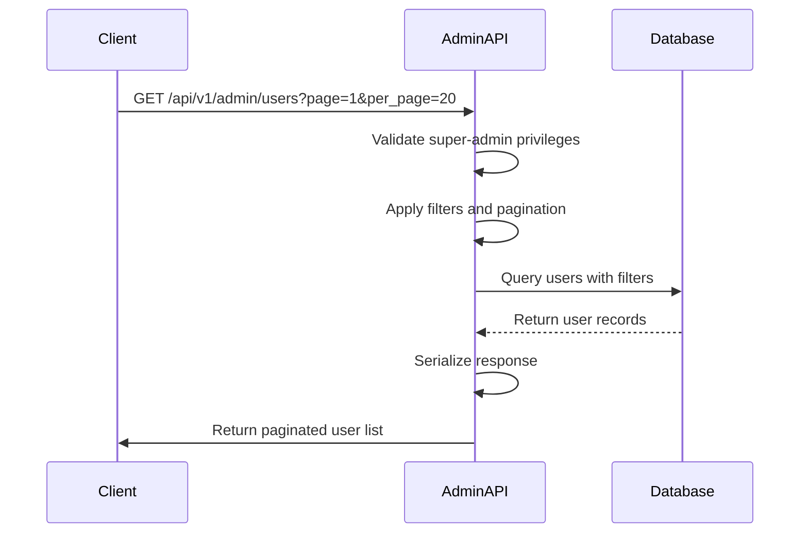
```mermaid
sequenceDiagram
participant Client
participant AdminAPI
participant Database
Client->>AdminAPI : GET /api/v1/admin/users?page=1&per_page=20
AdminAPI->>AdminAPI : Validate super-admin privileges
AdminAPI->>AdminAPI : Apply filters and pagination
AdminAPI->>Database : Query users with filters
Database-->>AdminAPI : Return user records
AdminAPI->>AdminAPI : Serialize response
AdminAPI->>Client : Return paginated user list
```

**Diagram sources**
- [admin.py](file://api/admin.py#L1-L23)
- [schemas.py](file://api/schemas.py#L100-L150)

### PUT /api/v1/admin/users/{id}/role

Updates the role of a specific user. Requires super-admin privileges.

**Path Parameters:**
- `id`: User ID (UUID format)

**Request Body:** JSON with role field.

**Response:** Returns the updated user information or error details.

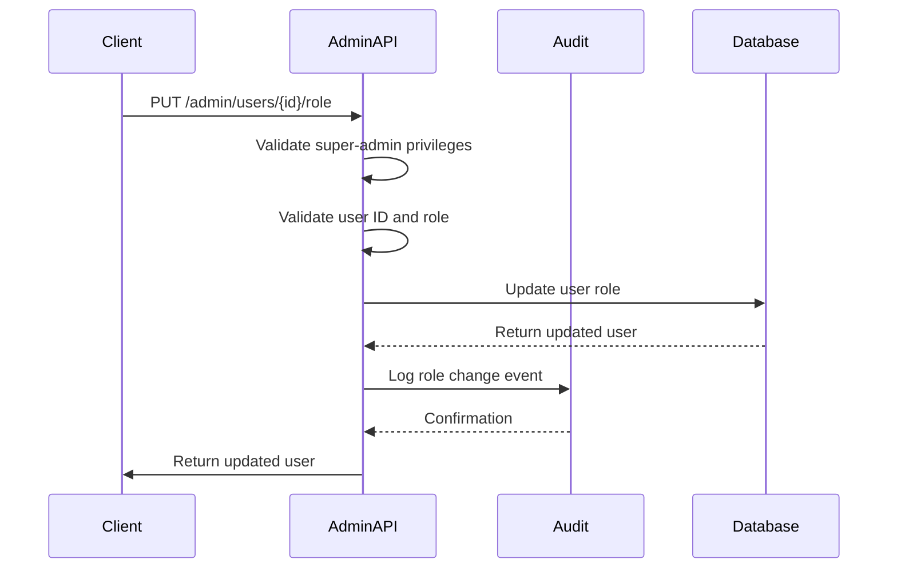
```mermaid
sequenceDiagram
participant Client
participant AdminAPI
participant Audit
participant Database
Client->>AdminAPI : PUT /admin/users/{id}/role
AdminAPI->>AdminAPI : Validate super-admin privileges
AdminAPI->>AdminAPI : Validate user ID and role
AdminAPI->>Database : Update user role
Database-->>AdminAPI : Return updated user
AdminAPI->>Audit : Log role change event
Audit-->>AdminAPI : Confirmation
AdminAPI->>Client : Return updated user
```

**Diagram sources**
- [admin.py](file://api/admin.py#L1-L23)
- [audit.py](file://security/audit.py#L200-L250)

### POST /api/v1/admin/system-backup

Triggers an immediate system backup operation. Requires super-admin privileges.

**Request Body:** Optional JSON with backup options.

**Response:** Returns backup status, path, size, and metadata.

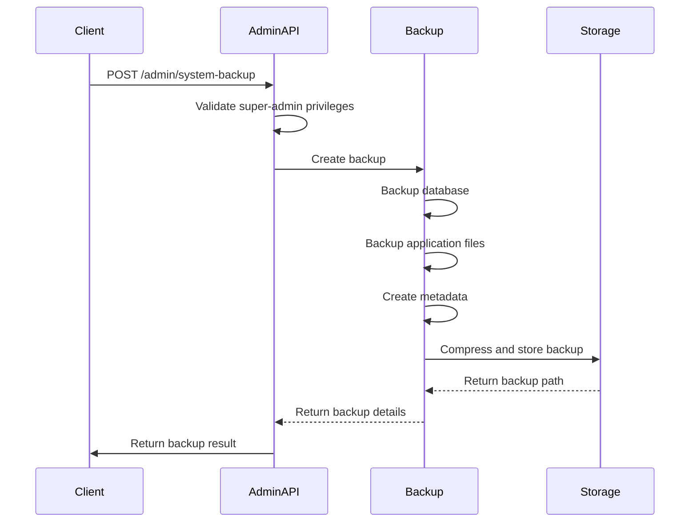
```mermaid
sequenceDiagram
participant Client
participant AdminAPI
participant Backup
participant Storage
Client->>AdminAPI : POST /admin/system-backup
AdminAPI->>AdminAPI : Validate super-admin privileges
AdminAPI->>Backup : Create backup
Backup->>Backup : Backup database
Backup->>Backup : Backup application files
Backup->>Backup : Create metadata
Backup->>Storage : Compress and store backup
Storage-->>Backup : Return backup path
Backup-->>AdminAPI : Return backup details
AdminAPI->>Client : Return backup result
```

**Diagram sources**
- [admin.py](file://api/admin.py#L1-L23)
- [backup.py](file://database/backup.py#L50-L100)

### GET /api/v1/admin/audit-log

Retrieves audit log entries with filtering options. Requires super-admin privileges.

**Query Parameters:**
- `start_date`: Filter logs from this date
- `end_date`: Filter logs to this date
- `user_id`: Filter by user ID
- `event_type`: Filter by event type
- `severity`: Filter by severity level
- `limit`: Maximum number of logs to return (default: 100)

**Response:** Returns a list of audit log entries with detailed information about each event.

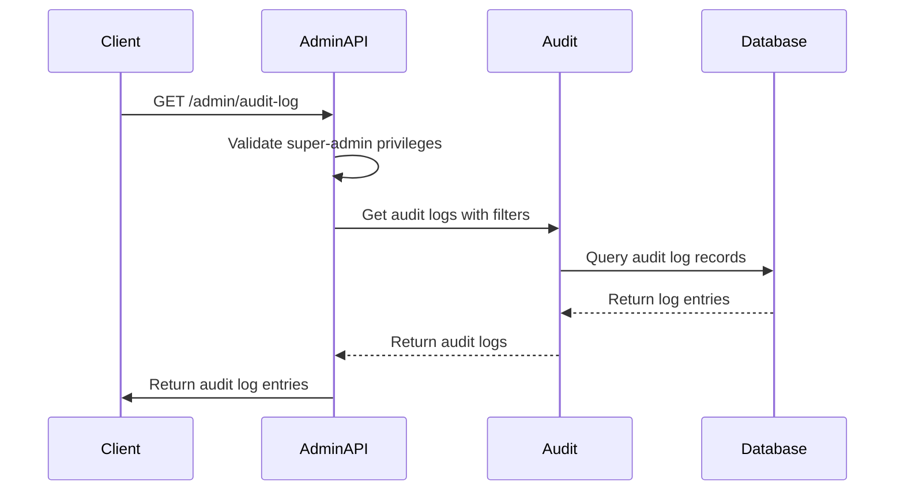
```mermaid
sequenceDiagram
participant Client
participant AdminAPI
participant Audit
participant Database
Client->>AdminAPI : GET /admin/audit-log
AdminAPI->>AdminAPI : Validate super-admin privileges
AdminAPI->>Audit : Get audit logs with filters
Audit->>Database : Query audit log records
Database-->>Audit : Return log entries
Audit-->>AdminAPI : Return audit logs
AdminAPI->>Client : Return audit log entries
```

**Diagram sources**
- [admin.py](file://api/admin.py#L1-L23)
- [audit.py](file://security/audit.py#L500-L550)

### POST /api/v1/admin/clear-cache

Clears the application cache. Requires super-admin privileges.

**Request Body:** Optional JSON specifying cache types to clear.

**Response:** Returns cache clearing status and statistics.

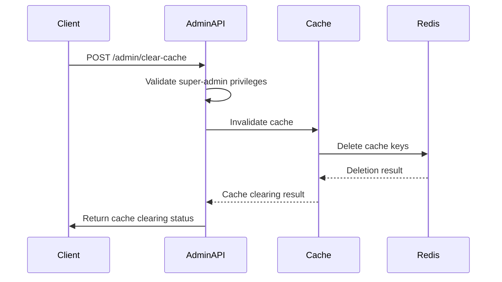
```mermaid
sequenceDiagram
participant Client
participant AdminAPI
participant Cache
participant Redis
Client->>AdminAPI : POST /admin/clear-cache
AdminAPI->>AdminAPI : Validate super-admin privileges
AdminAPI->>Cache : Invalidate cache
Cache->>Redis : Delete cache keys
Redis-->>Cache : Deletion result
Cache-->>AdminAPI : Cache clearing result
AdminAPI->>Client : Return cache clearing status
```

**Diagram sources**
- [admin.py](file://api/admin.py#L1-L23)
- [redis_client.py](file://cache/redis_client.py#L200-L250)

## Request Schemas

### AdminUserUpdateSchema

Schema for updating user roles through administrative endpoints.

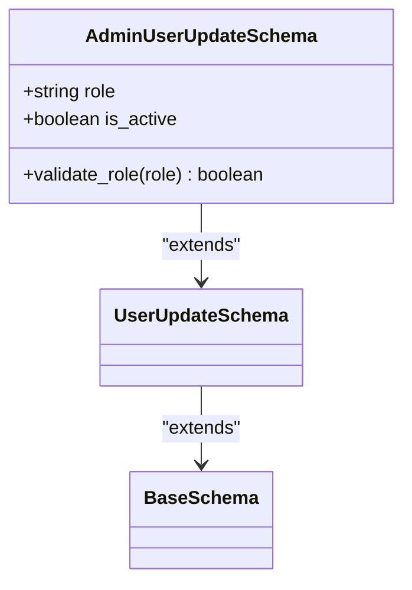
```mermaid
classDiagram
class AdminUserUpdateSchema {
+string role
+boolean is_active
+validate_role(role) boolean
}
AdminUserUpdateSchema --> UserUpdateSchema : "extends"
UserUpdateSchema --> BaseSchema : "extends"
```

**Diagram sources**
- [schemas.py](file://api/schemas.py#L150-L180)

### SystemBackupSchema

Schema for system backup operations and responses.

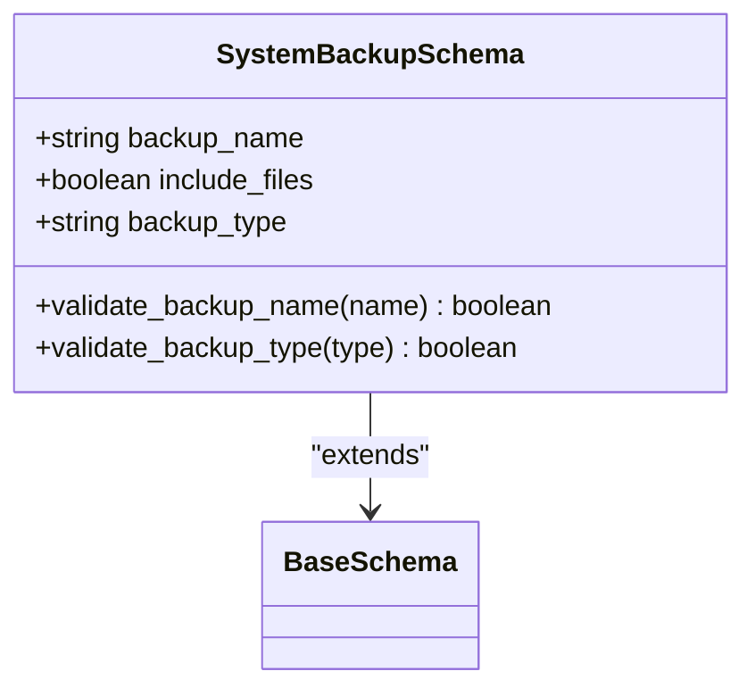
```mermaid
classDiagram
class SystemBackupSchema {
+string backup_name
+boolean include_files
+string backup_type
+validate_backup_name(name) boolean
+validate_backup_type(type) boolean
}
SystemBackupSchema --> BaseSchema : "extends"
```

**Diagram sources**
- [schemas.py](file://api/schemas.py#L300-L310)

## Security and Authentication

Administrative endpoints require super-admin privileges, which are validated through role-based access control. The authentication system implements enhanced security measures for administrative operations:

- **Super-admin Privileges**: Only users with the super-admin role can access these endpoints
- **Multi-Factor Authentication**: Additional MFA verification is required for sensitive operations
- **IP Restrictions**: Administrative access is restricted to approved IP ranges
- **Rate Limiting**: Protection against brute force attacks and excessive requests

The security system uses a decorator-based approach to enforce these requirements consistently across all administrative endpoints.

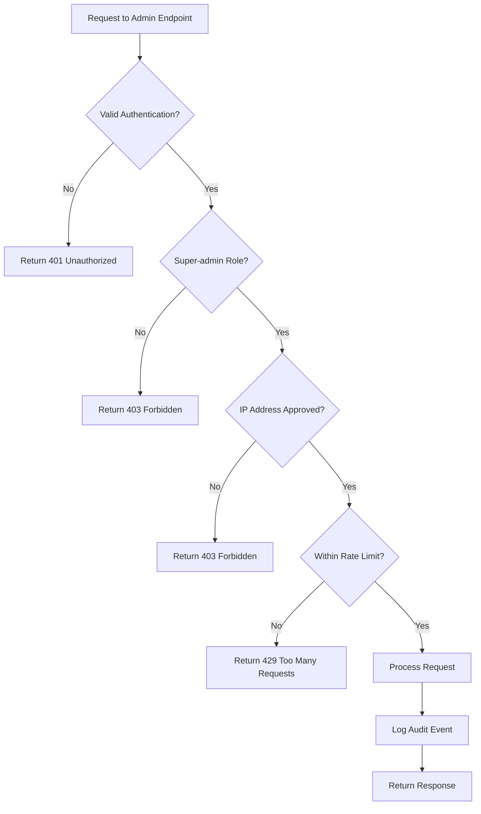
```mermaid
flowchart TD
A[Request to Admin Endpoint] --> B{Valid Authentication?}
B --> |No| C[Return 401 Unauthorized]
B --> |Yes| D{Super-admin Role?}
D --> |No| E[Return 403 Forbidden]
D --> |Yes| F{IP Address Approved?}
F --> |No| G[Return 403 Forbidden]
F --> |Yes| H{Within Rate Limit?}
H --> |No| I[Return 429 Too Many Requests]
H --> |Yes| J[Process Request]
J --> K[Log Audit Event]
K --> L[Return Response]
```

**Diagram sources**
- [admin.py](file://api/admin.py#L1-L23)
- [audit.py](file://security/audit.py#L100-L150)

**Section sources**
- [admin.py](file://api/admin.py#L1-L23)
- [security/authentication.py](file://security/authentication.py#L1-L50)

## Audit Logging System

All administrative actions are automatically logged through the comprehensive audit logging system. The audit system captures detailed information about each operation for compliance, security monitoring, and troubleshooting purposes.

### Audit Event Structure

Each audit log entry contains the following information:
- Event type and severity level
- User ID and session information
- IP address and user agent
- Resource type and ID
- Action performed
- Detailed event information
- Timestamp
- Cryptographic checksum for integrity verification

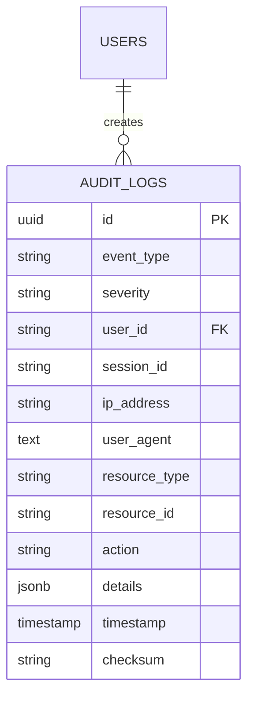
```mermaid
erDiagram
AUDIT_LOGS {
uuid id PK
string event_type
string severity
string user_id FK
string session_id
string ip_address
text user_agent
string resource_type
string resource_id
string action
jsonb details
timestamp timestamp
string checksum
}
USERS ||--o{ AUDIT_LOGS : "creates"
```

**Diagram sources**
- [audit.py](file://security/audit.py#L100-L200)

### Audit Event Types

The system defines specific event types for administrative operations:

- **ACCESS_GRANTED**: Successful access to administrative endpoint
- **ACCESS_DENIED**: Failed access attempt to administrative endpoint
- **PERMISSION_CHANGE**: Changes to user permissions
- **ROLE_CHANGE**: Changes to user roles
- **BACKUP_CREATE**: System backup creation
- **RATE_LIMIT_EXCEEDED**: Rate limit violations

**Section sources**
- [audit.py](file://security/audit.py#L1-L100)

## Database Backup Process

The database backup system provides reliable and secure backup operations for system data and application files.

### Backup Components

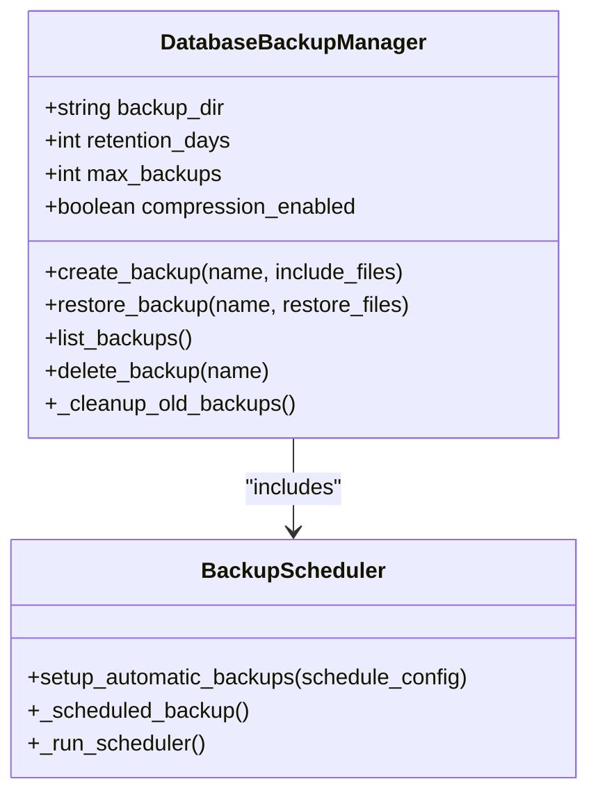
```mermaid
classDiagram
class DatabaseBackupManager {
+string backup_dir
+int retention_days
+int max_backups
+boolean compression_enabled
+create_backup(name, include_files)
+restore_backup(name, restore_files)
+list_backups()
+delete_backup(name)
+_cleanup_old_backups()
}
class BackupScheduler {
+setup_automatic_backups(schedule_config)
+_scheduled_backup()
+_run_scheduler()
}
DatabaseBackupManager --> BackupScheduler : "includes"
```

**Diagram sources**
- [backup.py](file://database/backup.py#L50-L100)

### Backup Process Flow

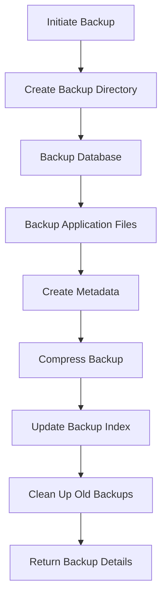
```mermaid
flowchart TD
A[Initiate Backup] --> B[Create Backup Directory]
B --> C[Backup Database]
C --> D[Backup Application Files]
D --> E[Create Metadata]
E --> F[Compress Backup]
F --> G[Update Backup Index]
G --> H[Clean Up Old Backups]
H --> I[Return Backup Details]
```

**Diagram sources**
- [backup.py](file://database/backup.py#L100-L200)

## Cache Management

The cache management system uses Redis for high-performance caching of frequently accessed data and query results.

### Cache Architecture

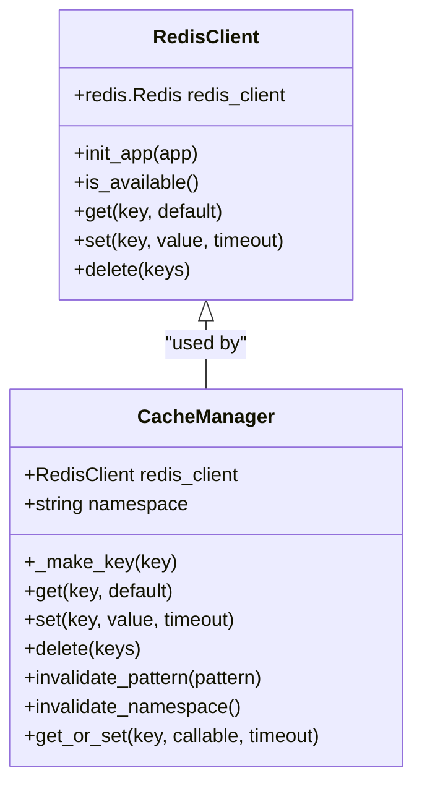
```mermaid
classDiagram
class RedisClient {
+redis.Redis redis_client
+init_app(app)
+is_available()
+get(key, default)
+set(key, value, timeout)
+delete(keys)
}
class CacheManager {
+RedisClient redis_client
+string namespace
+_make_key(key)
+get(key, default)
+set(key, value, timeout)
+delete(keys)
+invalidate_pattern(pattern)
+invalidate_namespace()
+get_or_set(key, callable, timeout)
}
RedisClient <|-- CacheManager : "used by"
```

**Diagram sources**
- [redis_client.py](file://cache/redis_client.py#L50-L100)

### Cache Invalidation Strategy

When administrative operations modify system state, the cache is automatically invalidated to ensure data consistency:

- User management operations invalidate user-related caches
- System configuration changes invalidate configuration caches
- Data imports/exports invalidate relevant data caches
- Backup operations may invalidate query result caches

**Section sources**
- [redis_client.py](file://cache/redis_client.py#L1-L50)

## Usage Examples

### Bulk User Management

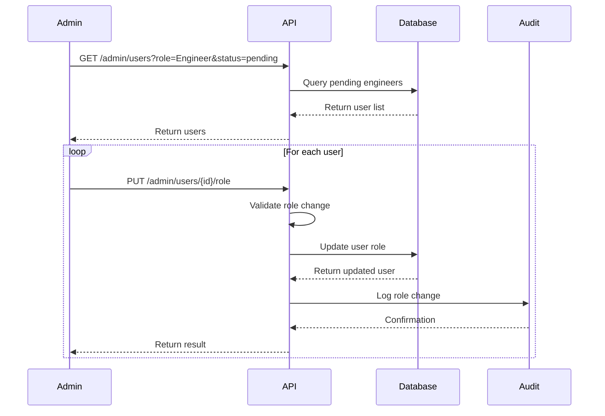
```mermaid
sequenceDiagram
participant Admin
participant API
participant Database
participant Audit
Admin->>API : GET /admin/users?role=Engineer&status=pending
API->>Database : Query pending engineers
Database-->>API : Return user list
API-->>Admin : Return users
loop For each user
Admin->>API : PUT /admin/users/{id}/role
API->>API : Validate role change
API->>Database : Update user role
Database-->>API : Return updated user
API->>Audit : Log role change
Audit-->>API : Confirmation
API-->>Admin : Return result
end
```

**Diagram sources**
- [admin.py](file://api/admin.py#L1-L23)
- [audit.py](file://security/audit.py#L200-L250)

### Triggering System Backup

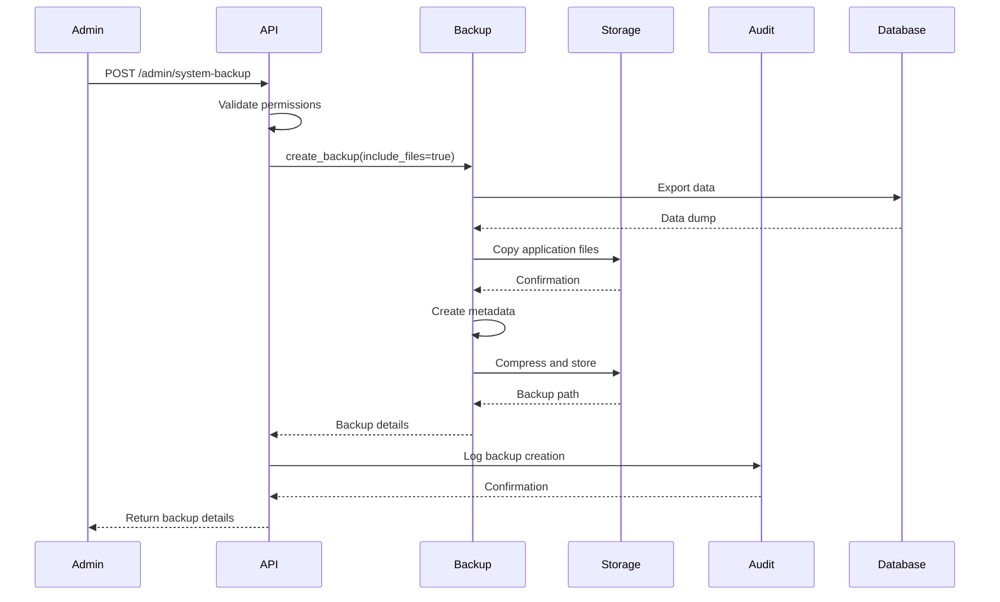
```mermaid
sequenceDiagram
participant Admin
participant API
participant Backup
participant Storage
participant Audit
Admin->>API : POST /admin/system-backup
API->>API : Validate permissions
API->>Backup : create_backup(include_files=true)
Backup->>Database : Export data
Database-->>Backup : Data dump
Backup->>Storage : Copy application files
Storage-->>Backup : Confirmation
Backup->>Backup : Create metadata
Backup->>Storage : Compress and store
Storage-->>Backup : Backup path
Backup-->>API : Backup details
API->>Audit : Log backup creation
Audit-->>API : Confirmation
API-->>Admin : Return backup details
```

**Diagram sources**
- [admin.py](file://api/admin.py#L1-L23)
- [backup.py](file://database/backup.py#L50-L100)

### Retrieving Audit Trails

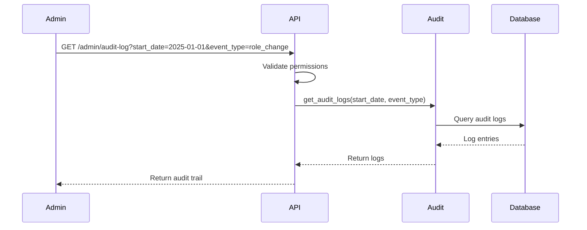
```mermaid
sequenceDiagram
participant Admin
participant API
participant Audit
participant Database
Admin->>API : GET /admin/audit-log?start_date=2025-01-01&event_type=role_change
API->>API : Validate permissions
API->>Audit : get_audit_logs(start_date, event_type)
Audit->>Database : Query audit logs
Database-->>Audit : Log entries
Audit-->>API : Return logs
API-->>Admin : Return audit trail
```

**Diagram sources**
- [admin.py](file://api/admin.py#L1-L23)
- [audit.py](file://security/audit.py#L500-L550)

## Security Considerations

### IP Restrictions

Administrative endpoints are protected by IP-based access control:

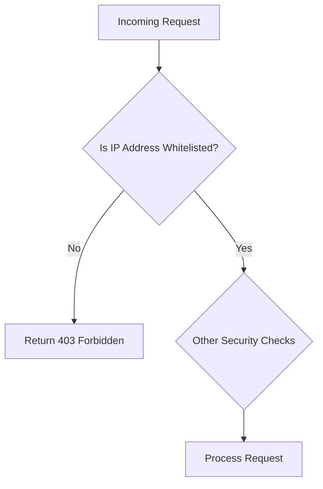
```mermaid
flowchart TD
A[Incoming Request] --> B{Is IP Address Whitelisted?}
B --> |No| C[Return 403 Forbidden]
B --> |Yes| D{Other Security Checks}
D --> E[Process Request]
```

**Section sources**
- [security/validation.py](file://security/validation.py#L1-L20)

### Multi-Factor Authentication

Additional MFA requirements for sensitive operations:

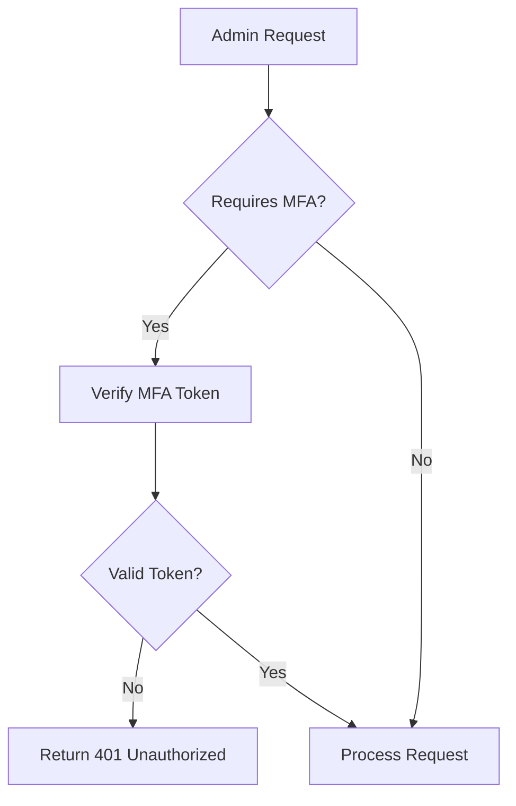
```mermaid
flowchart TD
A[Admin Request] --> B{Requires MFA?}
B --> |Yes| C[Verify MFA Token]
C --> D{Valid Token?}
D --> |No| E[Return 401 Unauthorized]
D --> |Yes| F[Process Request]
B --> |No| F[Process Request]
```

**Section sources**
- [security/authentication.py](file://security/authentication.py#L100-L150)

### Rate Limiting

Protection against abuse of administrative endpoints:

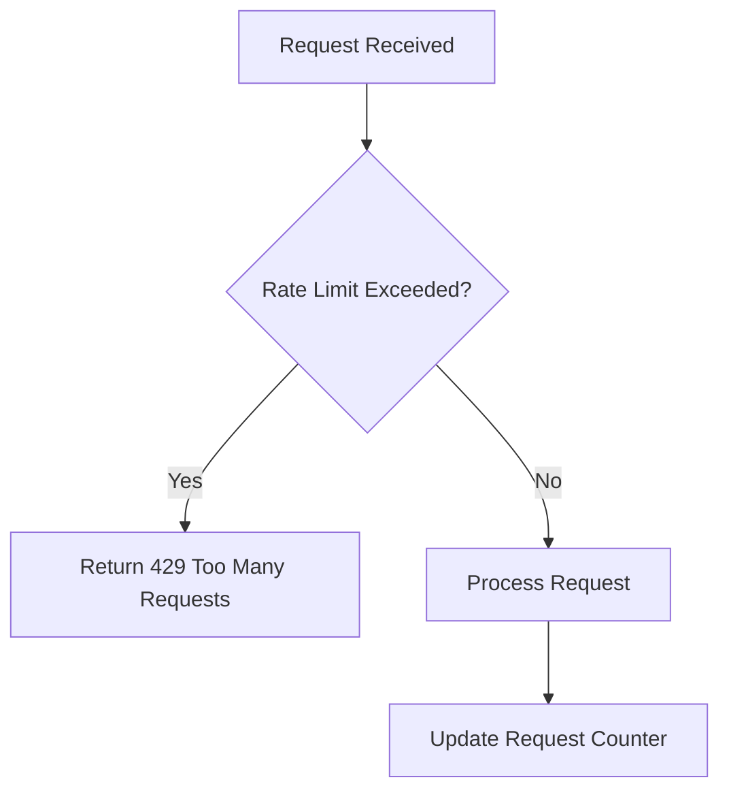
```mermaid
flowchart TD
A[Request Received] --> B{Rate Limit Exceeded?}
B --> |Yes| C[Return 429 Too Many Requests]
B --> |No| D[Process Request]
D --> E[Update Request Counter]
```

**Section sources**
- [security/rate_limiting.py](file://security/rate_limiting.py#L1-L20)

## Error Handling

The administrative API implements comprehensive error handling to provide meaningful feedback while maintaining security:

- **401 Unauthorized**: Authentication required or failed
- **403 Forbidden**: Insufficient privileges or IP restrictions
- **404 Not Found**: Resource not found
- **429 Too Many Requests**: Rate limit exceeded
- **500 Internal Server Error**: Unexpected server error
- **503 Service Unavailable**: System temporarily unavailable

Error responses include appropriate status codes and generic error messages to prevent information disclosure, with detailed logging for troubleshooting.

**Section sources**
- [errors.py](file://api/errors.py#L1-L50)
- [admin.py](file://api/admin.py#L1-L23)