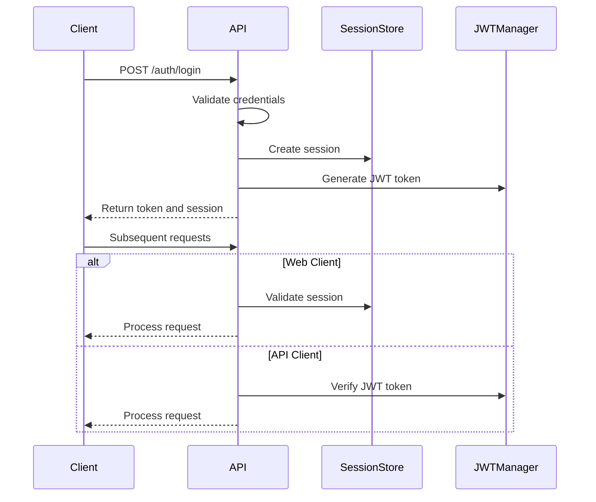
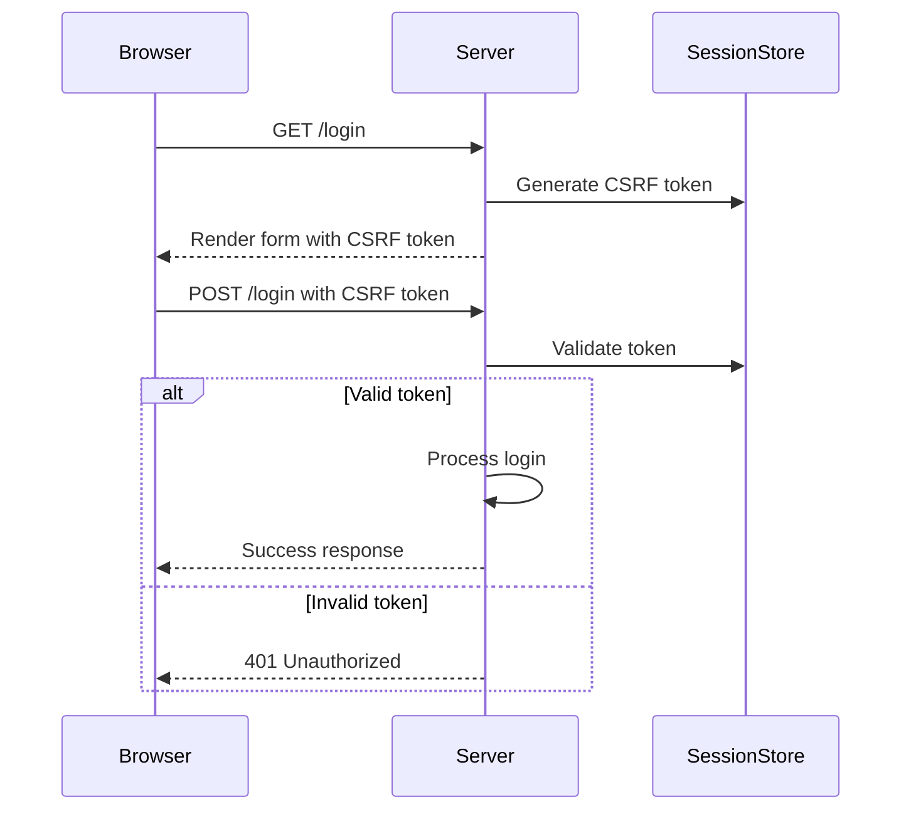
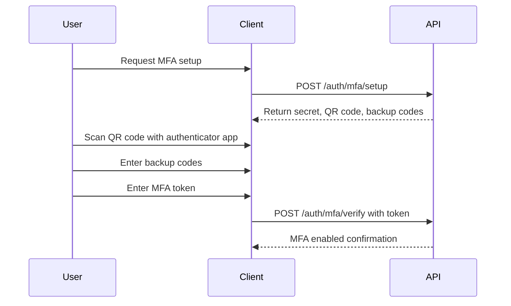

# Authentication API

<cite>
**Referenced Files in This Document**   
- [api/auth.py](file://api/auth.py)
- [api/schemas.py](file://api/schemas.py)
- [api/security.py](file://api/security.py)
- [routes/auth.py](file://routes/auth.py)
- [auth.py](file://auth.py)
- [security/headers.py](file://security/headers.py)
- [static/js/csrf_manager.js](file://static/js/csrf_manager.js)
</cite>

## Table of Contents
1. [Introduction](#introduction)
2. [Authentication Mechanisms](#authentication-mechanisms)
3. [API Endpoints](#api-endpoints)
4. [Request and Response Schemas](#request-and-response-schemas)
5. [CSRF Protection](#csrf-protection)
6. [Token Refresh Logic](#token-refresh-logic)
7. [MFA Handling](#mfa-handling)
8. [Error Codes](#error-codes)
9. [Security Headers](#security-headers)
10. [Integration with Flask-Login](#integration-with-flask-login)
11. [Code Examples](#code-examples)
12. [Token Validation Middleware](#token-validation-middleware)

## Introduction
This document provides comprehensive documentation for the authentication endpoints under `/api/v1/auth`. The API supports both session-based authentication for web clients and JWT-based authentication for API clients. The system implements robust security measures including CSRF protection, rate limiting, MFA support, and comprehensive audit logging.

The authentication system is built on Flask-RESTX for API endpoint definition, Flask-Login for session management, and custom JWT implementation for token-based authentication. All endpoints are protected by rate limiting and comprehensive validation.

**Section sources**
- [api/auth.py](file://api/auth.py#L1-L429)
- [api/schemas.py](file://api/schemas.py#L1-L307)

## Authentication Mechanisms
The system supports two primary authentication mechanisms:

### Session-Based Authentication
For web clients, the system uses Flask-Login with server-side session management. Sessions are tracked in a custom session store with additional security measures:
- Session validity checks on every request
- Server-side session revocation
- Session timeout after 24 hours of inactivity
- CSRF protection for all state-changing operations

### JWT-Based Authentication
For API clients, the system uses JWT (JSON Web Tokens) with the following characteristics:
- Tokens expire after 1 hour (3600 seconds)
- Tokens contain user ID, role, permissions, and other claims
- Enhanced validation with issuer and audience checks
- Support for token refresh without requiring re-authentication
- JTI (JWT ID) for potential token revocation

The JWT implementation includes enhanced security features such as issuer ('sat-report-generator') and audience ('sat-report-generator-api') validation, and includes user role and permissions in the token payload.



**Diagram sources**
- [api/auth.py](file://api/auth.py#L123-L162)
- [api/security.py](file://api/security.py#L202-L283)
- [auth.py](file://auth.py#L1-L41)

## API Endpoints
The authentication API provides several endpoints for user authentication and management.

### POST /auth/login
Authenticates a user and returns an access token.

**Request Parameters**
- `email`: User's email address (required)
- `password`: User's password (required)
- `remember_me`: Boolean indicating if the session should be remembered (optional)
- `mfa_token`: MFA token if MFA is enabled (optional)

**Response**
On successful authentication, returns a 200 status code with a JSON response containing:
- `access_token`: JWT access token
- `token_type`: Token type (Bearer)
- `expires_in`: Token expiration time in seconds
- `user`: User information including ID, email, full name, role, and MFA status

**Authentication Flow**
1. Validate input parameters
2. Check rate limiting (5 attempts per 5 minutes)
3. Verify user credentials
4. Check if account is active
5. Verify MFA token if MFA is enabled
6. Create session and generate JWT token
7. Update last login timestamp
8. Return authentication response

**Section sources**
- [api/auth.py](file://api/auth.py#L63-L162)

### POST /auth/logout
Logs out the current user and invalidates their session.

**Request Parameters**
None

**Response**
Returns a 200 status code with a JSON response:
```json
{"message": "Successfully logged out"}
```

The logout process includes:
- Destroying the server-side session
- Clearing all session data
- Logging the logout event
- Setting aggressive cache control headers to prevent back-button access

**Section sources**
- [api/auth.py](file://api/auth.py#L164-L184)
- [routes/auth.py](file://routes/auth.py#L117-L155)

### POST /auth/token/refresh
Refreshes an expired JWT access token.

**Request Parameters**
The token must be provided in the Authorization header:
```
Authorization: Bearer <token>
```

**Response**
On successful refresh, returns a 200 status code with a JSON response containing:
- `access_token`: New JWT access token
- `token_type`: Token type (Bearer)
- `expires_in`: Token expiration time in seconds
- `user`: User information

**Refresh Logic**
1. Extract token from Authorization header
2. Verify the current token
3. Check if user exists and is active
4. Generate a new token with fresh expiration
5. Return the new token

Tokens can be refreshed as long as they are not expired beyond the refresh window.

**Section sources**
- [api/auth.py](file://api/auth.py#L383-L428)

### GET /auth/user-info
Retrieves information about the currently authenticated user.

**Request Parameters**
None

**Response**
Returns user information including:
- User ID
- Email address
- Full name
- Role
- MFA status
- Last login timestamp

This endpoint requires authentication and returns a 401 status code if the user is not authenticated.

**Section sources**
- [api/auth.py](file://api/auth.py#L201-L242)

## Request and Response Schemas
The API uses Marshmallow schemas for request validation and response serialization.

### AuthRequest Schema
The `LoginSchema` class in `api.schemas` defines the request schema for authentication:

```python
class LoginSchema(BaseSchema):
    """Login request schema."""
    
    email = fields.Email(required=True)
    password = fields.String(required=True, load_only=True)
    remember_me = fields.Boolean(load_default=False)
    mfa_token = fields.String()
```

**Validation Rules**
- Email must be a valid email format
- Password is required and stripped of whitespace
- remember_me defaults to False if not provided
- mfa_token is optional and only required if MFA is enabled for the user

### UserSchema
The `UserSchema` class defines the response schema for user information:

```python
class UserSchema(BaseSchema):
    """User serialization schema."""
    
    id = fields.String(dump_only=True)
    email = fields.Email(required=True)
    full_name = fields.String(required=True, validate=lambda x: 2 <= len(x.strip()) <= 100)
    role = fields.String(required=True, validate=lambda x: x in ['Engineer', 'Admin', 'PM', 'Automation Manager'])
    is_active = fields.Boolean(dump_only=True)
    is_approved = fields.Boolean(dump_only=True)
    created_at = fields.DateTime(dump_only=True)
    last_login = fields.DateTime(dump_only=True)
```

**Field Descriptions**
- `id`: Unique user identifier (read-only)
- `email`: User's email address
- `full_name`: User's full name with character validation
- `role`: User's role with enum validation
- `is_active`: Account activation status
- `is_approved`: Approval status by administrator
- `created_at`: Account creation timestamp
- `last_login`: Last successful login timestamp

### Token Response Schema
The `TokenResponseSchema` combines token information with user data:

```python
class TokenResponseSchema(BaseSchema):
    """Token response schema."""
    
    access_token = fields.String()
    token_type = fields.String()
    expires_in = fields.Integer()
    user = fields.Nested(UserSchema)
```

This schema ensures consistent response format across authentication endpoints.

**Section sources**
- [api/schemas.py](file://api/schemas.py#L1-L307)

## CSRF Protection
The system implements comprehensive CSRF (Cross-Site Request Forgery) protection for web-based authentication.

### Implementation
CSRF protection is implemented through:
- CSRF tokens embedded in forms and AJAX requests
- Token validation on all state-changing operations
- Automatic token refresh via JavaScript
- Strict token expiration policies

The CSRF tokens are generated and validated by the `EnhancedCSRFProtection` class in `security/headers.py`, which provides:
- Token lifetime of 1 hour
- Constant-time comparison to prevent timing attacks
- Automatic injection into templates
- Support for both form-based and AJAX requests

### CSRF Token Management
The frontend JavaScript (`static/js/csrf_manager.js`) automatically handles CSRF token management:

```javascript
class CSRFManager {
    constructor() {
        this.refreshInterval = 300000; // 5 minutes
        this.init();
    }
    
    init() {
        this.startPeriodicRefresh();
        this.interceptFormSubmissions();
        this.setupAjaxInterceptor();
    }
}
```

**Key Features**
- Automatic token refresh every 5 minutes
- Interception of form submissions to ensure valid tokens
- AJAX request interception to include CSRF tokens
- Handling of page visibility changes (tab switching)
- Retry mechanism for failed token refresh

### Token Validation
CSRF tokens are validated on the server side with the following checks:
- Token presence in request (header or form field)
- Matching with session-stored token
- Expiration check (1 hour lifetime)
- Constant-time string comparison to prevent timing attacks

The validation process is integrated into the request processing pipeline and automatically applied to protected endpoints.



**Diagram sources**
- [security/headers.py](file://security/headers.py#L70-L109)
- [static/js/csrf_manager.js](file://static/js/csrf_manager.js#L1-L47)

**Section sources**
- [security/headers.py](file://security/headers.py#L70-L144)
- [static/js/csrf_manager.js](file://static/js/csrf_manager.js#L1-L167)

## Token Refresh Logic
The token refresh mechanism allows clients to obtain new access tokens without requiring user re-authentication.

### Refresh Process
The token refresh process follows these steps:

1. Client sends expired token in Authorization header
2. Server verifies the token signature and claims
3. Server checks if the user still exists and is active
4. Server generates a new token with fresh expiration
5. Server returns the new token to the client

### Refresh Endpoint
The `/auth/token/refresh` endpoint handles token refresh requests:

```python
@auth_ns.route('/token/refresh')
class TokenRefreshResource(Resource):
    @auth_ns.marshal_with(token_response_model)
    def post(self):
        # Get current token from Authorization header
        auth_header = request.headers.get('Authorization')
        if not auth_header or not auth_header.startswith('Bearer '):
            return {'message': 'Bearer token required'}, 401
        
        token = auth_header.split(' ')[1]
        
        # Verify current token
        payload = JWTManager.verify_token(token)
        if not payload:
            return {'message': 'Invalid or expired token'}, 401
        
        user_id = payload.get('user_id')
        user = User.query.get(user_id)
        
        if not user or not user.is_active:
            return {'message': 'User not found or inactive'}, 401
        
        # Generate new token
        new_token = JWTManager.generate_token(user_id)
        
        return {
            'access_token': new_token,
            'token_type': 'Bearer',
            'expires_in': 3600,
            'user': { /* user info */ }
        }, 200
```

### Refresh Limitations
The refresh mechanism has the following characteristics:
- Tokens can only be refreshed if they are expired but still valid (within refresh window)
- Revoked tokens cannot be refreshed
- Inactive users cannot refresh tokens
- The refresh endpoint does not support refresh tokens (uses access tokens for refresh)

### Client Implementation
Clients should implement token refresh with the following pattern:

1. Intercept 401 responses from API calls
2. Check if the error is due to token expiration
3. Call the refresh endpoint with the expired token
4. Retry the original request with the new token
5. If refresh fails, redirect to login page

This approach provides a seamless user experience while maintaining security.

**Section sources**
- [api/auth.py](file://api/auth.py#L383-L428)
- [api/security.py](file://api/security.py#L202-L283)

## MFA Handling
The system supports Multi-Factor Authentication (MFA) using TOTP (Time-Based One-Time Password) for enhanced security.

### MFA Endpoints
The API provides several endpoints for MFA management:

#### POST /auth/mfa/setup
Initiates MFA setup for the current user:
- Generates a TOTP secret
- Creates a QR code URL for authenticator app setup
- Generates backup codes
- Returns setup information to the client

#### POST /auth/mfa/verify
Verifies the MFA setup by checking the TOTP token:
- Validates the token against the temporary secret
- Enables MFA for the user
- Stores the verified secret and backup codes
- Removes the temporary secret

#### POST /auth/mfa/disable
Disables MFA for the current user:
- Requires valid MFA token for verification
- Removes MFA secret and backup codes
- Updates user record to disable MFA

### MFA Flow
The complete MFA flow follows these steps:



### Security Considerations
The MFA implementation includes several security features:
- Temporary secrets stored during setup process
- Hashed backup codes in database
- Rate limiting on MFA verification attempts
- Audit logging of MFA events
- Requirement of valid MFA token to disable MFA

### Backup Codes
When setting up MFA, the system generates backup codes that can be used when the primary authenticator is unavailable:
- 10 backup codes generated
- Each code is 8 characters long
- Codes are hashed before storage
- Each code can only be used once
- Used codes are tracked and invalidated

Clients should display backup codes to users during setup and advise them to store them securely.

**Section sources**
- [api/auth.py](file://api/auth.py#L240-L317)

## Error Codes
The authentication API returns standardized error responses with appropriate HTTP status codes.

### 401 Unauthorized
Indicates authentication failure or missing credentials.

**Common Causes**
- Invalid email or password
- Expired or invalid JWT token
- Missing Authorization header
- Invalid MFA token
- Disabled account

**Response Format**
```json
{
  "message": "Invalid email or password"
}
```

For MFA-required scenarios, the response may include additional information:
```json
{
  "message": "MFA token required",
  "mfa_required": true
}
```

### 403 Forbidden
Indicates the authenticated user does not have permission to perform the requested action.

**Common Causes**
- Insufficient permissions
- Attempting to access resources owned by another user
- Security policy violations

**Response Format**
```json
{
  "error": {
    "message": "Insufficient permissions",
    "code": "INSUFFICIENT_PERMISSIONS",
    "required_permissions": ["admin"]
  }
}
```

### 422 Unprocessable Entity
Indicates validation errors in the request data.

**Common Causes**
- Missing required fields
- Invalid email format
- Password validation failures
- Invalid MFA token format

**Response Format**
```json
{
  "error": {
    "message": "Validation failed",
    "code": "VALIDATION_ERROR",
    "details": {
      "email": ["Not a valid email address."],
      "password": ["Length must be at least 12 characters."]
    }
  }
}
```

### 429 Too Many Requests
Indicates rate limiting has been triggered.

**Common Causes**
- Too many login attempts (5 attempts per 5 minutes)
- Excessive API requests
- Brute force attack detection

**Response Format**
```json
{
  "message": "Too many login attempts. Please try again later."
}
```

The response includes rate limit headers:
- `X-RateLimit-Limit`: Maximum number of requests
- `X-RateLimit-Remaining`: Remaining requests in current window
- `X-RateLimit-Reset`: Time when rate limit resets

### Other Error Codes
- **400 Bad Request**: Malformed request or missing parameters
- **404 Not Found**: Requested resource not found
- **409 Conflict**: Resource already exists (e.g., email already registered)
- **500 Internal Server Error**: Unexpected server error

All error responses follow the standardized format defined in `api.errors.ErrorResponse`.

**Section sources**
- [api/auth.py](file://api/auth.py#L63-L162)
- [api/errors.py](file://api/errors.py#L1-L171)

## Security Headers
The system implements comprehensive security headers to protect against common web vulnerabilities.

### Implemented Headers
The following security headers are applied to all responses:

- **X-Content-Type-Options**: `nosniff` - Prevents MIME type sniffing
- **X-Frame-Options**: `DENY` - Prevents clickjacking attacks
- **X-XSS-Protection**: `1; mode=block` - Enables XSS filtering
- **Strict-Transport-Security**: `max-age=31536000; includeSubDomains` - Enforces HTTPS
- **Content-Security-Policy**: `default-src 'none'` - Restricts resource loading
- **Referrer-Policy**: `strict-origin-when-cross-origin` - Controls referrer information
- **Permissions-Policy**: Restricts browser features

### Cache Control
Aggressive cache control headers prevent sensitive data from being cached:

```
Cache-Control: no-store, no-cache, must-revalidate, post-check=0, pre-check=0, max-age=0, s-maxage=0, proxy-revalidate
Pragma: no-cache
Expires: 0
```

These headers are particularly important for authentication endpoints to prevent back-button access to authenticated pages.

### Additional Security Measures
- **ETag headers** with unique values to force revalidation
- **Vary: *** header to prevent caching issues
- **X-Cache: BYPASS** to ensure responses are not cached
- Removal of server information headers

The security headers are implemented in the `security_headers` decorator in `api/security.py` and applied globally to all API responses.

**Section sources**
- [api/security.py](file://api/security.py#L450-L490)

## Integration with Flask-Login
The authentication system integrates with Flask-Login for session-based authentication.

### User Loader
The `load_user` function is registered with Flask-Login to load user objects:

```python
@login_manager.user_loader
def load_user(user_id):
    """Load user only if session is valid and not revoked"""
    # Check if session is valid before loading user
    if not session_manager.is_session_valid():
        session.clear()
        return None
    
    # Check if we have a valid session_id
    session_id = session.get('session_id')
    if not session_id:
        return None
    
    # Double-check session is not revoked
    if session_manager.is_session_revoked(session_id):
        session.clear()
        return None
    
    # Verify user_id matches session
    stored_user_id = session.get('user_id')
    if stored_user_id is None or stored_user_id != int(user_id):
        session.clear()
        return None
    
    return User.query.get(int(user_id))
```

### Session Management
The system enhances Flask-Login's session management with additional security:

- Server-side session tracking via `session_manager`
- Session revocation on logout
- Session validity checks on every request
- Protection against session fixation attacks
- Synchronization between Flask-Login session and custom session store

### Authentication Flow
The integration follows this flow:

1. User submits login credentials
2. System verifies credentials
3. `login_user()` is called to establish Flask-Login session
4. Custom session is created in server-side store
5. Session ID and user ID are stored in Flask session
6. Subsequent requests validate both Flask-Login and custom session

### Logout Process
The logout process ensures complete session cleanup:

1. Revoke server-side session
2. Call `logout_user()` to clear Flask-Login session
3. Clear all session data
4. Pop critical session keys
5. Set session as modified and new
6. Add aggressive cache control headers

This comprehensive approach prevents session fixation and ensures users are fully logged out.

**Section sources**
- [auth.py](file://auth.py#L1-L41)
- [routes/auth.py](file://routes/auth.py#L117-L155)

## Code Examples
This section provides practical examples for implementing authentication flows.

### Python Example
```python
import requests
import json

class AuthClient:
    def __init__(self, base_url):
        self.base_url = base_url
        self.session = requests.Session()
        self.access_token = None
    
    def login(self, email, password, mfa_token=None):
        """Authenticate with the API."""
        url = f"{self.base_url}/api/v1/auth/login"
        data = {
            'email': email,
            'password': password
        }
        
        if mfa_token:
            data['mfa_token'] = mfa_token
        
        response = self.session.post(url, json=data)
        
        if response.status_code == 200:
            token_data = response.json()
            self.access_token = token_data['access_token']
            self.session.headers.update({
                'Authorization': f'Bearer {self.access_token}'
            })
            return token_data
        elif response.status_code == 401 and response.json().get('mfa_required'):
            raise Exception('MFA required')
        else:
            raise Exception(f'Login failed: {response.text}')
    
    def refresh_token(self):
        """Refresh the access token."""
        if not self.access_token:
            raise Exception('No token to refresh')
        
        url = f"{self.base_url}/api/v1/auth/token/refresh"
        headers = {'Authorization': f'Bearer {self.access_token}'}
        
        response = self.session.post(url, headers=headers)
        
        if response.status_code == 200:
            token_data = response.json()
            self.access_token = token_data['access_token']
            self.session.headers.update({
                'Authorization': f'Bearer {self.access_token}'
            })
            return token_data
        else:
            self.access_token = None
            raise Exception('Token refresh failed')
    
    def make_authenticated_request(self, method, endpoint, **kwargs):
        """Make an authenticated API request."""
        url = f"{self.base_url}/api/v1{endpoint}"
        
        try:
            response = self.session.request(method, url, **kwargs)
            
            # Handle token expiration
            if response.status_code == 401:
                try:
                    self.refresh_token()
                    # Retry the request with new token
                    response = self.session.request(method, url, **kwargs)
                except:
                    raise Exception('Authentication failed')
            
            return response
        except requests.exceptions.RequestException as e:
            raise Exception(f'Request failed: {str(e)}')
```

### JavaScript Example
```javascript
class AuthManager {
    constructor(baseUrl) {
        this.baseUrl = baseUrl;
        this.accessToken = null;
        this.csrfToken = null;
        this.tokenRefreshPromise = null;
    }
    
    async login(email, password, mfaToken = null) {
        const response = await fetch(`${this.baseUrl}/api/v1/auth/login`, {
            method: 'POST',
            headers: {
                'Content-Type': 'application/json',
                'X-CSRFToken': this.csrfToken
            },
            body: JSON.stringify({
                email: email,
                password: password,
                mfa_token: mfaToken
            }),
            credentials: 'include'
        });
        
        if (response.ok) {
            const data = await response.json();
            this.accessToken = data.access_token;
            this.setAuthHeader();
            return data;
        } else if (response.status === 401) {
            const data = await response.json();
            if (data.mfa_required) {
                throw new Error('MFA_REQUIRED');
            } else {
                throw new Error('INVALID_CREDENTIALS');
            }
        } else {
            throw new Error('LOGIN_FAILED');
        }
    }
    
    setAuthHeader() {
        if (this.accessToken) {
            fetch(`${this.baseUrl}/api/set-token`, {
                method: 'POST',
                headers: {
                    'Content-Type': 'application/json',
                    'X-CSRFToken': this.csrfToken
                },
                body: JSON.stringify({token: this.accessToken})
            });
        }
    }
    
    async refreshToken() {
        if (this.tokenRefreshPromise) {
            return this.tokenRefreshPromise;
        }
        
        this.tokenRefreshPromise = this.performTokenRefresh();
        
        try {
            const result = await this.tokenRefreshPromise;
            this.tokenRefreshPromise = null;
            return result;
        } catch (error) {
            this.tokenRefreshPromise = null;
            throw error;
        }
    }
    
    async performTokenRefresh() {
        if (!this.accessToken) {
            throw new Error('No token to refresh');
        }
        
        const response = await fetch(`${this.baseUrl}/api/v1/auth/token/refresh`, {
            method: 'POST',
            headers: {
                'Authorization': `Bearer ${this.accessToken}`,
                'X-CSRFToken': this.csrfToken
            },
            credentials: 'include'
        });
        
        if (response.ok) {
            const data = await response.json();
            this.accessToken = data.access_token;
            this.setAuthHeader();
            return data;
        } else {
            this.accessToken = null;
            throw new Error('TOKEN_REFRESH_FAILED');
        }
    }
    
    async apiRequest(method, endpoint, data = null) {
        let options = {
            method: method,
            headers: {
                'Content-Type': 'application/json',
                'X-CSRFToken': this.csrfToken
            },
            credentials: 'include'
        };
        
        if (data) {
            options.body = JSON.stringify(data);
        }
        
        if (this.accessToken) {
            options.headers['Authorization'] = `Bearer ${this.accessToken}`;
        }
        
        let response = await fetch(`${this.baseUrl}/api/v1${endpoint}`, options);
        
        // Handle token expiration
        if (response.status === 401) {
            try {
                await this.refreshToken();
                // Update authorization header with new token
                options.headers['Authorization'] = `Bearer ${this.accessToken}`;
                response = await fetch(`${this.baseUrl}/api/v1${endpoint}`, options);
            } catch (error) {
                // Redirect to login page
                window.location.href = '/login';
                throw error;
            }
        }
        
        return response;
    }
}
```

### Token Storage and Handling
```python
# Secure token storage recommendations
class SecureTokenStorage:
    """Best practices for token storage."""
    
    @staticmethod
    def web_client():
        """For web clients, use HTTP-only cookies."""
        # Set cookie with secure attributes
        # - HttpOnly: prevents JavaScript access
        # - Secure: only sent over HTTPS
        # - SameSite=Lax: prevents CSRF
        # - Short expiration
        pass
    
    @staticmethod
    def api_client():
        """For API clients, store tokens in memory or secure storage."""
        # Avoid local storage due to XSS risks
        # Use in-memory storage when possible
        # If persistent storage needed, use encrypted storage
        pass
```

**Section sources**
- [api/auth.py](file://api/auth.py#L63-L162)
- [api/security.py](file://api/security.py#L202-L283)

## Token Validation Middleware
The token validation middleware is implemented in `api/security.py` and provides comprehensive authentication and authorization.

### APISecurityManager
The core security manager handles authentication and authorization:

```python
class APISecurityManager:
    """Comprehensive API security management."""
    
    def __init__(self):
        self.rate_limiter = RateLimiter()
        self.jwt_manager = JWTManager()
    
    def authenticate_request(self):
        """Authenticate API request using multiple methods."""
        # Try JWT Bearer token first
        # Try API Key authentication
        # Try session-based authentication (fallback)
        pass
    
    def check_permissions(self, required_permissions):
        """Check if current user/API key has required permissions."""
        pass
    
    def log_api_usage(self, start_time, status_code):
        """Log API usage for analytics."""
        pass
```

### Authentication Methods
The middleware supports three authentication methods in order of preference:

1. **JWT Bearer Token**: For API clients
2. **API Key**: For server-to-server integrations
3. **Session-based**: For web clients (fallback)

### require_auth Decorator
The `@require_auth` decorator provides a unified interface for protecting endpoints:

```python
def require_auth(permissions=None):
    """Decorator to require authentication and optional permissions."""
    def decorator(f):
        @wraps(f)
        def decorated_function(*args, **kwargs):
            # Check rate limiting
            # Authenticate request
            # Check permissions if specified
            # Log API usage
            # Add rate limit headers
            pass
        return decorated_function
    return decorator
```

### Security Features
The middleware implements several security features:

- **Rate limiting**: Prevents brute force attacks
- **Request logging**: Tracks API usage for analytics
- **Permission checking**: Enforces role-based access control
- **Audit logging**: Records security-relevant events
- **Rate limit headers**: Provides rate limit information to clients

### Integration
The middleware is integrated with the Flask-RESTX API and automatically applied to protected endpoints. It handles the complete authentication flow, from initial request to response, ensuring consistent security across all API endpoints.

**Section sources**
- [api/security.py](file://api/security.py#L1-L577)