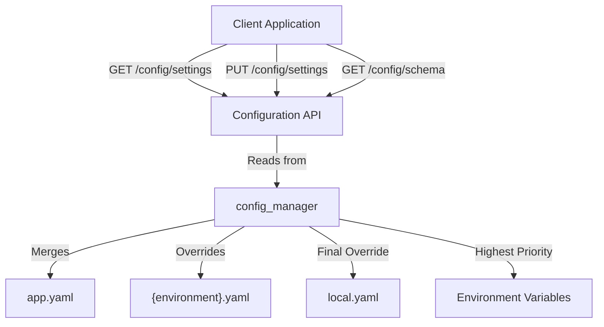
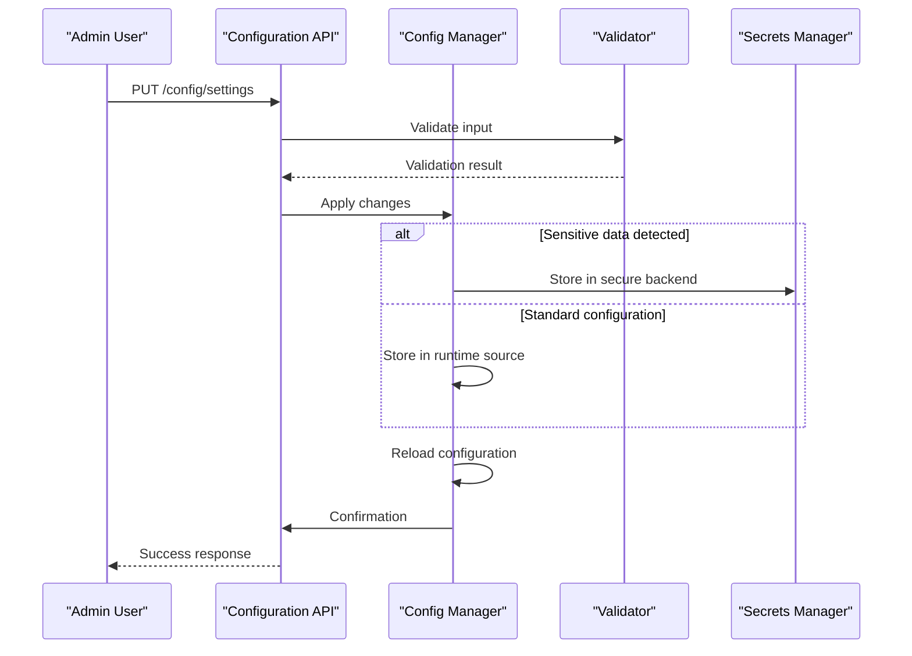

# Configuration API

<cite>
**Referenced Files in This Document**   
- [config.py](file://api/config.py)
- [schemas.py](file://api/schemas.py)
- [manager.py](file://config/manager.py)
- [app.yaml](file://config/app.yaml)
- [development.yaml](file://config/development.yaml)
- [production.yaml](file://config/production.yaml)
- [testing.yaml](file://config/testing.yaml)
</cite>

## Table of Contents
1. [Introduction](#introduction)
2. [Configuration Endpoints](#configuration-endpoints)
3. [Hierarchical Configuration System](#hierarchical-configuration-system)
4. [Configuration Schemas](#configuration-schemas)
5. [Validation and Security](#validation-and-security)
6. [Access Control and Auditing](#access-control-and-auditing)
7. [Dynamic Configuration and Application Behavior](#dynamic-configuration-and-application-behavior)
8. [Integration Examples](#integration-examples)
9. [Troubleshooting](#troubleshooting)

## Introduction
The Configuration API provides secure, hierarchical management of application settings for the SAT Report Generator. This API enables administrators to retrieve, update, and validate configuration parameters through RESTful endpoints under `/api/v1/config`. The system supports environment-specific overrides, secure handling of sensitive data, and runtime configuration changes with proper validation.

**Section sources**
- [config.py](file://api/config.py#L1-L453)

## Configuration Endpoints
The Configuration API exposes several endpoints for managing system settings:

### GET /config/settings
Retrieves the current merged configuration. Returns a JSON representation of all configuration values after merging across all sources.

### PUT /config/settings
Updates configuration values at runtime. Accepts JSON payload with key-value pairs to update. Changes are stored in a high-priority runtime source and trigger configuration reload.

### GET /config/schema
Retrieves the configuration schema for validation and UI integration purposes. This endpoint provides metadata about expected configuration structure and validation rules.



**Diagram sources**
- [config.py](file://api/config.py#L1-L453)
- [manager.py](file://config/manager.py#L1-L607)

**Section sources**
- [config.py](file://api/config.py#L1-L453)

## Hierarchical Configuration System
The configuration system implements a hierarchical model with multiple layers of configuration sources, where higher-priority sources override lower-priority ones:

1. **Base Configuration** (`app.yaml`): Default settings for all environments
2. **Environment Configuration** (`{environment}.yaml`): Environment-specific overrides (development, testing, production)
3. **Local Overrides** (`local.yaml`): Machine-specific settings not committed to version control
4. **Environment Variables**: Highest priority, used for sensitive or deployment-specific settings

The system automatically detects the current environment from the `FLASK_ENV` variable and loads the corresponding configuration file. Settings are deeply merged, allowing partial overrides of nested objects.

```mermaid
graph TD
subgraph Configuration Layers
A["app.yaml<br/>Priority: 0"] --> B["{environment}.yaml<br/>Priority: 100"]
B --> C["local.yaml<br/>Priority: 200"]
C --> D["Environment Variables<br/>Priority: Highest"]
end
E["Final Merged Configuration"] < --> A
E < --> B
E < --> C
E < --> D
style A fill:#f9f,stroke:#333
style B fill:#f9f,stroke:#333
style C fill:#f9f,stroke:#333
style D fill:#f9f,stroke:#333
style E fill:#bbf,stroke:#333,color:#fff
```

**Diagram sources**
- [manager.py](file://config/manager.py#L1-L607)
- [app.yaml](file://config/app.yaml#L1-L126)

**Section sources**
- [manager.py](file://config/manager.py#L1-L607)

## Configuration Schemas
The system defines strict schemas for configuration validation and API communication.

### ConfigUpdateSchema
Represents the expected structure for configuration updates:

```json
{
  "key": "string",
  "value": "any",
  "source": "string"
}
```

### ConfigResponseSchema
Defines the response format for configuration retrieval:

```json
{
  "key": "string",
  "value": "any",
  "source": "string"
}
```

The validation schema enforces type safety and value constraints for critical settings such as port numbers, file sizes, and security parameters.

**Section sources**
- [schemas.py](file://api/schemas.py#L1-L307)
- [manager.py](file://config/manager.py#L1-L607)

## Validation and Security
All configuration updates undergo rigorous validation before being applied.

### Validation Rules
- **Port**: Must be between 1 and 65535
- **Secret Key**: Minimum 32 characters
- **Session Timeout**: Between 300 and 86400 seconds
- **Database Pool Size**: Positive integer
- **File Upload Size**: Maximum 16MB by default

### Secure Handling of Sensitive Settings
Sensitive configuration values (passwords, API keys, secret keys) are:
- Redacted in API responses when `include_sensitive=false`
- Masked in logs and error messages
- Can be stored in environment variables or external secret management systems
- Automatically detected and protected by key name patterns

The system supports integration with external secret management through the secrets manager API endpoints.



**Diagram sources**
- [manager.py](file://config/manager.py#L1-L607)
- [config.py](file://api/config.py#L1-L453)

**Section sources**
- [manager.py](file://config/manager.py#L1-L607)

## Access Control and Auditing
The Configuration API enforces strict access controls and maintains audit trails.

### Access Controls
All configuration endpoints require:
- Valid authentication session
- Administrator role (`Admin`)

Implemented through the `@enhanced_login_required` and `@role_required_api(['Admin'])` decorators.

### Change Auditing
All configuration changes are automatically:
- Logged with timestamp, user ID, and IP address
- Recorded in the audit log system
- Tracked through configuration reload callbacks
- Associated with the user who made the change

The system supports integration with external monitoring and alerting systems through the configured metrics endpoints.

**Section sources**
- [config.py](file://api/config.py#L1-L453)
- [manager.py](file://config/manager.py#L1-L607)

## Dynamic Configuration and Application Behavior
The configuration system supports dynamic updates with varying restart requirements.

### Runtime Updates
Most configuration changes take effect immediately:
- Feature flags
- Email settings
- Upload limits
- Logging levels

### Application Restart Required
Certain changes require application restart:
- Port number changes
- Database connection changes
- Secret key rotation
- SSL/TLS configuration

The system provides a `/config/reload` endpoint to programmatically reload configuration without restarting the application, though some changes still require full restart.

### File Watching
The system monitors configuration files for external changes:
- Watches the `config/` directory recursively
- Implements debounce to prevent rapid reloads
- Automatically reloads when configuration files are modified
- Notifies registered callbacks of configuration changes

**Section sources**
- [manager.py](file://config/manager.py#L1-L607)

## Integration Examples
Common use cases for the Configuration API:

### Retrieving Current Configuration
```http
GET /api/v1/config/settings
Authorization: Bearer <admin_token>
```

### Updating Email Settings
```http
PUT /api/v1/config/settings
Content-Type: application/json
Authorization: Bearer <admin_token>

{
  "key": "email.smtp_server",
  "value": "smtp.office365.com",
  "source": "runtime"
}
```

### Schema Introspection for UI
```http
GET /api/v1/config/schema
Accept: application/json
Authorization: Bearer <admin_token>
```

### Environment-Specific Configuration
The system automatically applies environment-specific settings:
- Development: Debug mode enabled, verbose logging
- Production: Optimized performance, minimal logging
- Testing: Isolated database, mock services

**Section sources**
- [config.py](file://api/config.py#L1-L453)
- [manager.py](file://config/manager.py#L1-L607)

## Troubleshooting
Common issues and solutions:

### Configuration Not Updating
- Ensure you have administrator privileges
- Check that the configuration key exists in the schema
- Verify JSON syntax in request body
- Review server logs for validation errors

### Sensitive Values Not Persisting
- Values may be overridden by environment variables
- Check for higher-priority configuration sources
- Ensure values are not being redacted in responses

### File Changes Not Detected
- Verify file watcher is active (`watchers_active` in status)
- Check file permissions
- Ensure the config directory is writable
- Restart the application if watchers fail

The `/config/status` endpoint provides diagnostic information about the current configuration system state.

**Section sources**
- [config.py](file://api/config.py#L1-L453)
- [manager.py](file://config/manager.py#L1-L607)