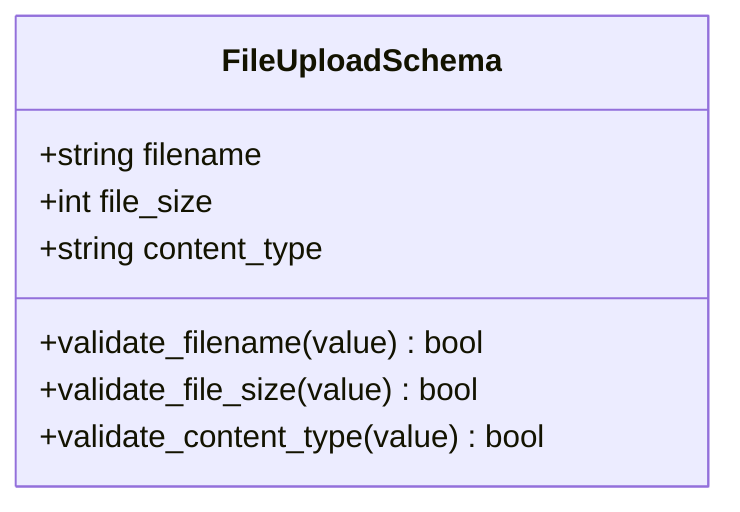
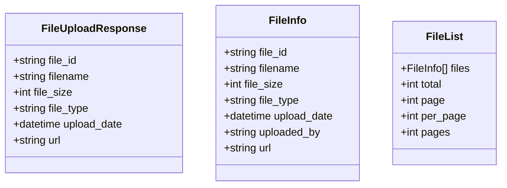
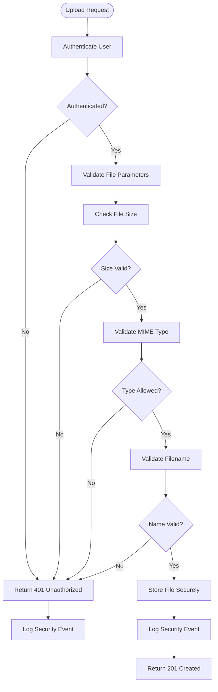
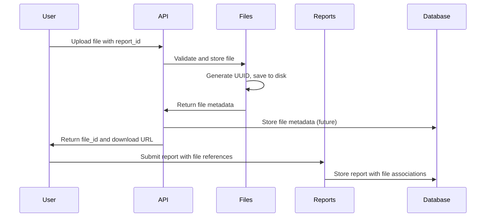
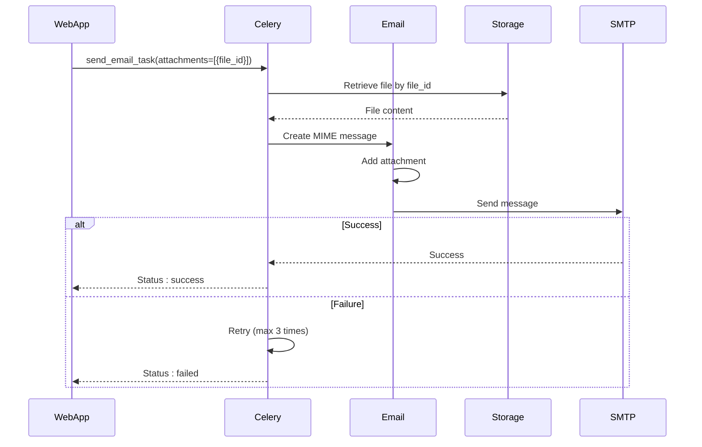
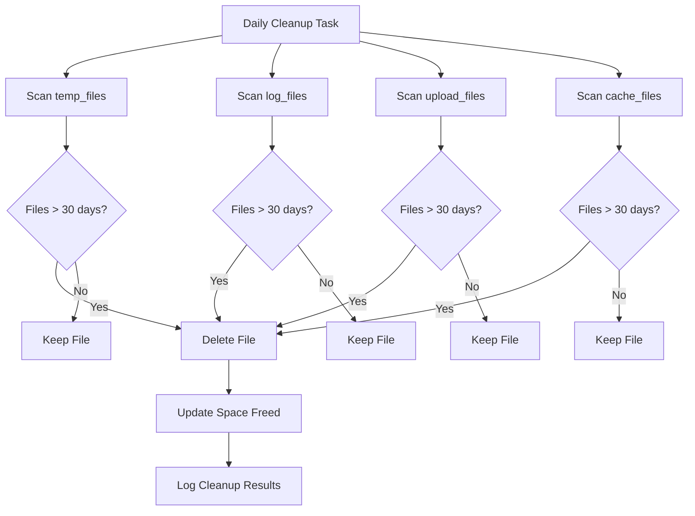

# File Operations API

<cite>
**Referenced Files in This Document**   
- [api/files.py](file://api/files.py)
- [api/schemas.py](file://api/schemas.py)
- [config/app.yaml](file://config/app.yaml)
- [tasks/email_tasks.py](file://tasks/email_tasks.py)
- [config/cdn.yaml](file://config/cdn.yaml)
- [tasks/maintenance_tasks.py](file://tasks/maintenance_tasks.py)
</cite>

## Table of Contents
1. [Introduction](#introduction)
2. [API Endpoints](#api-endpoints)
3. [File Upload Schema](#file-upload-schema)
4. [File Response Schema](#file-response-schema)
5. [File Storage Backend](#file-storage-backend)
6. [Security Measures](#security-measures)
7. [Integration with Report Submissions](#integration-with-report-submissions)
8. [Email Attachments Integration](#email-attachments-integration)
9. [Usage Examples](#usage-examples)
10. [File Size Limits and Allowed Types](#file-size-limits-and-allowed-types)
11. [Cleanup Policies](#cleanup-policies)
12. [Error Handling](#error-handling)

## Introduction
The File Operations API provides endpoints for managing file uploads, downloads, listing, and deletion within the SAT Report Generator system. These endpoints support critical workflows including report submissions and email notifications. The API ensures secure file handling with validation, access control, and integration with background tasks for asynchronous processing.

**Section sources**
- [api/files.py](file://api/files.py#L1-L50)

## API Endpoints

### POST /api/v1/files/upload
Uploads a file to the server. The file is stored with a unique identifier and can be associated with a report.

**Request**
- Method: POST
- Content-Type: multipart/form-data
- Authentication: Required (enhanced_login_required)

**Form Parameters**
- `file`: The file to upload (required)
- `report_id`: Optional report ID to associate the file with

**Response**
- Status: 201 Created
- Content-Type: application/json
- Body: FileUploadResponseSchema

**Example Request**
```bash
curl -X POST https://api.example.com/api/v1/files/upload \
  -H "Authorization: Bearer <token>" \
  -F "file=@document.pdf" \
  -F "report_id=abc123"
```

### GET /api/v1/files/download/{id}
Downloads a file by its unique identifier.

**Request**
- Method: GET
- Authentication: Required (enhanced_login_required)

**Path Parameters**
- `id`: File identifier (required)

**Query Parameters**
- `report_id`: Optional report ID for scoped access

**Response**
- Status: 200 OK
- Content-Type: File-specific (e.g., application/pdf)
- Body: File content as attachment

**Example Request**
```bash
curl -X GET https://api.example.com/api/v1/files/download/uuid-here \
  -H "Authorization: Bearer <token>" \
  -G -d report_id=abc123
```

### GET /api/v1/files/list
Retrieves a list of uploaded files with pagination support.

**Request**
- Method: GET
- Authentication: Required (enhanced_login_required)

**Query Parameters**
- `page`: Page number (default: 1)
- `per_page`: Items per page (default: 20, max: 100)
- `report_id`: Filter by report ID

**Response**
- Status: 200 OK
- Content-Type: application/json
- Body: FileListSchema

**Example Request**
```bash
curl -X GET https://api.example.com/api/v1/files/list \
  -H "Authorization: Bearer <token>" \
  -G -d page=1 -d per_page=10 -d report_id=abc123
```

### DELETE /api/v1/files/{id}
Deletes a file by its unique identifier.

**Request**
- Method: DELETE
- Authentication: Required (enhanced_login_required)

**Path Parameters**
- `id`: File identifier (required)

**Query Parameters**
- `report_id`: Optional report ID for scoped deletion

**Response**
- Status: 200 OK
- Content-Type: application/json
- Body: Success message

**Example Request**
```bash
curl -X DELETE https://api.example.com/api/v1/files/uuid-here \
  -H "Authorization: Bearer <token>" \
  -G -d report_id=abc123
```

**Section sources**
- [api/files.py](file://api/files.py#L158-L305)

## File Upload Schema
The FileUploadSchema defines the structure and validation rules for file metadata.



**Validation Rules**
- **filename**: Must pass InputValidator.validate_filename()
- **file_size**: Must not exceed system limits and pass InputValidator.validate_file_size()
- **content_type**: Must be one of the allowed MIME types

**Allowed MIME Types**
- image/png, image/jpeg, image/gif, image/webp
- application/pdf
- application/vnd.openxmlformats-officedocument.wordprocessingml.document
- application/msword

**Section sources**
- [api/schemas.py](file://api/schemas.py#L200-L230)
- [api/files.py](file://api/files.py#L70-L85)

## File Response Schema
The API returns standardized file information in responses.



**Field Descriptions**
- **file_id**: UUID generated for the file
- **filename**: Original filename from upload
- **file_size**: Size in bytes
- **file_type**: MIME type of the file
- **upload_date**: ISO 8601 timestamp
- **url**: Access URL for download
- **uploaded_by**: User ID of uploader

**Section sources**
- [api/files.py](file://api/files.py#L20-L55)

## File Storage Backend
Files are stored locally on the server with a structured directory organization.

**Storage Configuration**
- Base path: Configured in app.yaml under uploads.upload_path
- Default: static/uploads
- Report-specific storage: uploads/reports/{report_id}

**File Naming Convention**
- Original files are renamed using UUIDs to prevent conflicts
- Format: {uuid}.{extension}
- Example: 550e8400-e29b-41d4-a716-446655440000.pdf

**CDN Integration**
- CDN is configured but currently disabled
- When enabled, files will be served through CloudFront
- Cache control headers vary by file type:
  - Images: 24 hours
  - Documents: 1 hour
  - HTML/JSON: 5 minutes

```mermaid
graph TD
A[Client Upload] --> B[Server]
B --> C{Report ID?}
C --> |Yes| D[uploads/reports/{report_id}]
C --> |No| E[uploads/]
D --> F[UUID-filename.ext]
E --> G[UUID-filename.ext]
F --> H[CDN Distribution]
G --> H
H --> I[Client Download]
```

**Section sources**
- [api/files.py](file://api/files.py#L93-L128)
- [config/app.yaml](file://config/app.yaml#L25-L35)
- [config/cdn.yaml](file://config/cdn.yaml#L1-L165)

## Security Measures
The file operations API implements multiple security layers to protect against common threats.

**MIME Type Validation**
- Strict whitelist of allowed content types
- Validation occurs at upload time
- Prevents execution of malicious file types

**Filename Validation**
- Uses InputValidator.validate_filename()
- Prevents directory traversal attacks
- Sanitizes special characters

**File Size Limits**
- Maximum file size: 16MB
- Configured in app.yaml and enforced in code
- Prevents denial-of-service attacks

**Virus Scanning**
- Not currently implemented
- Future enhancement planned
- Would integrate with antivirus service

**Access Control**
- All endpoints require authentication
- File access tied to user permissions
- Report-associated files require appropriate report access



**Section sources**
- [api/files.py](file://api/files.py#L93-L128)
- [security/validation.py](file://security/validation.py#L269-L293)
- [api/files.py](file://api/files.py#L199-L237)

## Integration with Report Submissions
Files are tightly integrated with the report submission workflow.

**Report Association**
- Files can be linked to reports via report_id parameter
- Stored in report-specific subdirectories
- Access controlled by report permissions

**Submission Workflow**
1. User uploads supporting documents for a SAT report
2. Files are stored with unique identifiers
3. Report submission references these file IDs
4. Approval process includes document review
5. Generated reports may include attached documents

**Database Relationship**
- In a complete implementation, file metadata would be stored in the database
- Foreign key relationship to reports table
- Currently implemented with file system storage



**Section sources**
- [api/files.py](file://api/files.py#L93-L128)
- [api/reports.py](file://api/reports.py#L350-L400)

## Email Attachments Integration
Uploaded files can be attached to email notifications through background tasks.

**Attachment Process**
- Files are retrieved by file_id
- Content loaded into memory
- Attached to email messages
- Sent via SMTP with proper encoding

**Background Task Flow**
1. Email task receives file_id list
2. Retrieve files from storage
3. Encode as MIME attachments
4. Send email with attachments
5. Handle failures with retry logic

**Task Configuration**
- Maximum retries: 3
- Retry delay: 60 seconds
- Progress tracking: 25%, 50%, 75%, 100%



**Section sources**
- [tasks/email_tasks.py](file://tasks/email_tasks.py#L0-L402)
- [api/files.py](file://api/files.py#L126-L164)

## Usage Examples

### Uploading Supporting Documents for SAT Reports
```python
import requests

# Upload a PDF document for a SAT report
url = "https://api.example.com/api/v1/files/upload"
headers = {
    "Authorization": "Bearer your-access-token"
}
files = {
    "file": ("test_plan.pdf", open("test_plan.pdf", "rb"), "application/pdf")
}
data = {
    "report_id": "sat-report-001"
}

response = requests.post(url, headers=headers, files=files, data=data)
print(response.json())
# Response: {
#   "file_id": "550e8400-e29b-41d4-a716-446655440000",
#   "filename": "test_plan.pdf",
#   "file_size": 152400,
#   "file_type": "application/pdf",
#   "upload_date": "2025-09-13T10:30:00Z",
#   "url": "/api/v1/files/550e8400-e29b-41d4-a716-446655440000"
# }
```

### Generating Download URLs
```python
# Generate a download URL for a file
def generate_download_url(file_id, report_id=None):
    base_url = "https://api.example.com/api/v1/files/download"
    url = f"{base_url}/{file_id}"
    if report_id:
        url += f"?report_id={report_id}"
    return url

# Usage
download_url = generate_download_url(
    "550e8400-e29b-41d4-a716-446655440000",
    "sat-report-001"
)
print(download_url)
# Output: https://api.example.com/api/v1/files/download/550e8400-e29b-41d4-a716-446655440000?report_id=sat-report-001
```

**Section sources**
- [api/files.py](file://api/files.py#L158-L202)
- [api/files.py](file://api/files.py#L238-L270)

## File Size Limits and Allowed Types
The system enforces strict limits on file uploads to ensure performance and security.

**Size Limits**
- Maximum file size: 16MB (16,777,216 bytes)
- Configured in app.yaml and enforced in code
- Exceeding limit returns 400 Bad Request

**Allowed File Types**
- **Images**: PNG, JPG/JPEG, GIF
- **Documents**: PDF, DOCX, DOC
- **Spreadsheets**: XLSX
- **Text**: TXT, CSV

**Configuration**
```yaml
# config/app.yaml
uploads:
  max_file_size: 16777216  # 16MB
  allowed_extensions:
    - "png"
    - "jpg"
    - "jpeg"
    - "gif"
    - "pdf"
    - "docx"
```

**Section sources**
- [config/app.yaml](file://config/app.yaml#L25-L35)
- [api/files.py](file://api/files.py#L93-L128)

## Cleanup Policies
Temporary files are automatically cleaned up to prevent disk space exhaustion.

**Cleanup Schedule**
- Runs daily at 02:00
- Configured in maintenance tasks
- Files older than 30 days are removed

**Cleanup Targets**
- Temporary upload directories
- Log files (rotated logs)
- Cache files
- Temporary working files

**Retention Policy**
- Maximum age: 30 days
- Configurable via max_age_days parameter
- Space reclamation tracked and logged



**Section sources**
- [tasks/maintenance_tasks.py](file://tasks/maintenance_tasks.py#L0-L138)
- [database/backup.py](file://database/backup.py#L658-L686)

## Error Handling
The API provides comprehensive error handling for file operations.

**Common Error Responses**
- **400 Bad Request**: Missing file, invalid parameters
- **401 Unauthorized**: Authentication required
- **403 Forbidden**: Insufficient permissions
- **404 Not Found**: File not found
- **413 Payload Too Large**: File exceeds size limit
- **500 Internal Server Error**: Server processing failure

**Error Response Format**
```json
{
  "message": "Descriptive error message"
}
```

**Security Event Logging**
- All failed operations are logged
- Security events include:
  - Failed uploads
  - Unauthorized access attempts
  - Validation failures
- Logs include filename, user ID, and error details

**Section sources**
- [api/files.py](file://api/files.py#L158-L202)
- [api/files.py](file://api/files.py#L238-L270)