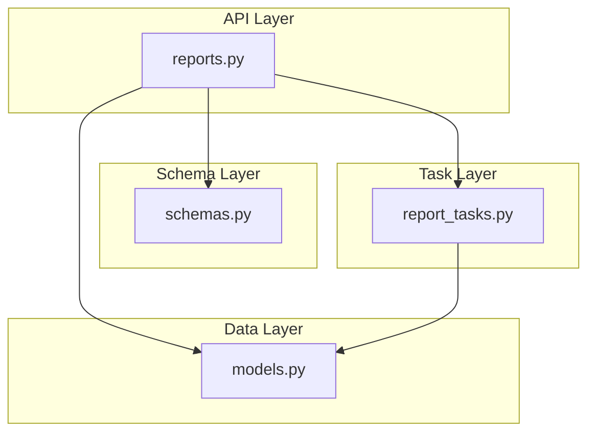
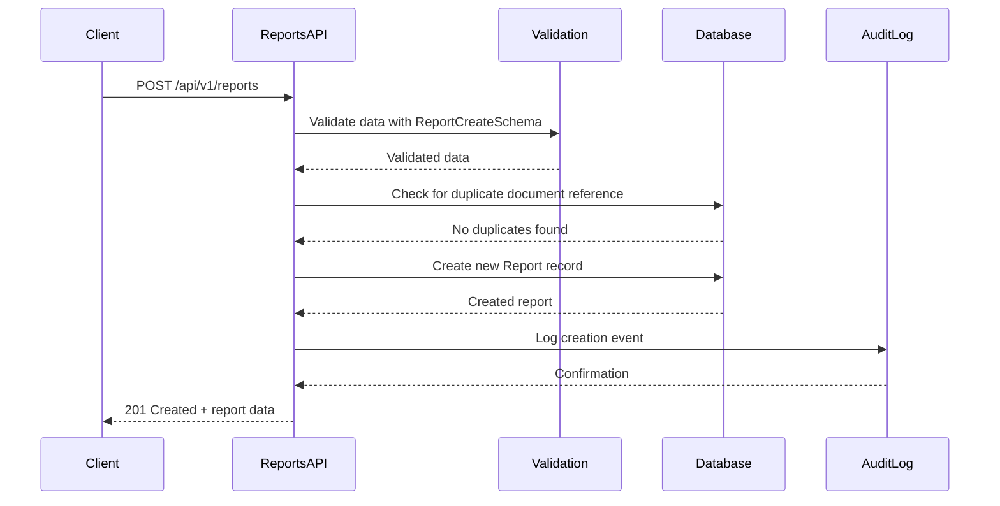
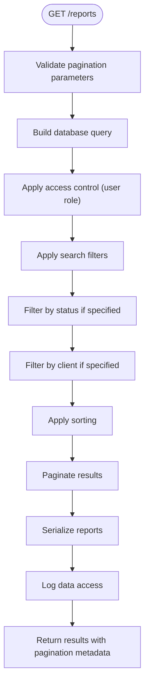
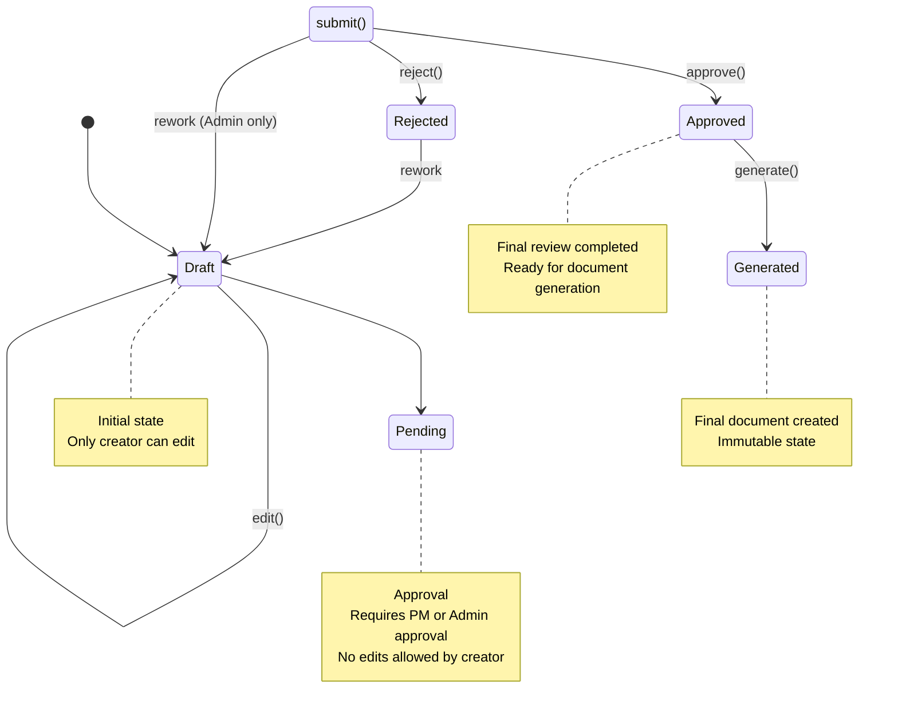
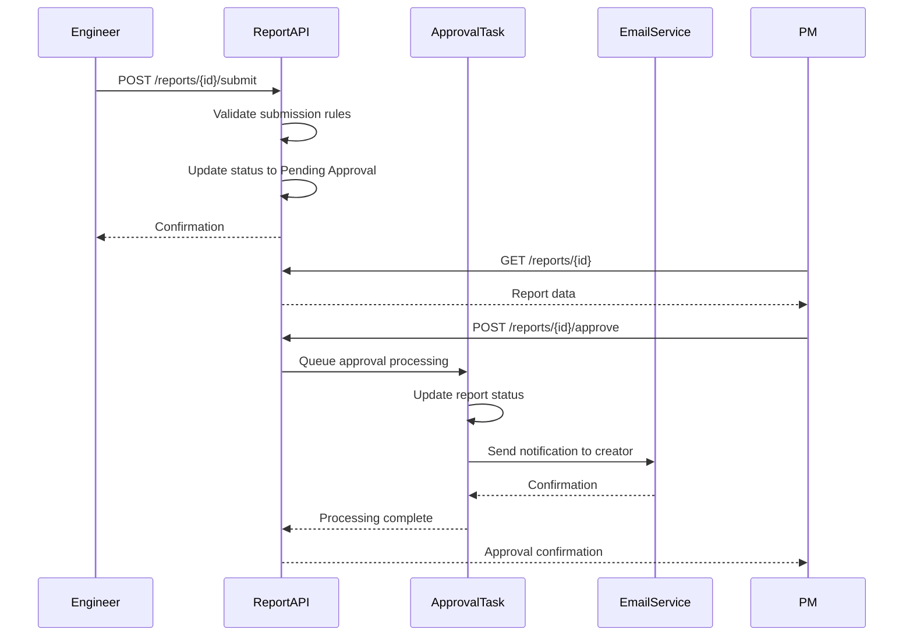
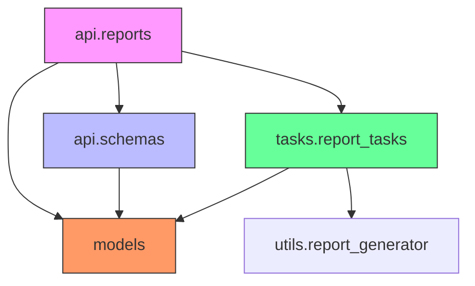

# Report Management API

<cite>
**Referenced Files in This Document**   
- [reports.py](file://api/reports.py)
- [schemas.py](file://api/schemas.py)
- [report_tasks.py](file://tasks/report_tasks.py)
- [models.py](file://models.py)
</cite>

## Table of Contents
1. [Introduction](#introduction)
2. [Core Components](#core-components)
3. [Architecture Overview](#architecture-overview)
4. [Detailed Component Analysis](#detailed-component-analysis)
5. [Dependency Analysis](#dependency-analysis)
6. [Performance Considerations](#performance-considerations)
7. [Troubleshooting Guide](#troubleshooting-guide)
8. [Conclusion](#conclusion)

## Introduction
The Report Management API provides a comprehensive interface for managing technical reports within the system. It supports full CRUD operations for reports, specialized state transitions for approval workflows, document generation, and integration with background processing and audit logging systems. The API is designed to support SAT-specific reporting requirements while maintaining extensibility for other report types.

The system implements a robust state machine for report lifecycle management, from draft creation through approval and final document generation. It integrates with Celery for asynchronous report generation tasks and includes comprehensive audit logging for all critical operations.

**Section sources**
- [reports.py](file://api/reports.py#L1-L504)
- [schemas.py](file://api/schemas.py#L1-L307)

## Core Components

The Report Management API consists of several key components that work together to provide a complete reporting solution. The core functionality is implemented in the `reports.py` module using Flask-RESTX for API endpoint definition and documentation. Data validation and serialization are handled through Marshmallow schemas defined in `schemas.py`. Background processing for report generation is managed by Celery tasks in `report_tasks.py`, while data persistence is handled by SQLAlchemy models in `models.py`.

Key components include:
- Report CRUD operations with comprehensive validation
- Approval workflow management with state transitions
- Asynchronous document generation via Celery
- Audit logging integration for security and compliance
- Rate limiting for edit operations
- Version history tracking

**Section sources**
- [reports.py](file://api/reports.py#L1-L504)
- [schemas.py](file://api/schemas.py#L1-L307)
- [report_tasks.py](file://tasks/report_tasks.py#L1-L453)
- [models.py](file://models.py#L1-L701)

## Architecture Overview



**Diagram sources**
- [reports.py](file://api/reports.py#L1-L504)
- [schemas.py](file://api/schemas.py#L1-L307)
- [report_tasks.py](file://tasks/report_tasks.py#L1-L453)
- [models.py](file://models.py#L1-L701)

## Detailed Component Analysis

### Report CRUD Operations
The API provides standard CRUD operations for report management through the `/api/v1/reports` endpoints. These operations include creation, retrieval, updating, and deletion of reports with appropriate access control and validation.

#### Report Creation


**Diagram sources**
- [reports.py](file://api/reports.py#L100-L150)
- [schemas.py](file://api/schemas.py#L150-L180)

#### Report Retrieval with Filtering


**Diagram sources**
- [reports.py](file://api/reports.py#L50-L95)

### Approval Workflow Management
The report approval system implements a state machine that governs the lifecycle of reports from draft to approved status. This workflow ensures proper review and validation before final document generation.

#### State Transition Diagram


**Diagram sources**
- [reports.py](file://api/reports.py#L250-L350)
- [models.py](file://models.py#L150-L170)

#### Approval Process Sequence


**Diagram sources**
- [reports.py](file://api/reports.py#L300-L350)
- [report_tasks.py](file://tasks/report_tasks.py#L150-L250)

### Document Generation System
The document generation system uses Celery for asynchronous processing of report documents, allowing the API to remain responsive while generating potentially large documents.

#### Report Generation Flow
```mermaid
flowchart TD
A([POST /reports/{id}/generate]) --> B{Status = Approved?}
B --> |No| C[Return Error]
B --> |Yes| D[Queue generate_report_task]
D --> E[Task: generate_report_task]
E --> F[Initialize ReportGenerator]
F --> G[Prepare output directory]
G --> H[Generate document file]
H --> I{File created?}
I --> |No| J[Update status: GENERATION_FAILED]
I --> |Yes| K[Update status: GENERATED]
K --> L[Return success response]
```

**Diagram sources**
- [reports.py](file://api/reports.py#L350-L400)
- [report_tasks.py](file://tasks/report_tasks.py#L1-L150)

## Dependency Analysis



**Diagram sources**
- [reports.py](file://api/reports.py#L1-L504)
- [schemas.py](file://api/schemas.py#L1-L307)
- [report_tasks.py](file://tasks/report_tasks.py#L1-L453)
- [models.py](file://models.py#L1-L701)

## Performance Considerations

The Report Management API incorporates several performance optimizations:

1. **Database Query Optimization**: The GET /reports endpoint uses pagination and selective filtering to prevent excessive data retrieval.
2. **Asynchronous Processing**: Document generation is handled by Celery tasks to avoid blocking API responses.
3. **Caching Strategy**: Report lists can be cached at the middleware level for frequently accessed data.
4. **Rate Limiting**: Edit operations are rate-limited to prevent abuse and ensure system stability.
5. **Connection Pooling**: Database connections are pooled to reduce connection overhead.

The system also includes monitoring capabilities through the audit logging system, which can be used to identify performance bottlenecks and optimize frequently accessed endpoints.

**Section sources**
- [reports.py](file://api/reports.py#L50-L95)
- [report_tasks.py](file://tasks/report_tasks.py#L1-L453)

## Troubleshooting Guide

Common issues and their solutions:

1. **Report submission fails with "must have SAT reports" error**
   - Cause: Attempting to submit a report without associated SAT data
   - Solution: Ensure at least one SAT report is associated with the main report before submission

2. **Document generation fails**
   - Cause: Template file missing, disk space issues, or generation timeout
   - Solution: Check report_tasks.py logs, verify template availability, and ensure sufficient disk space

3. **Permission denied errors**
   - Cause: User role lacks required permissions for the operation
   - Solution: Verify user role and required permissions for the specific endpoint

4. **Duplicate document reference errors**
   - Cause: Attempting to create a report with an existing document reference
   - Solution: Use a unique document reference or retrieve the existing report

5. **Approval workflow not triggering notifications**
   - Cause: Email service misconfiguration or task queue issues
   - Solution: Verify Celery worker status and email service configuration

**Section sources**
- [reports.py](file://api/reports.py#L1-L504)
- [report_tasks.py](file://tasks/report_tasks.py#L1-L453)

## Conclusion

The Report Management API provides a robust, secure, and scalable solution for managing technical reports within the organization. Its well-defined endpoints, comprehensive validation, and integration with background processing systems make it suitable for handling complex reporting workflows, particularly for SAT-specific requirements.

The architecture separates concerns effectively between API handling, data validation, business logic, and background processing, allowing for maintainable and extensible code. The state-based approval workflow ensures proper review processes are followed, while the asynchronous document generation system maintains API responsiveness.

Future enhancements could include additional report types, more sophisticated version comparison tools, and enhanced collaboration features such as inline commenting and change tracking.