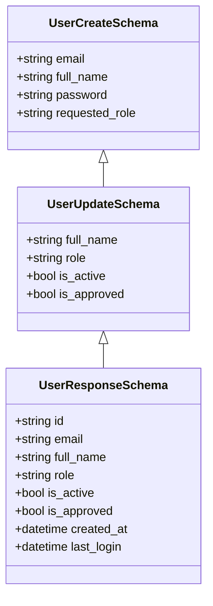
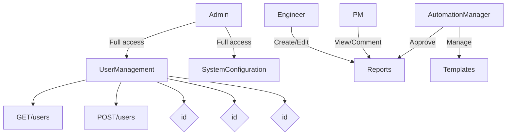
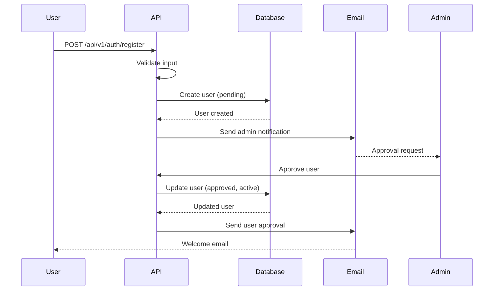
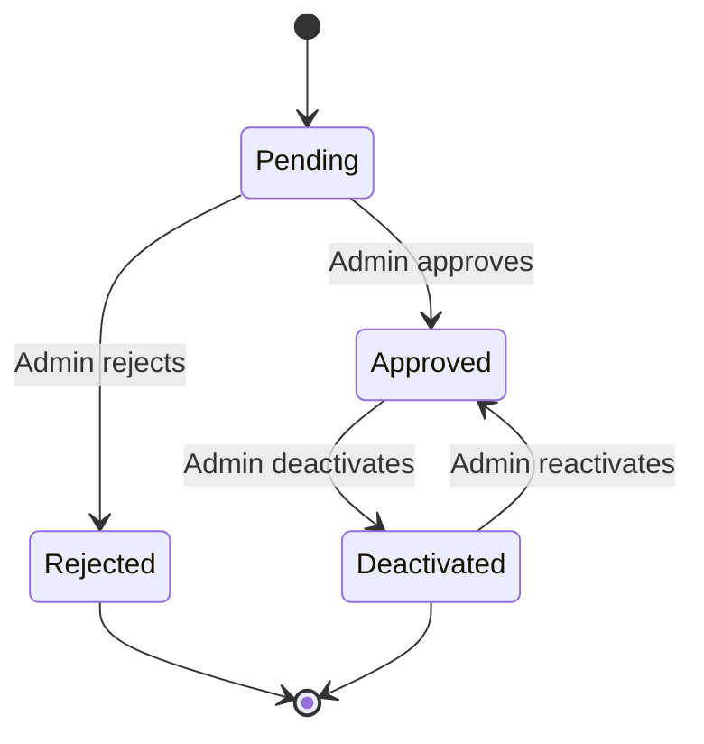
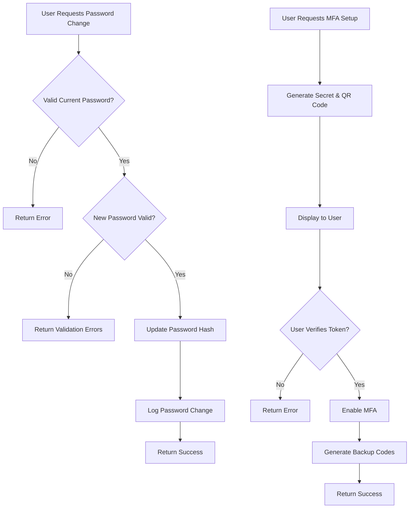
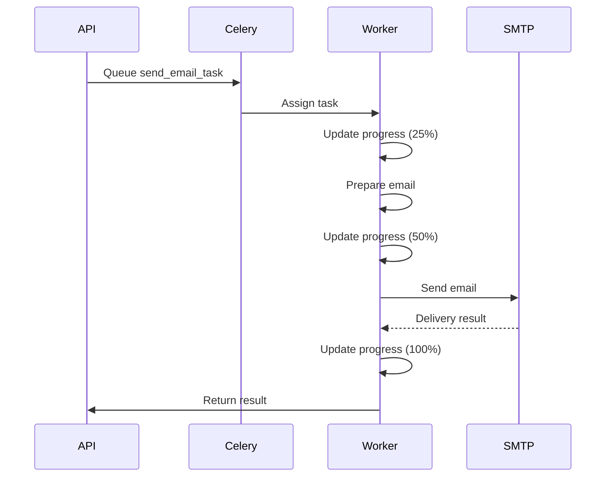
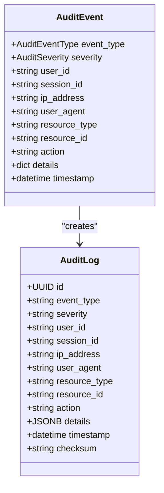

# User Management API

<cite>
**Referenced Files in This Document**   
- [users.py](file://api/users.py)
- [schemas.py](file://api/schemas.py)
- [models.py](file://models.py)
- [audit.py](file://security/audit.py)
- [email_tasks.py](file://tasks/email_tasks.py)
</cite>

## Table of Contents
1. [Introduction](#introduction)
2. [User Management Endpoints](#user-management-endpoints)
3. [Request/Response Schemas](#requestresponse-schemas)
4. [Role-Based Access Control](#role-based-access-control)
5. [User Registration Workflow](#user-registration-workflow)
6. [User Approval and Status](#user-approval-and-status)
7. [Password Reset and MFA](#password-reset-and-mfa)
8. [Background Tasks and Email Notifications](#background-tasks-and-email-notifications)
9. [Audit Logging](#audit-logging)
10. [Error Conditions](#error-conditions)
11. [Examples](#examples)

## Introduction
This document provides comprehensive API documentation for the user management system under `/api/v1/users`. The API supports full CRUD operations for user accounts with robust role-based access control, audit logging, and integration with background task processing for email notifications. The system implements a secure user registration and approval workflow, ensuring proper governance of user access.

The user management API is built on Flask-RESTx with Marshmallow for schema validation, SQLAlchemy for data persistence, and Celery for background task execution. All operations are protected by authentication and authorization mechanisms, with comprehensive audit logging for compliance and security monitoring.

**Section sources**
- [users.py](file://api/users.py#L1-L335)
- [schemas.py](file://api/schemas.py#L1-L306)

## User Management Endpoints

### GET /users
Retrieves a paginated list of all users in the system. Only users with the Admin role can access this endpoint.

**Query Parameters:**
- `page`: Page number (default: 1)
- `per_page`: Number of users per page (default: 20, max: 100)
- `search`: Text search on email or full name
- `role`: Filter by user role
- `status`: Filter by status (active, inactive, pending)

**Response:** Returns a paginated list of users with total count and pagination metadata.

### POST /users
Creates a new user account. This endpoint is typically used during the user registration process.

**Request Body:** Requires user registration information including email, full name, password, and requested role.

**Response:** Returns success message with user ID. New accounts are created with `is_active=False` and `is_approved=False`, requiring admin approval.

### GET /users/{id}
Retrieves detailed information about a specific user.

**Permissions:**
- Users can view their own profile
- Admin users can view any user's profile

**Response:** Returns complete user information including ID, email, full name, role, status, and timestamps.

### PUT /users/{id}
Updates user information. Field-level permissions apply based on the authenticated user's role.

**Permissions:**
- Users can update their own full name
- Admin users can update any user field including role, active status, and approval status

**Response:** Returns updated user information.

### DELETE /users/{id}
Deactivates a user account (soft delete). Only Admin users can perform this operation.

**Restrictions:**
- Users cannot delete their own account
- Actual database records are preserved with `is_active=False`

**Response:** Returns success message indicating the user has been deactivated.

**Section sources**
- [users.py](file://api/users.py#L1-L335)

## Request/Response Schemas

### UserCreateSchema
Schema for creating new users during registration.

**Fields:**
- `email`: User's email address (required, must be unique)
- `full_name`: User's full name (required, 2-100 characters)
- `password`: User's password (required, minimum 12 characters)
- `requested_role`: Role requested by user (required, one of: Engineer, Admin, PM, Automation Manager)

### UserUpdateSchema
Schema for updating existing user information.

**Fields:**
- `full_name`: User's full name (2-100 characters)
- `role`: User's role (one of: Engineer, Admin, PM, Automation Manager)
- `is_active`: Account active status (boolean)
- `is_approved`: Account approval status (boolean)

### UserResponseSchema
Schema for user response data.

**Fields:**
- `id`: Unique user identifier
- `email`: User's email address
- `full_name`: User's full name
- `role`: User's current role
- `is_active`: Whether account is active
- `is_approved`: Whether account has been approved by admin
- `created_at`: Account creation timestamp
- `last_login`: Last login timestamp



**Diagram sources**
- [schemas.py](file://api/schemas.py#L1-L306)

## Role-Based Access Control

The system implements a role-based access control (RBAC) model with four distinct roles:

### Roles
- **Admin**: Full administrative privileges including user management, approvals, and system configuration
- **Engineer**: Can create and edit reports, submit for approval, and view assigned reports
- **PM (Project Manager)**: Can view reports, provide feedback, and track project progress
- **Automation Manager**: Can approve reports, manage templates, and oversee the approval workflow

### Permission Matrix
| Operation | Admin | Engineer | PM | Automation Manager |
|---------|-------|----------|-----|-------------------|
| View all users | ✓ | ✗ | ✗ | ✗ |
| View own profile | ✓ | ✓ | ✓ | ✓ |
| Update own name | ✓ | ✓ | ✓ | ✓ |
| Update any user | ✓ | ✗ | ✗ | ✗ |
| Approve users | ✓ | ✗ | ✗ | ✗ |
| Delete users | ✓ | ✗ | ✗ | ✗ |
| View user stats | ✓ | ✗ | ✗ | ✗ |



**Diagram sources**
- [users.py](file://api/users.py#L1-L335)
- [models.py](file://models.py#L1-L700)

## User Registration Workflow

The user registration process follows a secure workflow with admin approval:

### Registration Steps
1. User submits registration form with email, full name, password, and requested role
2. System validates input against UserRegistrationSchema
3. New user record is created with `is_active=False` and `is_approved=False`
4. Admin receives notification of pending approval
5. Admin reviews and approves or rejects the account
6. User receives email notification of approval status

### Security Features
- Password policy enforcement (minimum 12 characters)
- Email uniqueness validation
- Rate limiting on registration attempts (3 per hour)
- Input sanitization and validation
- Secure password hashing with Werkzeug



**Diagram sources**
- [users.py](file://api/users.py#L1-L335)
- [auth.py](file://api/auth.py#L1-L429)
- [email_tasks.py](file://tasks/email_tasks.py#L1-L401)

## User Approval and Status

User accounts have two status indicators that control access:

### Status Fields
- **is_active**: Controls whether the user can log in
  - `True`: User can authenticate and access the system
  - `False`: User is deactivated and cannot log in
- **is_approved**: Controls whether the account has been vetted by an administrator
  - `True`: Account has been approved
  - `False`: Account is pending approval

### Approval Endpoints
- `POST /users/{id}/approve`: Admin endpoint to approve a user account
- `POST /users/{id}/reject`: Admin endpoint to reject a user account

### State Transitions
- **Pending**: New registration, `is_active=False`, `is_approved=False`
- **Approved**: Admin approved, `is_active=True`, `is_approved=True`
- **Rejected**: Admin rejected, user record deleted
- **Deactivated**: Admin deactivated, `is_active=False`, `is_approved=True`



**Diagram sources**
- [users.py](file://api/users.py#L1-L335)
- [models.py](file://models.py#L1-L700)

## Password Reset and MFA

The system supports secure password management and multi-factor authentication:

### Password Reset
- Users can change their password via `POST /api/v1/auth/password/change`
- Requires current password and new password
- New password must meet complexity requirements
- Password change is logged in audit trail

### Multi-Factor Authentication
- Optional MFA using TOTP (Time-based One-Time Password)
- Setup flow:
  1. User requests MFA setup
  2. System generates secret and QR code
  3. User scans QR code with authenticator app
  4. User verifies with generated token
  5. MFA is enabled with backup codes



**Diagram sources**
- [auth.py](file://api/auth.py#L1-L429)

## Background Tasks and Email Notifications

The system integrates with Celery for asynchronous email processing:

### Email Task Flow
1. API endpoint triggers email task
2. Task is queued in Celery
3. Worker processes the task and sends email
4. Task status is updated with progress
5. Completion or failure is logged

### Notification Types
- User registration confirmation
- Account approval/rejection
- Password change confirmation
- Security alerts
- System notifications

### Retry Mechanism
- Failed email tasks are automatically retried
- Maximum of 3 retries with exponential backoff
- Final failure is logged with error details



**Diagram sources**
- [email_tasks.py](file://tasks/email_tasks.py#L1-L401)
- [users.py](file://api/users.py#L1-L335)

## Audit Logging

All user management operations are logged for security and compliance:

### Logged Events
- User creation (DATA_CREATE)
- User retrieval (DATA_READ)
- User update (DATA_UPDATE)
- User deletion (DATA_DELETE)
- Access denied attempts (ACCESS_DENIED)

### Audit Record Structure
- Event type and severity
- User ID and session ID
- IP address and user agent
- Resource type and ID
- Action performed
- Timestamp
- Integrity checksum (SHA-256)

### Compliance Features
- Immutable log entries with cryptographic integrity
- 7-year retention policy
- GDPR compliance support
- Export capabilities for audits



**Diagram sources**
- [audit.py](file://security/audit.py#L1-L594)

## Error Conditions

The API returns specific error responses for various failure scenarios:

### Common Error Codes
| Status | Error | Description |
|--------|-------|-------------|
| 400 | Bad Request | Invalid input data |
| 401 | Unauthorized | Authentication required |
| 403 | Forbidden | Insufficient permissions |
| 404 | Not Found | User not found |
| 409 | Conflict | Duplicate email |
| 429 | Too Many Requests | Rate limit exceeded |

### Specific Error Conditions
- **Duplicate Email**: `409 Conflict` when creating a user with existing email
- **Invalid Role**: `400 Bad Request` when specifying a role not in allowed list
- **Forbidden Operation**: `403 Forbidden` when user lacks required permissions
- **Self-Deletion**: `400 Bad Request` when attempting to delete own account
- **Already Approved**: `400 Bad Request` when approving an already approved user

### Error Response Structure
```json
{
  "message": "Descriptive error message",
  "errors": ["Validation error details"]
}
```

**Section sources**
- [users.py](file://api/users.py#L1-L335)
- [schemas.py](file://api/schemas.py#L1-L306)

## Examples

### Creating Users with Different Roles
```http
POST /api/v1/auth/register HTTP/1.1
Content-Type: application/json

{
  "full_name": "John Engineer",
  "email": "john@company.com",
  "password": "SecurePass123!",
  "requested_role": "Engineer"
}
```

### Updating Profile Information
```http
PUT /api/v1/users/123 HTTP/1.1
Authorization: Bearer <token>
Content-Type: application/json

{
  "full_name": "John Smith",
  "role": "Senior Engineer"
}
```

### Retrieving User List with Filtering
```http
GET /api/v1/users?role=Engineer&status=active&page=1&per_page=10 HTTP/1.1
Authorization: Bearer <token>
```

### Approving a User Account
```http
POST /api/v1/users/123/approve HTTP/1.1
Authorization: Bearer <admin_token>
```

**Section sources**
- [users.py](file://api/users.py#L1-L335)
- [auth.py](file://api/auth.py#L1-L429)