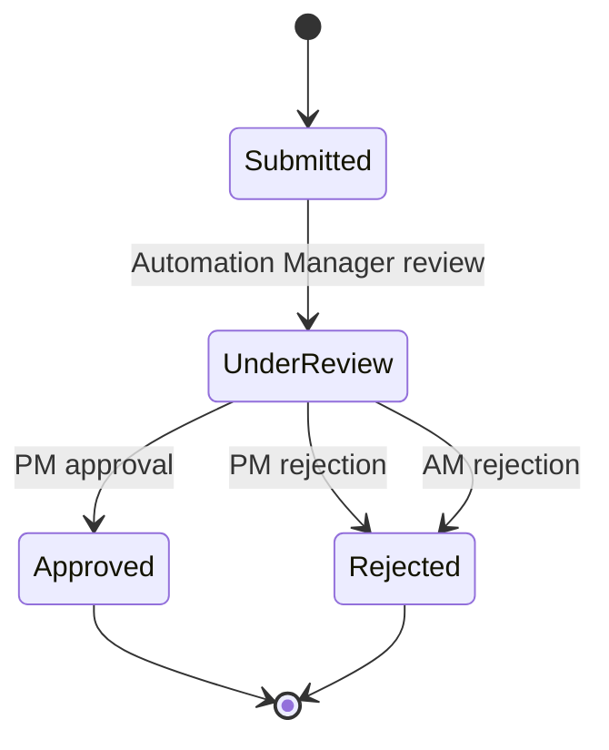
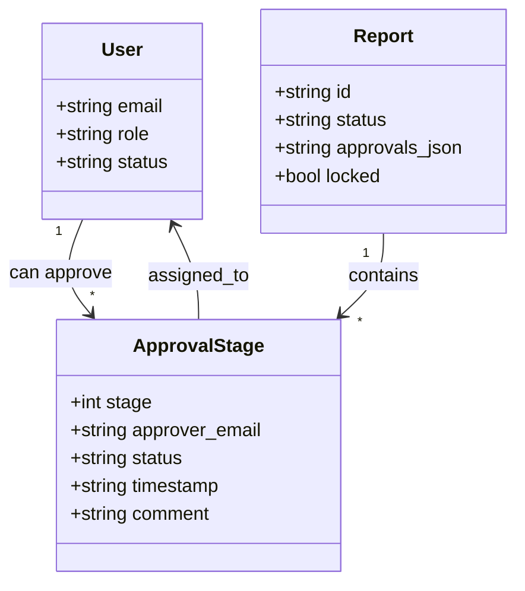
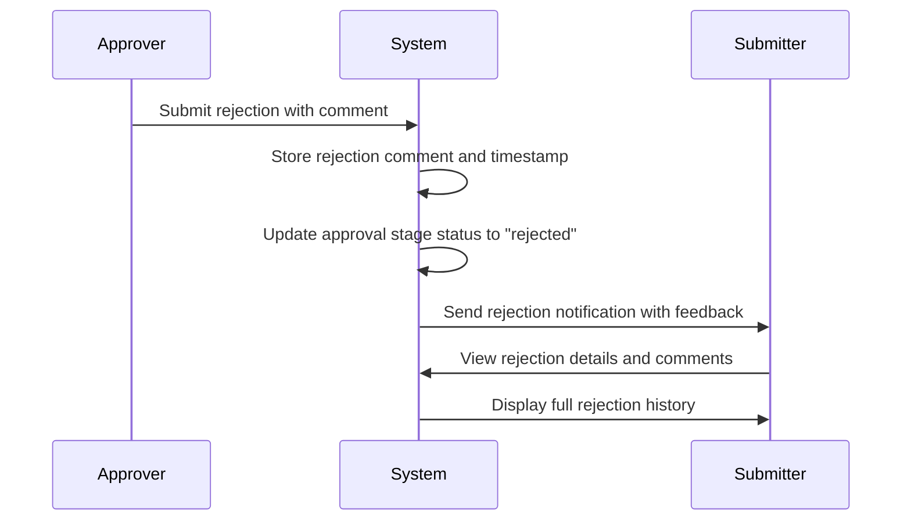

# Approval Workflow

<cite>
**Referenced Files in This Document**   
- [routes/approval.py](file://routes/approval.py)
- [security/audit.py](file://security/audit.py)
- [routes/dashboard.py](file://routes/dashboard.py)
- [auth.py](file://auth.py)
- [models.py](file://models.py)
</cite>

## Table of Contents
1. [Introduction](#introduction)
2. [Approval State Transitions](#approval-state-transitions)
3. [Role-Based Access Control](#role-based-access-control)
4. [Dashboard Views for Approval Management](#dashboard-views-for-approval-management)
5. [Comment System and Rejection Flow](#comment-system-and-rejection-flow)
6. [Audit Trail Implementation](#audit-trail-implementation)
7. [Status Update Handlers](#status-update-handlers)
8. [Edge Case Handling](#edge-case-handling)
9. [Performance Considerations](#performance-considerations)
10. [Conclusion](#conclusion)

## Introduction
This document details the multi-stage approval process for the SAT Report Generator system. The workflow manages the lifecycle of reports from submission through review and final approval, with robust security, audit capabilities, and user interface components. The system supports a structured approval chain where reports progress through defined states, with access control enforced by role-based decorators. Automation Managers and Project Managers interact with pending reports through dedicated dashboard views, while a comprehensive audit trail logs all actions. This documentation covers the implementation details, state transitions, security mechanisms, and performance considerations for the approval workflow.

## Approval State Transitions
The approval workflow implements a three-stage process that transitions reports through distinct states: 'submitted' → 'under_review' → 'approved/rejected'. When a report is initially submitted by an engineer, it enters the 'submitted' state and is assigned to the Automation Manager for the first review stage. The system tracks this state transition in the `approvals_json` field of the Report model, which stores a JSON array of approval stages with their respective statuses.

Upon submission, the report status in the database is set to 'PENDING', indicating it is awaiting review. The Automation Manager receives a notification and accesses the report through their dedicated dashboard. When they approve the report, the system updates the approval stage 1 status to 'approved' and automatically notifies the Project Manager, transitioning the report to the 'under_review' state for the second approval stage.

The final transition occurs when the Project Manager completes their review. If approved, the report status changes to 'APPROVED' and becomes locked for further edits. If rejected at any stage, the report transitions to the 'rejected' state with feedback provided to the submitter. The system prevents re-submission of rejected reports without appropriate versioning and re-approval workflows.

**Diagram sources**
- [routes/approval.py](file://routes/approval.py#L100-L300)
- [models.py](file://models.py#L150-L180)

**Section sources**
- [routes/approval.py](file://routes/approval.py#L100-L600)
- [models.py](file://models.py#L150-L180)

## Role-Based Access Control
The system enforces role-based access control through decorators that restrict access to approval functionality based on user roles. The `@role_required` decorator, defined in `auth.py`, ensures that only users with specific roles can access approval routes. This decorator checks the user's role against the allowed roles list and denies access if the user does not have the required permissions.

For the approval workflow, two primary roles interact with the system: Automation Manager and Project Manager. The Automation Manager, corresponding to stage 1 approval, can only approve reports assigned to them in the first stage. Similarly, the Project Manager handles stage 2 approvals and can only act on reports that have successfully passed the Automation Manager review.

The access control implementation includes multiple security layers. First, the `@login_required` decorator ensures the user is authenticated. Then, the `@role_required` decorator verifies the user's specific role. Additionally, the system validates that the current user's email matches the approver email specified in the approval stage, preventing unauthorized users from approving reports even if they have the correct role.

**Diagram sources**
- [auth.py](file://auth.py#L50-L100)
- [models.py](file://models.py#L150-L200)

**Section sources**
- [auth.py](file://auth.py#L50-L100)
- [routes/approval.py](file://routes/approval.py#L100-L200)

## Dashboard Views for Approval Management
Automation Managers and Project Managers interact with pending reports through dedicated dashboard views that provide tailored interfaces for their respective approval responsibilities. These dashboards are implemented in `routes/dashboard.py` and render different templates based on the user's role, ensuring each user sees only the reports relevant to their approval stage.

The Automation Manager dashboard (`automation_manager_dashboard.html`) displays reports requiring stage 1 approval. It queries the database for all reports with status 'PENDING' and filters for approval stages where the approver email matches the current user and the stage is 1. The dashboard shows key information including document title, project reference, client name, and a direct link to the approval page. It also displays summary statistics such as the number of pending approvals and approved reports.

Similarly, the Project Manager dashboard (`pm_dashboard.html`) presents reports that have completed stage 1 approval and require stage 2 review. The system verifies that stage 1 has been approved before showing the report in the PM's queue. This dashboard includes additional project management metrics such as project count, completed reports, and on-time percentage, providing context for the approval decisions.

Both dashboards implement real-time notification systems that alert users to new pending approvals. The interface includes visual indicators for the number of unread notifications and provides quick access to recent reports. The dashboards are optimized for performance with database queries that use eager loading to prevent N+1 query problems when retrieving related SAT report data.

**Section sources**
- [routes/dashboard.py](file://routes/dashboard.py#L200-L500)
- [templates/automation_manager_dashboard.html](file://templates/automation_manager_dashboard.html)
- [templates/pm_dashboard.html](file://templates/pm_dashboard.html)

## Comment System and Rejection Flow
The system implements a comprehensive comment system that allows approvers to provide feedback during the review process. When rejecting a report, approvers can include detailed comments explaining the reasons for rejection, which are then communicated to the submitter. This feedback mechanism is implemented through form fields in the approval interface that capture both approval and rejection comments.

In the rejection flow, when an approver submits a rejection, the system captures the rejection comment along with the approver's name and timestamp. This information is stored in the approval stage object within the `approvals_json` field of the Report model. The system then triggers a notification to the original submitter, informing them of the rejection and providing access to the feedback.

The comment system supports both approval and rejection scenarios. For approvals, approvers can include optional comments that are recorded in the audit trail. For re-submissions, the system preserves the history of previous comments and rejections, allowing reviewers to track the evolution of the report through multiple iterations. The interface ensures that rejection comments are mandatory, preventing approvers from rejecting without providing justification.

**Diagram sources**
- [routes/approval.py](file://routes/approval.py#L500-L600)
- [utils.py](file://utils.py#L200-L300)

**Section sources**
- [routes/approval.py](file://routes/approval.py#L500-L600)
- [utils.py](file://utils.py#L200-L300)

## Audit Trail Implementation
The system implements a comprehensive audit trail that logs all approval actions using the `audit.py` module in the security package. This audit logging system captures critical information about each approval event, including the user ID, session ID, IP address, timestamp, and action details. The audit trail serves both security and compliance purposes, providing a verifiable record of all approval activities.

The audit implementation uses a dedicated `AuditLog` database model that stores event details in a structured format. Each approval action triggers an audit event with the appropriate event type from the `AuditEventType` enum, such as `REPORT_APPROVE` or `REPORT_REJECT`. The system automatically captures contextual information like the resource ID (report ID), user agent, and action details, ensuring a complete record of the transaction.

To ensure data integrity, each audit log entry includes a SHA-256 checksum calculated from the entry's content. This allows the system to verify that audit records have not been tampered with. The audit logger also supports filtering and retrieval of logs based on date ranges, user IDs, event types, and severity levels, enabling administrators to investigate specific activities or generate compliance reports.

The audit system is integrated throughout the approval workflow. When an approver submits an approval or rejection, the system creates an audit event before updating the report status. This ensures that even if the approval process fails after the audit log is created, there is still a record of the attempted action.

**Section sources**
- [security/audit.py](file://security/audit.py#L100-L500)
- [routes/approval.py](file://routes/approval.py#L200-L300)

## Status Update Handlers
The approval status update handlers are implemented in `routes/approval.py` and manage the state transitions of reports through the approval workflow. The primary handler, `approve_submission`, processes both GET and POST requests for approval stages. When accessed via GET, it renders the approval interface with the report details and approval form. When accessed via POST, it processes the approval submission, including signature capture and comment recording.

The handler implements several critical functions: it validates that the current user is authorized to approve the specific stage, processes the pad-drawn signature (captured as a base64 PNG), records the approver's comment and timestamp, and updates the approval status in the database. For stage 1 approvals (Automation Manager), the system also updates Word template fields with the approver's name and date, and locks the report to prevent further editing.

After processing an approval, the handler determines the next action in the workflow. If the current approval is not the final stage, it notifies the next approver in the chain. If it is the final approval stage, the system generates the final document, sends completion notifications to the submitter and client, and marks the report as fully approved. The handler includes comprehensive error handling to manage database connection issues, file system errors, and other potential failures during the approval process.

The status update handlers are protected by multiple decorators that enforce authentication and role-based access control. They also implement session validation to prevent actions from expired or revoked sessions. The handlers use database transactions to ensure data consistency, rolling back changes if any part of the approval process fails.

**Section sources**
- [routes/approval.py](file://routes/approval.py#L100-L600)

## Edge Case Handling
The system implements robust handling of various edge cases that may occur during the approval workflow. For concurrent approvals, where multiple users might attempt to approve the same report simultaneously, the system uses database-level locking and transaction isolation to prevent race conditions. When an approval is processed, the system checks the current status of the approval stage and rejects the request if another user has already approved or rejected it.

For expired sessions during review, the system implements session validation at the route level. Before processing any approval action, the handler verifies that the user's session is still valid and not revoked. If the session has expired, the user is redirected to the login page with a message indicating that their session has expired. This prevents approval actions from being processed with stale authentication.

The system also handles orphaned pending reports—reports that remain in a pending state due to approver unavailability or system errors. A background task periodically scans for reports that have been pending for an unusually long time and can trigger escalation procedures or notifications to administrators. The dashboard views include filters and sorting options that help administrators identify and manage these exceptional cases.

Other edge cases include handling of missing or corrupted signature files, network failures during email notifications, and database connection issues. The system implements retry mechanisms for critical operations like sending approval notifications and includes fallback storage locations for signature files. Comprehensive logging captures all edge case scenarios, enabling administrators to diagnose and resolve issues.

**Section sources**
- [routes/approval.py](file://routes/approval.py#L100-L600)
- [utils.py](file://utils.py#L50-L100)

## Performance Considerations
The system incorporates several performance optimizations for querying large approval queues, particularly in the dashboard views where managers may need to review numerous pending reports. The database queries use eager loading with `joinedload` and `selectinload` to prevent N+1 query problems when retrieving related SAT report data. This reduces the number of database round-trips and improves response times for dashboards displaying multiple reports.

Indexing strategies are implemented on key database fields used in approval queries, including the `status` field in the Report model and the `approver_email` field in the approval data. These indexes significantly improve the performance of queries that filter reports by status or approver email, which are common operations in the approval workflow.

For large approval queues, the system implements pagination and limits the number of reports retrieved in a single query. The dashboard views typically limit results to a reasonable number (e.g., 50 reports) and provide navigation for additional pages. This prevents memory issues and ensures responsive user interfaces even with thousands of reports in the system.

The approval processing itself is optimized to minimize database transactions and file system operations. When an approval is processed, the system batches related database updates and uses atomic transactions to ensure data consistency. Signature files are stored in a designated directory with appropriate file system permissions, and the system includes error handling for cases where the signature directory is not writable.

**Section sources**
- [routes/dashboard.py](file://routes/dashboard.py#L200-L500)
- [models.py](file://models.py#L150-L200)

## Conclusion
The multi-stage approval workflow provides a robust, secure, and user-friendly system for managing report approvals. By implementing clear state transitions, role-based access control, and comprehensive audit logging, the system ensures that reports are properly reviewed and approved according to organizational policies. The dedicated dashboard views for Automation Managers and Project Managers streamline the approval process, while the comment system and rejection flow provide valuable feedback to submitters. The system's attention to edge cases and performance considerations ensures reliability even under heavy load or exceptional circumstances. This approval workflow represents a mature implementation that balances security, usability, and scalability for enterprise document management.