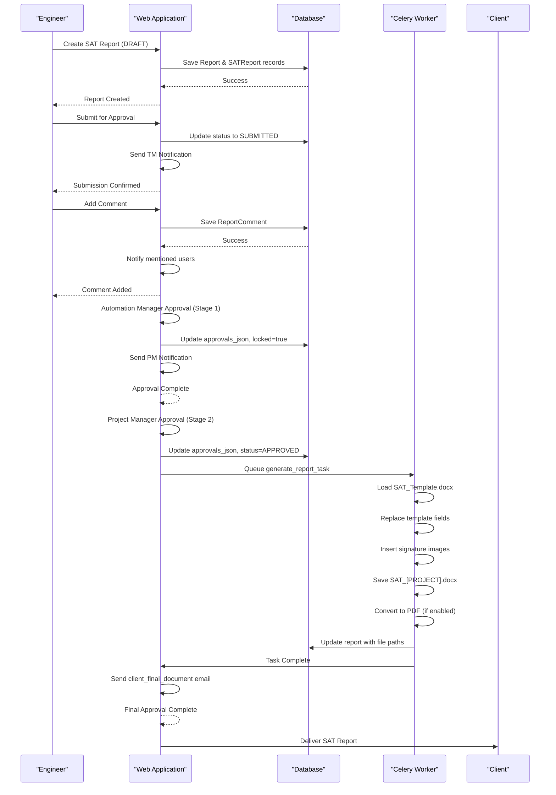

# Business Logic Layer

<cite>
**Referenced Files in This Document**   
- [models.py](file://models.py)
- [routes/approval.py](file://routes/approval.py)
- [routes/status.py](file://routes/status.py)
- [routes/collaboration.py](file://routes/collaboration.py)
- [utils.py](file://utils.py)
- [tasks/celery_app.py](file://tasks/celery_app.py)
- [tasks/failure_handler.py](file://tasks/failure_handler.py)
- [README.md](file://README.md)
</cite>

## Table of Contents
1. [SAT Report Workflow Overview](#sat-report-workflow-overview)
2. [State Machine and Status Transitions](#state-machine-and-status-transitions)
3. [Document Generation Pipeline](#document-generation-pipeline)
4. [Collaboration Features](#collaboration-features)
5. [Asynchronous Task Integration](#asynchronous-task-integration)
6. [Error Handling and Rollback Procedures](#error-handling-and-rollback-procedures)
7. [Control Flow Sequence Diagram](#control-flow-sequence-diagram)

## SAT Report Workflow Overview

The SAT report workflow follows a structured multi-stage approval process from creation to final delivery. Engineers initiate the process by creating a report in DRAFT status. Upon submission, the report enters a two-stage approval workflow: first reviewed by the Automation Manager (stage 1), then by the Project Manager (stage 2). Each approval stage requires digital signature, timestamp, and optional comments. The workflow is stored as JSON in the `approvals_json` field of the Report model, with each approval entry containing stage number, approver email, status, timestamp, signature filename, and comment.

The process flow begins with report creation by an engineer, followed by submission which triggers notification to the Automation Manager. After technical review and approval, the PM receives notification for business review. Final PM approval triggers document generation and client delivery. Rejection at any stage returns the report to the engineer with feedback. The system maintains complete audit trails through the ReportEdit model, tracking all changes with before/after states, editor information, and version transitions.

**Section sources**
- [models.py](file://models.py#L200-L250)
- [routes/approval.py](file://routes/approval.py#L18-L603)
- [README.md](file://README.md#L122-L149)

## State Machine and Status Transitions

The SAT report state machine governs status transitions through the approval workflow. The system recognizes six primary states: **DRAFT**, **SUBMITTED**, **TM_APPROVED**, **PM_APPROVED**, **REJECTED**, and **DELIVERED**. Status transitions are validated and enforced through business logic in the approval routes. When an engineer creates a report, it defaults to DRAFT status. Submission transitions the status to SUBMITTED, locking further edits until review.

Approval by the Automation Manager transitions the status to TM_APPROVED, while PM approval moves it to PM_APPROVED. The system prevents approval of non-pending stages and ensures sequential processing. Rejection at any stage sets the status to REJECTED and unlocks the report for editing. The overall status is determined by aggregating individual approval statuses: if any approval is rejected, the overall status is rejected; if all are approved, it's approved; if some are approved, it's partially approved; otherwise, it remains pending.

Validation rules enforce business constraints: engineers can edit their own reports only until Automation Manager approval; Automation Managers can edit until PM approval; Admins can edit any report. The locked field in the Report model enforces immutability after Automation Manager approval. Status transitions are logged in the database with timestamps, and notifications are triggered for relevant stakeholders based on the transition type.

**Section sources**
- [models.py](file://models.py#L200-L250)
- [routes/approval.py](file://routes/approval.py#L18-L603)
- [README.md](file://README.md#L150-L178)

## Document Generation Pipeline

The document generation pipeline uses docxtpl templates to dynamically populate SAT reports with form data. The process begins when the PM approves the final stage, triggering template processing. The system loads the SAT_Template.docx template specified in the application configuration and creates a context dictionary from the submission data's context field. This context includes key-value pairs for all template placeholders such as PROJECT_REFERENCE, DOCUMENT_TITLE, DATE, CLIENT_NAME, and REVISION.

The template engine replaces all placeholders in paragraphs, tables, headers, and footers while preserving company branding, formatting, logos, and styles. The implementation uses a brute-force replacement strategy that handles template tags split across Word runs by reconstructing paragraph text. Signature fields (SIG_PREPARED, SIG_REVIEW_TECH, SIG_REVIEW_PM) are populated with InlineImage objects from signature PNG files stored in the signatures directory. The pipeline generates both .docx and .pdf versions, with the .docx version saved to the output directory using the standardized naming convention SAT_[PROJECT_NUMBER].docx.

The generation process includes extensive error handling and validation: template file existence is verified, output directories are ensured to exist, and file integrity is checked after generation. The system attempts to resolve common template issues by adding missing invisible tags in tables and footers. Generated documents are served from memory to avoid file locking issues, with proper MIME types and content disposition headers.

**Section sources**
- [routes/status.py](file://routes/status.py#L215-L640)
- [utils.py](file://utils.py#L1076-L1116)
- [README.md](file://README.md#L150-L178)

## Collaboration Features

The system provides comprehensive collaboration features through comment threads, mentions, and real-time notifications. Users can add comments to reports with optional field references, creating a threaded discussion system. The ReportComment model stores comments with user information, text content, creation timestamp, resolution status, and parent-child relationships for replies. Comments can be resolved, reopened, or deleted by their authors or administrators, with resolution tracking including who resolved the comment and when.

The mention system allows users to tag colleagues using @username syntax in comments. The extract_mentions function parses comment text to identify mentions and links them to user records. When a user is mentioned, they receive a notification with a direct link to the comment. Reply notifications are automatically sent to the original comment author when someone responds to their comment. The system provides autocomplete for mentions through the get-users-for-mention endpoint, which searches active users by name.

Live collaboration is supported through a dedicated view that shows active users working on the same report, with avatar colors generated consistently from email hashes. The collaboration features are integrated with the approval workflow, allowing approvers to add technical comments and feedback during review. All collaboration activities are logged and contribute to the comprehensive audit trail maintained by the system.

**Section sources**
- [routes/collaboration.py](file://routes/collaboration.py#L0-L292)
- [models.py](file://models.py#L550-L580)

## Asynchronous Task Integration

The system integrates synchronous web requests with asynchronous Celery tasks to ensure non-blocking operations. Background tasks are managed by Celery with Redis as the message broker and result backend. The architecture separates concerns between web workers handling HTTP requests and dedicated task workers processing background jobs. Critical operations such as email notifications, document generation, and database maintenance are offloaded to Celery tasks to prevent request timeouts and improve responsiveness.

The integration follows a fire-and-forget pattern for non-critical tasks and a result-tracking pattern for operations requiring status monitoring. When a task is submitted, the web request immediately returns a task ID, allowing the client to poll for status updates. The TaskResultResource API endpoint provides task status, progress, and results. Tasks are configured with appropriate time limits, retry policies, and rate limiting to prevent system overload. Email tasks have a 50 per minute rate limit, while report generation tasks are assigned to a dedicated queue with higher resource allocation.

Task monitoring is implemented through signals that log task lifecycle events (prerun, postrun, success, failure). Failed tasks are handled by the FailureHandler system, which implements different retry strategies based on failure type: network failures retry with exponential backoff, database failures check for transient conditions, and other errors follow configurable retry policies. Task results are cached with TTL to support status polling and prevent redundant processing.

**Section sources**
- [tasks/celery_app.py](file://tasks/celery_app.py#L0-L208)
- [tasks/failure_handler.py](file://tasks/failure_handler.py#L168-L196)
- [api/tasks.py](file://api/tasks.py#L389-L462)

## Error Handling and Rollback Procedures

The system implements comprehensive error handling and rollback procedures to maintain data integrity. Database operations use explicit transaction management with try-except blocks and session rollback on exceptions. When an error occurs during approval processing, the system rolls back the database transaction to prevent partial updates. Similarly, document generation errors trigger cleanup of partially created files and maintain the report's previous state.

The failure handler system categorizes errors into network, database, and application types, applying appropriate recovery strategies. Network failures trigger retries with increasing delays up to 10 minutes, while database failures are analyzed for transient conditions like deadlocks or connection pool exhaustion. Application errors follow configurable retry policies with maximum retry limits. Failed tasks are logged with full error context, and administrators receive alerts for persistent failures.

For document generation, the system implements a two-phase approach: first creating a temporary file, then atomically moving it to the final location. This prevents clients from accessing incomplete documents. File operations include existence checks and size validation to detect corruption. Signature processing includes multiple fallback paths, attempting alternative storage locations if the primary directory is inaccessible. The system logs detailed debugging information for troubleshooting, including template context, file paths, and error traces, while presenting user-friendly messages to end users.

**Section sources**
- [routes/approval.py](file://routes/approval.py#L18-L603)
- [routes/status.py](file://routes/status.py#L215-L640)
- [tasks/failure_handler.py](file://tasks/failure_handler.py#L168-L196)

## Control Flow Sequence Diagram

**Diagram sources **
- [routes/approval.py](file://routes/approval.py#L18-L603)
- [routes/status.py](file://routes/status.py#L215-L640)
- [tasks/celery_app.py](file://tasks/celery_app.py#L0-L208)
- [utils.py](file://utils.py#L1076-L1116)

**Section sources**
- [routes/approval.py](file://routes/approval.py#L18-L603)
- [routes/status.py](file://routes/status.py#L215-L640)
- [tasks/celery_app.py](file://tasks/celery_app.py#L0-L208)