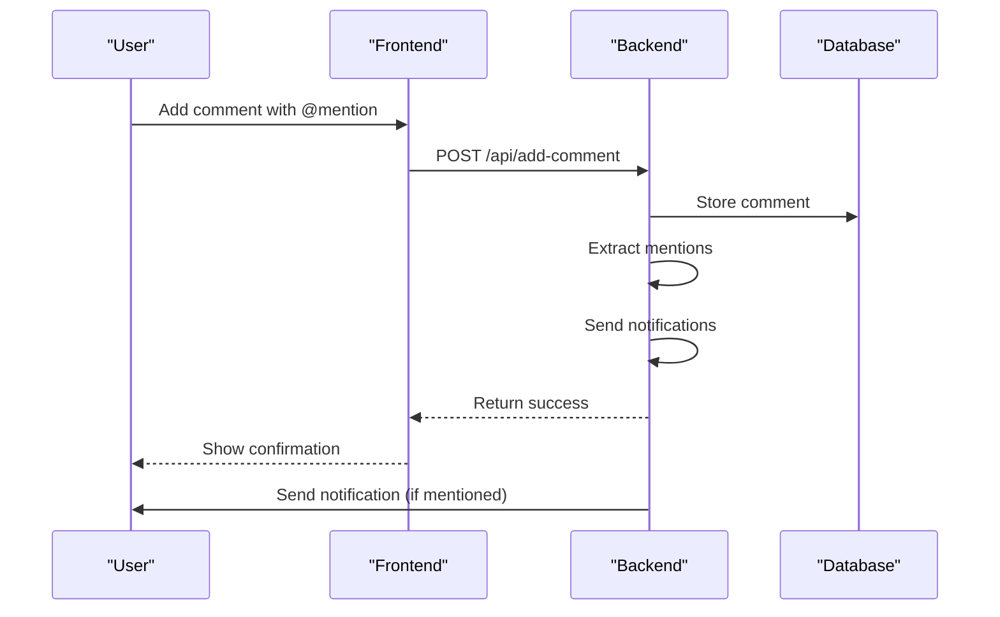
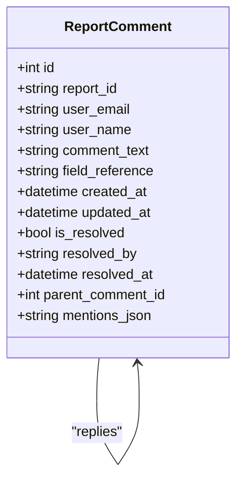
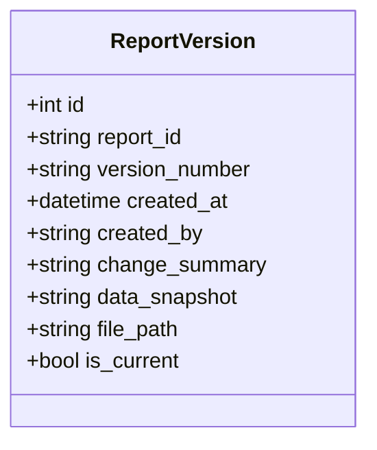
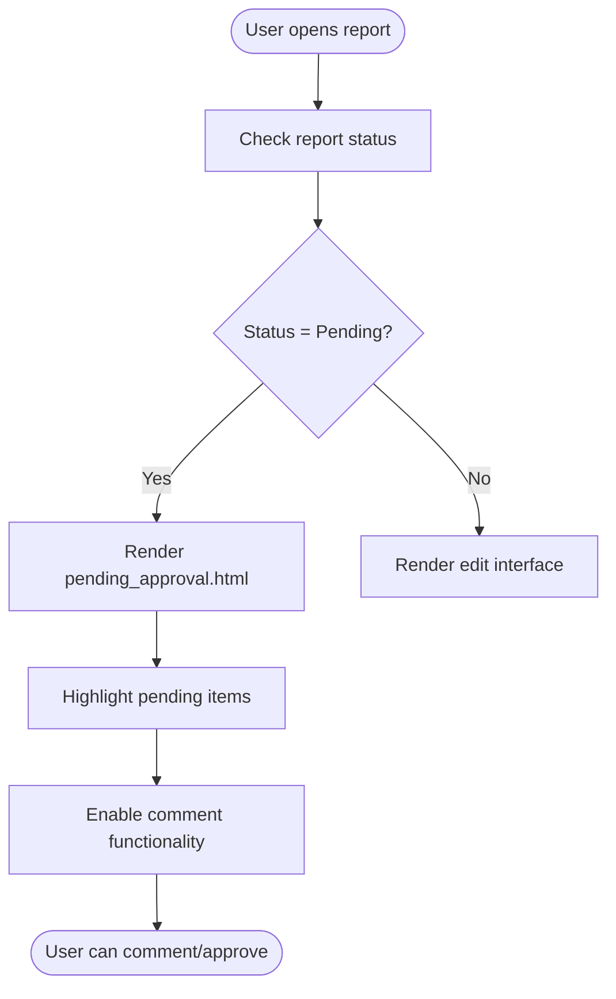
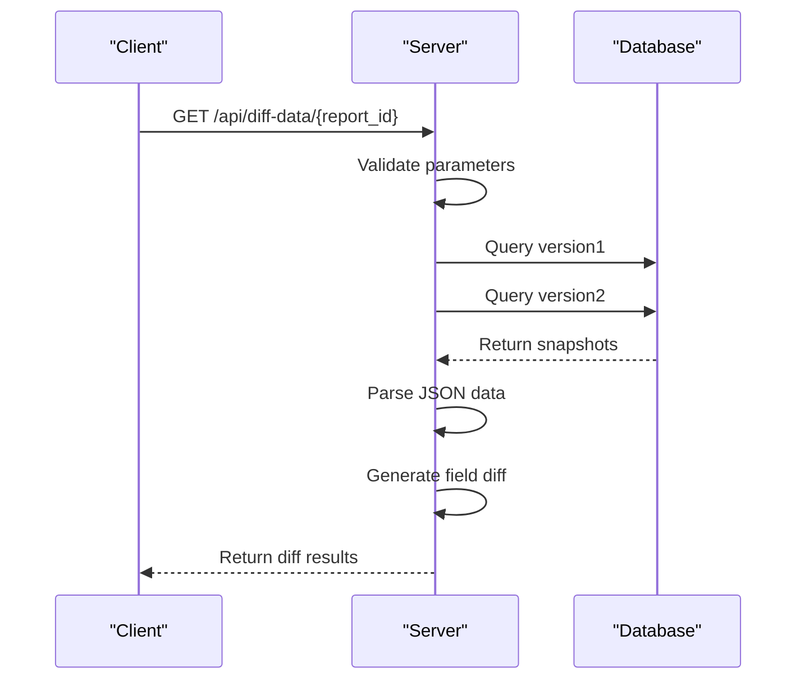
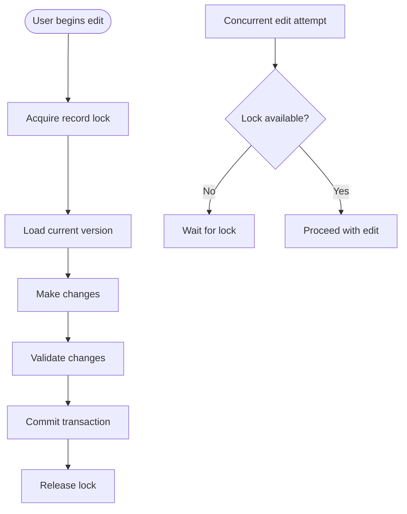
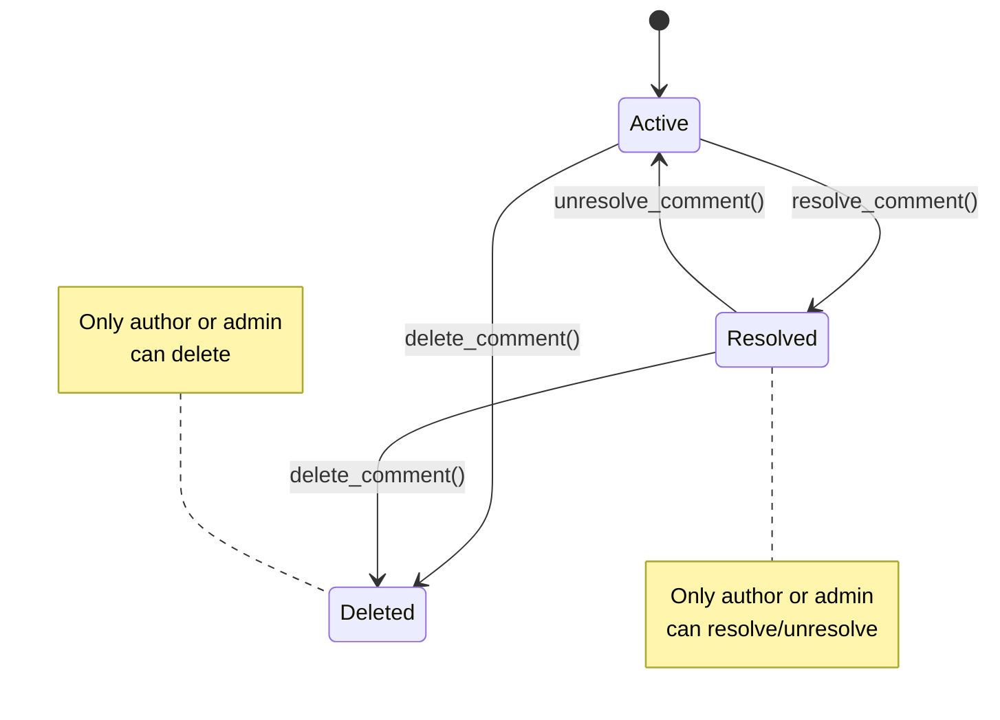
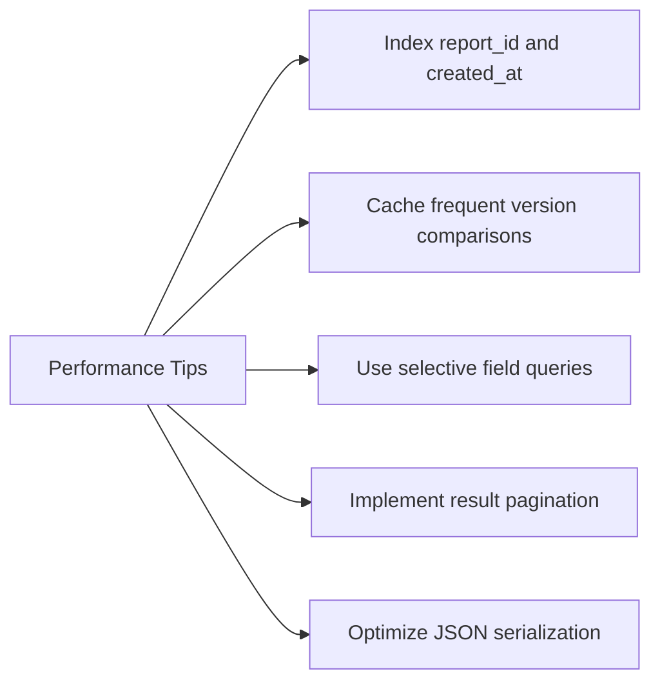

# Collaboration & Edit Tracking

<cite>
**Referenced Files in This Document**   
- [models.py](file://models.py#L238-L277)
- [routes/collaboration.py](file://routes/collaboration.py#L0-L292)
- [routes/compare.py](file://routes/compare.py#L0-L134)
- [api/versioning.py](file://api/versioning.py#L0-L273)
- [templates/pending_approval.html](file://templates/pending_approval.html#L32-L82)
- [routes/edit.py](file://routes/edit.py)
</cite>

## Table of Contents
1. [Introduction](#introduction)
2. [Collaboration Features](#collaboration-features)
3. [Edit Tracking Implementation](#edit-tracking-implementation)
4. [Version History System](#version-history-system)
5. [UI Integration](#ui-integration)
6. [API Endpoints for Version Comparison](#api-endpoints-for-version-comparison)
7. [Data Consistency and Concurrency](#data-consistency-and-concurrency)
8. [Comment Moderation and Retention](#comment-moderation-and-retention)
9. [Performance Optimization](#performance-optimization)
10. [Conclusion](#conclusion)

## Introduction
This document details the collaboration, edit tracking, and version history features of the SAT Report Generator application. The system enables multiple users to collaborate on reports through comments, tracks all changes made during editing, and maintains a comprehensive version history. These features support review cycles, ensure data integrity, and provide audit trails for compliance purposes.

## Collaboration Features

The collaboration system allows users to add comments during review cycles using dedicated endpoints. Users can comment on specific fields, mention colleagues, and track comment resolution status.

**Diagram sources**
- [routes/collaboration.py](file://routes/collaboration.py#L72-L103)
- [models.py](file://models.py#L255-L277)

**Section sources**
- [routes/collaboration.py](file://routes/collaboration.py#L0-L292)
- [models.py](file://models.py#L255-L277)

## Edit Tracking Implementation

The system implements comprehensive edit tracking that captures changes to report fields before submission. All modifications are recorded with timestamps, user information, and field references.

**Diagram sources**
- [models.py](file://models.py#L255-L277)
- [routes/collaboration.py](file://routes/collaboration.py#L72-L103)

**Section sources**
- [models.py](file://models.py#L255-L277)
- [routes/collaboration.py](file://routes/collaboration.py#L72-L103)

## Version History System

The versioning system creates snapshots using the `ReportVersion` model upon major state transitions. Each version captures the complete state of the report at that point in time.

**Diagram sources**
- [models.py](file://models.py#L238-L253)
- [routes/compare.py](file://routes/compare.py#L97-L134)

**Section sources**
- [models.py](file://models.py#L238-L253)
- [routes/compare.py](file://routes/compare.py#L97-L134)

## UI Integration

The UI integrates with `pending_approval.html` and `edit.py` routes to highlight changes and facilitate collaboration. The pending approval page displays the current status of reports awaiting review.

**Diagram sources**
- [templates/pending_approval.html](file://templates/pending_approval.html#L32-L82)
- [routes/edit.py](file://routes/edit.py)

**Section sources**
- [templates/pending_approval.html](file://templates/pending_approval.html#L32-L82)
- [routes/edit.py](file://routes/edit.py)

## API Endpoints for Version Comparison

The version comparison APIs in `api/versioning.py` enable clients to retrieve and compare different versions of reports. These endpoints support both HTML and JSON responses for flexibility.

**Diagram sources**
- [api/versioning.py](file://api/versioning.py#L0-L273)
- [routes/compare.py](file://routes/compare.py#L64-L100)

**Section sources**
- [api/versioning.py](file://api/versioning.py#L0-L273)
- [routes/compare.py](file://routes/compare.py#L64-L100)

## Data Consistency and Concurrency

The system addresses data consistency challenges during concurrent edits through transaction management and locking mechanisms. When multiple users edit the same report, the system ensures that changes are applied in a controlled manner.

**Section sources**
- [routes/edit.py](file://routes/edit.py)
- [models.py](file://models.py#L238-L253)

## Comment Moderation and Retention

The comment moderation workflow includes features for resolving, reopening, and deleting comments. Only comment authors and administrators can modify or delete comments, ensuring accountability.

**Section sources**
- [routes/collaboration.py](file://routes/collaboration.py#L103-L174)
- [models.py](file://models.py#L255-L277)

## Performance Optimization

For querying version diffs on large reports, several performance tips are recommended:
- Use selective field loading to minimize data transfer
- Implement caching for frequently accessed version pairs
- Optimize JSON parsing with streaming parsers
- Use database indexing on report_id and created_at fields
- Implement pagination for version history displays

**Section sources**
- [api/versioning.py](file://api/versioning.py#L0-L273)
- [routes/compare.py](file://routes/compare.py#L64-L100)

## Conclusion
The collaboration, edit tracking, and version history features provide a comprehensive solution for team-based report development and review. By combining comment functionality, detailed change tracking, and robust version management, the system supports efficient workflows while maintaining data integrity and auditability. The implementation balances usability with performance, ensuring that these features remain responsive even with large reports and extensive history.