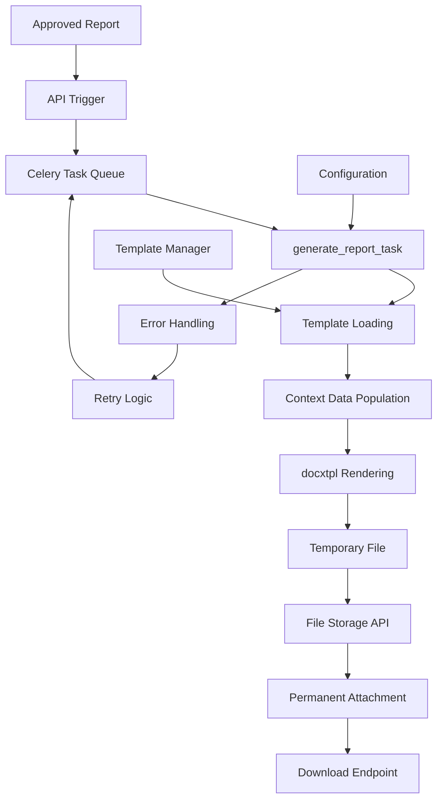
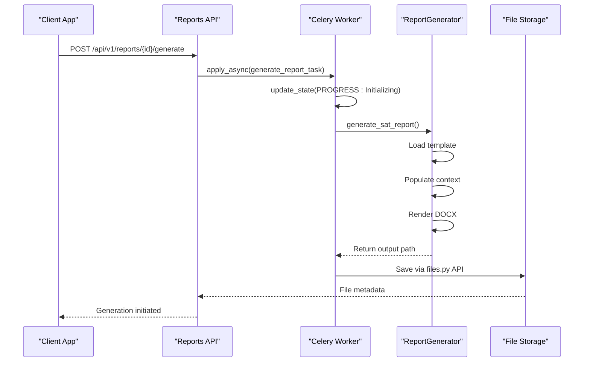
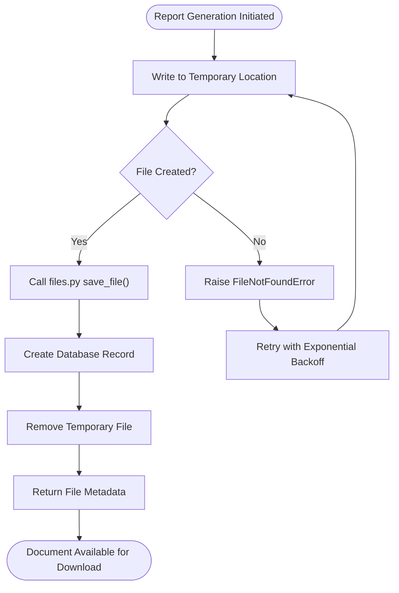
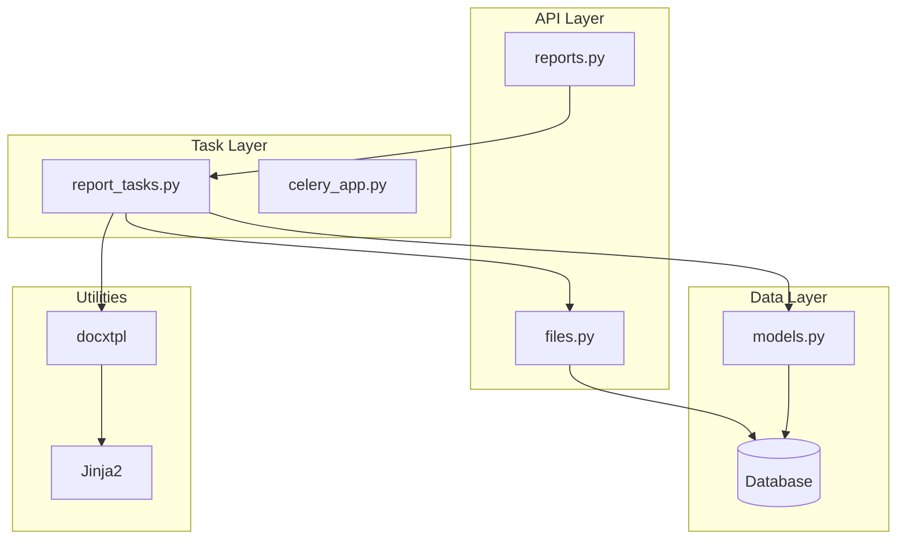

# Document Generation Pipeline

<cite>
**Referenced Files in This Document**   
- [report_tasks.py](file://tasks/report_tasks.py)
- [reports.py](file://api/reports.py)
- [files.py](file://api/files.py)
- [models.py](file://models.py)
</cite>

## Table of Contents
1. [Introduction](#introduction)
2. [Architecture Overview](#architecture-overview)
3. [Core Components](#core-components)
4. [Detailed Component Analysis](#detailed-component-analysis)
5. [Dependency Analysis](#dependency-analysis)
6. [Performance Considerations](#performance-considerations)
7. [Troubleshooting Guide](#troubleshooting-guide)
8. [Conclusion](#conclusion)

## Introduction
This document details the document generation pipeline within the SAT Report Generator system. The pipeline enables asynchronous generation of DOCX documents from approved reports using Celery background tasks. It leverages the `docxtpl` library to populate Jinja2-templated DOCX files with dynamic data extracted from the `SATReport` model. The workflow includes secure file handling, temporary file management, permanent attachment via the `files.py` API, and robust error handling for template rendering issues such as missing context variables or malformed templates. This system supports customization through configurable templates, manages performance implications of large document generation, and ensures secure binary file downloads.

## Architecture Overview

**Diagram sources**
- [report_tasks.py](file://tasks/report_tasks.py#L15-L452)
- [reports.py](file://api/reports.py#L380-L420)
- [files.py](file://api/files.py#L15-L400)

## Core Components

The document generation pipeline is composed of several key components that work together to transform approved report data into downloadable DOCX documents. These include the Celery task system for asynchronous processing, the `docxtpl`-based template engine for dynamic content insertion, the file management API for secure storage, and the error handling mechanisms that ensure reliability. The pipeline is triggered when a report reaches the "Approved" status and proceeds through stages of data preparation, template rendering, file creation, and persistent storage.

**Section sources**
- [report_tasks.py](file://tasks/report_tasks.py#L15-L452)
- [reports.py](file://api/reports.py#L380-L420)
- [files.py](file://api/files.py#L15-L400)
- [models.py](file://models.py#L150-L200)

## Detailed Component Analysis

### Report Generation Task Implementation

The `generate_report_task` function in `report_tasks.py` serves as the core of the asynchronous document generation process. It receives the report ID, type, and data payload, then orchestrates the entire document creation workflow. The task begins by initializing progress tracking through Celery's `update_state` mechanism, providing real-time feedback on the generation status. It then loads the appropriate report generator based on type (SAT, FDS, HDS), prepares the output directory, and constructs a timestamped filename. The actual document rendering is performed by specialized generator methods that use `docxtpl` to populate templates with dynamic data from the `SATReport` model.

**Diagram sources**
- [report_tasks.py](file://tasks/report_tasks.py#L15-L150)
- [reports.py](file://api/reports.py#L380-L420)

### Template Processing with docxtpl

The template engine utilizes `docxtpl`, a Python library that extends DOCX files with Jinja2 templating capabilities. Templates are stored as DOCX files with embedded Jinja2 expressions (e.g., `{{ document_title }}`) that are replaced with actual data during rendering. The context data is derived from the `SATReport.data_json` field, which contains the complete form submission as a JSON object. This approach allows for highly customizable templates where different sections, tables, and conditional content can be dynamically generated based on the report data. Template customization options include conditional sections (``), loops for repeating elements (``), and custom filters for data formatting.

**Section sources**
- [report_tasks.py](file://tasks/report_tasks.py#L15-L452)
- [models.py](file://models.py#L150-L200)

### File Storage Workflow

The file storage workflow follows a secure, two-stage process for handling generated documents. Initially, the document is written to a temporary location in the configured `REPORT_OUTPUT_DIR`. Once generation is complete, the file is transferred to permanent storage through the `files.py` API, which handles metadata recording, access control, and URL generation. The `FileManager` class in `files.py` provides utilities for validating file types, enforcing size limits, generating secure filenames, and managing report-specific subdirectories. This separation ensures that incomplete or failed generations do not pollute the permanent storage system.

**Diagram sources**
- [report_tasks.py](file://tasks/report_tasks.py#L15-L452)
- [files.py](file://api/files.py#L15-L400)

### Error Handling and Recovery

The pipeline implements comprehensive error handling at multiple levels. During template rendering, exceptions such as `TemplateError` (missing variables, syntax errors) are caught and logged, with the report status updated to "GENERATION_FAILED". The system distinguishes between recoverable errors (e.g., temporary file system issues, database connection problems) and unrecoverable ones (e.g., malformed templates, missing required data). Recoverable errors trigger Celery's retry mechanism with exponential backoff, while unrecoverable errors result in permanent failure with detailed error logging. The task also updates the report status in the database to reflect failures, enabling proper user notification and troubleshooting.

**Section sources**
- [report_tasks.py](file://tasks/report_tasks.py#L15-L452)
- [models.py](file://models.py#L150-L200)

## Dependency Analysis

**Diagram sources**
- [report_tasks.py](file://tasks/report_tasks.py#L15-L452)
- [reports.py](file://api/reports.py#L380-L420)
- [files.py](file://api/files.py#L15-L400)
- [models.py](file://models.py#L150-L200)

## Performance Considerations

Large document generation presents several performance challenges that the system addresses through asynchronous processing and resource management. By offloading document creation to Celery workers, the main application thread remains responsive, preventing timeouts during lengthy generation processes. The system configures worker concurrency and resource limits to balance throughput with memory usage, as DOCX rendering can be memory-intensive for complex documents. For very large reports, the pipeline could be enhanced with chunked processing or streaming output. The current implementation includes progress tracking to provide user feedback during long-running operations. Template complexity directly impacts generation time, so optimization of Jinja2 expressions and minimizing nested loops in templates is recommended for performance-critical scenarios.

## Troubleshooting Guide

Common issues in the document generation pipeline typically fall into three categories: template errors, data context problems, and file system issues. Template errors often manifest as `TemplateError` exceptions and are usually caused by missing context variables or malformed Jinja2 syntax. These can be diagnosed by verifying that all template placeholders have corresponding data in the `SATReport.data_json` structure. Data context problems occur when expected fields are missing or have incorrect types, which can be resolved by ensuring complete data submission in the reporting interface. File system issues may arise from insufficient disk space, permission problems in the output directory, or network storage latency. Monitoring logs for `FileNotFoundError` or `PermissionError` exceptions helps identify these issues. The retry mechanism handles transient failures, but persistent problems require checking Celery worker status and resource availability.

**Section sources**
- [report_tasks.py](file://tasks/report_tasks.py#L15-L452)
- [files.py](file://api/files.py#L15-L400)

## Conclusion

The document generation pipeline provides a robust, scalable solution for converting approved reports into professional DOCX documents. By leveraging asynchronous task processing with Celery, template-driven content generation with `docxtpl`, and secure file management through the `files.py` API, the system ensures reliable document creation while maintaining application responsiveness. The architecture supports template customization, handles errors gracefully with retry logic, and follows security best practices for file handling. Future enhancements could include support for additional output formats (PDF, HTML), template versioning, and improved progress tracking for users during long generation processes.