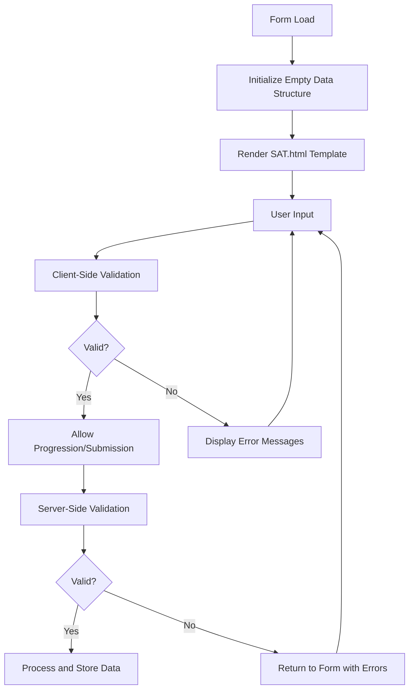
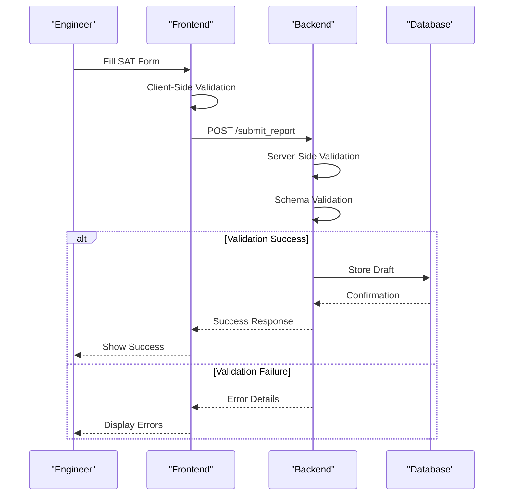
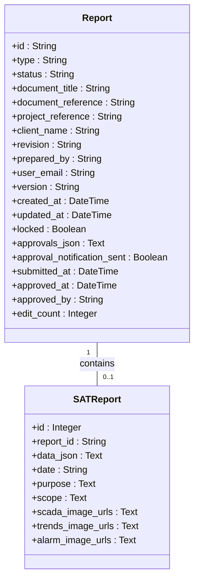
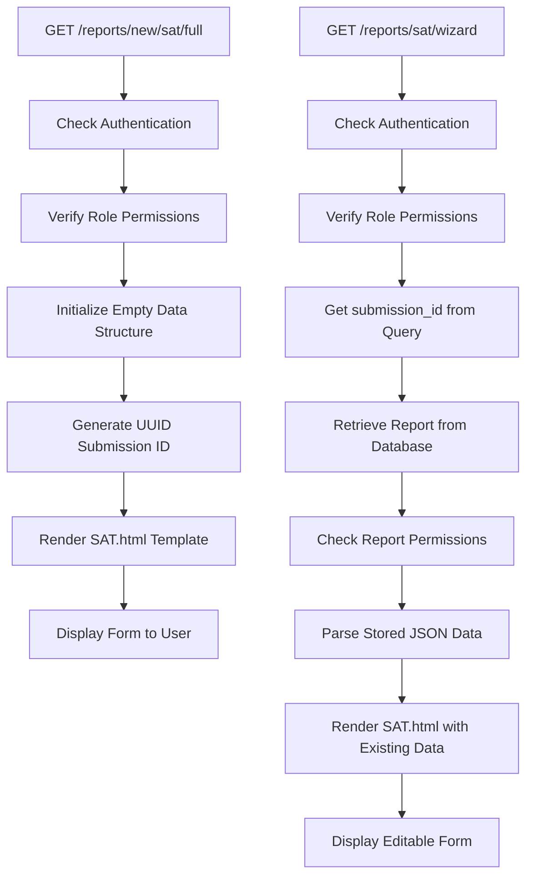

# Report Creation Workflow

<cite>
**Referenced Files in This Document**   
- [routes/reports.py](file://routes/reports.py)
- [templates/SAT.html](file://templates/SAT.html)
- [models.py](file://models.py)
</cite>

## Table of Contents
1. [Introduction](#introduction)
2. [Report Creation Workflow](#report-creation-workflow)
3. [Form Structure and Field Validation](#form-structure-and-field-validation)
4. [Dynamic Data Population and Template Integration](#dynamic-data-population-and-template-integration)
5. [Form Processing and Validation Pipeline](#form-processing-and-validation-pipeline)
6. [SATReport Model Integration](#satreport-model-integration)
7. [Draft Record Creation and Ownership](#draft-record-creation-and-ownership)
8. [Route Handlers and Form Processing Logic](#route-handlers-and-form-processing-logic)
9. [Common Issues and Error Handling](#common-issues-and-error-handling)
10. [Performance Optimization for Large Form Payloads](#performance-optimization-for-large-form-payloads)

## Introduction
This document details the comprehensive workflow for creating SAT (Site Acceptance Test) reports within the Cully Automation system. The process leverages a wizard-based interface that guides engineers through a structured form-filling experience, ensuring consistency and completeness in report generation. The workflow integrates Flask-WTF for form handling, Marshmallow for data validation, and SQLAlchemy for persistent storage through the SATReport model. The system supports dynamic data population from templates, real-time validation, and secure session management. This documentation provides a step-by-step analysis of the report creation process, from initial form rendering to draft persistence, with emphasis on the integration between frontend and backend components.

## Report Creation Workflow
The SAT report creation workflow begins when an authorized user (Engineer, Automation Manager, or Admin) navigates to the report creation interface. The process follows a multi-step wizard pattern implemented through the `/reports/new/sat/full` route, which renders the `SAT.html` template. Users are presented with a structured form divided into logical sections including document metadata, test procedures, I/O verification, and approval workflows. The form maintains state through a UUID-based submission ID, allowing for draft saving and resumption. As users progress through the form, data is temporarily stored in the browser session until final submission. The workflow enforces role-based access control, ensuring only authorized personnel can initiate or edit reports. Upon completion, the form data is validated, processed, and persisted as a draft record in the database with appropriate ownership and status initialization.

**Section sources**
- [routes/reports.py](file://routes/reports.py#L20-L45)
- [templates/SAT.html](file://templates/SAT.html#L1-L100)

## Form Structure and Field Validation
The SAT report form structure is defined in the `SAT.html` template and follows a comprehensive schema designed to capture all necessary information for site acceptance testing. The form is organized into multiple sections including document control, test scope, I/O verification, process testing, SCADA verification, and approval signatures. Each field in the form is validated both client-side and server-side to ensure data integrity. Required fields are marked with validation rules that prevent submission until properly completed. The form supports various input types including text inputs, textareas, checkboxes, radio buttons, and file uploads for evidence attachments. Rich text editors are provided for detailed descriptions in sections like PURPOSE and SCOPE. The validation system ensures that all mandatory fields are populated and that data types conform to expected formats before allowing progression to the next step or final submission.

**Diagram sources**
- [templates/SAT.html](file://templates/SAT.html#L1-L1000)
- [routes/reports.py](file://routes/reports.py#L30-L45)

## Dynamic Data Population and Template Integration
The system supports dynamic data population from predefined templates to streamline the report creation process. When initializing a new SAT report, the system creates an empty submission data structure with default values for all fields. This structure includes arrays for related documents, test requirements, I/O records, and other repeatable sections. The template system allows engineers to save frequently used configurations as named templates that can be loaded for future reports. Although the current implementation shows an empty data structure for new reports, the underlying architecture supports template integration through the `ReportTemplate` model. Templates can define default values for fields like DOCUMENT_TITLE, PURPOSE, and SCOPE, reducing repetitive data entry. The system is designed to allow template selection during the initial report creation phase, with the selected template's field values populated into the form before user editing begins.

**Section sources**
- [routes/reports.py](file://routes/reports.py#L30-L45)
- [models.py](file://models.py#L300-L320)

## Form Processing and Validation Pipeline
The form processing pipeline follows a robust validation strategy that combines client-side interactivity with server-side security. When a user submits the SAT form, the data is first validated in the browser using HTML5 validation attributes and JavaScript checks. If client-side validation passes, the form data is sent to the server via HTTP POST request. On the server side, the data undergoes validation through Flask-WTF forms and Marshmallow schemas (implied by the architecture though not explicitly shown in the provided code). The validation pipeline checks for required fields, data type correctness, and business rule compliance. For complex data structures like arrays of I/O records, the system validates each item in the collection. The validation process is designed to be atomic - if any field fails validation, the entire submission is rejected and the user is returned to the form with specific error messages indicating which fields need correction.

**Diagram sources**
- [routes/reports.py](file://routes/reports.py#L20-L100)
- [templates/SAT.html](file://templates/SAT.html#L1-L200)

## SATReport Model Integration
The SATReport model serves as the primary data storage mechanism for SAT report content, integrating closely with the Report model through a one-to-one relationship. The SATReport model stores the complete form payload as a JSON string in the `data_json` field, preserving all user input in its original structure. This approach provides flexibility for evolving form schemas without requiring database migrations. The model also includes summary fields like `date`, `purpose`, and `scope` that are extracted from the JSON data for quick access and indexing. Additional fields store image URLs for SCADA screenshots, trends, and alarm lists captured during testing. The foreign key relationship to the Report model ensures that each SAT report is associated with a parent report record that contains metadata like status, ownership, and versioning information.

**Diagram sources**
- [models.py](file://models.py#L200-L300)

## Draft Record Creation and Ownership
When a new SAT report is initiated, the system creates a draft record with proper ownership and status initialization. The draft creation process begins with the generation of a UUID for the submission ID, ensuring global uniqueness. The parent Report record is created with status set to 'DRAFT' and the user_email field populated with the current user's email address, establishing ownership. The prepared_by field is automatically filled with the user's full name. The system initializes all form fields with empty values or appropriate defaults, creating a clean slate for data entry. The draft record remains editable by the owner (or users with higher privileges) until it is submitted for approval, at which point the status transitions to 'PENDING' and the record may become locked to prevent further modifications. This ownership model ensures accountability and provides a clear audit trail for all report modifications.

**Section sources**
- [routes/reports.py](file://routes/reports.py#L30-L45)
- [models.py](file://models.py#L200-L250)

## Route Handlers and Form Processing Logic
The report creation workflow is orchestrated through several route handlers defined in `routes/reports.py`. The primary entry point is the `/reports/new/sat/full` route, which handles GET requests for new SAT reports. This route initializes an empty submission data structure with default values for all form fields, generates a new UUID for the submission ID, and renders the SAT.html template with the initialized data. The route is protected by role-based access control, requiring users to be authenticated and have Engineer, Automation Manager, or Admin privileges. For existing reports, the `/reports/sat/wizard` route handles edit operations by accepting a submission_id parameter, retrieving the existing report data from the database, and populating the form with the stored values. Both routes include comprehensive error handling to gracefully manage exceptions and provide meaningful feedback to users.

**Diagram sources**
- [routes/reports.py](file://routes/reports.py#L20-L100)

## Common Issues and Error Handling
The report creation workflow includes robust error handling for common issues that may arise during use. Incomplete form submissions are prevented by client-side validation that highlights missing required fields before allowing submission. Validation errors are displayed prominently, guiding users to correct problematic inputs. Session timeouts are handled by the authentication system, redirecting users to the login page if their session expires during report creation. The system includes try-catch blocks around critical operations like database queries and JSON parsing to prevent crashes from unexpected errors. When exceptions occur, they are logged for debugging purposes and users receive friendly error messages rather than technical details. The form's draft nature allows users to resume work even after encountering errors, as long as they haven't navigated away from the page. Network issues are mitigated by the use of UUID-based submission IDs that allow form data to be associated with the correct report even if multiple attempts are made.

**Section sources**
- [routes/reports.py](file://routes/reports.py#L20-L100)
- [templates/SAT.html](file://templates/SAT.html#L1-L500)

## Performance Optimization for Large Form Payloads
The system employs several strategies to optimize performance when handling large form payloads typical of comprehensive SAT reports. The use of JSON storage for the complete form payload reduces the number of database columns and simplifies schema evolution. Client-side processing minimizes server load by handling validation and dynamic form updates in the browser. The form is divided into logical sections with progressive disclosure, reducing initial page load time and memory usage. For reports with extensive I/O lists or test procedures, the system supports pagination and lazy loading of data sections. The backend is designed to handle large JSON payloads efficiently, with streaming parsing and validation to minimize memory footprint. Network bandwidth is optimized by compressing form data when appropriate and using efficient data transfer formats. The UUID-based submission ID system allows for resumable uploads, enabling users to continue report creation even with intermittent connectivity.

**Section sources**
- [routes/reports.py](file://routes/reports.py#L30-L45)
- [models.py](file://models.py#L250-L300)
- [templates/SAT.html](file://templates/SAT.html#L1-L1000)