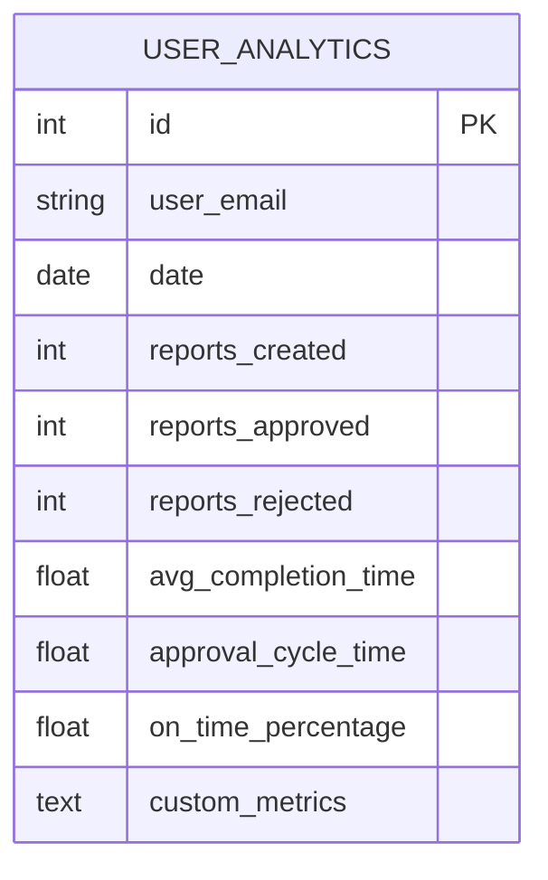
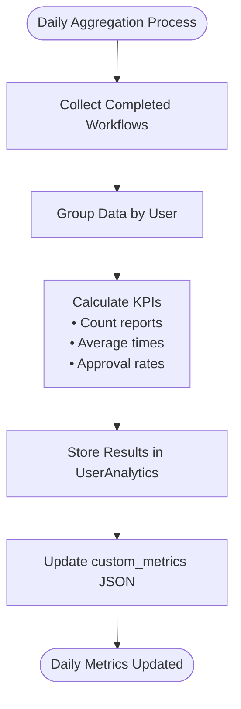
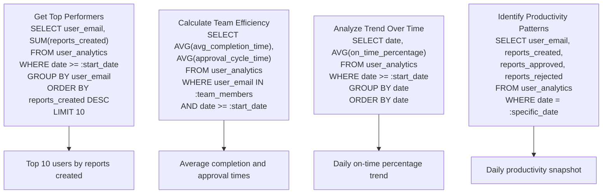
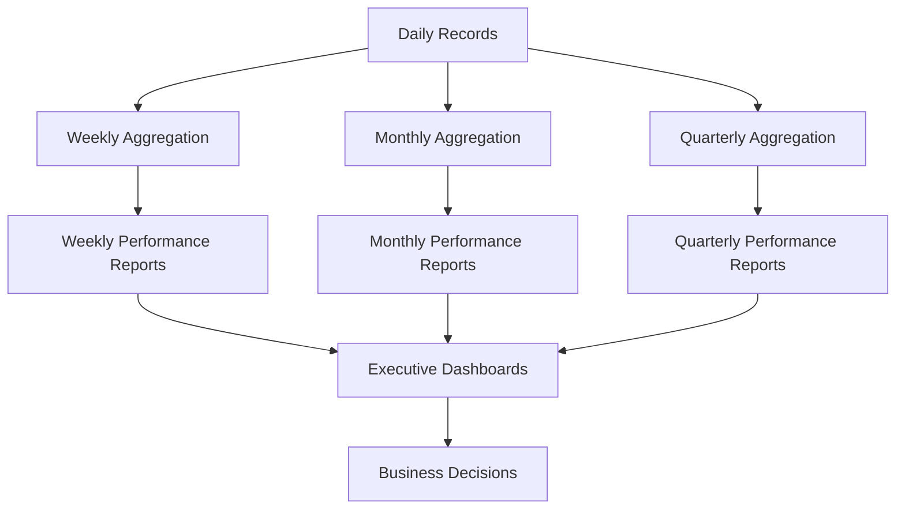
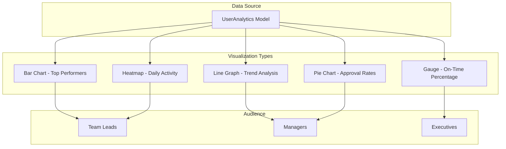
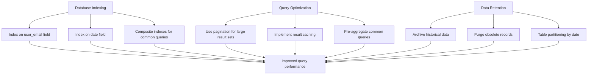
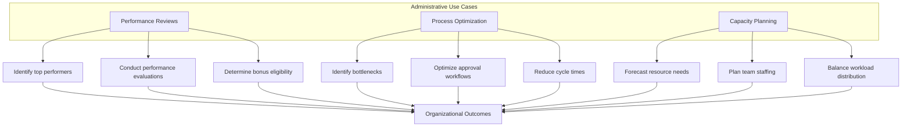
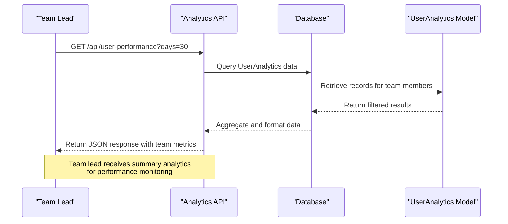

# Analytics Framework

<cite>
**Referenced Files in This Document**   
- [models.py](file://models.py#L223-L249)
- [routes/analytics.py](file://routes/analytics.py#L98-L137)
- [database/performance.py](file://database/performance.py#L211-L241)
- [monitoring/metrics.py](file://monitoring/metrics.py#L47-L106)
</cite>

## Table of Contents
1. [Introduction](#introduction)
2. [Data Model Structure](#data-model-structure)
3. [Field Definitions](#field-definitions)
4. [Daily Aggregation Process](#daily-aggregation-process)
5. [Analytics Query Examples](#analytics-query-examples)
6. [Time-Series Reporting](#time-series-reporting)
7. [Dashboard Visualizations](#dashboard-visualizations)
8. [Performance Considerations](#performance-considerations)
9. [Administrative Use Cases](#administrative-use-cases)
10. [API Access for Team Leads](#api-access-for-team-leads)
11. [Conclusion](#conclusion)

## Introduction
The UserAnalytics model serves as the central data structure for tracking performance metrics and KPIs across the organization. It captures daily productivity, process efficiency, and timeliness metrics for users involved in report creation and approval workflows. This documentation provides comprehensive details about the model's structure, data aggregation mechanisms, query patterns, and usage scenarios for both administrative and operational purposes.

**Section sources**
- [models.py](file://models.py#L223-L249)

## Data Model Structure
The UserAnalytics model is implemented as a database table that stores daily performance summaries for each user. The model captures key productivity indicators and process efficiency metrics, enabling time-series analysis and performance benchmarking across the organization.

**Diagram sources**
- [models.py](file://models.py#L223-L249)

**Section sources**
- [models.py](file://models.py#L223-L249)

## Field Definitions
The UserAnalytics model contains the following fields:

| Field | Type | Description |
|-------|------|-------------|
| user_email | String(120) | Unique identifier for the user, used for cross-referencing with the users table |
| date | Date | Date of the performance metrics, enabling time-series analysis |
| reports_created | Integer | Count of reports created by the user on the specified date |
| reports_approved | Integer | Count of reports approved by the user on the specified date |
| reports_rejected | Integer | Count of reports rejected by the user on the specified date |
| avg_completion_time | Float | Average time in hours taken to complete reports on the specified date |
| approval_cycle_time | Float | Average time in hours for reports to complete the approval cycle on the specified date |
| on_time_percentage | Float | Percentage of reports completed on time, with 100.0 as the default value |
| custom_metrics | Text | JSON field storing additional custom metrics for extensibility |

**Section sources**
- [models.py](file://models.py#L223-L249)

## Daily Aggregation Process
The system automatically aggregates data daily from completed workflows and updates the UserAnalytics metrics. This process occurs at the end of each day, summarizing all completed report workflows and calculating the relevant KPIs for each user.

**Diagram sources**
- [models.py](file://models.py#L223-L249)
- [routes/analytics.py](file://routes/analytics.py#L98-L137)

**Section sources**
- [models.py](file://models.py#L223-L249)
- [routes/analytics.py](file://routes/analytics.py#L98-L137)

## Analytics Query Examples
The UserAnalytics model supports various aggregation queries for performance analysis. These queries enable administrators to extract meaningful insights from the collected metrics.

**Diagram sources**
- [routes/analytics.py](file://routes/analytics.py#L98-L137)

**Section sources**
- [routes/analytics.py](file://routes/analytics.py#L98-L137)

## Time-Series Reporting
The UserAnalytics model enables comprehensive time-series reporting by storing daily metrics that can be aggregated over various time periods. This allows for trend analysis and performance tracking over time.

**Diagram sources**
- [models.py](file://models.py#L223-L249)
- [routes/analytics.py](file://routes/analytics.py#L98-L137)

**Section sources**
- [models.py](file://models.py#L223-L249)
- [routes/analytics.py](file://routes/analytics.py#L98-L137)

## Dashboard Visualizations
The system provides various dashboard visualizations that consume UserAnalytics data to present performance metrics in an accessible format for different stakeholders.

**Diagram sources**
- [routes/analytics.py](file://routes/analytics.py#L98-L137)

**Section sources**
- [routes/analytics.py](file://routes/analytics.py#L98-L137)

## Performance Considerations
To ensure optimal performance when querying the UserAnalytics model, several considerations have been implemented, including database indexing strategies and query optimization techniques.

**Diagram sources**
- [database/performance.py](file://database/performance.py#L211-L241)
- [models.py](file://models.py#L223-L249)

**Section sources**
- [database/performance.py](file://database/performance.py#L211-L241)
- [models.py](file://models.py#L223-L249)

## Administrative Use Cases
Administrators leverage the UserAnalytics data for various organizational purposes, including performance reviews, process optimization, and capacity planning.

**Diagram sources**
- [routes/analytics.py](file://routes/analytics.py#L98-L137)
- [models.py](file://models.py#L223-L249)

**Section sources**
- [routes/analytics.py](file://routes/analytics.py#L98-L137)
- [models.py](file://models.py#L223-L249)

## API Access for Team Leads
Team leads access summary analytics through dedicated API endpoints that provide aggregated performance data for their teams, enabling them to monitor team productivity and identify areas for improvement.

**Diagram sources**
- [routes/analytics.py](file://routes/analytics.py#L98-L137)

**Section sources**
- [routes/analytics.py](file://routes/analytics.py#L98-L137)

## Conclusion
The UserAnalytics model provides a robust framework for tracking and analyzing organizational performance metrics. By capturing daily productivity data and process efficiency indicators, it enables data-driven decision-making for performance management, process optimization, and capacity planning. The model's design supports efficient querying through appropriate indexing and allows for extensibility via the custom_metrics JSON field. With automated daily aggregation from completed workflows, the system ensures timely and accurate performance data is available to administrators and team leads through both dashboard visualizations and API access.