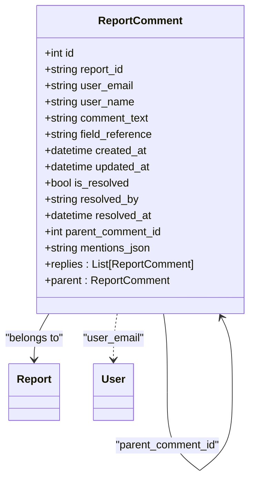
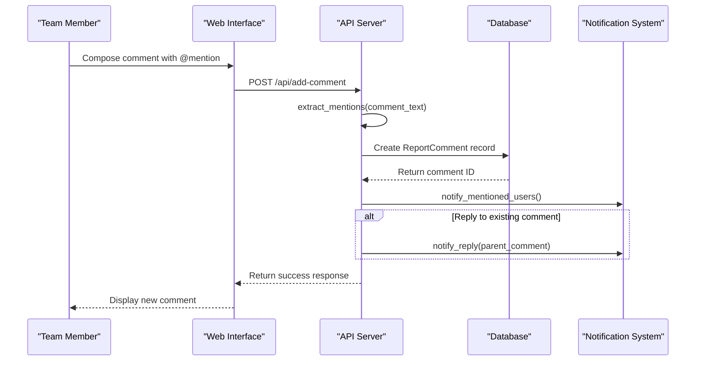
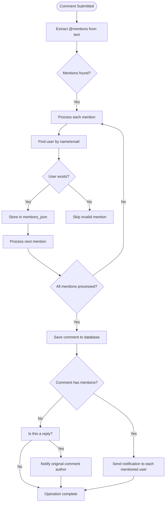
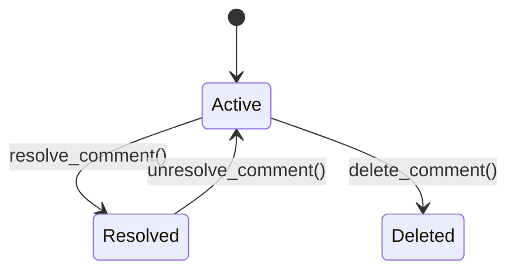
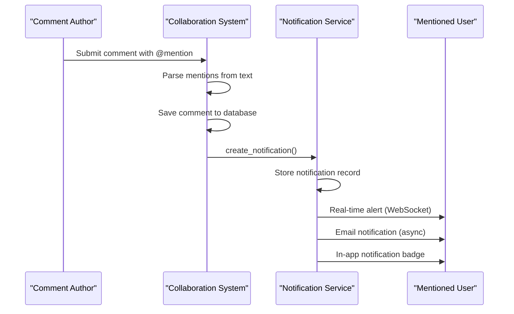

# Collaboration Features

<cite>
**Referenced Files in This Document**   
- [models.py](file://models.py)
- [routes/collaboration.py](file://routes/collaboration.py)
- [database/performance.py](file://database/performance.py)
</cite>

## Table of Contents
1. [Introduction](#introduction)
2. [ReportComment Model Structure](#reportcomment-model-structure)
3. [Hierarchical Comment System](#hierarchical-comment-system)
4. [Comment Threading Logic](#comment-threading-logic)
5. [Mentions and Notifications](#mentions-and-notifications)
6. [Resolution Workflow](#resolution-workflow)
7. [Performance Considerations](#performance-considerations)
8. [Database Indexing Strategy](#database-indexing-strategy)
9. [UI Patterns for Comment Rendering](#ui-patterns-for-comment-rendering)
10. [Integration with Notification Framework](#integration-with-notification-framework)

## Introduction
The ReportComment model enables team collaboration on reports through a comprehensive commenting system. This documentation details the hierarchical comment structure, mention functionality, resolution workflow, and integration with the notification system that allows team members to collaborate effectively on report content.

## ReportComment Model Structure

The ReportComment model provides a robust foundation for collaborative discussions on reports with comprehensive metadata and relationships.

**Section sources**
- [models.py](file://models.py#L255-L277)

## Hierarchical Comment System



**Diagram sources**
- [models.py](file://models.py#L255-L277)

The hierarchical comment system is built around the ReportComment model which supports threaded discussions through its self-referential relationship. Each comment can be associated with a specific report via the report_id field and can optionally reference a particular section of the report through the field_reference field.

The model includes comprehensive attribution with user_email and user_name fields that capture the identity of the commenter. The comment_text field stores the actual content of the comment, allowing team members to provide feedback, ask questions, or suggest changes to report content.

**Section sources**
- [models.py](file://models.py#L255-L277)

## Comment Threading Logic



**Diagram sources**
- [routes/collaboration.py](file://routes/collaboration.py#L69-L105)
- [models.py](file://models.py#L255-L277)

The comment threading logic enables nested discussions through the parent_comment_id field, which creates a self-referential relationship within the ReportComment model. When a user replies to an existing comment, the system sets the parent_comment_id to the ID of the comment being replied to, establishing a parent-child relationship.

The model implements this relationship through the replies relationship and parent backref configuration, allowing for efficient traversal of comment threads in both directions. Top-level comments have a null parent_comment_id, while replies contain the ID of their parent comment, creating a tree structure that can be recursively traversed to render comment threads.

**Section sources**
- [models.py](file://models.py#L275-L277)
- [routes/collaboration.py](file://routes/collaboration.py#L69-L105)

## Mentions and Notifications



**Diagram sources**
- [routes/collaboration.py](file://routes/collaboration.py#L150-L170)
- [models.py](file://models.py#L268)

The mentions system supports @-mentions of team members through the mentions_json field, which stores a JSON array of referenced users. When a user includes an @mention in their comment text (e.g., @John_Doe), the system parses the text using regular expressions to identify mentions and resolves them to actual user accounts.

The extract_mentions function processes the comment text, converts the underscore-separated format back to full names, and queries the User model to verify the existence of mentioned users. Valid mentions are stored in the mentions_json field as a JSON array containing the email and name of each mentioned user.

When comments are saved, the system triggers notifications to mentioned users through the notify_mentioned_users function, ensuring that team members are alerted when they are directly referenced in a discussion.

**Section sources**
- [routes/collaboration.py](file://routes/collaboration.py#L150-L170)

## Resolution Workflow



**Diagram sources**
- [routes/collaboration.py](file://routes/collaboration.py#L103-L139)

The resolution workflow is managed through three key fields: is_resolved, resolved_by, and resolved_at. When a comment is marked as resolved, the is_resolved flag is set to true, resolved_by captures the email of the user who resolved the comment, and resolved_at records the timestamp of resolution.

The system provides API endpoints to manage the resolution state:
- `/api/resolve-comment/<int:comment_id>`: Marks a comment as resolved
- `/api/unresolve-comment/<int:comment_id>`: Reopens a resolved comment
- `/api/delete-comment/<int:comment_id>`: Deletes a comment (with permission checks)

Only the comment author or users with Admin role can resolve, unresolve, or delete comments, ensuring appropriate access control for comment management.

**Section sources**
- [routes/collaboration.py](file://routes/collaboration.py#L103-L139)

## Performance Considerations

For deeply nested comment threads, the system employs several performance optimizations to ensure responsive interactions. The current implementation uses eager loading patterns to retrieve comment threads in a single query, minimizing database round trips when rendering comment trees.

The get_comments endpoint retrieves top-level comments ordered by created_at in descending order, then iterates through each comment to include its replies, creating a complete thread structure in memory before serialization. This approach reduces the number of database queries but may require optimization for reports with very high comment volumes.

Potential performance enhancements include:
- Implementing pagination for comment threads
- Adding lazy loading for nested replies
- Caching frequently accessed comment threads
- Using database-level tree structures for hierarchical queries

**Section sources**
- [routes/collaboration.py](file://routes/collaboration.py#L0-L35)

## Database Indexing Strategy

```mermaid
erDiagram
REPORT_COMMENTS {
int id PK
string report_id FK
string user_email
string user_name
text comment_text
string field_reference
datetime created_at
datetime updated_at
bool is_resolved
string resolved_by
datetime resolved_at
int parent_comment_id FK
text mentions_json
}
REPORTS ||--o{ REPORT_COMMENTS : "contains"
REPORT_COMMENTS }o--|| REPORT_COMMENTS : "parent/child"
USERS ||--o{ REPORT_COMMENTS : "authors"
INDEX idx_report_comments_report_created[report_id, created_at]
INDEX idx_report_comments_resolved[is_resolved]
INDEX idx_report_comments_parent[parent_comment_id]
REPORT_COMMENTS ||--o{ INDEX : "has indexes"
```

**Diagram sources**
- [database/performance.py](file://database/performance.py#L179-L213)
- [models.py](file://models.py#L255-L277)

The database indexing strategy includes optimized indexes to support common query patterns for comment retrieval. While the current implementation doesn't explicitly define indexes for the ReportComment table in the model, the system's performance module suggests indexing strategies for optimal query performance.

Recommended indexes include:
- Composite index on report_id and created_at for efficient retrieval of comments by report with chronological ordering
- Index on parent_comment_id to optimize queries for comment replies
- Index on is_resolved to quickly filter resolved vs. active comments
- Index on field_reference to support queries for comments on specific report sections

These indexes ensure that common operations like loading all comments for a report, finding unresolved comments, or retrieving comment threads perform efficiently even as the comment volume grows.

**Section sources**
- [database/performance.py](file://database/performance.py#L179-L213)

## UI Patterns for Comment Rendering

The UI patterns for rendering comment trees follow a recursive approach that visually represents the hierarchical structure of discussions. Top-level comments are displayed in chronological order (newest first), with nested replies indented beneath their parent comments.

Each comment displays:
- Commenter's name and avatar
- Timestamp of creation
- Contextual field reference (if applicable)
- Comment content with rendered @mentions
- Resolution status indicator
- Reply action button

The interface supports progressive disclosure, initially showing only top-level comments with options to expand reply threads. This approach maintains readability while accommodating deeply nested discussions.

**Section sources**
- [routes/collaboration.py](file://routes/collaboration.py#L0-L35)

## Integration with Notification Framework



**Diagram sources**
- [routes/collaboration.py](file://routes/collaboration.py#L150-L170)
- [models.py](file://models.py#L645-L700)

The comment system integrates with the notification framework to ensure stakeholders are informed of relevant discussions. When a user is @mentioned in a comment, the notify_mentioned_users function creates Notification records for each mentioned user, triggering multiple notification channels.

The integration also supports reply notifications, where the author of a comment receives a notification when someone replies to their comment. This creates a complete communication loop that keeps team members engaged in ongoing discussions.

Notification types used include:
- 'mention': When a user is @mentioned in a comment
- 'reply': When a user receives a reply to their comment
- 'comment': General comment activity on reports a user is following

The system respects user preferences and notification settings, ensuring that team members receive timely updates without unnecessary interruptions.

**Section sources**
- [routes/collaboration.py](file://routes/collaboration.py#L150-L170)
- [models.py](file://models.py#L645-L700)