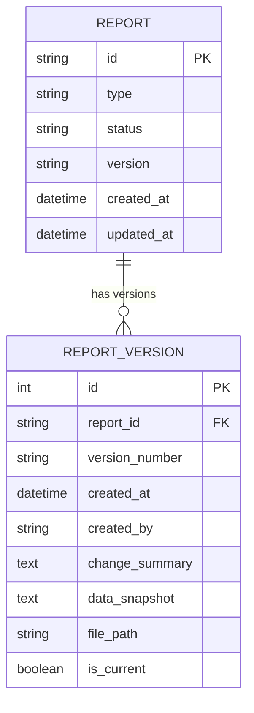
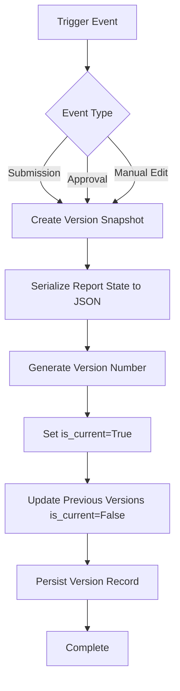
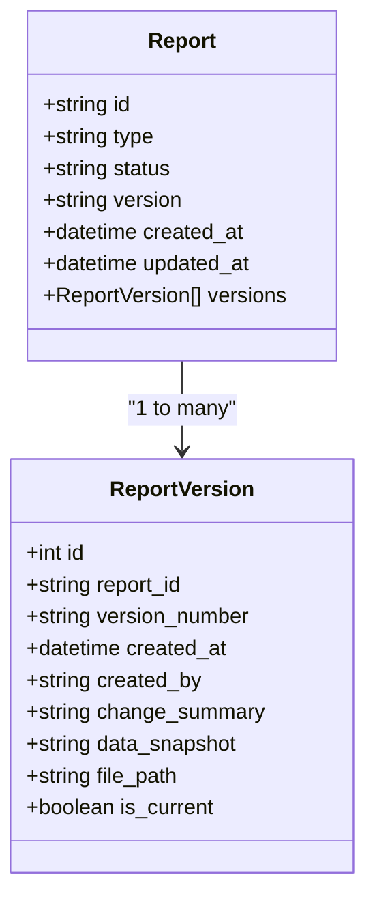
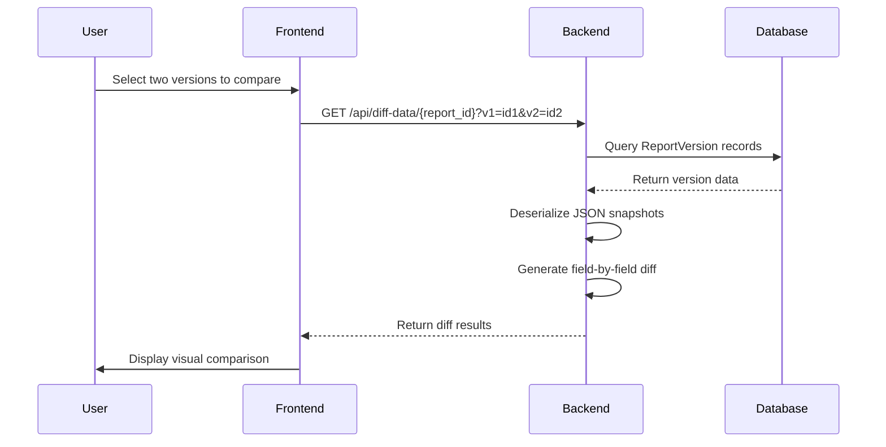

# Document Versioning System

<cite>
**Referenced Files in This Document**   
- [models.py](file://models.py#L238-L253)
- [routes/compare.py](file://routes/compare.py#L97-L172)
- [api/versioning.py](file://api/versioning.py#L0-L84)
</cite>

## Table of Contents
1. [Introduction](#introduction)
2. [ReportVersion Data Model](#reportversion-data-model)
3. [Field Specifications](#field-specifications)
4. [Version Creation Workflow](#version-creation-workflow)
5. [Parent-Child Relationship with Report Entity](#parent-child-relationship-with-report-entity)
6. [Version Restoration Process](#version-restoration-process)
7. [Version Comparison and Diff Logic](#version-comparison-and-diff-logic)
8. [Data Snapshot Management](#data-snapshot-management)
9. [File Path Handling](#file-path-handling)
10. [Performance Considerations](#performance-considerations)
11. [Indexing and Query Optimization](#indexing-and-query-optimization)
12. [Storage Implications](#storage-implications)
13. [Background Task Integration](#background-task-integration)
14. [API Endpoints for Version History](#api-endpoints-for-version-history)
15. [Conclusion](#conclusion)

## Introduction
The SAT Report Generator system implements a comprehensive document versioning mechanism through the ReportVersion model, enabling full auditability and state tracking throughout a report's lifecycle. This documentation details the architecture, functionality, and operational characteristics of the version control system, focusing on how document states are captured, stored, and restored during critical workflow transitions such as submission, approval, and manual edits.

## ReportVersion Data Model
The ReportVersion entity serves as the cornerstone of the document versioning system, capturing complete snapshots of report states at specific points in time. Each version record maintains metadata about the change, the user responsible, and the complete document state, enabling full historical reconstruction and audit capabilities.

**Diagram sources**
- [models.py](file://models.py#L238-L253)
- [models.py](file://models.py#L66-L101)

**Section sources**
- [models.py](file://models.py#L238-L253)

## Field Specifications
The ReportVersion model contains several critical fields that collectively preserve the complete state and context of document changes:

- **version_number**: String identifier following the R0, R1, R2 pattern, corresponding to the revision level of the document
- **created_at**: Timestamp of version creation using UTC timezone for consistent temporal ordering
- **created_by**: User identifier (email) capturing the identity of the user who triggered the version creation
- **change_summary**: Optional textual description providing audit context for the changes captured in the version
- **data_snapshot**: Complete JSON serialization of the report's state at the time of versioning, stored as text
- **file_path**: File system path pointing to the generated document (PDF, DOCX, etc.) associated with this version
- **is_current**: Boolean flag indicating whether this version represents the active, current state of the document

**Section sources**
- [models.py](file://models.py#L238-L253)

## Version Creation Workflow
The system automatically creates version snapshots during key workflow transitions, including report submission, approval milestones, and significant manual edits. The versioning process is triggered by the `create_version_snapshot` function, which captures the current state of the report and persists it as a new ReportVersion record.

When a new version is created, the system automatically sets the `is_current` flag to true for the new version while updating all existing versions of the same report to have `is_current = false`, ensuring only one current version exists at any time.

**Diagram sources**
- [routes/compare.py](file://routes/compare.py#L131-L172)

**Section sources**
- [routes/compare.py](file://routes/compare.py#L131-L172)

## Parent-Child Relationship with Report Entity
The ReportVersion model maintains a strict parent-child relationship with the Report entity through a foreign key constraint on the report_id field. Each Report can have multiple associated ReportVersion records, forming a version history timeline. The relationship is configured with cascading operations to ensure version records are properly maintained alongside their parent reports.

**Diagram sources**
- [models.py](file://models.py#L66-L101)
- [models.py](file://models.py#L238-L253)

**Section sources**
- [models.py](file://models.py#L66-L101)
- [models.py](file://models.py#L238-L253)

## Version Restoration Process
Version restoration allows users to revert a report to a previous state by selecting a historical version from the version history interface. The restoration process deserializes the JSON data_snapshot from the selected ReportVersion record and updates the parent Report entity with the historical state. This operation creates a new version record with the restored state, maintaining a complete audit trail of the restoration action.

The system ensures data integrity during restoration by validating the JSON structure before applying changes and wrapping the operation in a database transaction to prevent partial updates.

## Version Comparison and Diff Logic
The system provides version comparison capabilities through the `/api/diff-data/<report_id>` endpoint, which generates a field-by-field diff between two selected versions. The comparison logic uses Python's difflib module to identify changes between the deserialized JSON snapshots of two versions, presenting differences in a user-friendly format.

The diff algorithm processes both top-level report attributes and nested context data, highlighting additions, deletions, and modifications to support audit and review workflows.

**Diagram sources**
- [routes/compare.py](file://routes/compare.py#L64-L100)

**Section sources**
- [routes/compare.py](file://routes/compare.py#L64-L100)

## Data Snapshot Management
The data_snapshot field stores a complete JSON representation of the report state at the time of versioning, ensuring full fidelity of historical states. For SAT reports, this includes the data_json field from the associated SATReport record, while other report types serialize key attributes like document_title, project_reference, and client_name.

The system handles JSON serialization and deserialization through standard library functions, with error handling to manage malformed data. Snapshots are stored as text in the database to accommodate large payloads and ensure compatibility across database systems.

## File Path Handling
The file_path field stores the filesystem location of generated documents (PDF, DOCX, etc.) associated with each version. This enables the system to maintain version-specific document artifacts and support features like downloading historical versions. The path is stored as a relative path to facilitate environment portability and backup/restore operations.

## Performance Considerations
Storing complete JSON snapshots for each version presents performance considerations, particularly for large reports with extensive data. The system mitigates these concerns through several strategies:

- Using text fields optimized for large content storage
- Implementing database indexing on frequently queried fields
- Employing connection pooling and query optimization
- Utilizing caching for frequently accessed version data

For extremely large reports, the system may implement compression of JSON snapshots or selective field inclusion in future iterations.

**Section sources**
- [models.py](file://models.py#L238-L253)

## Indexing and Query Optimization
The database schema includes strategic indexing to optimize time-based queries and version history retrieval:

- Index on report_id to accelerate queries for a specific report's version history
- Index on created_at to support chronological ordering and date-range queries
- Composite index on (report_id, created_at) for optimal performance when retrieving version timelines

These indexes ensure responsive performance when users navigate version history or compare different versions of a report.

**Section sources**
- [models.py](file://models.py#L238-L253)

## Storage Implications
Long-term version retention creates storage implications that are managed through configurable retention policies. Each version snapshot consumes database storage proportional to the size of the serialized report data. The system provides administrative controls to manage storage growth, including:

- Automated cleanup of old versions beyond retention periods
- Archival of historical versions to cold storage
- Reporting on storage utilization by report and version count

Organizations can configure retention policies based on compliance requirements and storage capacity.

## Background Task Integration
The versioning system integrates with background task processing through the Celery framework, allowing resource-intensive operations like document generation and large snapshot processing to occur asynchronously. This prevents UI blocking during version creation and ensures system responsiveness.

Background tasks handle post-versioning activities such as document generation, notification dispatch, and search index updates, with error handling and retry mechanisms to ensure reliability.

## API Endpoints for Version History
The system exposes version history through RESTful API endpoints that allow programmatic access to version data:

- `GET /versions/<report_id>` - Retrieve version history timeline
- `GET /api/diff-data/<report_id>` - Get JSON diff between two versions
- `POST /versions/<report_id>/restore` - Restore a specific version
- `GET /versions/<version_id>/download` - Download document for a specific version

These endpoints support both UI integration and external system integration, with proper authentication and authorization controls.

**Section sources**
- [routes/compare.py](file://routes/compare.py#L0-L33)

## Conclusion
The ReportVersion model provides a robust foundation for document version control within the SAT Report Generator system, enabling comprehensive audit trails, state preservation, and historical reconstruction. By capturing complete snapshots during key workflow transitions and maintaining clear relationships with parent reports, the system ensures data integrity and traceability throughout the document lifecycle. The integration of comparison tools, restoration capabilities, and performance optimizations creates a comprehensive versioning solution that meets both user experience and technical requirements.