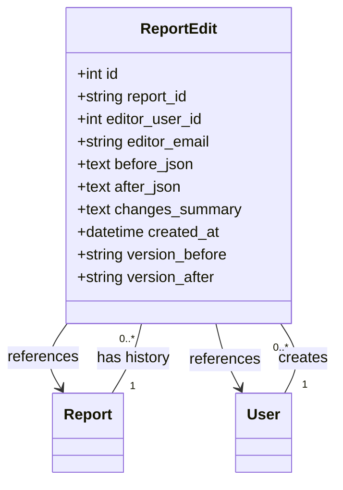
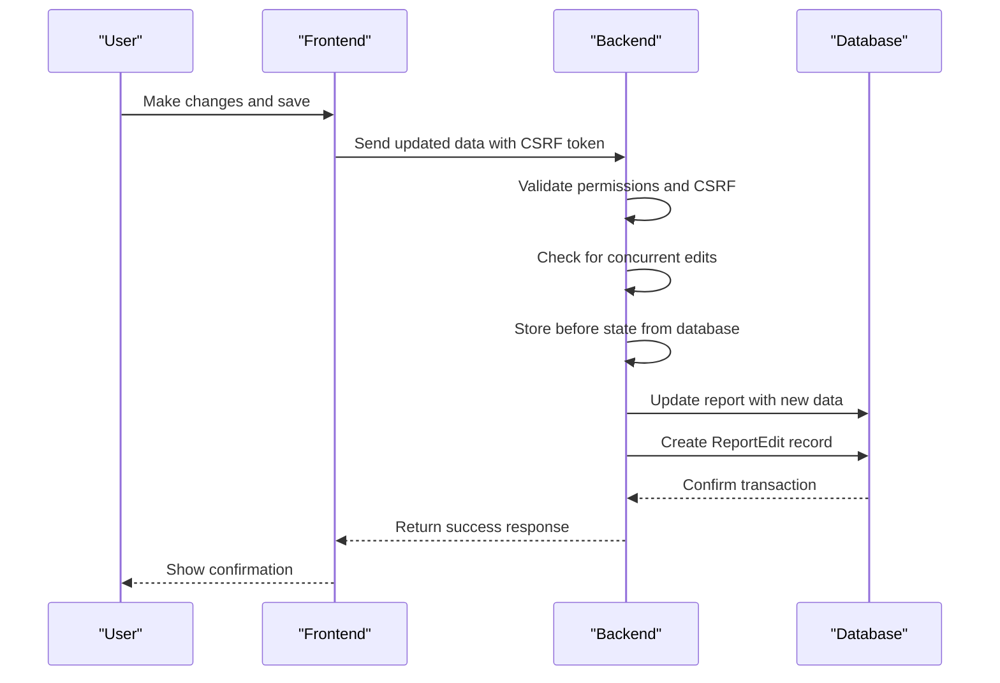
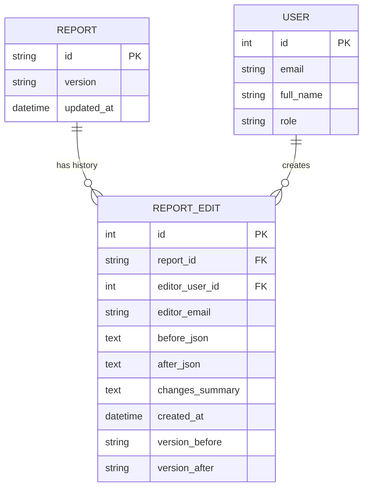

# Edit Audit Trail

<cite>
**Referenced Files in This Document**   
- [models.py](file://models.py#L623-L643)
- [routes/edit.py](file://routes/edit.py#L156-L195)
- [EDIT_FEATURE_FIX_SUMMARY.md](file://EDIT_FEATURE_FIX_SUMMARY.md#L91-L98)
</cite>

## Table of Contents
1. [Introduction](#introduction)
2. [ReportEdit Model Structure](#reportedit-model-structure)
3. [Field-Level Analysis](#field-level-analysis)
4. [Audit Trail Generation Process](#audit-trail-generation-process)
5. [Relationships with Report and User Models](#relationships-with-report-and-user-models)
6. [Code Examples](#code-examples)
7. [Security Considerations](#security-considerations)
8. [Performance Implications](#performance-implications)
9. [Database Indexing Strategy](#database-indexing-strategy)
10. [Administrative Use Cases](#administrative-use-cases)

## Introduction
The ReportEdit model serves as the comprehensive audit trail system for tracking all changes made to reports within the application. This model captures the complete state transition of report data, providing accountability, traceability, and historical context for every modification. The audit system ensures that no changes go unrecorded by automatically logging edits through model hooks in the application lifecycle. This documentation details the implementation, functionality, and usage patterns of the ReportEdit model, explaining how it supports compliance, troubleshooting, and data integrity requirements.

## ReportEdit Model Structure
The ReportEdit model is designed as a dedicated audit table that captures comprehensive information about every edit operation performed on reports. It maintains a historical record of changes with sufficient detail to reconstruct the evolution of any report over time. The model is implemented as a separate table from the main Report entity to ensure that audit data persists even if the original report is modified or deleted.

**Diagram sources**
- [models.py](file://models.py#L623-L643)

**Section sources**
- [models.py](file://models.py#L623-L643)

## Field-Level Analysis
The ReportEdit model contains several key fields that work together to provide a complete audit trail. Each field serves a specific purpose in capturing the context and details of report modifications.

### State Transition Fields
The `before_json` and `after_json` fields capture the complete state of the report before and after the edit operation. These fields store the full JSON representation of the report data, enabling complete reconstruction of any version. The `before_json` field is nullable to accommodate the creation of new reports, while `after_json` is required for all edit operations.

### Accountability Fields
The `editor_user_id` and `editor_email` fields provide dual identification of the user who made the edit. The user ID creates a direct relationship with the User model for data integrity, while the email address is stored redundantly to ensure accountability even if the user record is later modified or deleted.

### Metadata Fields
The `created_at` timestamp precisely records when the edit was made, while the `version_before` and `version_after` fields track the report's version progression. These fields enable chronological sorting of edits and provide context for version control.

### Summary Field
The `changes_summary` field contains a human-readable description of the changes made, making it easier for administrators and users to quickly understand the nature of each edit without having to analyze the JSON differences.

**Section sources**
- [models.py](file://models.py#L623-L643)

## Audit Trail Generation Process
The audit trail is automatically generated through the application's edit workflow, ensuring that no changes go unrecorded. When a user saves edits to a report, the system creates a new ReportEdit record as part of the transaction.

**Diagram sources**
- [routes/edit.py](file://routes/edit.py#L156-L195)

**Section sources**
- [routes/edit.py](file://routes/edit.py#L156-L195)

## Relationships with Report and User Models
The ReportEdit model establishes critical relationships with both the Report and User models, enabling powerful query capabilities and data integrity. The foreign key relationship with the Report model ensures that each edit is properly associated with its parent report, while the relationship with the User model provides accountability.

**Diagram sources**
- [models.py](file://models.py#L623-L643)

**Section sources**
- [models.py](file://models.py#L623-L643)

## Code Examples
The following code examples demonstrate how the audit log is generated during report updates, how differences between JSON states can be computed, and how change summaries are presented in the UI.

### Audit Log Generation
When saving edits to a report, the system creates a ReportEdit record that captures the complete context of the change:

[SPEC SYMBOL](file://routes/edit.py#L156-L195)

### Diff Computation
The system can compute differences between JSON states to generate meaningful change summaries:

[SPEC SYMBOL](file://routes/edit.py#L156-L195)

### UI Presentation
The edit history is presented in the UI through a dedicated view that displays chronological changes:

[SPEC SYMBOL](file://routes/edit.py#L226-L239)

**Section sources**
- [routes/edit.py](file://routes/edit.py#L156-L195)

## Security Considerations
The audit trail system incorporates several security measures to protect the integrity of audit data. All edit operations require CSRF protection to prevent cross-site request forgery attacks. The system implements optimistic concurrency control to prevent conflicts when multiple users attempt to edit the same report simultaneously.

The permission system ensures that only authorized users can make edits, with different roles having varying levels of access. Admin users can edit any report, engineers can edit their own reports in DRAFT or PENDING status, and Automation Managers can edit reports until they are approved by a Project Manager.

**Section sources**
- [routes/edit.py](file://routes/edit.py#L156-L195)

## Performance Implications
The audit trail system is designed to handle high-frequency editing operations while maintaining performance. Each edit operation is performed within a database transaction to ensure atomicity and consistency. The system uses efficient JSON storage for the before and after states, minimizing the overhead of storing complete report snapshots.

For reports that experience frequent edits, the system may generate a large number of audit records. To mitigate performance impacts, the application implements database indexing strategies and query optimization techniques to ensure that audit log retrieval remains efficient even as the volume of audit data grows.

**Section sources**
- [models.py](file://models.py#L623-L643)

## Database Indexing Strategy
The database indexing strategy for the ReportEdit model is designed to optimize common query patterns. The primary key on the `id` field ensures fast lookups of individual audit records. A foreign key index on `report_id` enables efficient retrieval of all edits for a specific report.

Additional indexes may be created on frequently queried fields such as `editor_user_id`, `created_at`, and `version_after` to support administrative queries and reporting. The indexing strategy balances query performance with the overhead of maintaining indexes during write operations.

**Section sources**
- [models.py](file://models.py#L623-L643)

## Administrative Use Cases
Administrators can leverage the audit trail data for various compliance reporting and troubleshooting scenarios. The complete history of changes allows administrators to investigate issues, verify compliance with regulatory requirements, and reconstruct the evolution of reports over time.

For compliance reporting, administrators can generate audit logs that demonstrate the integrity of the reporting process, showing who made changes, when they were made, and what the changes were. For troubleshooting, administrators can compare different versions of a report to identify when and where issues were introduced.

The audit trail also supports accountability by providing clear evidence of user actions, which can be used in performance evaluations or to resolve disputes about report content.

**Section sources**
- [EDIT_FEATURE_FIX_SUMMARY.md](file://EDIT_FEATURE_FIX_SUMMARY.md#L91-L98)