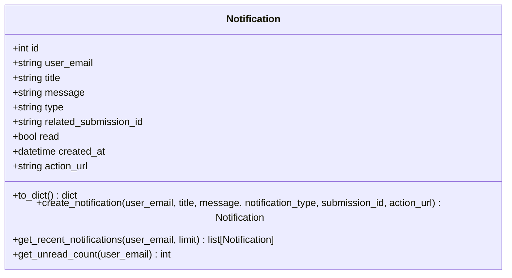
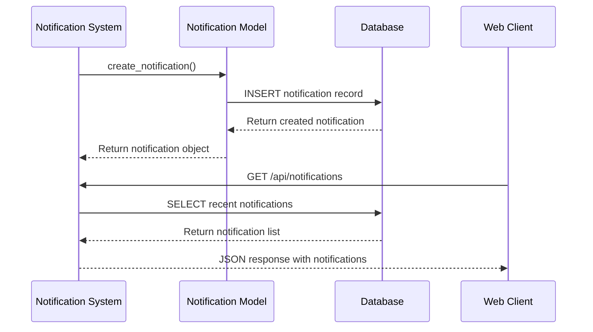
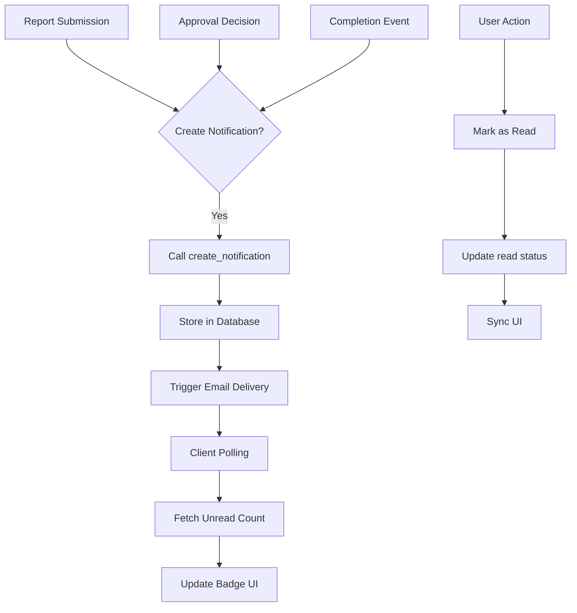
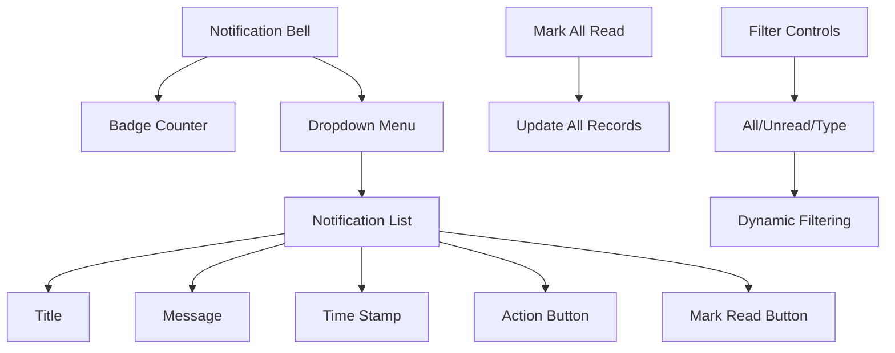

# Notification System

<cite>
**Referenced Files in This Document**   
- [models.py](file://models.py#L653-L700)
- [notifications.js](file://static/js/notifications.js)
- [notification_center.html](file://templates/notification_center.html)
- [test_models.py](file://tests/unit/test_models.py#L294-L331)
- [test_database_operations.py](file://tests/integration/test_database_operations.py#L387-L456)
</cite>

## Table of Contents
1. [Introduction](#introduction)
2. [Notification Data Model](#notification-data-model)
3. [Field Specifications](#field-specifications)
4. [Notification Creation and Management](#notification-creation-and-management)
5. [System Integration and Workflow](#system-integration-and-workflow)
6. [User Interface Components](#user-interface-components)
7. [Performance Considerations](#performance-considerations)
8. [Conclusion](#conclusion)

## Introduction
The Notification System provides a unified mechanism for delivering both in-app alerts and email notifications within the report generation platform. This system tracks key workflow events such as report submissions, approval decisions, and completion milestones. The design emphasizes real-time user engagement through a combination of database persistence, background processing, and client-side polling mechanisms. Notifications are structured to support deep linking to relevant content while maintaining performance at scale through optimized querying and indexing strategies.

## Notification Data Model

**Diagram sources**
- [models.py](file://models.py#L653-L700)

**Section sources**
- [models.py](file://models.py#L653-L700)

## Field Specifications

The Notification model contains the following fields that define its structure and behavior:

- **user_email**: Recipient identifier stored as string (120 characters), not nullable
- **title**: Notification headline stored as string (200 characters), not nullable
- **message**: Full content of the notification stored as text, not nullable
- **type**: Classification of notification (approval_request, status_update, completion, etc.), stored as string (50 characters), not nullable
- **related_submission_id**: Reference to associated report via UUID, stored as string (36 characters), nullable
- **read**: Boolean flag tracking read state with default value of false
- **created_at**: Timestamp of notification creation with UTC default
- **action_url**: Optional deep link for user interaction, stored as string (500 characters), nullable

The `to_dict()` method standardizes output format by mapping internal field names to more descriptive external representations, specifically renaming `type` to `notification_type` and `related_submission_id` to `submission_id` in the output.

**Section sources**
- [models.py](file://models.py#L653-L700)

## Notification Creation and Management

**Diagram sources**
- [models.py](file://models.py#L681-L700)
- [notifications.js](file://static/js/notifications.js)

The system provides static methods for creating, retrieving, and counting notifications:

- **create_notification()**: Creates and persists a new notification with specified parameters
- **get_recent_notifications()**: Retrieves recent notifications for a user ordered by creation time
- **get_unread_count()**: Returns count of unread notifications for a user

These methods enable batch processing in background tasks and support real-time updates through polling mechanisms. The system generates notifications at key workflow moments including report submission, approval decisions, and completion events.

**Section sources**
- [models.py](file://models.py#L681-L700)
- [test_models.py](file://tests/unit/test_models.py#L294-L331)
- [test_database_operations.py](file://tests/integration/test_database_operations.py#L387-L456)

## System Integration and Workflow

**Diagram sources**
- [models.py](file://models.py#L653-L700)
- [notifications.js](file://static/js/notifications.js)

The notification system integrates with workflow events through service layer calls that create notifications at appropriate junctures. When key events occur (report submission, approval, completion), the system invokes `create_notification()` with relevant context. This triggers both database persistence and integration with email delivery systems. Background tasks handle batch processing of notifications, particularly for email distribution, ensuring system responsiveness during high-volume operations.

**Section sources**
- [models.py](file://models.py#L653-L700)
- [notifications.js](file://static/js/notifications.js)

## User Interface Components

**Diagram sources**
- [notification_center.html](file://templates/notification_center.html)
- [notifications.js](file://static/js/notifications.js)

The user interface consists of multiple components that display notification status and content:

- **Notification badge**: Displays unread count on the navigation bar
- **Dropdown menu**: Shows recent notifications with quick actions
- **Notification center**: Full-page interface with filtering capabilities
- **Action buttons**: Enable deep linking to relevant content
- **Read state controls**: Allow users to mark individual or all notifications as read

The client-side implementation uses JavaScript to poll for unread counts every 30 seconds, updating the badge counter without requiring full page refreshes. The notification center provides filtering by type and read status, enhancing user experience when managing multiple notifications.

**Section sources**
- [notification_center.html](file://templates/notification_center.html)
- [notifications.js](file://static/js/notifications.js)

## Performance Considerations

The notification system incorporates several performance optimizations for high-volume scenarios:

- **Database indexing**: Indexes on `user_email` and `read` status enable efficient querying
- **Soft-delete pattern**: Read state tracking instead of record deletion preserves history while managing visibility
- **Batch processing**: Background tasks handle email delivery and bulk operations
- **Client-side polling**: Optimized polling for unread counts reduces server load
- **Caching strategy**: Unread counts can be cached to minimize database queries

The system is designed to handle high notification volumes by separating real-time in-app alerts from asynchronous email delivery. Database queries are optimized through proper indexing on frequently filtered fields, particularly `user_email` and `read` status, ensuring responsive performance even with large notification datasets.

**Section sources**
- [models.py](file://models.py#L653-L700)
- [notifications.js](file://static/js/notifications.js)

## Conclusion
The Notification System provides a robust foundation for user engagement through timely alerts and updates. By combining a well-structured data model with efficient querying and responsive user interface components, the system effectively supports both in-app and email notifications. The design accommodates high-volume scenarios through performance optimizations and background processing, while maintaining data integrity and user experience. Future enhancements could include notification preferences, delivery channel selection, and advanced filtering capabilities.