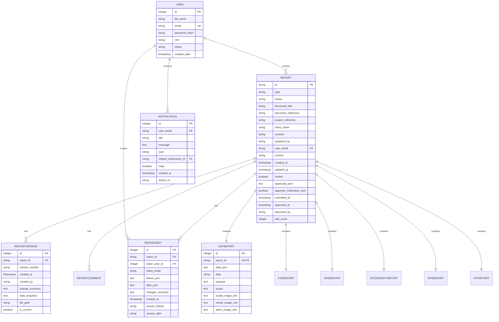

# Data Models & ORM Mapping

<cite>
**Referenced Files in This Document**   
- [models.py](file://models.py)
- [api/schemas.py](file://api/schemas.py)
</cite>

## Table of Contents
1. [Introduction](#introduction)
2. [Core Data Models](#core-data-models)
3. [Entity Relationships](#entity-relationships)
4. [Database Schema Diagram](#database-schema-diagram)
5. [Marshmallow Schema Mapping](#marshmallow-schema-mapping)
6. [Data Validation and Business Logic](#data-validation-and-business-logic)
7. [Performance Considerations](#performance-considerations)
8. [Lifecycle Hooks and Audit Trail](#lifecycle-hooks-and-audit-trail)

## Introduction
This document provides comprehensive documentation for the SQLAlchemy ORM models used in the SERVER application. It details the core entities involved in report generation and management, including User, Report, SATReport, Notification, ReportVersion, and ReportEdit. The documentation covers field definitions, constraints, relationships, serialization mappings, validation rules, and performance optimization strategies. The system uses a polymorphic pattern where the base Report entity serves as a container for specialized report types stored in separate tables.

## Core Data Models

### User Model
The User model represents application users with role-based access control.

**Field Definitions**
- `id`: Integer, primary key, auto-incremented
- `full_name`: String(100), required, user's full name
- `email`: String(120), unique, required, serves as login identifier
- `password_hash`: String(255), required, stores hashed password
- `role`: String(30), optional, one of Admin, Engineer, Automation Manager, PM
- `status`: String(20), default 'Pending', one of Pending, Active, Disabled
- `created_date`: DateTime, default UTC timestamp
- `requested_role`: String(20), optional, tracks role change requests

**Business Logic**
- Password management via `set_password()` and `check_password()` methods using Werkzeug security
- `is_active` property returns True only if status is 'Active'
- Email serves as the unique identifier (username field removed)

**Section sources**
- [models.py](file://models.py#L15-L30)

### Report Model
The Report model serves as the base entity for all report types with a polymorphic structure.

**Field Definitions**
- `id`: String(36), primary key, UUID format
- `type`: String(20), required, report type (SAT, FDS, HDS, etc.)
- `status`: String(20), default 'DRAFT', workflow state
- `document_title`: String(200), optional, human-readable title
- `document_reference`: String(100), optional, document ID
- `project_reference`: String(100), optional, project identifier
- `client_name`: String(100), optional, client organization
- `revision`: String(20), optional, revision identifier
- `prepared_by`: String(100), optional, preparer name
- `user_email`: String(120), required, creator's email
- `version`: String(10), default 'R0', version tracking
- `created_at`: DateTime, default UTC timestamp
- `updated_at`: DateTime, default and on-update UTC timestamp
- `locked`: Boolean, default False, indicates final approval
- `approvals_json`: Text, optional, JSON workflow definition
- `approval_notification_sent`: Boolean, default False
- `submitted_at`: DateTime, optional, submission timestamp
- `approved_at`: DateTime, optional, final approval timestamp
- `approved_by`: String(120), optional, approver's email
- `edit_count`: Integer, default 0, edit tracking

**Section sources**
- [models.py](file://models.py#L55-L107)

### SATReport Model
The SATReport model contains System Acceptance Test-specific data with a one-to-one relationship to the base Report.

**Field Definitions**
- `id`: Integer, primary key, auto-incremented
- `report_id`: String(36), foreign key to reports.id, unique
- `data_json`: Text, required, complete SAT form payload as JSON
- `date`: String(20), optional, test date
- `purpose`: Text, optional, test purpose
- `scope`: Text, optional, test scope
- `scada_image_urls`: Text, optional, JSON array of SCADA screenshot URLs
- `trends_image_urls`: Text, optional, JSON array of trend chart URLs
- `alarm_image_urls`: Text, optional, JSON array of alarm screen URLs

**Section sources**
- [models.py](file://models.py#L108-L142)

### Notification Model
The Notification model manages user notifications for workflow events.

**Field Definitions**
- `id`: Integer, primary key, auto-incremented
- `user_email`: String(120), required, recipient email
- `title`: String(200), required, notification title
- `message`: Text, required, notification content
- `type`: String(50), required, category (approval_request, status_update, etc.)
- `related_submission_id`: String(36), optional, linked report ID
- `read`: Boolean, default False, read status
- `created_at`: DateTime, default UTC timestamp
- `action_url`: String(500), optional, CTA link

**Business Logic**
- `to_dict()` method formats notification for API responses
- Static methods for creation and retrieval with convenience methods for unread count

**Section sources**
- [models.py](file://models.py#L630-L670)

### ReportVersion Model
The ReportVersion model implements version control for document tracking.

**Field Definitions**
- `id`: Integer, primary key, auto-incremented
- `report_id`: String(36), foreign key to reports.id
- `version_number`: String(10), required, version identifier (R0, R1, etc.)
- `created_at`: DateTime, default UTC timestamp
- `created_by`: String(120), required, creator email
- `change_summary`: Text, optional, description of changes
- `data_snapshot`: Text, required, JSON snapshot of report data
- `file_path`: String(200), optional, generated document location
- `is_current`: Boolean, default False, indicates active version

**Section sources**
- [models.py](file://models.py#L225-L248)

### ReportEdit Model
The ReportEdit model provides an audit trail for all modifications.

**Field Definitions**
- `id`: Integer, primary key, auto-incremented
- `report_id`: String(36), foreign key to reports.id
- `editor_user_id`: Integer, foreign key to users.id
- `editor_email`: String(120), required, editor's email
- `before_json`: Text, optional, previous state
- `after_json`: Text, required, new state
- `changes_summary`: Text, optional, human-readable changes
- `created_at`: DateTime, default UTC timestamp
- `version_before`: String(10), optional, version before edit
- `version_after`: String(10), optional, version after edit

**Relationships**
- `report`: backref to Report entity
- `editor`: backref to User entity

**Section sources**
- [models.py](file://models.py#L595-L629)

## Entity Relationships

### Relationship Overview
The data model implements a composition pattern where the base Report entity contains specialized report types through one-to-one relationships.

**One-to-One Relationships**
- Report → SATReport: One Report has one SATReport
- Report → FDSReport: One Report has one FDSReport  
- Report → HDSReport: One Report has one HDSReport
- Report → SiteSurveyReport: One Report has one SiteSurveyReport
- Report → SDSReport: One Report has one SDSReport
- Report → FATReport: One Report has one FATReport

**One-to-Many Relationships**
- User → Report: One User creates many Reports
- User → Notification: One User receives many Notifications
- User → ReportEdit: One User makes many ReportEdits
- Report → ReportVersion: One Report has many ReportVersions
- Report → ReportComment: One Report has many ReportComments
- Report → ReportEdit: One Report has many ReportEdits

**Self-Referential Relationship**
- ReportComment → ReportComment: Threaded comment system with parent-child hierarchy

**Section sources**
- [models.py](file://models.py#L85-L107)
- [models.py](file://models.py#L249-L273)
- [models.py](file://models.py#L595-L629)

## Database Schema Diagram

**Diagram sources**
- [models.py](file://models.py#L15-L700)

## Marshmallow Schema Mapping

### Schema Overview
The API uses Marshmallow schemas in api/schemas.py to handle serialization between ORM models and JSON API payloads. The schemas enforce validation rules and control field exposure.

### Report Schema Mapping
The ReportSchema maps to the Report model with field-level validation:

**Field Mappings**
- `id`: maps to Report.id, dump_only
- `document_title`: maps to Report.document_title, required, 5-200 chars
- `document_reference`: maps to Report.document_reference, required, alphanumeric with hyphens/underscores
- `project_reference`: maps to Report.project_reference, required, alphanumeric with hyphens/underscores
- `client_name`: maps to Report.client_name, required, 2-100 chars
- `revision`: maps to Report.revision, required, ≤10 chars
- `prepared_by`: maps to Report.prepared_by, required, 2-100 chars
- `date`: maps to SATReport.date, required
- `purpose`: maps to SATReport.purpose, required, 10-1000 chars
- `scope`: maps to SATReport.scope, required, 10-2000 chars
- `status`: maps to Report.status, dump_only
- `created_by`: maps to Report.user_email, dump_only
- `created_at`: maps to Report.created_at, dump_only
- `updated_at`: maps to Report.updated_at, dump_only

**Validation Rules**
- Document and project references must contain only letters, numbers, hyphens, and underscores
- Full name validation ensures no special characters
- String fields are automatically stripped of whitespace via post_load hook

### Notification Schema Mapping
The Notification model maps to API responses through its to_dict() method, which transforms database fields to API-friendly names:
- `type` → `notification_type`
- `related_submission_id` → `submission_id`

**Section sources**
- [models.py](file://models.py#L15-L700)
- [api/schemas.py](file://api/schemas.py#L1-L307)

## Data Validation and Business Logic

### Model-Level Validation
The application implements validation at multiple levels:

**User Model**
- `set_password()`: Hashes password using generate_password_hash
- `check_password()`: Verifies password using check_password_hash
- `is_active`: Property-based validation returning status == 'Active'

**Report Model**
- No explicit validation methods, relies on database constraints
- JSON fields store complex data structures (approvals, image URLs)

**SATReport Model**
- No validation methods, relies on application-level validation

**Notification Model**
- `to_dict()`: Transforms model to API response format
- Static methods for CRUD operations with automatic commit

### Application-Level Validation
Validation is primarily handled through Marshmallow schemas:

**String Validation**
- Length constraints (min/max characters)
- Character set restrictions (alphanumeric with specific symbols)
- Automatic whitespace stripping

**Data Type Validation**
- Email format validation
- Date format validation
- Boolean coercion

**Section sources**
- [models.py](file://models.py#L25-L30)
- [models.py](file://models.py#L650-L670)
- [api/schemas.py](file://api/schemas.py#L1-L307)

## Performance Considerations

### Indexing Strategy
The database schema includes several performance optimizations:

**Primary Keys**
- User.id: Integer primary key with auto-increment
- Report.id: String(36) UUID primary key
- SATReport.id: Integer primary key with auto-increment
- ReportVersion.id: Integer primary key with auto-increment
- ReportEdit.id: Integer primary key with auto-increment

**Unique Constraints**
- User.email: Unique constraint for login
- Report.id: Primary key constraint
- SATReport.report_id: Unique foreign key constraint

**Foreign Keys**
- SATReport.report_id → Report.id: Indexed foreign key
- ReportEdit.report_id → Report.id: Indexed foreign key
- ReportEdit.editor_user_id → User.id: Indexed foreign key

**Recommended Indexes**
Based on query patterns, the following indexes are recommended:
- reports(user_email, status): For user-specific report filtering
- reports(created_at): For chronological sorting
- reports(status): For workflow state filtering
- notifications(user_email, read): For notification center queries
- report_edits(report_id, created_at): For audit trail queries

### Loading Strategies
The application uses appropriate loading strategies:

**Eager Loading**
- Report → SATReport: Eager loading via relationship definition
- ReportEdit → User: Eager loading for audit trail display

**Lazy Loading**
- User → Reports: Lazy loading to prevent excessive data
- Report → ReportVersions: Lazy loading for version history
- Report → ReportEdits: Lazy loading for audit trail

**Section sources**
- [models.py](file://models.py#L85-L107)
- [models.py](file://models.py#L200-L205)
- [models.py](file://models.py#L595-L629)

## Lifecycle Hooks and Audit Trail

### Database Initialization
The init_db() function handles database setup with several lifecycle operations:

**Initialization Steps**
1. Creates instance directory if missing
2. Initializes SQLAlchemy with Flask app
3. Tests database connection
4. Creates tables if they don't exist
5. Creates default admin user if missing
6. Initializes system settings

**Default Records**
- Admin user: admin@cullyautomation.com with role 'Admin'
- System settings: company_name, company_logo, default_storage_location

### Audit Trail Implementation
The system implements comprehensive audit capabilities:

**ReportEdit Model**
- Tracks every modification to reports
- Stores before/after JSON snapshots
- Records editor information and timestamps
- Captures version transitions

**ReportVersion Model**
- Maintains complete version history
- Stores JSON snapshots of report data
- Tracks current version with is_current flag
- Records change summaries and creators

**Notification System**
- Creates notifications for workflow events
- Tracks read/unread status
- Supports different notification types
- Maintains creation timestamps

**Section sources**
- [models.py](file://models.py#L300-L440)
- [models.py](file://models.py#L225-L248)
- [models.py](file://models.py#L595-L629)
- [models.py](file://models.py#L630-L670)