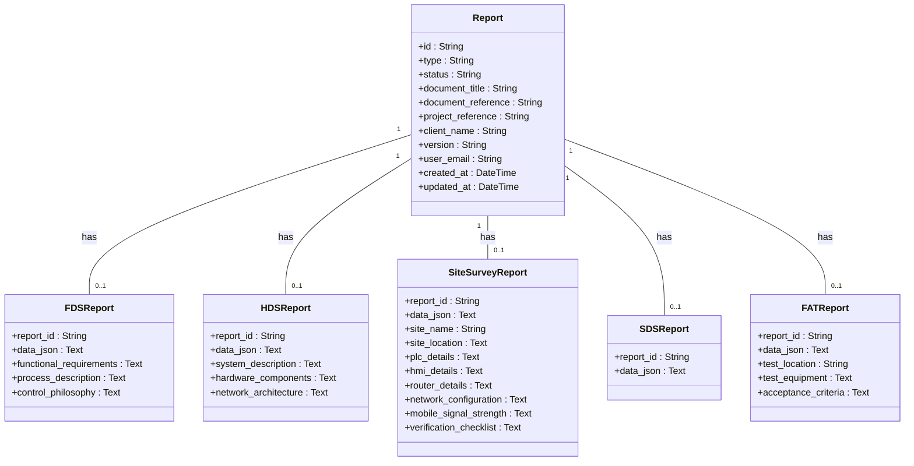

# Other Report Types

<cite>
**Referenced Files in This Document**   
- [models.py](file://models.py)
</cite>

## Table of Contents
1. [Introduction](#introduction)
2. [Core Report Model and Relationships](#core-report-model-and-relationships)
3. [FDSReport](#fdsreport)
4. [HDSReport](#hdsreport)
5. [SiteSurveyReport](#sitesurveyreport)
6. [SDSReport](#sdsreport)
7. [FATReport](#fatreport)
8. [Common Patterns Across Report Types](#common-patterns-across-report-types)
9. [Usage Examples](#usage-examples)
10. [Extending the System with New Report Types](#extending-the-system-with-new-report-types)

## Introduction
This document provides a comprehensive overview of all non-SAT report types in the system: FDSReport, HDSReport, SiteSurveyReport, SDSReport, and FATReport. Each report type extends the core Report model through a one-to-one relationship using a UUID-based `report_id` foreign key. These specialized reports capture domain-specific engineering data while maintaining a consistent structure and integration with the central reporting system. This documentation details the business purpose, data model, and usage patterns for each report type.

## Core Report Model and Relationships

The `Report` model serves as the central entity for all report types in the system. It stores common metadata such as document title, status, project reference, client name, version, and user information. The `type` field distinguishes between different report types (e.g., 'FDS', 'HDS', 'FAT'). Each specialized report type is linked to a parent `Report` via a UUID-based `report_id` foreign key, ensuring referential integrity and enabling unified querying across report types.



**Diagram sources**
- [models.py](file://models.py#L66-L101)
- [models.py](file://models.py#L124-L134)
- [models.py](file://models.py#L136-L146)
- [models.py](file://models.py#L148-L177)
- [models.py](file://models.py#L179-L184)
- [models.py](file://models.py#L186-L196)

**Section sources**
- [models.py](file://models.py#L66-L101)

## FDSReport

The `FDSReport` (Functional Design Specification Report) captures the functional requirements, process description, and control philosophy for automation systems. It serves as a blueprint for system design, ensuring alignment between engineering teams and client expectations before detailed hardware design begins.

### Business Purpose
The FDSReport documents the intended functionality of the control system, describing how processes should operate, the logic behind control decisions, and the overall system behavior. It is used during the design phase to validate requirements with stakeholders and guide subsequent engineering activities.

### Data Model
The `FDSReport` model extends the core `Report` with the following fields:
- `functional_requirements`: Detailed text describing system functions and capabilities
- `process_description`: Narrative description of the industrial process and its automation needs
- `control_philosophy`: Explanation of control strategies, interlocks, and safety considerations
- `data_json`: Full form payload stored as JSON for flexibility and auditability

**Section sources**
- [models.py](file://models.py#L124-L134)

## HDSReport

The `HDSReport` (Hardware Design Specification Report) documents the physical components and network architecture of automation systems. It provides a detailed view of the hardware configuration, enabling procurement, installation, and maintenance teams to understand system composition.

### Business Purpose
The HDSReport serves as a technical specification for system hardware, detailing component selection, connectivity, and network topology. It ensures that all stakeholders have a consistent understanding of the physical system design and facilitates accurate equipment ordering and installation planning.

### Data Model
The `HDSReport` model includes:
- `system_description`: Overview of the hardware system and its purpose
- `hardware_components`: JSON array containing specifications for PLCs, HMIs, I/O modules, and other devices
- `network_architecture`: Description of network topology, protocols, and communication paths
- `data_json`: Complete form submission stored as JSON

**Section sources**
- [models.py](file://models.py#L136-L146)

## SiteSurveyReport

The `SiteSurveyReport` captures comprehensive data for SCADA migration projects, documenting existing site conditions, hardware specifications, network configurations, and pre-departure verification. It ensures that migration teams have complete information before site visits and installations.

### Business Purpose
This report type supports SCADA system upgrades and migrations by systematically collecting field data during site surveys. It documents current infrastructure, identifies potential challenges, and verifies readiness for new system installation, reducing project risks and downtime.

### Data Model
The `SiteSurveyReport` includes structured fields for:
- **Site Information**: `site_name`, `site_location`, `site_access_details`, `area_engineer`, `site_caretaker`, `survey_completed_by`
- **Hardware Specifications**: `plc_details`, `hmi_details`, `router_details`, `network_equipment` (all stored as JSON)
- **Network Configuration**: `network_configuration` (JSON with IP, ports, gateways)
- **Communications**: `mobile_signal_strength` (JSON measurements)
- **Plant SCADA**: `local_scada_details` (existing system information)
- **Pre-Departure Checklist**: `verification_checklist` (JSON of verification items)
- `data_json`: Complete survey data as JSON payload

**Section sources**
- [models.py](file://models.py#L148-L177)

## SDSReport

The `SDSReport` (System Design Specification Report) is a minimal report type focused on storing structured design data in a flexible format. It serves as a lightweight container for system design information that may not require extensive field-level modeling.

### Business Purpose
The SDSReport provides a simple mechanism for capturing system design information without the overhead of defining numerous specific fields. Its primary purpose is to store form payloads in structured JSON format while maintaining linkage to the core reporting system.

### Data Model
The `SDSReport` model is intentionally minimal:
- `data_json`: Primary field storing the complete form payload as JSON
- No additional specialized fields, relying entirely on the JSON structure for data organization

**Section sources**
- [models.py](file://models.py#L179-L184)

## FATReport

The `FATReport` (Factory Acceptance Test Report) documents the testing performed on automation systems before deployment. It verifies that systems meet specified requirements in a controlled factory environment prior to field installation.

### Business Purpose
The FATReport provides evidence that the automation system functions correctly according to specifications. It supports quality assurance processes, client acceptance procedures, and regulatory compliance by documenting test conditions, equipment used, and acceptance criteria verification.

### Data Model
Key fields in the `FATReport` include:
- `test_location`: Physical location where testing was conducted
- `test_equipment`: JSON array listing equipment used during testing
- `acceptance_criteria`: Description of criteria that must be met for system acceptance
- `data_json`: Complete test documentation and results as JSON payload

**Section sources**
- [models.py](file://models.py#L186-L196)

## Common Patterns Across Report Types

All non-SAT report types follow consistent design patterns that ensure system coherence and maintainability:

### UUID-Based Foreign Key Relationships
Each specialized report type connects to the core `Report` model via a UUID-based `report_id` foreign key. This enables:
- Unified reporting and querying across all report types
- Referential integrity with the central report registry
- Flexible association without tight coupling

### Consistent Use of data_json
Every report type includes a `data_json` field that stores the complete form payload as a JSON string. This pattern provides:
- Flexibility to capture evolving form structures without database schema changes
- Complete audit trail of submitted data
- Support for dynamic form rendering and validation

### One-to-One Relationship Pattern
The system uses one-to-one relationships between `Report` and specialized report types, implemented with:
- `uselist=False` in SQLAlchemy relationships
- `unique=True` constraint on the `report_id` foreign key
- `cascade='all, delete-orphan'` to ensure cleanup of related records

### Standardized Field Types
Common field types are used consistently:
- `Text` for large content fields (descriptions, requirements)
- `String` for identifiers and short text
- JSON strings for structured data arrays and objects
- UUID strings for primary and foreign keys

**Section sources**
- [models.py](file://models.py#L66-L101)
- [models.py](file://models.py#L124-L196)

## Usage Examples

### Creating a New Report
```python
# Create parent report
report = Report(
    id=str(uuid.uuid4()),
    type='FDS',
    status='DRAFT',
    document_title='Functional Design for Pump Station',
    user_email='engineer@company.com'
)
db.session.add(report)

# Create specialized report
fds_report = FDSReport(
    report_id=report.id,
    data_json=json.dumps(form_data),
    functional_requirements="The system shall monitor pump status...",
    process_description="Pump station operates with two redundant pumps...",
    control_philosophy="Primary/backup pump selection based on runtime..."
)
db.session.add(fds_report)

db.session.commit()
```

### Querying Report Data
```python
# Retrieve FDS report with parent data
fds_report = FDSReport.query.filter_by(report_id='abc-123').first()
parent_report = fds_report.parent_report

# Access combined data
print(f"Document: {parent_report.document_title}")
print(f"Requirements: {fds_report.functional_requirements}")

# Parse JSON payload
form_data = json.loads(fds_report.data_json)
```

### Updating a Report
```python
# Update existing HDS report
hds_report = HDSReport.query.filter_by(report_id='xyz-789').first()
hds_report.hardware_components = json.dumps(updated_components)
hds_report.network_architecture = "Updated network diagram with redundant paths"

# Update parent report timestamp
hds_report.parent_report.updated_at = datetime.utcnow()
db.session.commit()
```

**Section sources**
- [models.py](file://models.py#L66-L196)

## Extending the System with New Report Types

To add new report types to the system, follow these guidelines to maintain consistency and schema integrity:

### Define the New Model
Create a new SQLAlchemy model that:
- Inherits from `db.Model`
- Uses a descriptive table name (e.g., `new_report_type`)
- Includes a `report_id` foreign key to `reports.id`
- Has `data_json` field for form payload storage
- Adds any specialized fields as needed

### Establish Relationships
Update the `Report` model to include a relationship to the new report type:
```python
new_report_type = db.relationship('NewReportType', backref='parent_report', uselist=False, cascade='all, delete-orphan')
```

### Maintain Schema Consistency
Follow existing patterns:
- Use UUID strings for primary keys
- Store structured data in JSON fields when appropriate
- Include `data_json` as the primary storage for form payloads
- Use consistent naming conventions

### Update Application Logic
Ensure the new report type is supported in:
- Report creation workflows
- User interfaces and templates
- API endpoints and validation rules
- Search and filtering functionality

By adhering to these patterns, new report types will integrate seamlessly with the existing system while preserving data integrity and maintainability.

**Section sources**
- [models.py](file://models.py#L66-L196)