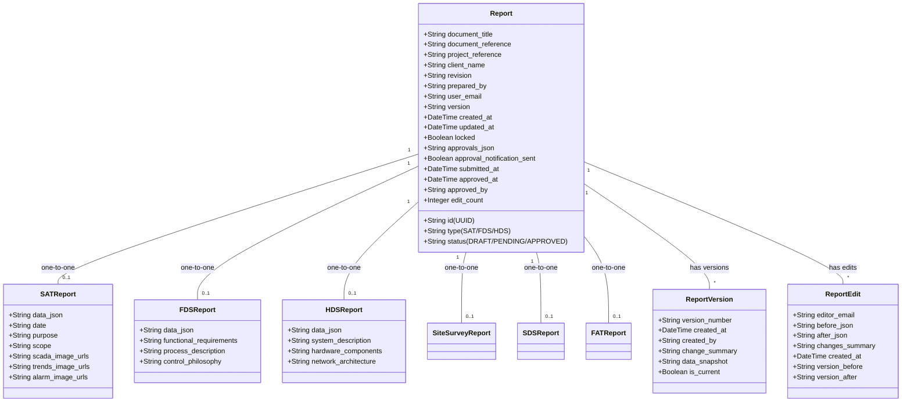
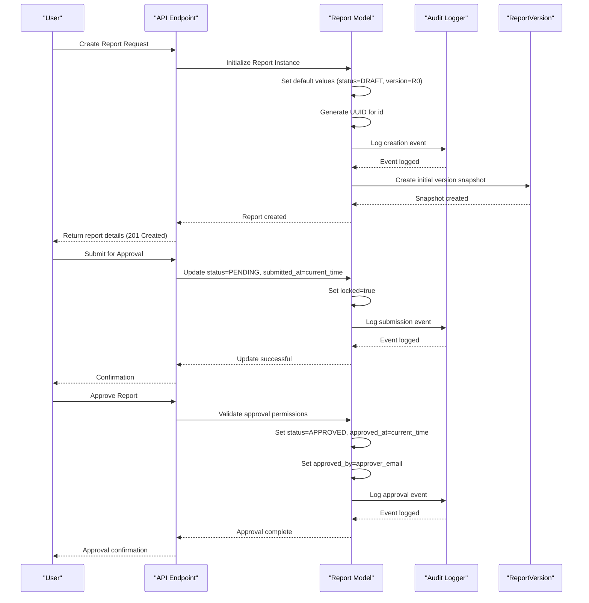
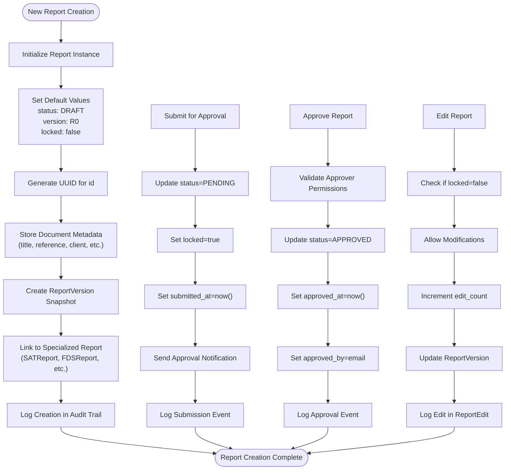

# Report Core

<cite>
**Referenced Files in This Document**   
- [models.py](file://models.py#L223-L249)
- [api/reports.py](file://api/reports.py#L52-L81)
- [routes/api.py](file://routes/api.py#L114-L155)
- [database/performance.py](file://database/performance.py#L211-L241)
- [security/audit.py](file://security/audit.py#L252-L285)
- [tests/factories.py](file://tests/factories.py#L80-L123)
- [routes/compare.py](file://routes/compare.py#L97-L134)
</cite>

## Table of Contents
1. [Introduction](#introduction)
2. [Core Components](#core-components)
3. [Architecture Overview](#architecture-overview)
4. [Detailed Component Analysis](#detailed-component-analysis)
5. [Performance Considerations](#performance-considerations)
6. [Troubleshooting Guide](#troubleshooting-guide)
7. [Conclusion](#conclusion)

## Introduction
The Report model serves as the central entity in the system's document management architecture, providing a polymorphic foundation for all report types including SAT, FDS, HDS, and others. This documentation details the model's structure, relationships, workflow management, and integration with auditing and versioning systems. The model uses UUID-based identifiers and a type field to distinguish between different report specializations while maintaining a unified interface for common operations.

## Core Components

The Report model acts as a base entity with one-to-one relationships to specialized report models. It manages document metadata, user tracking, versioning, and approval workflows through a comprehensive set of fields designed to support the entire document lifecycle from creation to finalization.

**Section sources**
- [models.py](file://models.py#L223-L249)

## Architecture Overview

**Diagram sources**
- [models.py](file://models.py#L223-L249)

## Detailed Component Analysis

### Report Model Analysis
The Report model serves as a polymorphic base entity using UUID-based id as primary key and type field to distinguish between SAT, FDS, HDS, and other report types. It manages the complete document lifecycle through status tracking (DRAFT, PENDING, APPROVED) and provides comprehensive metadata including title, reference, revision, and client information.

The model tracks user involvement through user_email (creator) and prepared_by fields, while maintaining versioning information via version and edit_count fields. Timestamps (created_at, updated_at) provide temporal context for all operations.

Approval workflow tracking is implemented through approvals_json (structured workflow data), approval_notification_sent (notification status), submitted_at (submission timestamp), approved_at (approval timestamp), and approved_by (approver identifier). The locked flag controls finalization, preventing further modifications when set.

Flexible data storage is achieved through JSON fields like approvals_json, allowing schema evolution without database migrations.

**Section sources**
- [models.py](file://models.py#L223-L249)

#### Report Creation and State Transition

**Diagram sources**
- [api/reports.py](file://api/reports.py#L210-L251)
- [security/audit.py](file://security/audit.py#L252-L285)

#### Data Flow and Relationships

**Diagram sources**
- [models.py](file://models.py#L223-L249)
- [routes/compare.py](file://routes/compare.py#L97-L134)

## Performance Considerations

The system implements several performance optimizations for efficient querying and data management. Indexing strategies include composite indexes on (type, status) and (user_email, status) fields to accelerate common filtering operations. The reports table also features an index on created_at for time-based queries.

The database performance module recommends and creates indexes for optimal query execution, including foreign key relationships and frequently accessed columns. These indexes ensure that report retrieval operations remain efficient even as the dataset grows.

Query optimization techniques are employed throughout the API endpoints, with pagination support and filtered queries that minimize data transfer and processing overhead.

**Section sources**
- [database/performance.py](file://database/performance.py#L211-L241)

## Troubleshooting Guide

When working with the Report model, ensure that UUID generation is properly implemented for new instances. Verify that status transitions follow the expected workflow (DRAFT → PENDING → APPROVED) and that the locked flag is appropriately managed during submission and approval processes.

For performance issues, check that recommended indexes have been created and are being utilized by the query planner. Monitor the frequency of ReportVersion creation to ensure version snapshots are being generated correctly during edits and approvals.

When debugging approval workflows, validate that approvals_json contains properly structured data and that approval_notification_sent accurately reflects notification status. Check that timestamps (submitted_at, approved_at) are being set correctly during workflow transitions.

**Section sources**
- [tests/factories.py](file://tests/factories.py#L80-L123)

## Conclusion

The Report model provides a robust foundation for document management in the system, supporting multiple report types through a polymorphic design. Its comprehensive field set enables complete tracking of document metadata, user interactions, version history, and approval workflows. The integration with audit logging and versioning systems ensures data integrity and traceability throughout the document lifecycle. By following the documented patterns for creation, state transitions, and querying, developers can effectively leverage this model to build reliable reporting functionality.