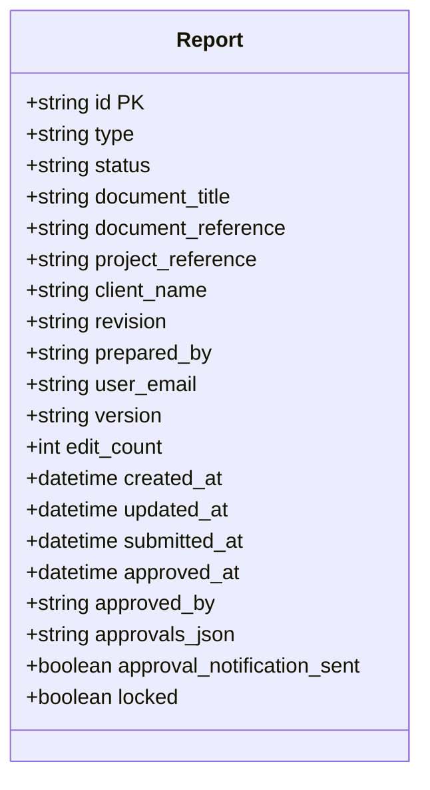
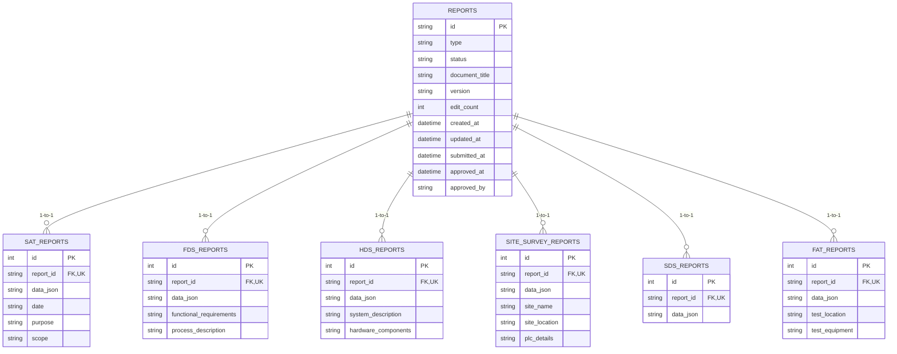
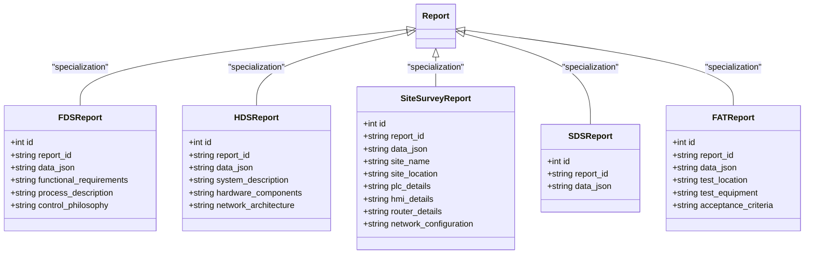
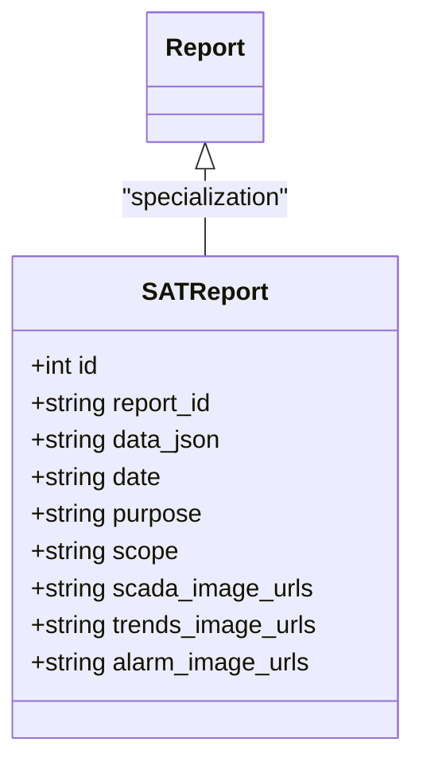
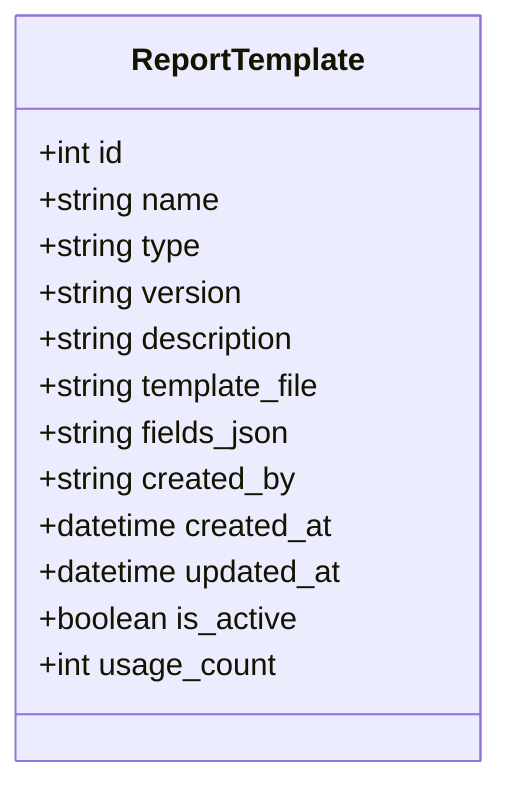
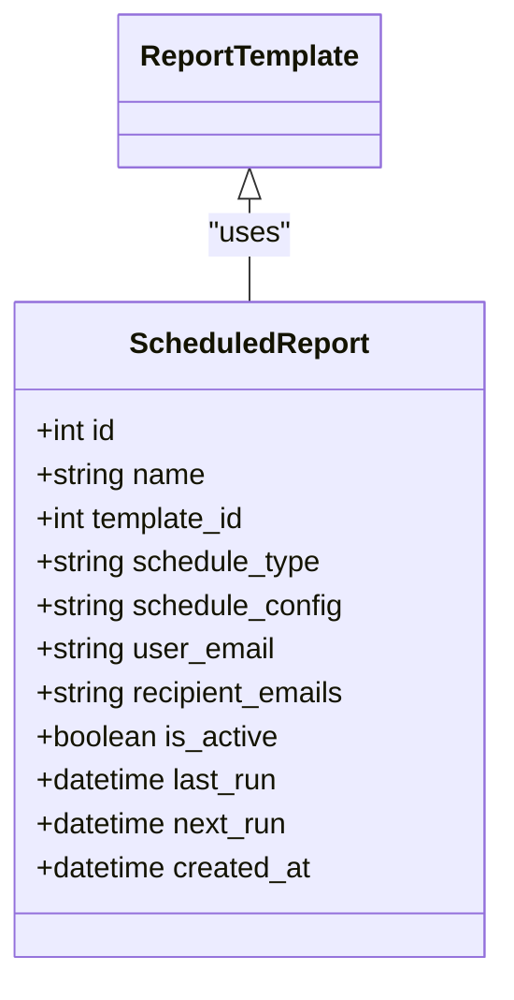

# Report Models

<cite>
**Referenced Files in This Document**   
- [models.py](file://models.py)
</cite>

## Table of Contents
1. [Introduction](#introduction)
2. [Core Report Model](#core-report-model)
3. [Polymorphic Design Pattern](#polymorphic-design-pattern)
4. [Specialized Report Types](#specialized-report-types)
5. [SATReport Model](#satreport-model)
6. [Image URL Storage Patterns](#image-url-storage-patterns)
7. [ReportTemplate Model](#reporttemplate-model)
8. [ScheduledReport Model](#scheduledreport-model)
9. [Performance Considerations](#performance-considerations)
10. [Example Workflows](#example-workflows)

## Introduction
This document provides comprehensive documentation for the core report models in the system, focusing on the polymorphic design pattern that enables flexible report type specialization. The architecture centers around a base Report entity with specialized child models for different report types including SATReport, FDSReport, HDSReport, SiteSurveyReport, SDSReport, and FATReport. The system supports document generation, versioning, approval workflows, and automated reporting through templates and scheduling.

**Section sources**
- [models.py](file://models.py#L103-L569)

## Core Report Model

The `Report` model serves as the central entity for all report types in the system, providing a consistent structure while enabling type-specific specialization through one-to-one relationships. The model uses a UUID-based primary key (`id`) to uniquely identify each report across the system.

### Core Fields
- **id**: String(36) - UUID primary key
- **type**: String(20) - Report type discriminator ('SAT', 'FDS', 'HDS', etc.)
- **status**: String(20) - Lifecycle state ('DRAFT', 'PENDING', 'APPROVED', etc.)
- **document metadata**: Fields for document_title, document_reference, project_reference, client_name, revision, and prepared_by
- **versioning**: version (string) and edit_count (integer) fields for tracking document iterations
- **timestamps**: created_at, updated_at, submitted_at, approved_at
- **approval tracking**: approvals_json (JSON text), approval_notification_sent (boolean), approved_by (string)

### Approval and Edit Tracking
The model includes comprehensive fields for tracking the approval workflow and edit history:
- **submitted_at**: Timestamp when the report is submitted for approval
- **approved_at**: Timestamp when the report is finally approved
- **approved_by**: Email of the approving user
- **edit_count**: Number of edits made to the report
- **approvals_json**: JSON string storing the complete approval workflow data



**Diagram sources**
- [models.py](file://models.py#L103-L120)

**Section sources**
- [models.py](file://models.py#L103-L120)

## Polymorphic Design Pattern

The system implements a polymorphic design pattern using a base `Report` table with one-to-one relationships to specialized report type tables. This approach combines the benefits of single table inheritance with the flexibility of separate tables for type-specific data.

### Implementation Details
The pattern uses a UUID-based `report_id` as a foreign key that serves as both the primary key and foreign key in the specialized report tables. This creates a strict one-to-one relationship where each specialized report record is uniquely tied to exactly one base Report.



**Diagram sources**
- [models.py](file://models.py#L103-L197)

**Section sources**
- [models.py](file://models.py#L103-L197)

## Specialized Report Types

The system supports multiple specialized report types, each with its own table and specific fields while sharing the common base Report structure.

### FDSReport
The Functional Design Specification report captures high-level system requirements:
- **functional_requirements**: Text field for functional requirements
- **process_description**: Text field for process description
- **control_philosophy**: Text field for control philosophy

### HDSReport
The Hardware Design Specification report documents system hardware:
- **system_description**: Text field for overall system description
- **hardware_components**: Text field (JSON array) for hardware components
- **network_architecture**: Text field for network architecture details

### SiteSurveyReport
The Site Survey report captures field survey data for SCADA migration projects:
- **site information**: site_name, site_location, site_access_details
- **personnel**: area_engineer, site_caretaker, survey_completed_by
- **hardware details**: plc_details, hmi_details, router_details (all JSON)
- **communications**: network_configuration, mobile_signal_strength (JSON)
- **pre-departure checklist**: verification_checklist (JSON)

### SDSReport
The Software Design Specification report focuses on software architecture:
- **data_json**: Text field storing the complete form payload

### FATReport
The Factory Acceptance Test report documents factory testing:
- **test_location**: String field for test location
- **test_equipment**: Text field (JSON array) for test equipment
- **acceptance_criteria**: Text field for acceptance criteria



**Diagram sources**
- [models.py](file://models.py#L124-L197)

**Section sources**
- [models.py](file://models.py#L124-L197)

## SATReport Model

The SATReport model represents Site Acceptance Test reports and contains both comprehensive data storage and optimized query fields.

### Data Storage
- **data_json**: Text field storing the complete SAT form payload as JSON. This contains all form data submitted by users.
- **report_id**: String(36) foreign key referencing the base Report's id, with unique constraint ensuring one-to-one relationship.

### Summary Fields
To enable efficient querying without parsing JSON, the model includes denormalized summary fields:
- **date**: String(20) - Test date for quick filtering
- **purpose**: Text - Test purpose description
- **scope**: Text - Test scope description

These fields are populated from the data_json during creation or update, allowing for fast searches and filtering without JSON parsing.



**Diagram sources**
- [models.py](file://models.py#L103-L123)

**Section sources**
- [models.py](file://models.py#L103-L123)

## Image URL Storage Patterns

The system uses a consistent pattern for storing image URLs across different report types, primarily implemented in the SATReport model.

### JSON Array Storage
Image URLs are stored in dedicated text fields that contain JSON arrays:
- **scada_image_urls**: JSON array of SCADA screenshot URLs
- **trends_image_urls**: JSON array of trends chart URLs
- **alarm_image_urls**: JSON array of alarm list screenshots

This approach provides flexibility in the number of images while maintaining structured access. Each field stores a JSON-formatted string containing an array of URL strings.

### Access Pattern
When retrieving image URLs, the application must:
1. Query the specialized report table (e.g., sat_reports)
2. Extract the JSON string from the appropriate field
3. Parse the JSON string into an array
4. Use the array of URLs in the application

The use of separate fields for different image types enables targeted queries and reduces parsing overhead when only specific image types are needed.

**Section sources**
- [models.py](file://models.py#L115-L120)

## ReportTemplate Model

The ReportTemplate model manages DOCX templates used for generating formatted reports.

### Core Fields
- **name**: String(100) - Template name
- **type**: String(20) - Report type ('SAT', 'FDS', 'HDS', 'FAT', etc.)
- **version**: String(10) - Template version (default '1.0')
- **description**: Text - Template description
- **template_file**: String(200) - Path to the DOCX template file
- **fields_json**: Text - JSON array defining required fields in the template
- **created_by**: String(120) - Email of template creator
- **usage_count**: Integer - Number of times template has been used
- **is_active**: Boolean - Whether template is available for use

### Versioning and Usage Tracking
The model includes comprehensive versioning with the version field and usage tracking through usage_count. This enables template management, including deprecation of old templates and analysis of template popularity.



**Diagram sources**
- [models.py](file://models.py#L198-L216)

**Section sources**
- [models.py](file://models.py#L198-L216)

## ScheduledReport Model

The ScheduledReport model enables automated report generation at regular intervals.

### Scheduling Configuration
- **name**: String(100) - Schedule name
- **template_id**: Integer - Foreign key to ReportTemplate
- **schedule_type**: String(20) - Frequency ('daily', 'weekly', 'monthly')
- **schedule_config**: Text - JSON configuration with cron-like scheduling details
- **user_email**: String(120) - Creator's email
- **recipient_emails**: Text - JSON array of recipient email addresses
- **next_run**: DateTime - When the schedule will next execute

### Automation Workflow
The model supports automated report generation by:
1. Referencing a specific template (template_id)
2. Defining the schedule (schedule_type and schedule_config)
3. Specifying recipients (recipient_emails)
4. Tracking execution (last_run, next_run)

This enables recurring reports to be generated automatically using the specified template and delivered to the designated recipients.



**Diagram sources**
- [models.py](file://models.py#L569-L587)

**Section sources**
- [models.py](file://models.py#L569-L587)

## Performance Considerations

The report model architecture includes several performance optimizations to ensure efficient querying and data management.

### Indexing Strategy
While explicit indexes are not defined in the model code, optimal performance requires strategic indexing on:
- **status field**: For filtering reports by lifecycle state (DRAFT, PENDING, APPROVED)
- **type field**: For filtering by report type
- **created_at/updated_at**: For date-based queries and sorting
- **user_email**: For user-specific report queries
- **approved_at**: For approval timeline analysis

### JSON Field Querying
The extensive use of JSON fields (approvals_json, data_json, various URL arrays) requires careful querying strategies:
- Use database-specific JSON functions to query within JSON fields
- Consider partial indexing on frequently queried JSON paths
- For high-frequency queries, leverage the denormalized summary fields (date, purpose, scope in SATReport) instead of parsing JSON

### Query Optimization
The polymorphic design allows for:
- **Efficient type-specific queries**: Query the specialized table directly when type is known
- **Unified reporting**: Query the base Report table for cross-type operations
- **Reduced JSON parsing**: Use summary fields for filtering before retrieving full JSON data

**Section sources**
- [models.py](file://models.py#L103-L587)

## Example Workflows

### Report Creation
1. Create a base Report record with type='SAT' and status='DRAFT'
2. Create a corresponding SATReport record with the same report_id
3. Populate data_json with the complete form payload
4. Set summary fields (date, purpose, scope) from the form data
5. Store image URLs in the appropriate JSON array fields

### Type Specialization
```python
# Create base report
report = Report(
    id=str(uuid.uuid4()),
    type='SAT',
    status='DRAFT',
    user_email='engineer@company.com',
    document_title='Site Acceptance Test'
)

# Create specialized SAT report
sat_report = SATReport(
    report_id=report.id,
    data_json=json.dumps(form_data),
    date=form_data.get('date'),
    purpose=form_data.get('purpose'),
    scope=form_data.get('scope')
)

db.session.add(report)
db.session.add(sat_report)
db.session.commit()
```

### Template Usage
1. Select a ReportTemplate by type and version
2. Use the template_file path to load the DOCX template
3. Parse fields_json to identify required data fields
4. Populate the template with data from the report's data_json
5. Generate the final document and update usage_count on the template

**Section sources**
- [models.py](file://models.py#L103-L587)