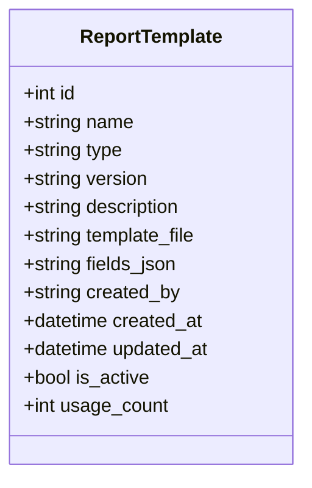
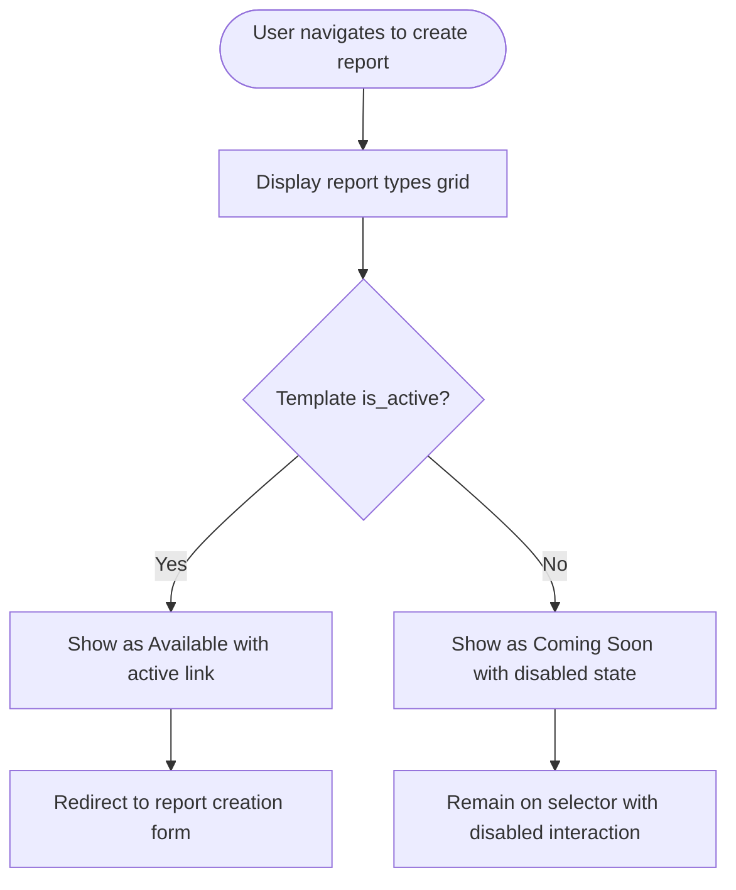
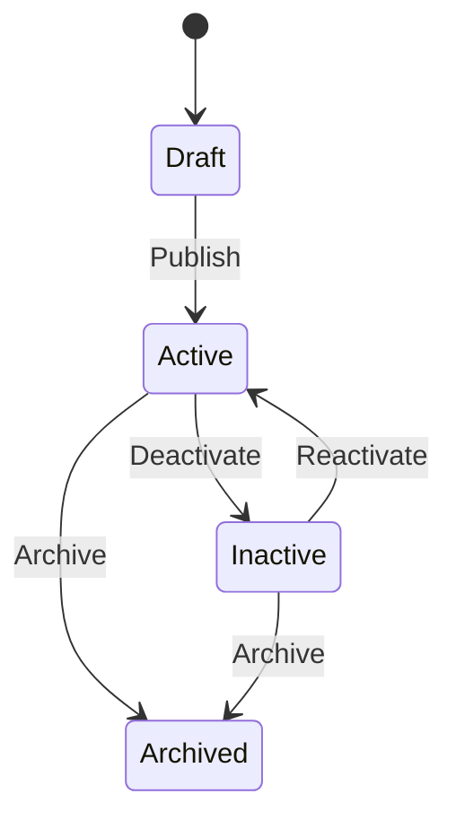
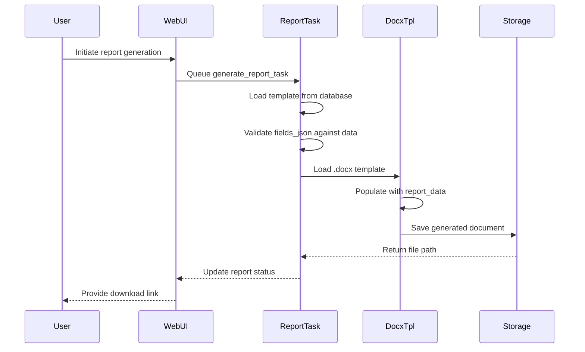
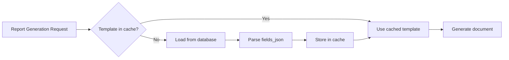

# Report Templates

<cite>
**Referenced Files in This Document**   
- [models.py](file://models.py#L250-L300)
- [report_tasks.py](file://tasks/report_tasks.py#L10-L450)
- [report_selector.html](file://templates/report_selector.html#L1-L635)
- [routes/templates.py](file://routes/templates.py)
</cite>

## Table of Contents
1. [Introduction](#introduction)
2. [ReportTemplate Model Structure](#reporttemplate-model-structure)
3. [Template Selection Interface](#template-selection-interface)
4. [Template Versioning and Lifecycle Management](#template-versioning-and-lifecycle-management)
5. [Template Creation and Field Mapping](#template-creation-and-field-mapping)
6. [Document Generation Process](#document-generation-process)
7. [Security and Access Control](#security-and-access-control)
8. [Troubleshooting Template Issues](#troubleshooting-template-issues)
9. [Performance and Caching](#performance-and-caching)
10. [Conclusion](#conclusion)

## Introduction
The ReportTemplate model serves as the foundation for automated DOCX report generation within the system. It enables standardized, reusable templates for various report types including SAT, FDS, HDS, and FAT. This documentation details the model's structure, usage workflow, integration with document generation processes, and operational considerations for template management.

## ReportTemplate Model Structure

The ReportTemplate model defines the schema for managing DOCX templates used in automated report generation. Each template contains metadata and configuration that governs its usage, versioning, and data requirements.

### Core Fields
- **name**: Descriptive name of the template (e.g., "SAT Report v2")
- **type**: Report category (SAT, FDS, HDS, FAT, etc.) that determines which reports can use this template
- **version**: Semantic version string (e.g., "1.0", "2.1") for tracking template iterations
- **description**: Human-readable explanation of the template's purpose and contents
- **template_file**: Filesystem path to the .docx template document
- **fields_json**: JSON array defining required data fields and their structure
- **created_by**: Email of the user who created the template
- **usage_count**: Counter tracking how many times the template has been used
- **is_active**: Boolean flag indicating whether the template is available for selection



**Diagram sources**
- [models.py](file://models.py#L250-L300)

**Section sources**
- [models.py](file://models.py#L250-L300)

## Template Selection Interface

Templates are selected through the `report_selector.html` interface, which presents users with available report types and their corresponding templates. The interface displays template availability status and guides users to the appropriate report creation workflow.

### Selection Workflow
1. User navigates to the report creation page
2. Interface displays available report types with visual indicators
3. Active templates show "Available" status with pulsing indicator
4. Inactive or coming-soon templates are disabled with "Coming Soon" badge
5. Clicking an available template redirects to the specific report creation form



**Diagram sources**
- [report_selector.html](file://templates/report_selector.html#L1-L635)

**Section sources**
- [report_selector.html](file://templates/report_selector.html#L1-L635)

## Template Versioning and Lifecycle Management

The system implements a comprehensive versioning system that allows for controlled template evolution while maintaining backward compatibility.

### Versioning System
- Semantic versioning (major.minor) is used for template identification
- Each version is stored as a separate record in the database
- Version increments occur when template structure or field requirements change
- Previous versions remain accessible but can be deactivated

### Activation/Deactivation Workflow
1. Administrators access the template management interface
2. View list of all templates with current version and status
3. Select template for modification
4. Upload new .docx file and update field mappings
5. Increment version number
6. Set is_active flag to publish the template
7. Previous versions can be archived or kept as fallback options



**Section sources**
- [models.py](file://models.py#L250-L300)
- [routes/templates.py](file://routes/templates.py)

## Template Creation and Field Mapping

Creating a new template involves defining the DOCX document structure and mapping its content to data fields required for dynamic population.

### Template Creation Process
1. Prepare .docx template with proper field placeholders
2. Define fields_json structure matching document placeholders
3. Upload template file to designated storage location
4. Create ReportTemplate record with all metadata
5. Validate template against required fields
6. Activate template for use

### Field Mapping Example
For a SAT report template, the fields_json might include:
```json
[
  {"name": "document_title", "type": "string", "required": true},
  {"name": "client_name", "type": "string", "required": true},
  {"name": "project_reference", "type": "string", "required": true},
  {"name": "test_results", "type": "array", "required": false}
]
```

**Section sources**
- [models.py](file://models.py#L250-L300)
- [routes/templates.py](file://routes/templates.py)

## Document Generation Process

The document generation process uses the docxtpl library to populate templates with dynamic data and generate final reports.

### Generation Workflow


The `generate_report_task` in report_tasks.py handles asynchronous document generation, using the selected template to produce PDF or DOCX outputs based on user requirements.

**Diagram sources**
- [report_tasks.py](file://tasks/report_tasks.py#L10-L450)
- [models.py](file://models.py#L250-L300)

**Section sources**
- [report_tasks.py](file://tasks/report_tasks.py#L10-L450)

## Security and Access Control

Template security is maintained through file storage controls and access restrictions.

### Security Measures
- Template files stored in protected directory with restricted access
- File paths validated to prevent directory traversal attacks
- Only authenticated users with appropriate roles can create or modify templates
- Template activation requires administrative privileges
- Input validation on all template-related operations

### Access Control
- **Administrators**: Full CRUD access to templates
- **Automation Managers**: Read access and activation/deactivation rights
- **Engineers**: Read-only access to active templates
- **PMs**: Read-only access to active templates

**Section sources**
- [models.py](file://models.py#L250-L300)
- [routes/templates.py](file://routes/templates.py)

## Troubleshooting Template Issues

Common template-related issues and their resolution strategies.

### Template Rendering Failures
- **Cause**: Invalid DOCX structure or corrupted template file
- **Solution**: Re-upload template and verify integrity

### Missing Fields
- **Cause**: Data payload missing fields defined in fields_json
- **Solution**: Validate data against template requirements before generation

### Version Conflicts
- **Cause**: Multiple active versions of same template type
- **Solution**: Ensure only one active version per report type

### Debugging Steps
1. Verify template_file path exists and is accessible
2. Validate fields_json structure is proper JSON
3. Check is_active status of template
4. Review usage_count for unexpected values
5. Examine error logs in report generation tasks

**Section sources**
- [models.py](file://models.py#L250-L300)
- [report_tasks.py](file://tasks/report_tasks.py#L10-L450)

## Performance and Caching

Template performance considerations focus on generation speed and resource utilization.

### Performance Implications
- DOCX template compilation is resource-intensive
- Large templates with complex formatting increase processing time
- High-frequency generation requests can create bottlenecks

### Caching Strategies
- Frequently used templates are cached in memory
- Template file handles are kept open for active templates
- Field validation results are cached to avoid repeated parsing
- Generated documents are stored for reuse when appropriate



**Diagram sources**
- [report_tasks.py](file://tasks/report_tasks.py#L10-L450)

**Section sources**
- [report_tasks.py](file://tasks/report_tasks.py#L10-L450)

## Conclusion
The ReportTemplate model provides a robust framework for managing DOCX templates in automated report generation. Its comprehensive field structure, versioning system, and integration with the document generation pipeline enable efficient, standardized reporting across multiple report types. Proper template management, security controls, and performance optimization ensure reliable operation in production environments.