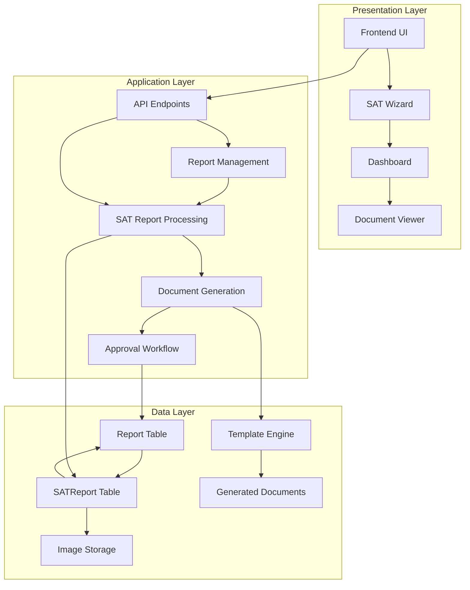
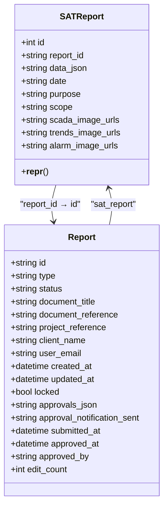
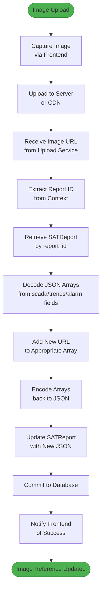
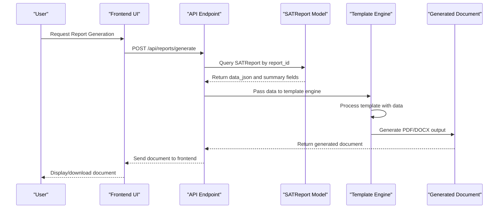

# SAT Report

<cite>
**Referenced Files in This Document**   
- [models.py](file://models.py#L103-L121)
- [routes/dashboard.py](file://routes/dashboard.py#L606-L630)
- [routes/edit.py](file://routes/edit.py#L134-L158)
- [tests/unit/test_models.py](file://tests/unit/test_models.py#L157-L196)
- [tests/integration/test_file_workflows.py](file://tests/integration/test_file_workflows.py#L491-L523)
- [README.md](file://README.md#L282-L336)
- [docs/performance_optimization.md](file://docs/performance_optimization.md#L0-L403)
</cite>

## Table of Contents
1. [Introduction](#introduction)
2. [Core Components](#core-components)
3. [Architecture Overview](#architecture-overview)
4. [Detailed Component Analysis](#detailed-component-analysis)
5. [Dependency Analysis](#dependency-analysis)
6. [Performance Considerations](#performance-considerations)
7. [Troubleshooting Guide](#troubleshooting-guide)
8. [Conclusion](#conclusion)

## Introduction
The SATReport model is a specialized entity designed to extend the core Report entity with Site Acceptance Test-specific data. It implements a one-to-one relationship with the parent Report through the report_id foreign key, enabling efficient data organization and retrieval. The model utilizes a flexible data architecture that combines structured fields for quick querying with a data_json field that stores the complete form payload as serialized JSON. This hybrid approach supports both high-performance queries on summary fields and comprehensive data storage for complex SAT forms. The model also implements specialized mechanisms for storing image URLs and integrates with document generation and approval workflows.

## Core Components

The SATReport model consists of several key components that work together to provide a robust solution for Site Acceptance Test documentation. The model extends the core Report entity through a one-to-one relationship established by the report_id foreign key that references the primary key of the Report table. This relationship is configured with cascade delete-orphan behavior, ensuring data integrity when parent reports are removed. The data_json field stores the complete form payload as serialized JSON, preserving all form data including nested structures and dynamic fields. Summary fields such as date, purpose, and scope are extracted from the JSON payload to enable efficient querying without requiring JSON parsing. The model also implements specialized fields for storing image URLs in JSON array format, supporting SCADA, trends, and alarm images captured during site acceptance testing.

**Section sources**
- [models.py](file://models.py#L103-L121)

## Architecture Overview

The SATReport model is integrated into a comprehensive architecture that supports the complete Site Acceptance Test workflow, from data collection to document generation and approval. The architecture follows a layered approach with clear separation of concerns between data storage, business logic, and presentation layers.



**Diagram sources**
- [models.py](file://models.py#L88-L109)
- [models.py](file://models.py#L103-L121)

## Detailed Component Analysis

### SATReport Model Analysis

The SATReport model is designed to efficiently store and manage Site Acceptance Test data while maintaining integration with the core reporting system. The model implements a hybrid data storage approach that balances query performance with data flexibility.

#### Class Structure


**Diagram sources**
- [models.py](file://models.py#L103-L121)

### Data Storage and Retrieval

The SATReport model implements a sophisticated data storage strategy that combines structured fields with JSON serialization. The data_json field stores the complete SAT form payload as serialized JSON, preserving all form data including nested structures, dynamic fields, and user inputs. This approach provides maximum flexibility for form design while maintaining data integrity. The model also extracts key summary fields (date, purpose, scope) into dedicated database columns to enable efficient querying without requiring JSON parsing. This hybrid approach optimizes both storage flexibility and query performance.

When retrieving SAT report data, the system first queries the structured fields for quick access to summary information. For detailed analysis or document generation, the system parses the data_json field to access the complete form payload. The model supports partial JSON querying through application-level logic, allowing extraction of specific data elements without loading the entire JSON structure into memory.

**Section sources**
- [models.py](file://models.py#L103-L121)
- [routes/dashboard.py](file://routes/dashboard.py#L606-L630)

### Image URL Storage Mechanism

The SATReport model implements a specialized mechanism for storing image URLs using JSON arrays. Three dedicated fields—scada_image_urls, trends_image_urls, and alarm_image_urls—store URLs as serialized JSON arrays, enabling efficient storage and retrieval of multiple image references for each category.



**Diagram sources**
- [models.py](file://models.py#L114-L120)
- [tests/integration/test_file_workflows.py](file://tests/integration/test_file_workflows.py#L491-L523)

The encoding and decoding pattern follows a consistent process: when updating image references, the application retrieves the existing JSON array, decodes it into a Python list, adds the new URL, encodes the list back to JSON, and updates the database field. This pattern ensures data consistency and prevents corruption of the JSON structure. The frontend integration provides a seamless experience for users, automatically handling the upload process and updating the report with new image references.

### Document Generation Integration

The SATReport model integrates with document generation workflows through template engines that extract data from the data_json field. The generation process follows a structured sequence that transforms the stored SAT data into professional reports.



**Diagram sources**
- [models.py](file://models.py#L103-L121)
- [test_report_demo.py](file://test_report_demo.py#L138-L174)

The template engine extracts key information from the data_json field using predefined paths and mappings. Summary fields are used for quick access to commonly needed data, reducing processing time. The generated documents include all relevant SAT data, formatted according to organizational standards, and can be automatically populated with images referenced in the image URL fields.

## Dependency Analysis

The SATReport model has several critical dependencies that enable its full functionality within the reporting system. These dependencies form a cohesive ecosystem that supports data management, user interaction, and system integration.

```mermaid
graph TD
SATReport --> Report : "One-to-one relationship<br/>via report_id FK"
SATReport --> JSON : "Stores complete form<br/>payload in data_json"
SATReport --> ImageStorage : "References images via<br/>URL arrays"
SATReport --> TemplateEngine : "Provides data for<br/>document generation"
SATReport --> ApprovalWorkflow : "Integrates with<br/>approval processes"
SATReport --> Cache : "Supports caching<br/>of frequently accessed reports"
Report --> User : "Created by user_email"
Report --> ApprovalWorkflow : "Tracks approval status"
TemplateEngine --> DocumentStorage : "Saves generated documents"
ApprovalWorkflow --> Notification : "Sends status updates"
style SATReport fill:#2196F3,stroke:#1976D2
style Report fill:#2196F3,stroke:#1976D2
style JSON fill:#4CAF50,stroke:#388E3C
style ImageStorage fill:#4CAF50,stroke:#388E3C
style TemplateEngine fill:#4CAF50,stroke:#388E3C
style ApprovalWorkflow fill:#4CAF50,stroke:#388E3C
style Cache fill:#4CAF50,stroke:#388E3C
style User fill:#4CAF50,stroke:#388E3C
style DocumentStorage fill:#4CAF50,stroke:#388E3C
style Notification fill:#4CAF50,stroke:#388E3C
```

**Diagram sources**
- [models.py](file://models.py#L88-L109)
- [models.py](file://models.py#L103-L121)

The primary dependency is the one-to-one relationship with the Report entity, which serves as the parent container for all report types. This relationship enables shared functionality such as user tracking, status management, and approval workflows. The SATReport model also depends on JSON serialization for storing complex form data, image storage systems for managing visual documentation, template engines for document generation, and caching mechanisms for performance optimization.

## Performance Considerations

The SATReport model implements several performance optimization strategies to ensure efficient operation, particularly when handling large datasets or high-frequency access patterns. These strategies address query performance, data retrieval, and system scalability.

### Partial JSON Querying Strategies
The model supports partial JSON querying through application-level logic that extracts specific data elements without loading the entire JSON structure. This approach minimizes memory usage and processing time when only specific fields are needed. The system can parse the data_json field and extract targeted information using JSON path expressions, avoiding the need to deserialize the entire payload.

### Indexing Recommendations
To optimize query performance, the following indexing strategy is recommended:
- Primary key index on id field
- Unique index on report_id field (enforced by unique constraint)
- Index on date field for date-range queries
- Composite index on (report_id, date) for common query patterns

### Caching Approaches
The system implements a multi-layer caching strategy for frequently accessed reports:
- **Redis-based caching**: Stores frequently accessed SATReport objects in Redis with configurable TTL
- **Query result caching**: Caches the results of common queries to reduce database load
- **Document caching**: Caches generated documents to avoid repeated generation
- **CDN integration**: Serves static assets and generated documents through a Content Delivery Network

These caching mechanisms significantly improve response times for frequently accessed reports and reduce database load during peak usage periods.

**Section sources**
- [docs/performance_optimization.md](file://docs/performance_optimization.md#L0-L403)
- [models.py](file://models.py#L103-L121)

## Troubleshooting Guide

This section addresses common issues encountered when working with the SATReport model and provides guidance for resolution.

### Malformed JSON Handling
When malformed JSON is encountered in the data_json field, the system logs a warning and continues processing. To resolve this issue:
1. Verify the JSON structure using a validator
2. Check for unescaped characters or improper encoding
3. Ensure proper serialization before storage
4. Implement input validation in the frontend

Example error handling pattern:
```python
try:
    stored_data = json.loads(sat_report.data_json)
    context_data = stored_data.get('context', {})
except (json.JSONDecodeError, KeyError, TypeError) as e:
    current_app.logger.warning(f"Could not decode SATReport data: {e}")
```

### Missing Images
When images are missing from the report, verify the following:
1. Check that image URLs are properly encoded in the JSON arrays
2. Verify that the image files exist at the specified locations
3. Ensure proper permissions for image access
4. Confirm that the CDN or server is properly configured

### Data Consistency Issues
To maintain data consistency between the parent Report and SATReport:
1. Always update both entities within the same transaction
2. Use the report_id field to maintain the one-to-one relationship
3. Implement proper cascade operations for deletions
4. Validate data synchronization during updates

The system includes built-in concurrency control to prevent data conflicts when multiple users edit the same report simultaneously.

**Section sources**
- [routes/dashboard.py](file://routes/dashboard.py#L606-L630)
- [routes/edit.py](file://routes/edit.py#L134-L158)
- [tests/unit/test_models.py](file://tests/unit/test_models.py#L157-L196)

## Conclusion
The SATReport model provides a comprehensive solution for managing Site Acceptance Test documentation within the reporting system. By extending the core Report entity with specialized fields and JSON storage, it balances data flexibility with query performance. The one-to-one relationship with the parent Report ensures data integrity and enables shared functionality across report types. The model's integration with document generation, approval workflows, and caching systems creates a robust ecosystem for efficient report management. With proper implementation of performance optimizations and troubleshooting practices, the SATReport model can effectively support the organization's site acceptance testing requirements.