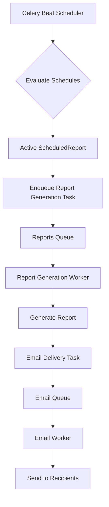
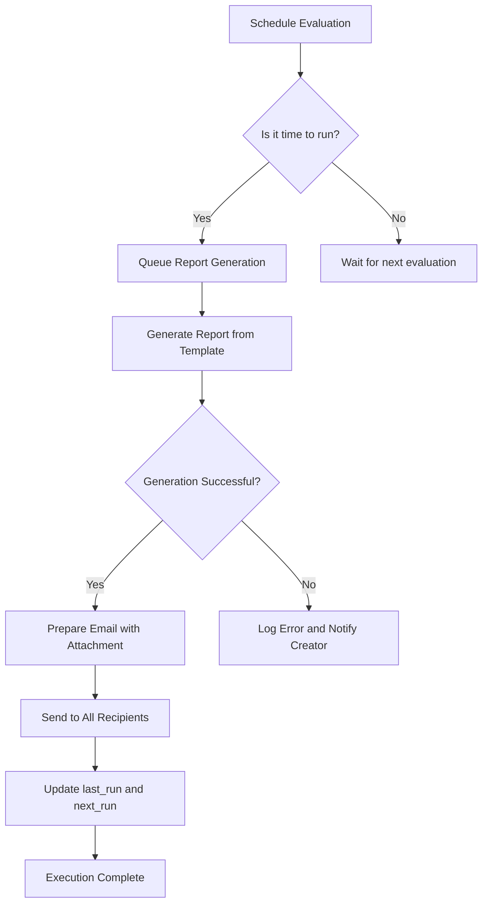
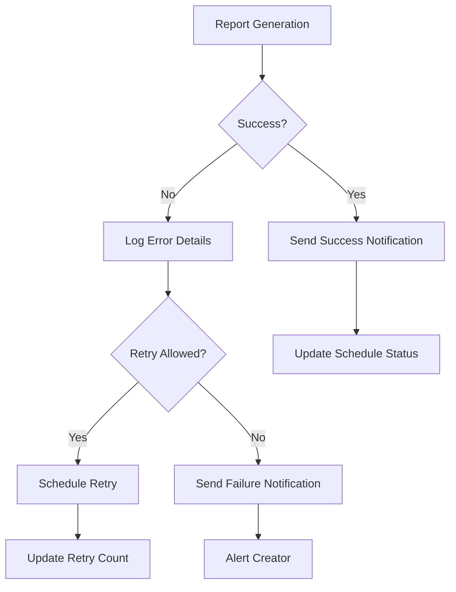

# Scheduled Reports

<cite>
**Referenced Files in This Document**   
- [models.py](file://models.py#L335-L352)
- [tasks/report_tasks.py](file://tasks/report_tasks.py)
- [tasks/celery_app.py](file://tasks/celery_app.py)
</cite>

## Table of Contents
1. [Introduction](#introduction)
2. [ScheduledReport Model](#scheduledreport-model)
3. [Scheduling System Integration](#scheduling-system-integration)
4. [Report Execution Workflow](#report-execution-workflow)
5. [Usage Examples](#usage-examples)
6. [Error Handling and Notifications](#error-handling-and-notifications)
7. [Configuration and Infrastructure](#configuration-and-infrastructure)
8. [Limitations and Best Practices](#limitations-and-best-practices)

## Introduction
The ScheduledReport system enables automated, recurring report generation to meet periodic reporting requirements without manual intervention. This documentation details the model structure, scheduling integration, execution workflow, and operational considerations for managing scheduled reports within the application.

## ScheduledReport Model
The `ScheduledReport` model represents automated report generation tasks with configurable schedules and delivery options.

### Field Definitions
- **name**: Descriptive name for the scheduled report (e.g., "Daily Executive Summary")
- **template_id**: Foreign key reference to `ReportTemplate` that defines the report structure and content
- **schedule_type**: Frequency type (daily, weekly, monthly) determining the recurrence pattern
- **schedule_config**: JSON-formatted cron-like configuration specifying exact execution times and recurrence rules
- **user_email**: Creator/owner of the scheduled report for accountability and notifications
- **recipient_emails**: JSON array containing all delivery targets for the generated report
- **is_active**: Boolean flag indicating whether the schedule is currently active or paused
- **last_run**: Timestamp of the most recent execution (null if never executed)
- **next_run**: Timestamp of the upcoming scheduled execution
- **created_at**: Creation timestamp when the schedule was first configured

**Section sources**
- [models.py](file://models.py#L335-L352)

## Scheduling System Integration
The scheduling system integrates with Celery Beat for reliable task orchestration and execution management.

### Celery Beat Configuration
The system uses Celery's periodic task scheduler to evaluate and trigger scheduled reports. The integration includes:
- Dynamic schedule evaluation based on `schedule_config` values
- Proper queue routing to prevent resource contention
- Configurable retry policies for failed executions
- Task monitoring and logging infrastructure

### Task Routing and Queues
Scheduled reports are processed through dedicated worker queues to ensure isolation from other background tasks:
- Reports are routed to the "reports" queue
- Email delivery tasks are handled by the "email" queue
- Maintenance tasks operate on separate queues

**Diagram sources**
- [tasks/celery_app.py](file://tasks/celery_app.py#L20-L45)
- [models.py](file://models.py#L335-L352)

**Section sources**
- [tasks/celery_app.py](file://tasks/celery_app.py#L20-L45)

## Report Execution Workflow
The workflow from schedule evaluation to document generation and delivery follows a structured process.

### Execution Sequence
1. Celery Beat evaluates all active schedules
2. When `next_run` time is reached, a report generation task is queued
3. The worker loads the specified `ReportTemplate`
4. Report content is generated according to the template
5. Generated document is attached to email
6. Email is sent to all `recipient_emails`
7. Schedule timestamps are updated (`last_run`, `next_run`)

### Status Management
The system maintains accurate execution state through timestamp updates and status tracking. Each successful execution updates the `last_run` field and calculates the subsequent `next_run` based on the schedule configuration.

**Diagram sources**
- [tasks/report_tasks.py](file://tasks/report_tasks.py#L10-L45)
- [models.py](file://models.py#L335-L352)

**Section sources**
- [tasks/report_tasks.py](file://tasks/report_tasks.py#L10-L45)

## Usage Examples
Practical examples demonstrate common use cases for scheduled reports.

### Daily Executive Summary
Creating a daily executive summary delivered to leadership:
- **name**: "Daily Operations Summary"
- **template_id**: Reference to executive summary template
- **schedule_type**: "daily"
- **schedule_config**: {"hour": 8, "minute": 0} (executes at 8:00 AM daily)
- **user_email**: creator@company.com
- **recipient_emails**: ["ceo@company.com", "cfo@company.com", "coo@company.com"]
- **is_active**: true

### Weekly Compliance Report
Setting up a weekly compliance report for regulatory requirements:
- **name**: "Weekly Safety Compliance Report"
- **template_id**: Reference to compliance template
- **schedule_type**: "weekly"
- **schedule_config**: {"day_of_week": 6, "hour": 9, "minute": 30} (executes Sundays at 9:30 AM)
- **user_email**: compliance@company.com
- **recipient_emails**: ["compliance@company.com", "legal@company.com", "safety@company.com"]
- **is_active**: true

**Section sources**
- [models.py](file://models.py#L335-L352)

## Error Handling and Notifications
The system implements comprehensive error handling for failed executions and delivery status notifications.

### Failure Recovery
When report generation fails, the system:
- Logs detailed error information
- Applies retry policies based on error type
- Updates the report status to reflect failure
- Notifies the schedule creator via email
- Preserves the schedule for future attempts

### Notification System
Status notifications inform stakeholders about:
- Successful report generation and delivery
- Failed execution attempts
- Schedule modifications
- System maintenance affecting scheduled reports

The notification system uses asynchronous email tasks to ensure reliability without blocking report generation.

**Diagram sources**
- [tasks/report_tasks.py](file://tasks/report_tasks.py#L85-L105)
- [tasks/celery_app.py](file://tasks/celery_app.py#L150-L180)

**Section sources**
- [tasks/report_tasks.py](file://tasks/report_tasks.py#L85-L105)

## Configuration and Infrastructure
Proper configuration ensures reliable scheduling infrastructure and task health monitoring.

### Required Configuration
Key configuration settings include:
- Celery broker URL (typically Redis)
- Result backend configuration
- Report output directory
- Email server settings
- Task queue definitions
- Retry policies and timeouts

### Monitoring Recommendations
To maintain schedule health:
- Monitor Celery worker availability
- Track task processing times
- Set up alerts for failed executions
- Regularly review schedule logs
- Implement heartbeat monitoring for the scheduler

**Section sources**
- [tasks/celery_app.py](file://tasks/celery_app.py#L20-L80)

## Limitations and Best Practices
Understanding limitations and following best practices ensures effective management of scheduled reports.

### Known Limitations
- Maximum of 100 recipients per scheduled report
- Schedule precision limited to one-minute intervals
- No support for complex recurrence patterns beyond daily, weekly, monthly
- Template modifications require recreation of schedules
- Resource constraints may affect concurrent report generation

### Best Practices
- Distribute heavy reports across different times to avoid resource spikes
- Use descriptive names for easy identification
- Regularly review and clean up inactive schedules
- Test new schedules with small recipient lists first
- Monitor system resources when scaling to large volumes
- Implement backup mechanisms for critical reports
- Document schedule purposes and ownership

**Section sources**
- [models.py](file://models.py#L335-L352)
- [tasks/report_tasks.py](file://tasks/report_tasks.py)
- [tasks/celery_app.py](file://tasks/celery_app.py)