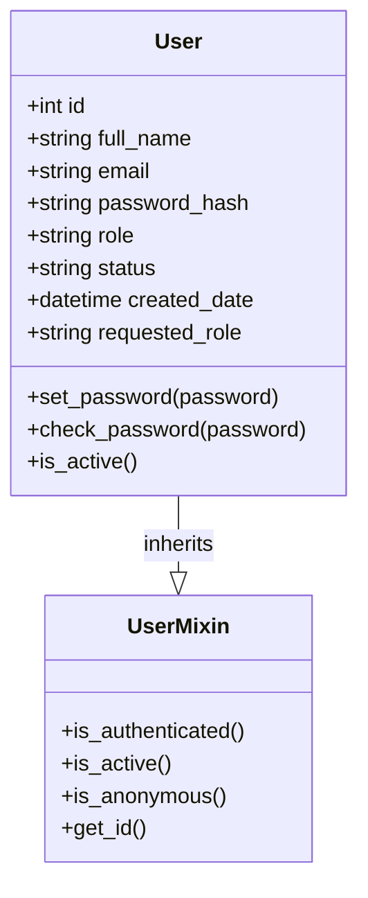
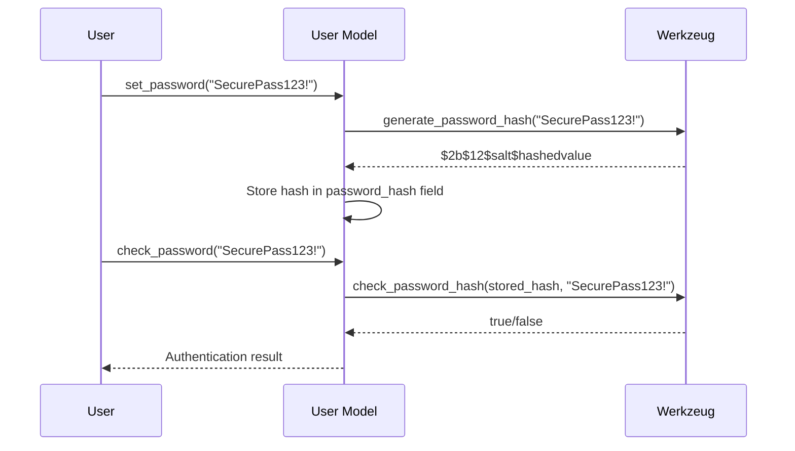
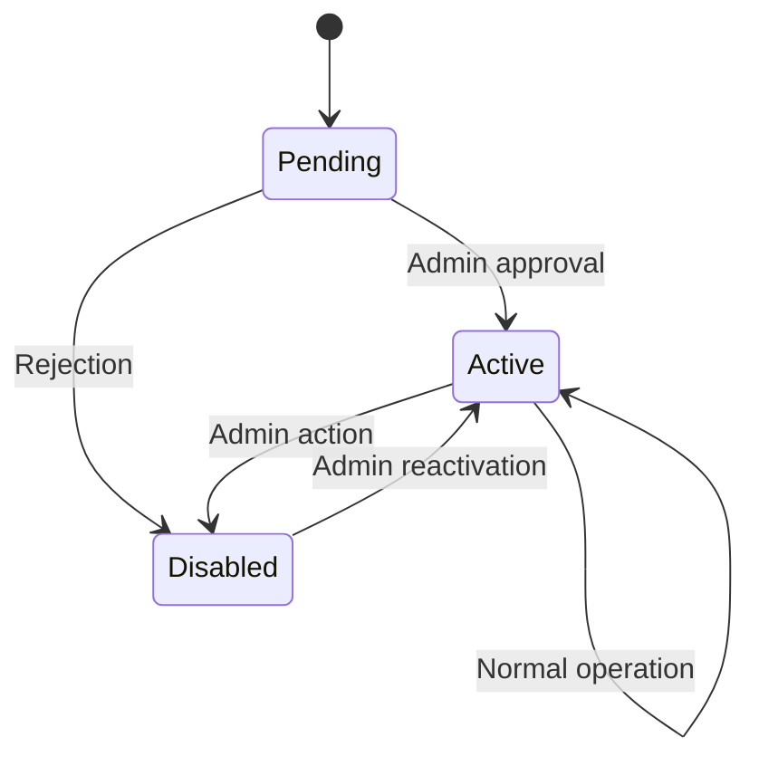
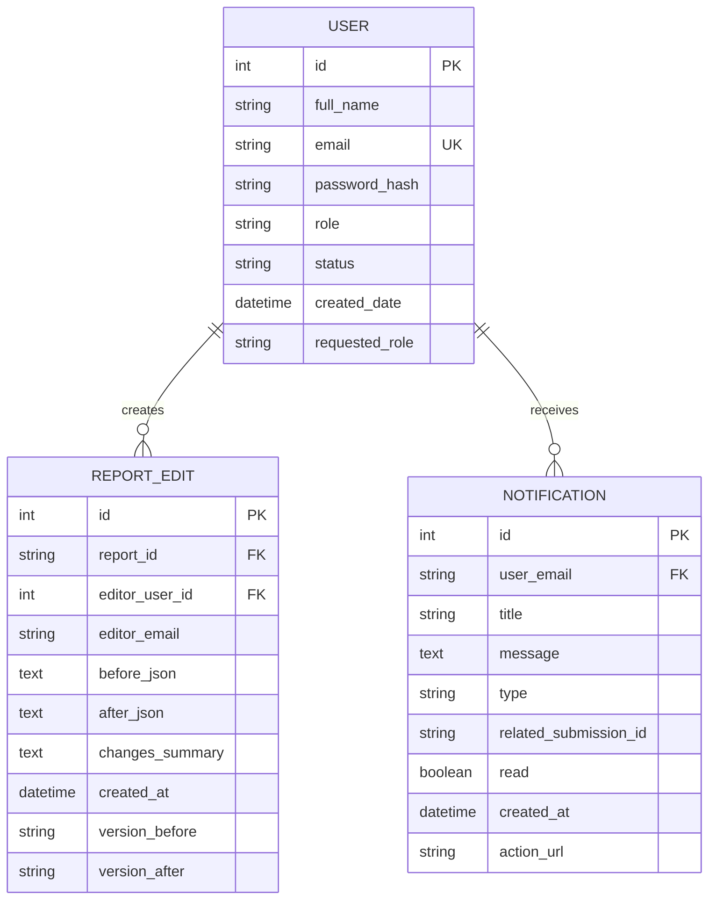

# User Model

<cite>
**Referenced Files in This Document**   
- [models.py](file://models.py#L15-L75)
- [auth.py](file://auth.py#L40-L70)
- [routes/auth.py](file://routes/auth.py#L68-L96)
- [api/auth.py](file://api/auth.py#L350-L388)
- [security/authentication.py](file://security/authentication.py#L176-L250)
- [templates/user_management.html](file://templates/user_management.html#L693-L708)
- [models.py](file://models.py#L629-L686)
- [models.py](file://models.py#L595-L629)
</cite>

## Table of Contents
1. [Introduction](#introduction)
2. [Core Fields](#core-fields)
3. [UserMixin Integration](#usermixin-integration)
4. [Password Management](#password-management)
5. [Role-Based Access Control](#role-based-access-control)
6. [Status Lifecycle](#status-lifecycle)
7. [Relationships](#relationships)
8. [User Creation and Status Transitions](#user-creation-and-status-transitions)
9. [Security Considerations](#security-considerations)
10. [Performance Notes](#performance-notes)

## Introduction
The User model serves as the central identity and access management entity within the SERVER application. It defines user attributes, authentication behavior, role-based permissions, and status tracking. Built on Flask-Login's UserMixin, the model integrates seamlessly with the application's session management system while enforcing security policies through password hashing and role-based access control. This document provides a comprehensive overview of the model's structure, behavior, and integration points.

## Core Fields
The User model contains the following core fields that define user identity and state:

- **id**: Integer primary key uniquely identifying each user
- **full_name**: String (100 characters) storing the user's full name, required field
- **email**: String (120 characters) serving as the unique login identifier with uniqueness constraint
- **password_hash**: String (255 characters) storing the securely hashed password using Werkzeug's algorithm
- **role**: String (30 characters) indicating the user's functional role (Admin, Engineer, Automation Manager, PM)
- **status**: String (20 characters) tracking account status with default value "Pending"
- **created_date**: DateTime field automatically set to UTC timestamp upon user creation
- **requested_role**: String (20 characters) storing role upgrade requests from users

**Section sources**
- [models.py](file://models.py#L15-L35)

## UserMixin Integration
The User model inherits from Flask-Login's UserMixin class, which provides essential methods for session management and authentication state tracking. The integration enables the application to maintain user sessions across requests while providing built-in methods for login state verification. The is_active property (detailed below) works in conjunction with UserMixin to determine whether a user can be logged in. This integration allows the application to use Flask-Login decorators like @login_required and @admin_required to protect routes based on authentication and authorization status.

**Diagram sources**
- [models.py](file://models.py#L15-L75)
- [auth.py](file://auth.py#L40-L70)

## Password Management
The User model implements secure password management through Werkzeug's security functions. The set_password method hashes passwords using generate_password_hash before storage, while check_password verifies credentials using check_password_hash during authentication. Passwords are never stored in plain text. The application enforces a comprehensive password policy requiring minimum 12-character length with uppercase, lowercase, digit, and special character requirements. Password validation also prevents common patterns and disallows passwords containing the username or email prefix.

**Diagram sources**
- [models.py](file://models.py#L25-L35)
- [security/authentication.py](file://security/authentication.py#L176-L250)
- [api/auth.py](file://api/auth.py#L350-L388)

## Role-Based Access Control
The application implements role-based access control with four distinct roles:

- **Admin**: Full system access, user management, and configuration privileges
- **Engineer**: Report creation and editing capabilities
- **Automation Manager**: Report review and approval authority
- **PM**: Project management and final approval responsibilities

Role enforcement is implemented through the @role_required decorator, which checks the user's role attribute before granting access to protected routes. The role system integrates with the status lifecycle, as only users with Active status and appropriate roles can perform role-specific actions. The requested_role field allows users to request role upgrades, which administrators can review and approve through the user management interface.

**Section sources**
- [models.py](file://models.py#L20-L21)
- [templates/user_management.html](file://templates/user_management.html#L693-L708)

## Status Lifecycle
The User model implements a three-state status lifecycle that controls account accessibility:

- **Pending**: Default state for new users; allows login but redirects to pending approval page
- **Active**: Fully operational state permitting access to all authorized functionality
- **Disabled**: Inactive state preventing login with appropriate error messaging

The is_active property returns true only when status equals "Active", which integrates with Flask-Login to control session establishment. During authentication, the system checks both credentials and status, preventing login for Disabled accounts and redirecting Pending users to an approval waiting page. Status transitions are managed by administrators through the user management interface.

**Diagram sources**
- [models.py](file://models.py#L22-L24)
- [routes/auth.py](file://routes/auth.py#L68-L96)

## Relationships
The User model maintains critical relationships with other entities for audit and notification purposes:

### ReportEdit Relationship
The User model has a one-to-many relationship with ReportEdit, enabling comprehensive audit tracking of user activities. Each report edit is associated with the editor through the editor_user_id foreign key, creating a complete audit trail of modifications. This relationship supports accountability by recording who made changes, when they were made, and what data was modified.

### Notification Relationship
The User model connects to the Notification system through the user_email field, enabling personalized alert delivery. Users receive notifications for report approvals, status updates, and other system events relevant to their work. The relationship allows the system to query notifications by user email and track read/unread status for each recipient.

**Diagram sources**
- [models.py](file://models.py#L629-L686)
- [models.py](file://models.py#L595-L629)

## User Creation and Status Transitions
User creation typically occurs through registration or administrative creation. When created, users receive a Pending status by default. Administrators review pending accounts and transition them to Active status upon approval. The system includes a default admin user creation during initialization with email 'admin@cullyautomation.com' and a temporary password. Status transitions are enforced throughout the application, with the login_required decorator checking is_active status on each protected request.

**Section sources**
- [models.py](file://models.py#L75-L150)
- [routes/auth.py](file://routes/auth.py#L68-L96)

## Security Considerations
The User model implements multiple security measures to protect user data and system integrity:

- **Password Storage**: All passwords are hashed using Werkzeug's generate_password_hash with adaptive hashing algorithms
- **Email Uniqueness**: The email field has a database-level uniqueness constraint preventing duplicate accounts
- **Session Validation**: The session_manager validates session integrity on each request, invalidating expired or tampered sessions
- **Authentication Flow**: Login process verifies both credentials and active status before establishing sessions
- **Password Policy**: Comprehensive validation prevents weak passwords and common patterns
- **Rate Limiting**: Authentication attempts are rate-limited to prevent brute force attacks

These measures work together to create a robust security posture that protects user accounts and prevents unauthorized access.

**Section sources**
- [models.py](file://models.py#L25-L35)
- [security/authentication.py](file://security/authentication.py#L176-L250)
- [auth.py](file://auth.py#L40-L70)

## Performance Notes
The User model includes performance optimizations for authentication workflows:

- **Email Indexing**: The email field is indexed with a unique constraint, enabling O(1) lookups during authentication
- **Query Patterns**: Authentication workflows use direct email lookups (User.query.filter_by(email=email)) rather than full table scans
- **Caching**: Session state is managed through Redis-backed caching for rapid validation
- **Connection Pooling**: Database connections are pooled to minimize connection overhead
- **Selective Loading**: Only essential user data is loaded during authentication, reducing payload size

These optimizations ensure responsive authentication performance even with growing user bases.

**Section sources**
- [models.py](file://models.py#L20)
- [database/performance.py](file://database/performance.py)
- [cache/session_store.py](file://cache/session_store.py)