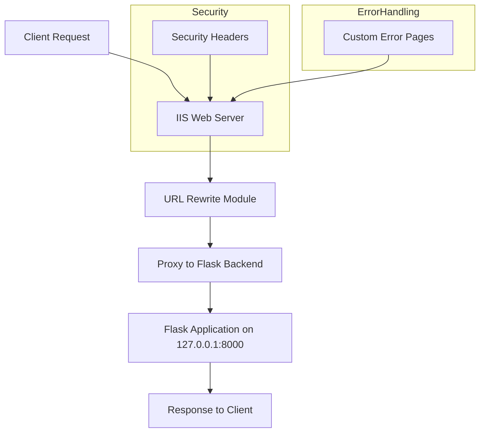
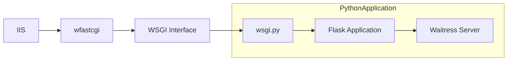
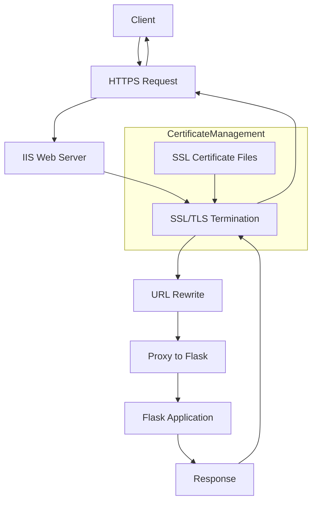

# Production Deployment

<cite>
**Referenced Files in This Document**   
- [iis_web_config.xml](file://iis_web_config.xml)
- [wsgi.py](file://wsgi.py)
- [start_production.bat](file://start_production.bat)
- [run_https_443.py](file://run_https_443.py)
- [app.py](file://app.py)
- [config.py](file://config.py)
- [deploy.py](file://deploy.py)
- [config/production.yaml](file://config/production.yaml)
- [middleware.py](file://middleware.py)
</cite>

## Table of Contents
1. [Introduction](#introduction)
2. [Environment Preparation](#environment-preparation)
3. [IIS Configuration and Integration](#iis-configuration-and-integration)
4. [WSGI Entry Point and wfastcgi Integration](#wsgi-entry-point-and-wfastcgi-integration)
5. [Production Startup Scripts](#production-startup-scripts)
6. [Python Environment Setup](#python-environment-setup)
7. [Application Pool Configuration](#application-pool-configuration)
8. [HTTPS Configuration and SSL Setup](#https-configuration-and-ssl-setup)
9. [Process Management and Startup Behavior](#process-management-and-startup-behavior)
10. [Logging and Monitoring Setup](#logging-and-monitoring-setup)
11. [Troubleshooting Common Deployment Issues](#troubleshooting-common-deployment-issues)
12. [Conclusion](#conclusion)

## Introduction
This document provides comprehensive guidance for deploying the SERVER application in a production environment. It covers the complete workflow from environment preparation to service activation, with detailed explanations of key components including IIS integration, WSGI configuration, and production startup mechanisms. The deployment process is designed to ensure optimal performance, security, and reliability in a Windows production environment.

## Environment Preparation
Before deploying the SERVER application, ensure the target Windows server meets all prerequisites. The deployment requires Python 3.x, IIS with CGI feature enabled, and appropriate permissions for file system access. The application is configured for domain-only access, specifically to automation-reports.mobilehmi.org, with direct IP access blocked for security. Key environment variables must be set, including FLASK_ENV=production, PORT, ALLOWED_DOMAINS, and various security and email configuration settings. The deployment directory should be properly structured with all necessary files and subdirectories in place.

**Section sources**
- [config.py](file://config.py#L1-L237)
- [deploy.py](file://deploy.py#L1-L173)
- [start_production.bat](file://start_production.bat#L1-L73)

## IIS Configuration and Integration
The IIS web server serves as the front-end for the SERVER application, handling incoming HTTP/HTTPS requests and proxying them to the Flask backend. The iis_web_config.xml file defines the site configuration, including URL rewrite rules that proxy all requests to the Flask application running on localhost:8000. This configuration includes security headers such as X-Content-Type-Options, X-Frame-Options, X-XSS-Protection, and Strict-Transport-Security to enhance security. The HTTP errors section is configured to handle 500 errors by serving a custom 500.html page, ensuring users receive appropriate error messages.

**Diagram sources**
- [iis_web_config.xml](file://iis_web_config.xml#L1-L37)

**Section sources**
- [iis_web_config.xml](file://iis_web_config.xml#L1-L37)
- [middleware.py](file://middleware.py#L1-L118)

## WSGI Entry Point and wfastcgi Integration
The wsgi.py file serves as the WSGI entry point for the SERVER application, enabling integration with IIS through the wfastcgi module. This file creates the Flask application instance using the production configuration and defines a production server function that utilizes the Waitress WSGI server. The Waitress configuration includes optimized settings such as 6 threads, a connection limit of 50, and various performance tuning parameters like cleanup_interval, channel_timeout, and buffer sizes. This WSGI interface allows IIS to communicate with the Python application through the FastCGI protocol, providing a stable and performant deployment option.

**Diagram sources**
- [wsgi.py](file://wsgi.py#L1-L42)

**Section sources**
- [wsgi.py](file://wsgi.py#L1-L42)
- [app.py](file://app.py#L1-L752)

## Production Startup Scripts
The SERVER application provides multiple production startup scripts to accommodate different deployment scenarios. The start_production.bat script is a Windows batch file that sets environment variables and launches the application on port 8443 with HTTPS. The deploy.py script is a Python deployment script that configures the production environment and starts the server on port 80, requiring administrator privileges. These scripts handle the setup of critical environment variables including security settings, email configuration, and domain access controls. They also create necessary directories and initialize the application with production configuration.

**Section sources**
- [start_production.bat](file://start_production.bat#L1-L73)
- [deploy.py](file://deploy.py#L1-L173)

## Python Environment Setup
To set up the Python environment for production deployment, install the required dependencies using pip and the requirements.txt file. The application requires Flask, Flask-Login, Flask-WTF, Flask-SQLAlchemy, and several other packages for functionality such as document generation and image processing. After installing dependencies, verify that all required modules are available by running the check_dependencies function in deploy.py. Create necessary directories for uploads, signatures, outputs, instance data, and logs. Ensure the Python environment is properly configured with access to all required libraries and that the application can import all necessary modules without errors.

**Section sources**
- [requirements.txt](file://requirements.txt)
- [deploy.py](file://deploy.py#L1-L173)
- [config.py](file://config.py#L1-L237)

## Application Pool Configuration
When configuring IIS for the SERVER application, create a dedicated application pool with appropriate settings. The application pool should run under an identity with sufficient permissions to access the application files and any required resources. Enable 32-bit applications if needed, and set the .NET CLR version to "No Managed Code" since this is a Python application. Configure the idle time-out to prevent the application from shutting down due to inactivity. Set the pipeline mode to "Integrated" to ensure proper handling of requests through the IIS pipeline. The application pool should be configured to automatically start and always run to ensure the application is available when needed.

## HTTPS Configuration and SSL Setup
The SERVER application supports HTTPS configuration through multiple mechanisms. The run_https_443.py script configures the application to run directly on port 443 with SSL/TLS encryption. This script sets up the HTTPS environment with appropriate security settings and attempts to load SSL certificates from the ssl directory. If certificates are not found, it can fall back to using an ad-hoc self-signed certificate for development purposes. The application expects SSL certificate files (server.crt and server.key) to be placed in the ssl directory. For production deployment, a valid SSL certificate for automation-reports.mobilehmi.org should be installed. The configuration enforces HTTPS by setting SESSION_COOKIE_SECURE and other security-related settings.

**Diagram sources**
- [run_https_443.py](file://run_https_443.py#L1-L124)
- [config.py](file://config.py#L1-L237)

**Section sources**
- [run_https_443.py](file://run_https_443.py#L1-L124)
- [config.py](file://config.py#L1-L237)
- [app.py](file://app.py#L1-L752)

## Process Management and Startup Behavior
The SERVER application is designed to run as a long-lived process in production. When started, it initializes the Flask application with production configuration, sets up logging, creates necessary directories, and starts listening on the configured port. The application runs in a single process with threading enabled to handle multiple concurrent requests. Signal handlers are configured to gracefully shut down the application on SIGINT and SIGTERM signals. The application performs health checks and initializes database connections during startup. In production, the application should be configured to start automatically when the server boots and to restart in case of failure.

**Section sources**
- [app.py](file://app.py#L1-L752)
- [deploy.py](file://deploy.py#L1-L173)
- [start_production.bat](file://start_production.bat#L1-L73)

## Logging and Monitoring Setup
The SERVER application includes comprehensive logging and monitoring capabilities for production use. In production mode, the application configures a rotating file handler that writes logs to the logs/sat_reports.log file, with a maximum size of 10MB per file and up to 10 backup files. Log entries include timestamps, log levels, messages, and source file information. The application also includes a health check endpoint at /health that returns the application status and database connectivity. Monitoring features include rate limiting, audit logging, and metrics collection. The logging level is set to WARNING in production to reduce log volume while still capturing important events.

**Section sources**
- [config.py](file://config.py#L1-L237)
- [app.py](file://app.py#L1-L752)
- [config/production.yaml](file://config/production.yaml#L1-L84)

## Troubleshooting Common Deployment Issues
Common deployment issues include module import errors, permission issues, port conflicts, and WSGI handshake failures. Module import errors typically indicate missing dependencies; resolve by installing packages listed in requirements.txt. Permission issues often occur when running on privileged ports like 80 or 443; run the command prompt as administrator or use a different port. Port conflicts happen when another process is using the desired port; identify and stop the conflicting process or choose a different port. WSGI handshake failures may indicate configuration issues between IIS and wfastcgi; verify the web.config file and wfastcgi installation. Other common issues include incorrect environment variables, missing SSL certificates, and directory permission problems.

**Section sources**
- [DEPLOYMENT_INSTRUCTIONS.txt](file://DEPLOYMENT_INSTRUCTIONS.txt#L1-L126)
- [app.py](file://app.py#L1-L752)
- [deploy.py](file://deploy.py#L1-L173)

## Conclusion
The production deployment of the SERVER application involves careful configuration of IIS, proper setup of the WSGI interface, and thorough preparation of the Python environment. By following the steps outlined in this document, administrators can ensure a secure, reliable, and high-performing deployment. The application's design emphasizes security through domain-only access, HTTPS enforcement, and comprehensive security headers. With proper monitoring and troubleshooting procedures in place, the SERVER application can provide stable service in a production environment.