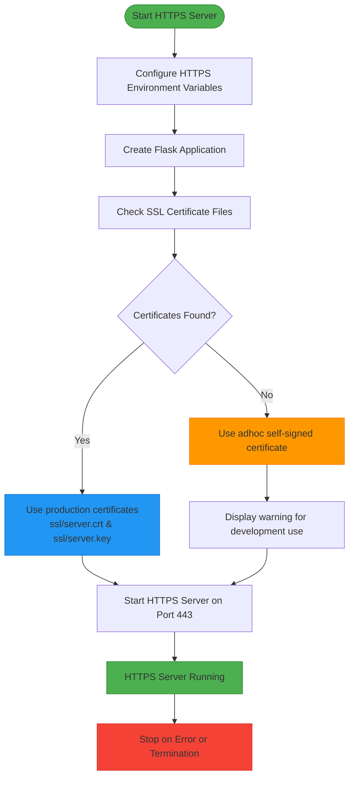
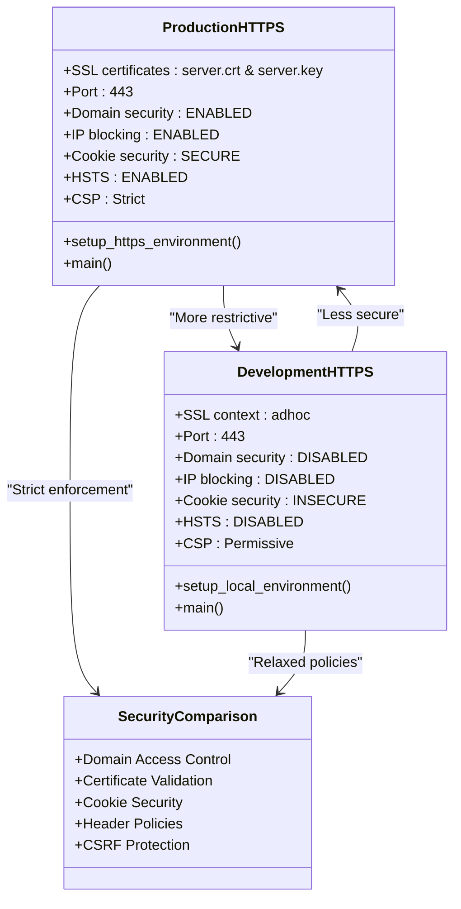
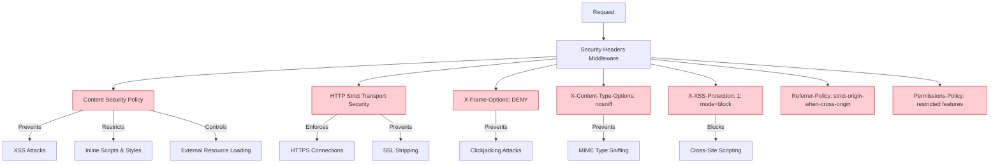
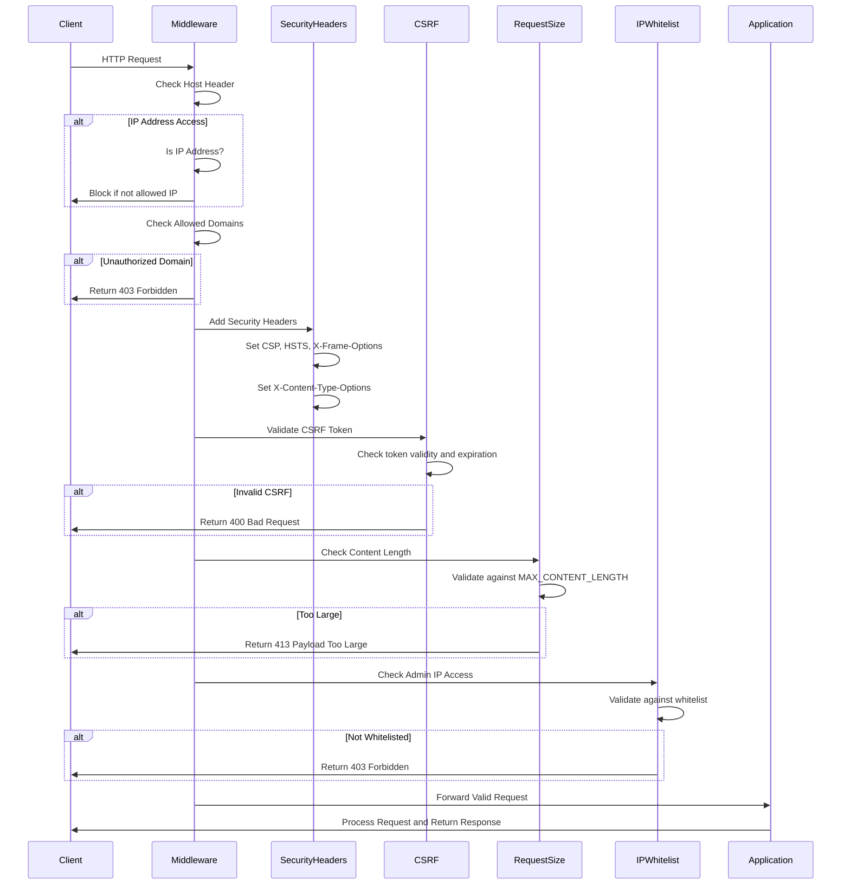
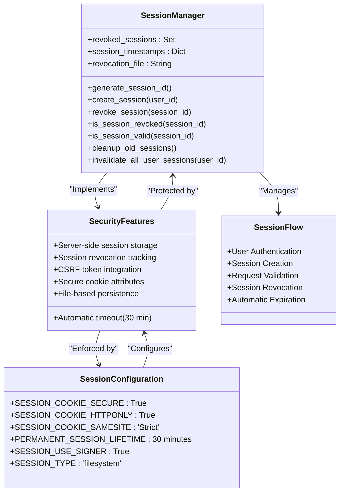
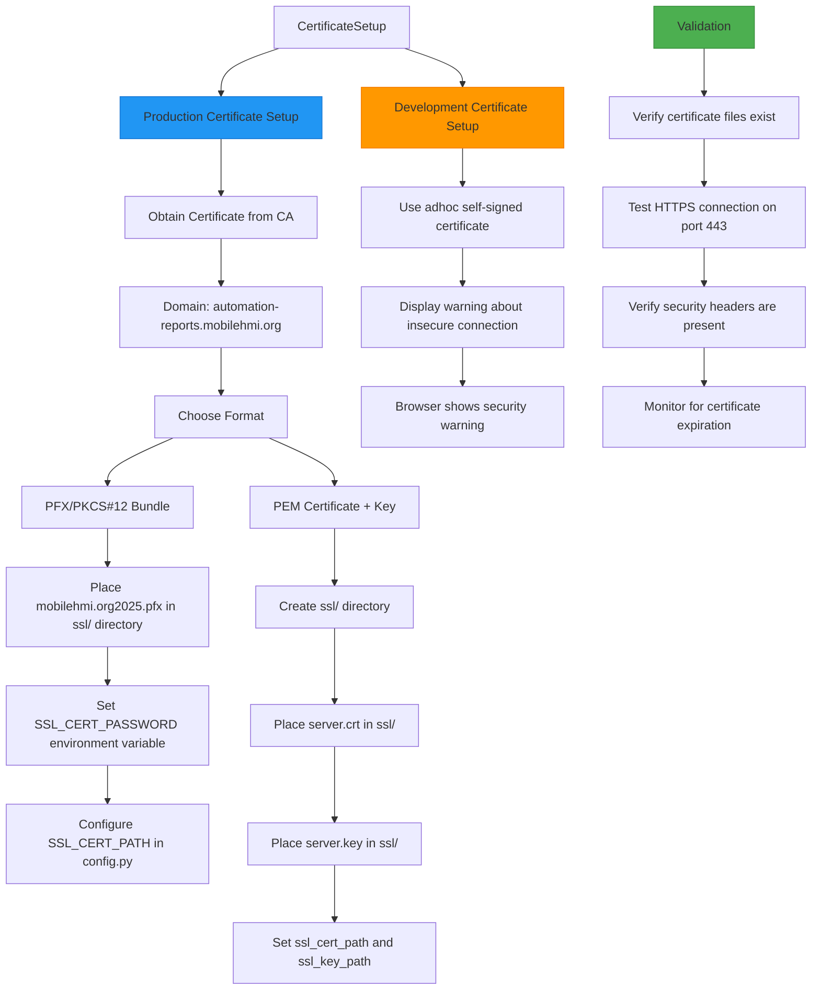
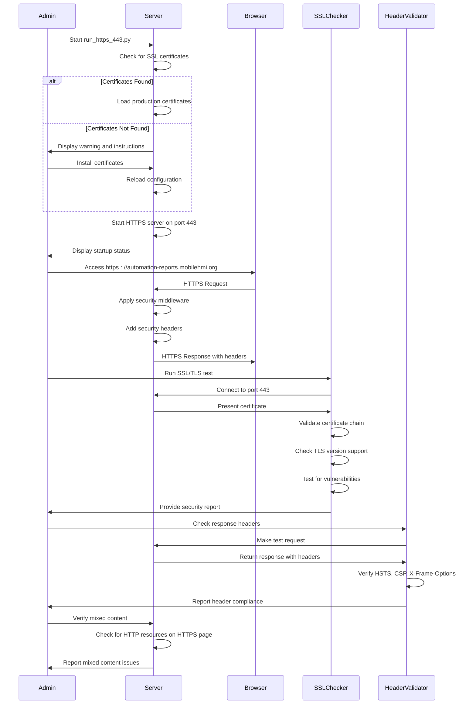

# SSL & Security Hardening

<cite>
**Referenced Files in This Document**   
- [run_https_443.py](file://run_https_443.py)
- [run_local_https.py](file://run_local_https.py)
- [config/production.yaml](file://config/production.yaml)
- [security/headers.py](file://security/headers.py)
- [middleware.py](file://middleware.py)
- [session_manager.py](file://session_manager.py)
- [app.py](file://app.py)
- [config.py](file://config.py)
</cite>

## Table of Contents
1. [Introduction](#introduction)
2. [Production HTTPS Implementation](#production-https-implementation)
3. [Development vs Production SSL Configuration](#development-vs-production-ssl-configuration)
4. [Security Headers Enforcement](#security-headers-enforcement)
5. [Middleware-Level Protections](#middleware-level-protections)
6. [Session Security and Cookie Configuration](#session-security-and-cookie-configuration)
7. [TLS and Certificate Configuration](#tls-and-certificate-configuration)
8. [SSL Certificate Management](#ssl-certificate-management)
9. [Security Testing and Validation](#security-testing-and-validation)
10. [Troubleshooting Guide](#troubleshooting-guide)

## Introduction
This document provides comprehensive guidance on SSL/TLS implementation and security hardening for the SERVER application in production. It details how the application enforces HTTPS on port 443 using Python's ssl module, implements secure HTTP headers, and applies middleware-level protections. The documentation covers the differences between development and production SSL configurations, secure session handling, and best practices for certificate management and validation.

## Production HTTPS Implementation

The SERVER application implements production-grade HTTPS through the `run_https_443.py` script, which configures direct HTTPS access on port 443 using Python's ssl module. This script sets up a secure environment for the Flask application with strict security parameters.

The implementation follows a structured approach to HTTPS configuration, setting critical environment variables for production security, including domain restrictions, secure cookie policies, and CSRF protection. The script validates SSL certificate availability and falls back to adhoc certificates only when production certificates are not present.



**Diagram sources**
- [run_https_443.py](file://run_https_443.py#L1-L123)

**Section sources**
- [run_https_443.py](file://run_https_443.py#L1-L123)

## Development vs Production SSL Configuration

The SERVER application maintains distinct SSL configurations for development and production environments, with `run_local_https.py` serving development needs and `run_https_443.py` handling production deployment.

The key differences between these configurations focus on security strictness, certificate handling, and header policies. Production configuration enforces domain-only access, blocks IP-based access, and requires valid SSL certificates, while development configuration prioritizes functionality and iframe embedding capabilities.



**Diagram sources**
- [run_https_443.py](file://run_https_443.py#L1-L123)
- [run_local_https.py](file://run_local_https.py#L1-L120)

**Section sources**
- [run_https_443.py](file://run_https_443.py#L1-L123)
- [run_local_https.py](file://run_local_https.py#L1-L120)

## Security Headers Enforcement

The SERVER application implements comprehensive security headers through the `security/headers.py` module, which configures Content Security Policy (CSP), HTTP Strict Transport Security (HSTS), and other critical security headers to protect against common web vulnerabilities.

The SecurityHeaders class systematically applies multiple layers of protection, including XSS prevention, clickjacking protection, MIME type sniffing prevention, and referrer policy enforcement. These headers are automatically added to all responses through Flask's after_request decorator.



**Diagram sources**
- [security/headers.py](file://security/headers.py#L1-L370)

**Section sources**
- [security/headers.py](file://security/headers.py#L1-L370)

## Middleware-Level Protections

The SERVER application implements multiple layers of middleware protection to enhance security, including domain access control, request validation, and attack pattern detection. These protections are implemented across several middleware components that work together to create a comprehensive security posture.

The middleware.py file contains domain security middleware that blocks direct IP access and enforces domain-only access, while security/headers.py includes additional protections against common attack vectors. The SecurityMiddleware class combines multiple security features into a unified protection system.



**Diagram sources**
- [middleware.py](file://middleware.py#L1-L117)
- [security/headers.py](file://security/headers.py#L1-L370)

**Section sources**
- [middleware.py](file://middleware.py#L1-L117)
- [security/headers.py](file://security/headers.py#L1-L370)

## Session Security and Cookie Configuration

The SERVER application implements robust session security through the session_manager.py module and comprehensive cookie configuration in the application settings. This ensures that user sessions are protected against hijacking, fixation, and unauthorized access.

The SessionManager class provides server-side session tracking with revocation capabilities, while the Flask session configuration enforces secure cookie attributes. The system implements automatic session invalidation after 30 minutes of inactivity and maintains a persistent record of revoked sessions.



**Diagram sources**
- [session_manager.py](file://session_manager.py#L1-L157)
- [config.py](file://config.py#L1-L236)

**Section sources**
- [session_manager.py](file://session_manager.py#L1-L157)
- [config.py](file://config.py#L1-L236)

## TLS and Certificate Configuration

The SERVER application's TLS configuration is managed through multiple layers of configuration files and runtime settings, ensuring secure communication in production environments. The system supports both .pfx certificate bundles and separate certificate/key files, providing flexibility for different deployment scenarios.

The SSL configuration is defined in config.py with environment-specific settings, while the production.yaml file contains additional security parameters for the production environment. The run_https_443.py script handles certificate validation and server startup with appropriate SSL context.

```mermaid
erDiagram
CONFIGURATION ||--o{ SSL_SETTINGS : "contains"
SSL_SETTINGS ||--o{ CERTIFICATE_TYPES : "supports"
CERTIFICATE_TYPES ||--o{ PFX_CERTIFICATE : "pfx file"
CERTIFICATE_TYPES ||--o{ PEM_CERTIFICATE : "pem/key files"
SSL_SETTINGS ||--o{ SECURITY_HEADERS : "enforces"
SSL_SETTINGS ||--o{ COOKIE_POLICY : "configures"
class CONFIGURATION {
config.py
production.yaml
Environment variables
}
class SSL_SETTINGS {
SSL_CERT_PATH
SSL_KEY_PATH
SSL_CERT_PASSWORD
USE_HTTPS
SESSION_COOKIE_SECURE
}
class CERTIFICATE_TYPES {
.pfx files
.pem + .key files
Self-signed (adhoc)
}
class PFX_CERTIFICATE {
Single file bundle
Password protected
Extracted at runtime
Temporary files
}
class PEM_CERTIFICATE {
server.crt
server.key
Direct usage
No password required
}
class SECURITY_HEADERS {
HSTS: max-age=31536000
CSP: Strict policies
X-Content-Type-Options: nosniff
}
class COOKIE_POLICY {
Secure: True
HttpOnly: True
SameSite: Strict
Max-Age: 1800 seconds
}
```

**Diagram sources**
- [config.py](file://config.py#L1-L236)
- [config/production.yaml](file://config/production.yaml#L1-L83)
- [run_https_443.py](file://run_https_443.py#L1-L123)

**Section sources**
- [config.py](file://config.py#L1-L236)
- [config/production.yaml](file://config/production.yaml#L1-L83)
- [run_https_443.py](file://run_https_443.py#L1-L123)

## SSL Certificate Management

The SERVER application follows a structured approach to SSL certificate management, with clear requirements for production deployment and fallback mechanisms for development environments. The system is designed to work with industry-standard certificate formats and provides guidance for proper certificate installation.

For production environments, the application requires valid SSL certificates for the domain automation-reports.mobilehmi.org, with certificate files placed in the ssl directory. The system supports both .pfx bundles and separate .crt/.key files, accommodating different certificate authority formats.



**Section sources**
- [run_https_443.py](file://run_https_443.py#L1-L123)
- [config.py](file://config.py#L1-L236)
- [config/production.yaml](file://config/production.yaml#L1-L83)

## Security Testing and Validation

The SERVER application includes comprehensive mechanisms for security testing and validation to ensure that SSL/TLS implementation and security hardening measures are functioning correctly. These validation processes cover certificate configuration, header enforcement, and connection security.

The validation process begins with certificate verification during server startup, where the system checks for the presence of required certificate files. If certificates are missing, the system provides clear guidance on proper installation. For production deployments, the system validates that all security features are properly configured before accepting connections.



**Section sources**
- [run_https_443.py](file://run_https_443.py#L1-L123)
- [security/headers.py](file://security/headers.py#L1-L370)
- [app.py](file://app.py#L1-L751)

## Troubleshooting Guide

This section provides guidance for resolving common issues related to SSL/TLS implementation and security configuration in the SERVER application. The troubleshooting steps address certificate errors, mixed content warnings, and insecure header issues that may occur during deployment.

When encountering SSL-related issues, administrators should follow a systematic approach to diagnosis and resolution, starting with certificate validation and progressing through configuration checks and security header verification.

```mermaid
flowchart TD
Issue --> Certificate["Certificate Issues"]
Issue --> Headers["Header Issues"]
Issue --> Connection["Connection Issues"]
Issue --> MixedContent["Mixed Content Issues"]
Certificate --> NotFound["SSL Certificate Not Found"]
NotFound --> CheckPath["Verify ssl/ directory exists"]
CheckPath --> CheckFiles["Confirm server.crt and server.key present"]
CheckFiles --> CheckConfig["Verify SSL_CERT_PATH in config.py"]
Certificate --> Permission["Permission Denied on Port 443"]
Permission --> RunAsAdmin["Run Command Prompt as Administrator"]
Permission --> CheckFirewall["Verify firewall allows port 443"]
Certificate --> Invalid["Invalid Certificate"]
Invalid --> CheckDomain["Confirm certificate matches automation-reports.mobilehmi.org"]
Invalid --> CheckFormat["Verify certificate format (PEM or PFX)"]
Invalid --> CheckPassword["For PFX: verify SSL_CERT_PASSWORD is set"]
Headers --> Missing["Security Headers Missing"]
Missing --> CheckMiddleware["Verify security middleware is enabled"]
Missing --> CheckConfig["Confirm headers.py is properly imported"]
Missing --> CheckResponse["Use browser developer tools to inspect headers"]
Connection --> Blocked["Connection Blocked"]
Blocked --> CheckDomain["Verify accessing via automation-reports.mobilehmi.org"]
Blocked --> CheckIP["Confirm not accessing via IP address"]
Blocked --> CheckPort["Ensure using port 443, not 80"]
MixedContent --> Warning["Mixed Content Warning"]
Warning --> CheckResources["Identify HTTP resources on HTTPS page"]
Warning --> UpdateLinks["Change HTTP links to HTTPS or relative"]
Warning --> CheckCDN["Verify CDN resources use HTTPS"]
Warning --> CheckImages["Ensure all images use HTTPS or relative paths"]
style Certificate fill:#FFCDD2,stroke:#C62828
style Headers fill:#FFCDD2,stroke:#C62828
style Connection fill:#FFCDD2,stroke:#C62828
style MixedContent fill:#FFCDD2,stroke:#C62828
```



**Section sources**
- [run_https_443.py](file://run_https_443.py#L1-L123)
- [security/headers.py](file://security/headers.py#L1-L370)
- [middleware.py](file://middleware.py#L1-L117)
- [app.py](file://app.py#L1-L751)