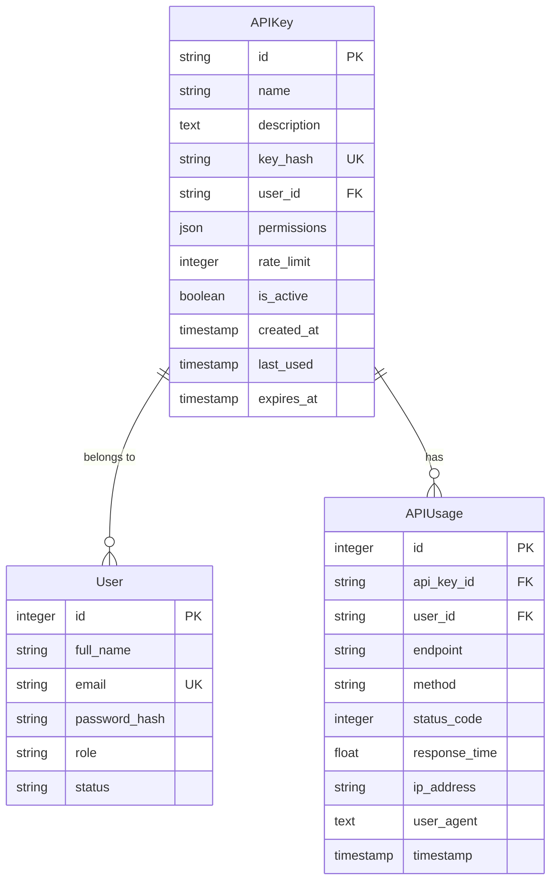
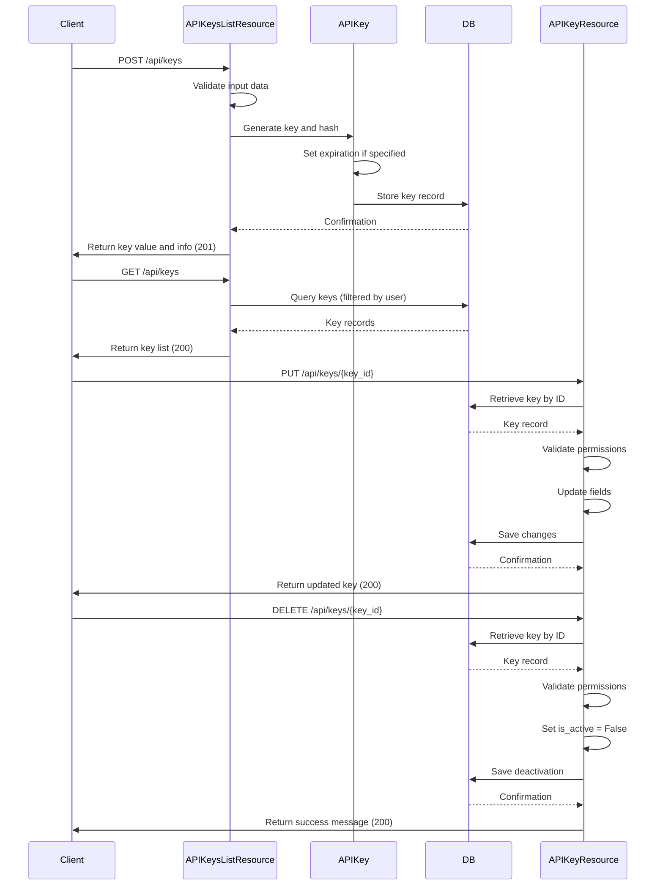
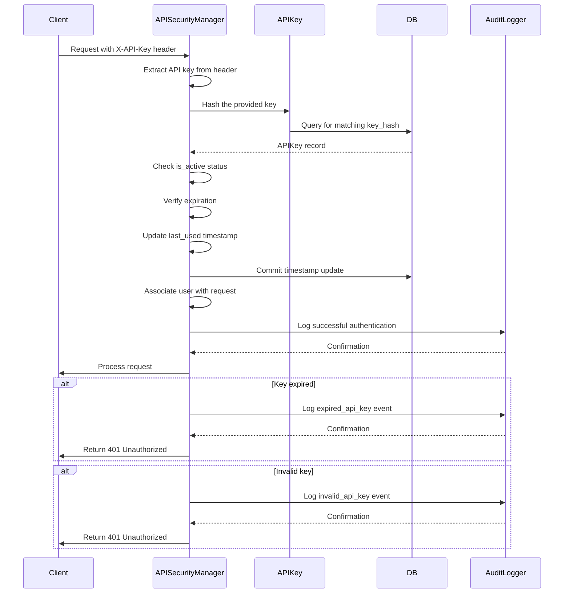
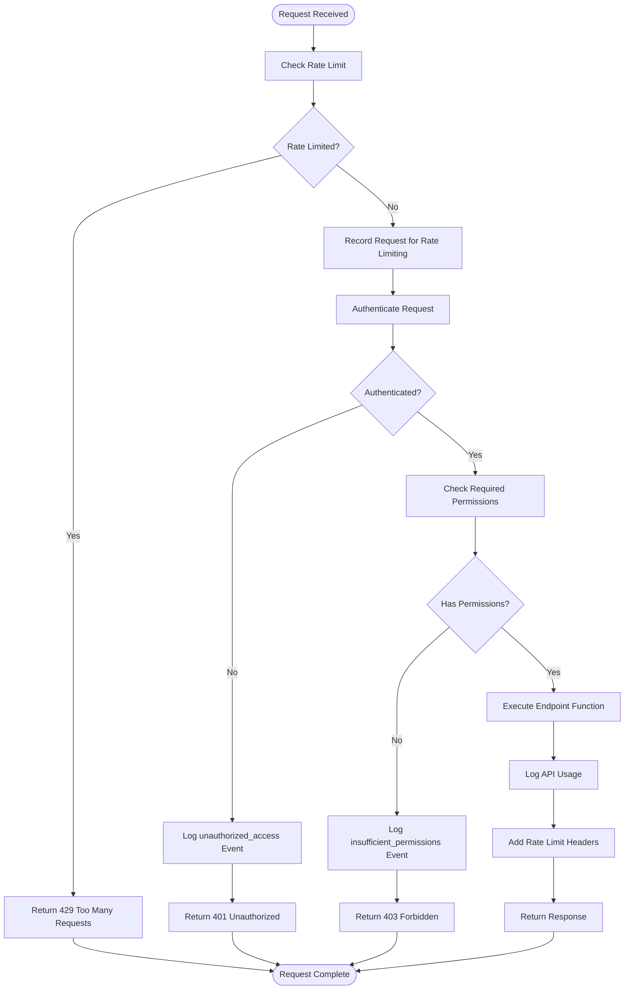
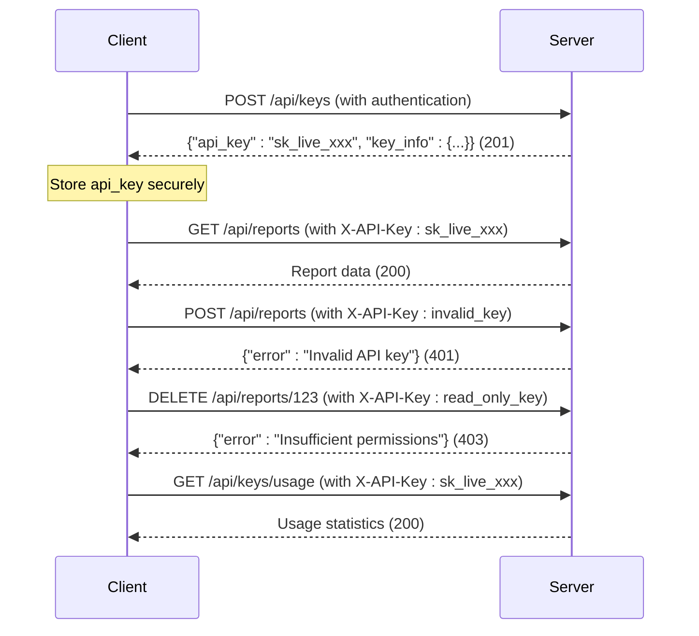
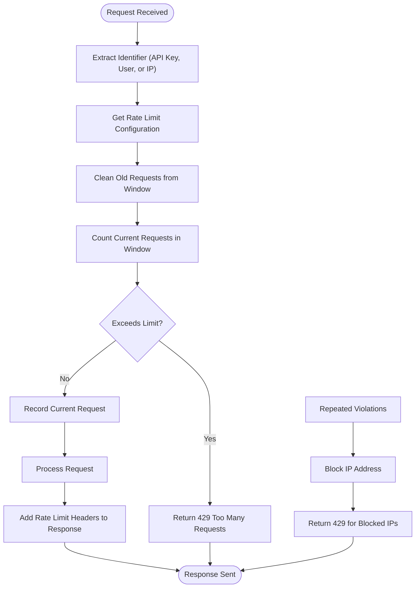

# API Key Management

<cite>
**Referenced Files in This Document**   
- [api/keys.py](file://api/keys.py)
- [models.py](file://models.py)
- [security/authentication.py](file://security/authentication.py)
- [api/security.py](file://api/security.py)
</cite>

## Table of Contents
1. [Introduction](#introduction)
2. [Core Components](#core-components)
3. [Data Model](#data-model)
4. [CRUD Operations](#crud-operations)
5. [Authentication Integration](#authentication-integration)
6. [Request Validation](#request-validation)
7. [Usage Examples](#usage-examples)
8. [Rate Limiting](#rate-limiting)
9. [Security Best Practices](#security-best-practices)
10. [Troubleshooting](#troubleshooting)

## Introduction
The API key management system in the SERVER application provides secure access control for third-party integrations with RESTful interfaces. This system enables authorized users to generate, manage, and revoke API keys with configurable permissions and expiration policies. The implementation follows security best practices including cryptographic key hashing, role-based access control, and comprehensive audit logging. The system supports multiple authentication methods including API keys, JWT tokens, and session-based authentication, with seamless integration into the application's security pipeline.

## Core Components
The API key management system consists of several interconnected components that work together to provide secure access control. The system is built around a comprehensive data model that stores API key information, usage statistics, and permission configurations. The implementation includes CRUD operations for managing API keys through RESTful endpoints, with proper validation and error handling. The security framework integrates with the authentication pipeline to validate API keys and enforce access policies. Usage tracking and rate limiting mechanisms ensure fair resource utilization and provide analytics for monitoring API consumption.

**Section sources**
- [api/keys.py](file://api/keys.py#L1-L453)
- [api/security.py](file://api/security.py#L1-L577)

## Data Model
The data model for API key management is designed to securely store key information while providing flexibility for permissions and usage tracking. The APIKey model stores essential information including the key name, description, hashed key value, associated user, permissions, rate limits, and expiration policies. The key_hash field stores the SHA-256 hash of the actual API key, ensuring that the raw key value is never stored in the database. The permissions field uses JSON storage to allow flexible permission configurations, while the rate_limit field controls the number of requests allowed per hour. The model also includes timestamps for creation, last use, and expiration to support key lifecycle management.

**Diagram sources **
- [models.py](file://models.py#L1-L701)
- [api/security.py](file://api/security.py#L34-L69)

## CRUD Operations
The API key management system implements comprehensive CRUD operations through RESTful endpoints. The creation process involves generating a cryptographically secure key, hashing it for storage, and associating it with the requesting user. Key creation requires appropriate role permissions (Admin, PM, or Automation Manager) and validates input parameters including name length, description length, rate limits, and expiration periods. The read operations allow users to list their keys or retrieve specific key information, with Admin users having visibility into all keys. Update operations enable modification of key properties such as name, description, permissions, rate limits, and active status. Deletion is implemented as a soft delete by deactivating the key rather than removing it from the database, preserving audit trail information.

**Diagram sources **
- [api/keys.py](file://api/keys.py#L115-L190)
- [api/keys.py](file://api/keys.py#L192-L262)

## Authentication Integration
The API key system integrates with the application's authentication pipeline through the APISecurityManager class. The authenticate_request method checks for API keys in the X-API-Key header and validates them against stored hashes. The system supports multiple authentication methods, with API key authentication taking precedence over JWT tokens and session-based authentication. When an API key is used, the system verifies its active status, checks for expiration, updates the last_used timestamp, and associates the corresponding user with the request context. The integration also supports role-based access control, where API key permissions are checked against required permissions for protected endpoints. The security manager maintains audit logs for all authentication attempts, including successful authentications and security events such as expired or invalid keys.

**Diagram sources **
- [security/authentication.py](file://security/authentication.py#L279-L320)
- [api/security.py](file://api/security.py#L279-L320)

## Request Validation
Request validation is implemented through the require_auth decorator, which provides comprehensive security checks for API endpoints. The validation process begins with rate limiting to prevent abuse, followed by authentication using the APISecurityManager. For authenticated requests, the system checks required permissions against the API key's permission set or the user's role-based permissions. The validation process includes detailed logging of security events and adds rate limit headers to responses to inform clients of their usage limits. Failed validation results in appropriate error responses with standardized error codes. The system also adds security headers to all responses to protect against common web vulnerabilities.

**Diagram sources **
- [api/security.py](file://api/security.py#L475-L510)

## Usage Examples
External clients can use API keys to authenticate requests to the SERVER application's RESTful interfaces. The API key should be included in the X-API-Key header of HTTP requests. When creating a new API key, the system returns the actual key value only once in the response, which must be securely stored by the client. Subsequent requests use the key for authentication without exposing the raw key in responses. Clients should handle the 401 Unauthorized response when a key is invalid or missing, and the 403 Forbidden response when the key lacks required permissions. The system supports both header-based and query parameter-based key transmission, though header-based transmission is recommended for security reasons.

**Diagram sources **
- [api/keys.py](file://api/keys.py#L148-L190)
- [api/keys.py](file://api/keys.py#L338-L404)

## Rate Limiting
The rate limiting system enforces configurable request limits per API key to prevent abuse and ensure fair resource utilization. Each API key has a rate_limit field that specifies the maximum number of requests allowed per hour. The RateLimiter class tracks requests using in-memory storage with deque structures for efficient time-based window calculations. The system checks rate limits before processing requests and returns appropriate 429 Too Many Requests responses when limits are exceeded. Rate limit information is included in response headers (X-RateLimit-Limit, X-RateLimit-Remaining, X-RateLimit-Reset) to help clients manage their usage. The system also implements IP-based blocking for repeated violations to prevent denial-of-service attacks.

**Diagram sources **
- [api/security.py](file://api/security.py#L74-L104)
- [api/security.py](file://api/security.py#L475-L510)

## Security Best Practices
The API key management system implements several security best practices to protect against common vulnerabilities. API keys are cryptographically generated using secrets.token_urlsafe() and stored as SHA-256 hashes to prevent exposure in case of database compromise. The system avoids key leakage in logs by never logging raw API key values and by filtering sensitive information from audit trails. Multi-factor authentication (MFA) is supported for key creation through the enhanced_login_required decorator, requiring additional verification for privileged operations. Comprehensive audit logging tracks all key-related activities including creation, access, updates, and deletion. The system also implements security headers in responses to protect against XSS, clickjacking, and other web-based attacks. Regular key rotation is supported through the regenerate endpoint, allowing users to create new keys while invalidating old ones.

```mermaid
flowchart TD
A[Security Best Practices] --> B[Key Generation]
A --> C[Storage Security]
A --> D[Access Control]
A --> E[Audit Logging]
A --> F[Data Protection]
A --> G[Network Security]
B --> B1["Use cryptographically secure random generation"]
B --> B2["Include environment indicator (sk_live/sk_test)"]
C --> C1["Store only SHA-256 hash of key"]
C --> C2["Never store raw key value"]
C --> C3["Never return raw key after creation"]
D --> D1["Role-based access control"]
D --> D2["MFA for key creation"]
D --> D3["Permission validation"]
E --> E1["Log all key operations"]
E --> E2["Track creation, access, updates, deletion"]
E --> E3["Record IP addresses and timestamps"]
F --> F1["Filter sensitive data from logs"]
F --> F2["Use parameterized queries"]
F --> F3["Validate all inputs"]
G --> G1["Add security headers to responses"]
G --> G2["Implement rate limiting"]
G --> G3["IP blocking for repeated violations"]
```

**Diagram sources **
- [api/security.py](file://api/security.py#L34-L69)
- [security/authentication.py](file://security/authentication.py#L1-L309)
- [api/security.py](file://api/security.py#L540-L575)

## Troubleshooting
Common issues with API key access can be diagnosed and resolved using the following troubleshooting steps. For unauthorized access errors (401), verify that the X-API-Key header is correctly formatted and contains a valid key. Check that the key has not been deactivated or expired by examining the is_active and expires_at fields. For insufficient permissions errors (403), review the required permissions for the endpoint and ensure the API key has the necessary permissions assigned. When experiencing rate limiting issues (429), check the rate limit headers in the response to determine remaining requests and reset time. If a key appears to be missing from the list, confirm that the requesting user has the appropriate role (Admin users can see all keys, while others see only their own). Usage statistics can be retrieved to verify that requests are being properly tracked and attributed to the correct key.

**Section sources**
- [api/keys.py](file://api/keys.py#L186-L226)
- [api/keys.py](file://api/keys.py#L338-L404)
- [api/security.py](file://api/security.py#L507-L543)