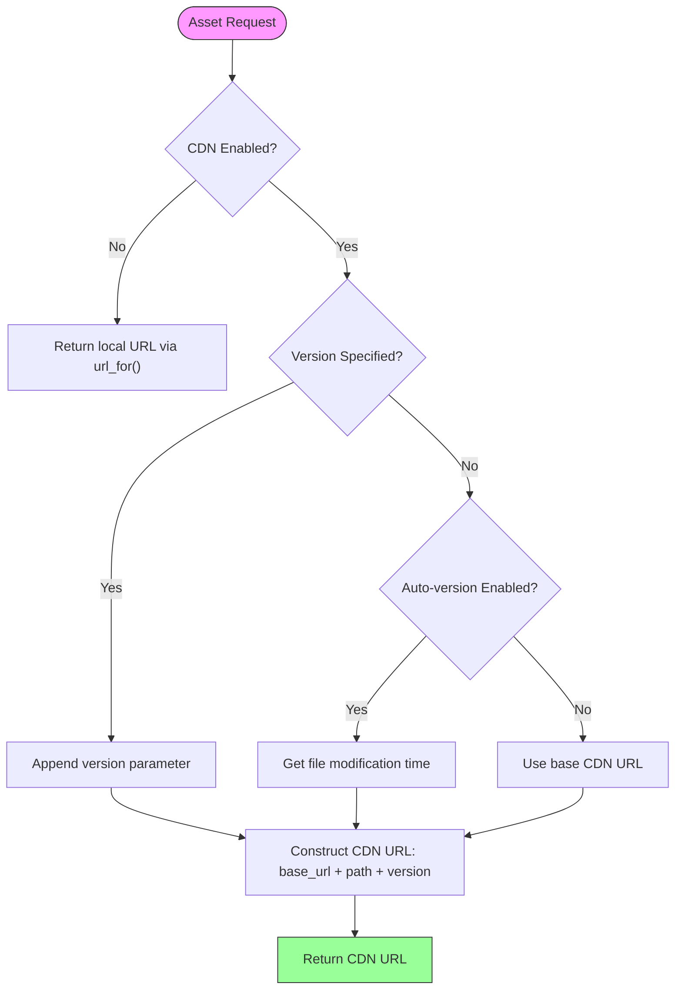
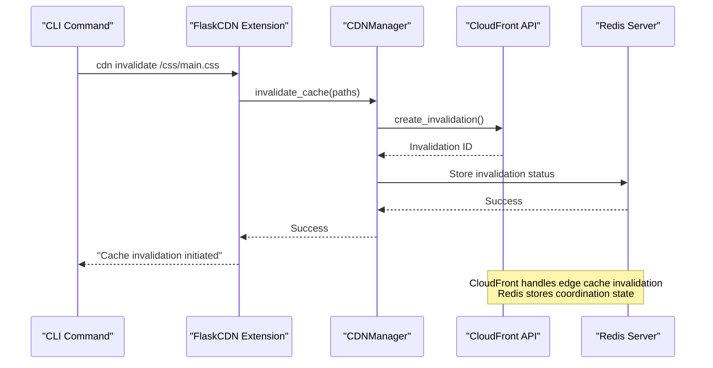
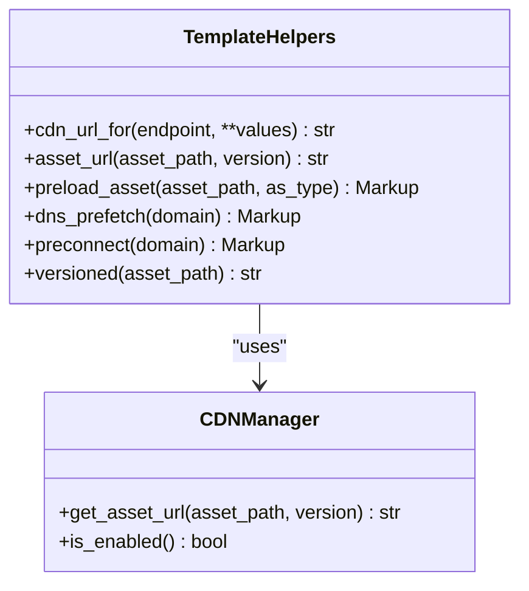

# CDN Integration

<cite>
**Referenced Files in This Document**   
- [flask_cdn.py](file://cache/flask_cdn.py)
- [cdn.yaml](file://config/cdn.yaml)
- [redis_client.py](file://cache/redis_client.py)
- [cdn.py](file://cache/cdn.py)
- [app.py](file://app.py)
</cite>

## Table of Contents
1. [Introduction](#introduction)
2. [CDN Integration Architecture](#cdn-integration-architecture)
3. [Configuration Management](#configuration-management)
4. [Cache Invalidation Workflow](#cache-invalidation-workflow)
5. [Template Integration and URL Generation](#template-integration-and-url-generation)
6. [Performance Optimization](#performance-optimization)
7. [Error Handling and Fallback Mechanisms](#error-handling-and-fallback-mechanisms)
8. [Troubleshooting Guide](#troubleshooting-guide)
9. [Best Practices](#best-practices)

## Introduction
This document details the CDN integration system designed to optimize delivery of static assets including CSS, JavaScript, and image files. The implementation leverages edge locations through a configurable CDN provider to reduce latency and improve application performance. The system integrates with Redis for cache coordination and provides comprehensive configuration options for domain mapping, asset versioning, and cache control policies.

## CDN Integration Architecture

```mermaid
graph TD
A[Flask Application] --> B[FlaskCDN Extension]
B --> C[CDNManager]
B --> D[AssetVersionManager]
C --> E[CloudFront/S3]
D --> F[Redis Client]
F --> G[Redis Server]
H[Template Engine] --> I[cdn_url_for]
H --> J[asset_url]
I --> C
J --> C
K[CLI Commands] --> L[cdn sync]
K --> M[cdn invalidate]
L --> C
M --> C
N[API Endpoints] --> O[/api/cdn/status]
N --> P[/api/cdn/sync]
N --> Q[/api/cdn/invalidate]
O --> C
P --> C
Q --> C
style A fill:#f9f,stroke:#333
style C fill:#bbf,stroke:#333
style F fill:#f96,stroke:#333
```

**Diagram sources**
- [flask_cdn.py](file://cache/flask_cdn.py#L1-L385)
- [cdn.py](file://cache/cdn.py#L1-L459)

**Section sources**
- [flask_cdn.py](file://cache/flask_cdn.py#L1-L385)
- [cdn.py](file://cache/cdn.py#L1-L459)

## Configuration Management

### CDN Provider Settings
The CDN configuration is managed through the `cdn.yaml` file, which supports multiple providers including CloudFront, Cloudflare, and generic CDN services. The primary configuration options include:

- **enabled**: Global toggle for CDN functionality
- **provider**: CDN provider selection (cloudfront, cloudflare, generic)
- **base_url**: CDN distribution domain
- **auto_version**: Automatic asset versioning for cache busting

### Domain Mapping
Domain mapping is configured through the `base_url` parameter, which specifies the CDN endpoint. Environment-specific configurations are supported through the `environments` section, allowing different domains for development, staging, and production environments.

### Asset Versioning Strategies
The system implements multiple asset versioning strategies:

1. **File modification time**: Uses the last modified timestamp of the asset file
2. **Content hash**: Generates MD5 hash of file content
3. **Global version**: Applies a single version to all assets
4. **Manifest-based**: Reads version information from build manifests



**Diagram sources**
- [cdn.py](file://cache/cdn.py#L150-L180)
- [flask_cdn.py](file://cache/flask_cdn.py#L110-L141)

**Section sources**
- [cdn.yaml](file://config/cdn.yaml#L1-L165)
- [cdn.py](file://cache/cdn.py#L1-L459)

## Cache Invalidation Workflow

### Redis Coordination Layer
The cache invalidation system uses Redis as a coordination layer through the `redis_client.py` module. The Redis client provides reliable connection management with automatic reconnection and health checking capabilities.



**Diagram sources**
- [flask_cdn.py](file://cache/flask_cdn.py#L232-L264)
- [cdn.py](file://cache/cdn.py#L300-L350)
- [redis_client.py](file://cache/redis_client.py#L1-L341)

**Section sources**
- [flask_cdn.py](file://cache/flask_cdn.py#L232-L264)
- [cdn.py](file://cache/cdn.py#L300-L350)
- [redis_client.py](file://cache/redis_client.py#L1-L341)

### Invalidation Process
The cache invalidation workflow follows these steps:
1. Receive invalidation request via CLI, API, or programmatic call
2. Validate CDN configuration and authentication
3. Format paths according to CDN provider requirements
4. Submit invalidation request to CDN provider API
5. Store invalidation status in Redis for monitoring
6. Return operation status to caller

## Template Integration and URL Generation

### Implementation Examples
The system provides template helpers to generate CDN-aware URLs for assets in the static directory:



**Diagram sources**
- [flask_cdn.py](file://cache/flask_cdn.py#L110-L141)
- [cdn.py](file://cache/cdn.py#L150-L180)

**Section sources**
- [flask_cdn.py](file://cache/flask_cdn.py#L110-L141)
- [cdn.py](file://cache/cdn.py#L150-L180)

### Usage in Templates
Template helpers are automatically registered and available in all templates:

- `cdn_url_for('static', filename='css/main.css')`: Generates CDN URL for static assets
- `asset_url('js/app.js', 'v1.2.3')`: Generates versioned asset URL
- `preload_asset('css/main.css')`: Generates preload link tag
- `dns_prefetch('fonts.googleapis.com')`: Generates DNS prefetch tag
- `preconnect('fonts.gstatic.com')`: Generates preconnect link tag

## Performance Optimization

### Cache Headers Configuration
The system implements optimized cache headers based on file type, configured in `cdn.yaml`:

```yaml
cache_control:
  "*.css": "public, max-age=31536000, immutable"
  "*.js": "public, max-age=31536000, immutable"
  "*.jpg": "public, max-age=86400"
  "*.png": "public, max-age=86400"
  "*.woff2": "public, max-age=31536000, immutable"
```

### Asset Minification
The configuration supports automatic minification of assets:

- CSS minification enabled by default
- JavaScript minification enabled by default
- HTML minification disabled by default
- Compression for text-based assets (CSS, JS, JSON, XML)

### Dynamic vs Static Content Handling
The system differentiates between dynamic and static content with appropriate caching strategies:

- Static assets (CSS, JS, images): Long-term caching (1 year) with immutable flag
- Documents (PDF, DOC): Medium-term caching (1 hour)
- HTML files: Short-term caching (5 minutes)
- JSON/XML: Short-term caching (5 minutes)

## Error Handling and Fallback Mechanisms

### CDN Outage Handling
The system implements graceful degradation during CDN outages:

1. **Automatic fallback**: When CDN is disabled or misconfigured, requests fall back to local static file serving
2. **Health monitoring**: Regular status checks through CLI and API endpoints
3. **Configuration validation**: Comprehensive testing of CDN connectivity and credentials

### Performance Benefits
- Reduced latency through edge location delivery
- Decreased origin server load
- Improved page load times
- Better user experience globally

### Cost Implications
- Reduced bandwidth costs on origin server
- Potential CDN provider costs based on traffic
- Cost savings from reduced server scaling requirements
- Trade-off between CDN costs and performance benefits

## Troubleshooting Guide

### Common Issues and Solutions
| Issue | Symptoms | Resolution |
|------|---------|------------|
| Broken asset links | 404 errors for static assets | Verify CDN base_url configuration and S3 bucket permissions |
| Stale content | Old versions of assets being served | Initiate cache invalidation for affected paths |
| SSL certificate errors | Mixed content warnings or blocked assets | Verify SSL certificate configuration on CDN endpoint |
| Sync failures | Assets not appearing on CDN | Check AWS credentials and S3 bucket configuration |
| Performance degradation | Slow asset loading | Verify cache control headers and CDN distribution status |

**Section sources**
- [flask_cdn.py](file://cache/flask_cdn.py#L232-L264)
- [cdn.py](file://cache/cdn.py#L300-L350)
- [cdn.yaml](file://config/cdn.yaml#L1-L165)

## Best Practices

### Cache Header Recommendations
- Use immutable flag for versioned static assets
- Set appropriate max-age values based on content type
- Implement ETag headers for conditional requests
- Use Cache-Control over Expires headers

### Asset Management
- Implement consistent versioning strategy
- Minify and compress assets before deployment
- Convert images to WebP format when possible
- Limit asset file sizes through optimization

### Monitoring and Maintenance
- Regularly test CDN connectivity using built-in commands
- Monitor cache hit ratios and adjust TTLs accordingly
- Implement automated sync processes for deployments
- Track invalidation requests and verify completion

### Security Considerations
- Use signed URLs for private content
- Implement proper CORS configuration
- Ensure SSL/TLS is properly configured on CDN
- Regularly rotate AWS credentials for S3 access

**Section sources**
- [cdn.yaml](file://config/cdn.yaml#L1-L165)
- [flask_cdn.py](file://cache/flask_cdn.py#L1-L385)
- [cdn.py](file://cache/cdn.py#L1-L459)