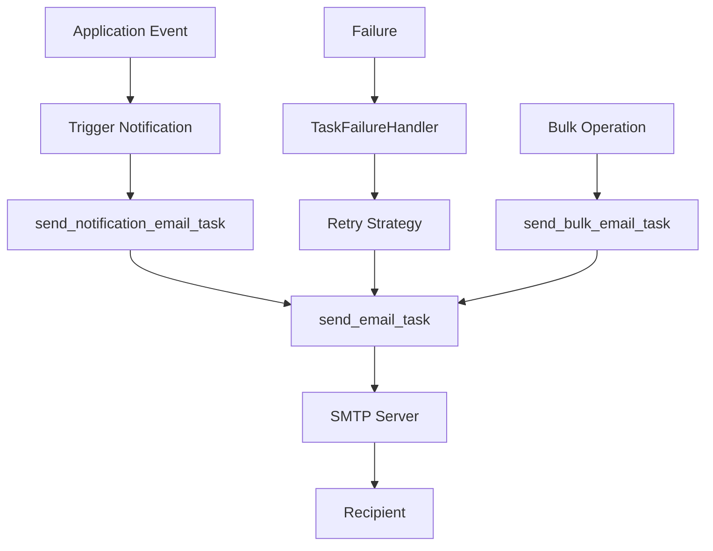
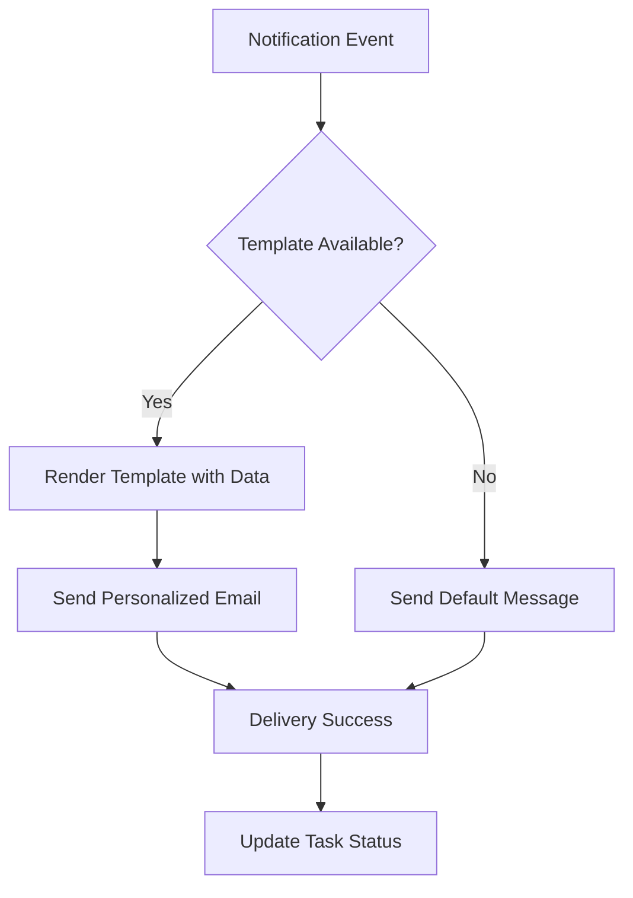
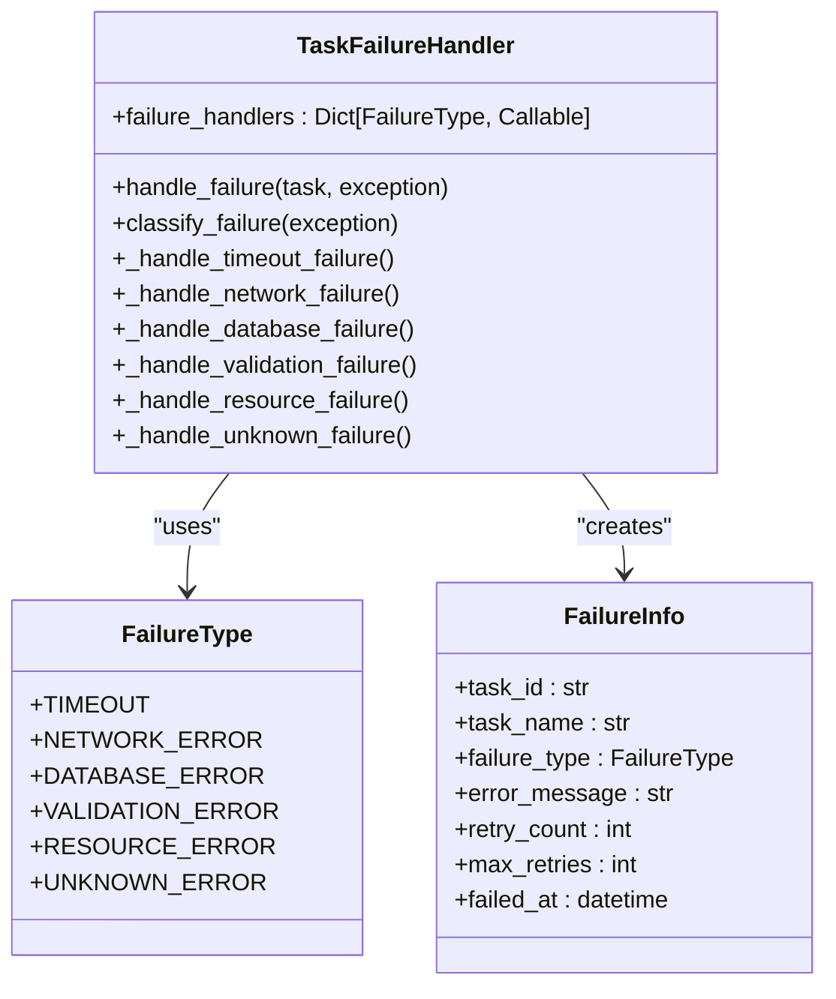

# Email Notifications

<cite>
**Referenced Files in This Document**   
- [email_tasks.py](file://tasks/email_tasks.py)
- [failure_handler.py](file://tasks/failure_handler.py)
- [app.yaml](file://config/app.yaml)
- [secrets.py](file://config/secrets.py)
- [approve.html](file://templates/approve.html)
</cite>

## Table of Contents
1. [Introduction](#introduction)
2. [Email Task Architecture](#email-task-architecture)
3. [Core Email Tasks](#core-email-tasks)
4. [Configuration and Integration](#configuration-and-integration)
5. [Template Rendering and Personalization](#template-rendering-and-personalization)
6. [Error Handling and Retry Mechanisms](#error-handling-and-retry-mechanisms)
7. [SMTP Configuration and Security](#smtp-configuration-and-security)
8. [Troubleshooting Common Issues](#troubleshooting-common-issues)
9. [Performance Optimization](#performance-optimization)
10. [Conclusion](#conclusion)

## Introduction
The email notification system in the SAT Report Generator leverages Celery for asynchronous task processing and SMTP for reliable email delivery. This system handles critical notifications for report submissions, approvals, and rejections, ensuring timely communication with stakeholders. The architecture integrates Flask's templating system with Jinja2 for dynamic content generation and employs robust error handling through Celery's retry mechanisms and custom failure handlers. This document provides a comprehensive analysis of the email notification workflow, configuration requirements, and operational best practices.

## Email Task Architecture



**Diagram sources**
- [email_tasks.py](file://tasks/email_tasks.py#L1-L402)

**Section sources**
- [email_tasks.py](file://tasks/email_tasks.py#L1-L402)

## Core Email Tasks

The email_tasks.py module defines three primary Celery tasks for handling different email scenarios:

1. **send_email_task**: Core function for sending individual emails with support for plain text, HTML, and attachments
2. **send_bulk_email_task**: Handles mass email distribution with batching and progress tracking
3. **send_notification_email_task**: Specialized task for system notifications with predefined templates

Each task is configured with appropriate retry policies and progress reporting to ensure reliable delivery.

**Section sources**
- [email_tasks.py](file://tasks/email_tasks.py#L1-L402)

## Configuration and Integration

Email configuration is managed through a layered approach combining app.yaml for general settings and secrets.py for sensitive credentials:

```yaml
# Email configuration in app.yaml
email:
  smtp_server: "smtp.gmail.com"
  smtp_port: 587
  use_tls: true
  username: ""
  password: ""
  default_sender: ""
```

The system retrieves credentials from multiple sources in order of preference:
1. HashiCorp Vault (production)
2. Encrypted local storage
3. Environment variables
4. Configuration files

This hierarchical approach ensures security while maintaining flexibility across deployment environments.

**Section sources**
- [app.yaml](file://config/app.yaml#L25-L33)
- [secrets.py](file://config/secrets.py#L1-L688)

## Template Rendering and Personalization

The system supports dynamic email content through Jinja2 template rendering. Notification templates are defined within the send_notification_email_task function and include:

- **report_approved**: Notifies users when their report is approved
- **report_rejected**: Informs users of report rejection with reason
- **approval_request**: Alerts approvers of pending reports

Template variables include user names, report titles, document references, timestamps, and action URLs. The system falls back to static content if template rendering fails, ensuring message delivery even in error conditions.



**Diagram sources**
- [email_tasks.py](file://tasks/email_tasks.py#L250-L350)
- [approve.html](file://templates/approve.html#L1-L195)

**Section sources**
- [email_tasks.py](file://tasks/email_tasks.py#L250-L350)

## Error Handling and Retry Mechanisms

The system implements comprehensive error handling through the failure_handler.py module, which classifies failures and applies appropriate recovery strategies:



**Diagram sources**
- [failure_handler.py](file://tasks/failure_handler.py#L1-L351)

**Section sources**
- [failure_handler.py](file://tasks/failure_handler.py#L1-L351)

The retry strategy varies by failure type:
- **Timeout**: Exponential backoff up to 5 minutes
- **Network**: Progressive delays up to 10 minutes
- **Database**: Shorter retries for transient errors
- **Resource**: Extended delays up to 30 minutes
- **Validation**: No retry (permanent error)
- **Unknown**: Conservative retry policy (maximum 2 attempts)

Failed tasks are logged in Redis with a 24-hour retention period, and failure statistics are available through the get_failure_statistics method.

## SMTP Configuration and Security

### Configuration Requirements
To configure outbound email, update the following settings in app.yaml:

```yaml
email:
  smtp_server: "your-smtp-server.com"
  smtp_port: 587
  use_tls: true
  username: "your-username"
  password: "your-password"
  default_sender: "noreply@yourdomain.com"
```

### Authentication Methods
The system supports multiple authentication methods:
- **Basic Authentication**: Username and password
- **App Passwords**: For services like Gmail
- **OAuth2**: Through Vault-managed tokens
- **API Keys**: Service-specific authentication

### Security Settings
- TLS/SSL encryption is enabled by default (port 587 with STARTTLS)
- Credentials are never stored in plain text
- All secrets are encrypted at rest
- Automatic credential rotation is supported
- Connection security is validated before sending

For testing, mail traps can be configured by redirecting emails to a test SMTP server or using services like Mailtrap.io.

**Section sources**
- [app.yaml](file://config/app.yaml#L25-L33)
- [secrets.py](file://config/secrets.py#L1-L688)

## Troubleshooting Common Issues

### Spam Filtering
- Ensure proper SPF, DKIM, and DMARC records
- Use a consistent sender address
- Avoid spam trigger words in subject lines
- Maintain good sender reputation
- Implement proper email authentication

### Missing Templates
- Verify template files exist in the templates directory
- Check file permissions
- Ensure template paths are correct
- Validate Jinja2 syntax in templates
- Confirm template variables match data structure

### Task Queue Bottlenecks
- Monitor Celery worker utilization
- Scale workers based on email volume
- Adjust batch sizes for bulk operations
- Optimize database queries in email preparation
- Implement rate limiting to avoid SMTP throttling

### Delivery Failures
- Check SMTP server connectivity
- Verify credentials and authentication
- Validate sender and recipient addresses
- Monitor rate limits and quotas
- Review firewall and network policies

**Section sources**
- [email_tasks.py](file://tasks/email_tasks.py#L1-L402)
- [failure_handler.py](file://tasks/failure_handler.py#L1-L351)

## Performance Optimization

For high-volume email scenarios, consider the following optimizations:

1. **Batch Processing**: Use send_bulk_email_task with appropriate batch sizes (default 50)
2. **Connection Pooling**: Maintain persistent SMTP connections
3. **Caching**: Cache frequently used template data
4. **Worker Scaling**: Deploy multiple Celery workers
5. **Asynchronous DNS**: Reduce connection latency
6. **Compression**: Compress large attachments
7. **Queue Prioritization**: Implement priority queues for critical notifications

Monitor system performance using the built-in metrics and adjust configuration parameters accordingly. The system can handle thousands of emails per hour with proper tuning and infrastructure.

**Section sources**
- [email_tasks.py](file://tasks/email_tasks.py#L150-L200)
- [failure_handler.py](file://tasks/failure_handler.py#L1-L351)

## Conclusion
The email notification system provides a robust, secure, and scalable solution for delivering critical notifications in the SAT Report Generator application. By leveraging Celery's asynchronous processing capabilities and implementing comprehensive error handling, the system ensures reliable message delivery even under adverse conditions. The layered configuration approach balances security with flexibility, while the template system enables personalized communication. Properly configured and monitored, this system can effectively support the application's notification requirements at any scale.