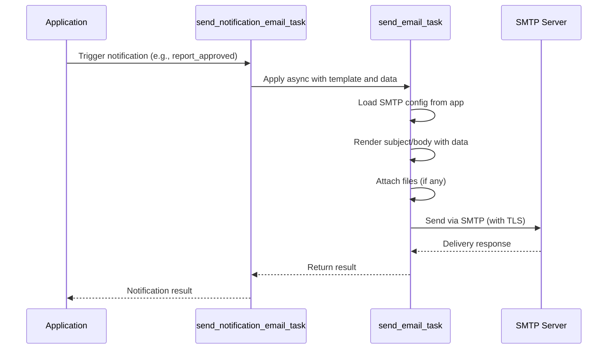
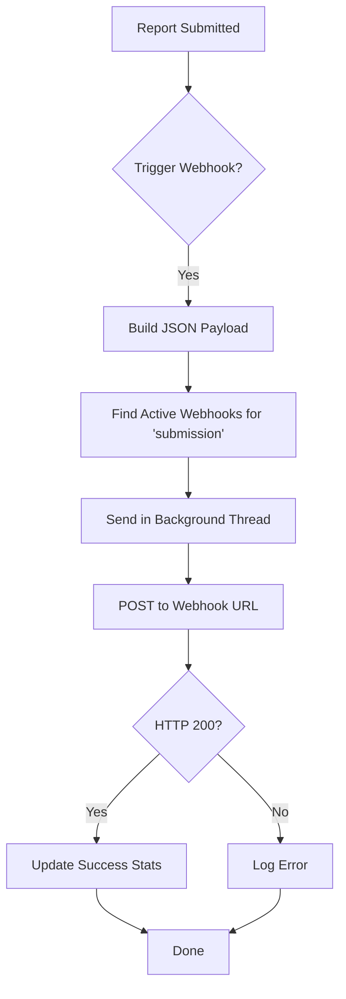
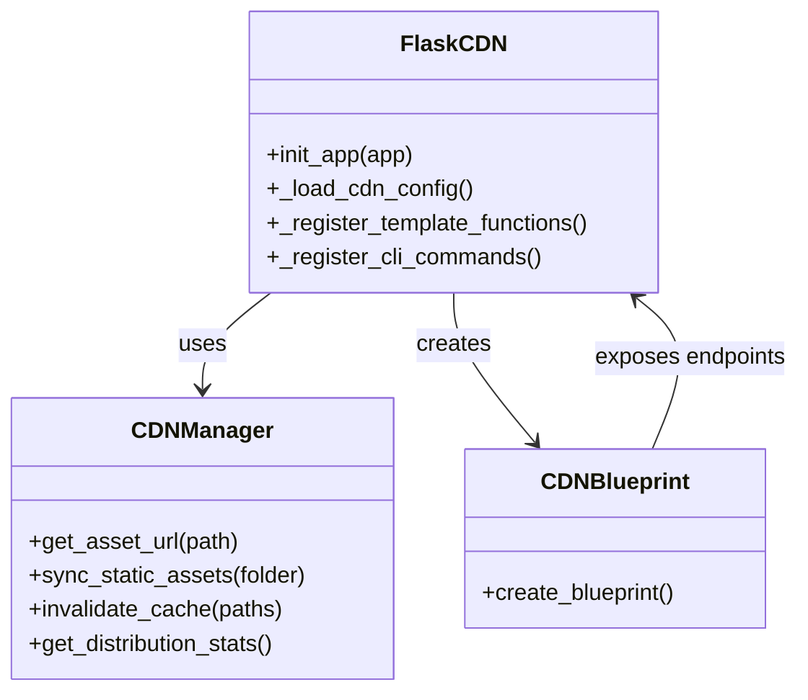
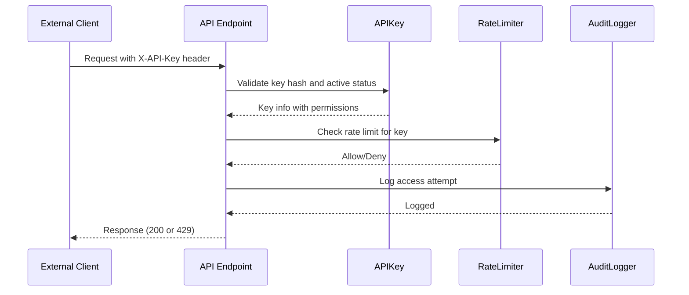

# External Integrations

<cite>
**Referenced Files in This Document**   
- [tasks/email_tasks.py](file://tasks/email_tasks.py)
- [routes/webhooks.py](file://routes/webhooks.py)
- [cache/flask_cdn.py](file://cache/flask_cdn.py)
- [api/keys.py](file://api/keys.py)
- [config/cdn.yaml](file://config/cdn.yaml)
- [config/app.yaml](file://config/app.yaml)
</cite>

## Table of Contents
1. [Email Notification System](#email-notification-system)
2. [Webhook System](#webhook-system)
3. [CDN Integration](#cdn-integration)
4. [API Key Management](#api-key-management)
5. [Security Considerations](#security-considerations)

## Email Notification System

The SERVER application uses Celery-based asynchronous tasks to manage email notifications through the `email_tasks.py` module. This system enables non-blocking email delivery, template rendering, and retry mechanisms for reliable communication.

Email configuration is sourced from the application’s configuration files, particularly `config/app.yaml`, where SMTP settings such as server, port, TLS usage, and credentials are defined. The system supports both plain text and HTML emails, with optional file attachments encoded in base64.

Template rendering is implemented using Flask’s `render_template_string`, allowing dynamic content insertion via Jinja2-like syntax. Predefined notification types—such as report approval, rejection, and submission requests—are managed by `send_notification_email_task`, which selects appropriate templates and populates them with context data.

The email task includes built-in retry logic (up to 3 attempts) on SMTP failures, ensuring resilience against transient network issues. Progress tracking is available through Celery task states, providing visibility into email preparation, attachment handling, and delivery phases.

**Diagram sources**
- [tasks/email_tasks.py](file://tasks/email_tasks.py#L150-L400)

**Section sources**
- [tasks/email_tasks.py](file://tasks/email_tasks.py#L1-L400)
- [config/app.yaml](file://config/app.yaml#L25-L31)

## Webhook System

The webhook system, implemented in `routes/webhooks.py`, allows external systems to receive real-time event notifications when key actions occur within the SERVER application. These events include report submission, approval, rejection, and completion.

Webhooks are managed through a RESTful API accessible only to users with Admin privileges. Administrators can create, update, test, and delete webhook endpoints via dedicated routes. Each webhook is configured with:
- A descriptive name
- Target URL for POST requests
- Event type filter (e.g., submission, approval)
- Custom HTTP headers
- Active/inactive status

When an event occurs (e.g., a report is approved), the corresponding trigger function (`on_report_approved`) constructs a JSON payload and asynchronously dispatches it to all active webhooks matching the event type. Dispatching occurs in background threads to prevent blocking the main application flow.

Each webhook request includes a JSON payload containing event metadata and relevant report details. The system tracks delivery statistics, including last trigger time and success/failure count. A built-in test endpoint allows administrators to validate webhook connectivity using sample data.

**Diagram sources**
- [routes/webhooks.py](file://routes/webhooks.py#L150-L270)

**Section sources**
- [routes/webhooks.py](file://routes/webhooks.py#L1-L274)

## CDN Integration

Static asset delivery is optimized through the FlaskCDN extension located in `cache/flask_cdn.py`. This integration enables serving CSS, JavaScript, images, and other static files via a Content Delivery Network (CDN), improving load times and reducing server bandwidth usage.

Configuration is managed through `config/cdn.yaml`, which defines CDN provider settings (e.g., CloudFront), base URL, cache control policies, and environment-specific overrides. The system supports AWS CloudFront natively, with fallback support for generic providers.

Key features include:
- Automatic asset URL rewriting using `cdn_url_for` in templates
- Cache busting via file versioning
- Support for environment-specific configurations (development, staging, production)
- CLI and API endpoints for syncing assets and invalidating cache

Cache invalidation is handled through the `/api/cdn/invalidate` endpoint or CLI command, allowing selective purging of stale content. Asset synchronization can be triggered manually or automated via deployment scripts.

Cache control headers are configured per file type, enabling fine-grained control over browser and CDN caching behavior. For example, CSS and JS files are served with immutable caching (1 year), while HTML files use short-lived caching (5 minutes).

**Diagram sources**
- [cache/flask_cdn.py](file://cache/flask_cdn.py#L50-L300)

**Section sources**
- [cache/flask_cdn.py](file://cache/flask_cdn.py#L1-L385)
- [config/cdn.yaml](file://config/cdn.yaml#L1-L165)

## API Key Management

Third-party access to the SERVER application is controlled through API keys managed in `api/keys.py`. This system provides secure, auditable, and rate-limited access to RESTful endpoints.

API keys are created, updated, and revoked via a Flask-RESTx namespace (`/api/keys`). Each key includes:
- Unique identifier and name
- Description and creation timestamp
- Permissions scope (e.g., reports:read, users:create)
- Rate limit (requests per hour)
- Expiration date (optional)
- Active/inactive status

Keys are cryptographically secure, generated using system randomness and stored as salted hashes. When a key is created or regenerated, the plaintext value is returned only once.

Permissions are organized into logical groups (reports, users, files, admin), allowing granular access control. Role-based access ensures that only Admins and authorized users (e.g., PM, Automation Manager) can manage keys.

Usage statistics are tracked in the `APIUsage` model, providing insights into request volume, error rates, top endpoints, and response times. A dedicated `/usage` endpoint allows key owners and admins to monitor consumption patterns.

**Diagram sources**
- [api/keys.py](file://api/keys.py#L150-L300)

**Section sources**
- [api/keys.py](file://api/keys.py#L1-L453)

## Security Considerations

Exposing external integration points requires careful security planning to prevent abuse, data leakage, and service disruption.

For **email integrations**, ensure SMTP credentials are stored securely using environment variables or secret management tools. Avoid hardcoding credentials in configuration files. Enable TLS and validate certificates to prevent interception.

For **webhooks**, validate incoming payloads using signature verification if supported by the receiving system. Implement timeout and retry limits to prevent denial-of-service from misconfigured endpoints. Monitor for failed deliveries and alert administrators of persistent issues.

For **CDN integration**, restrict S3 bucket access using IAM policies and ensure CloudFront distributions use signed URLs or OAI (Origin Access Identity). Avoid exposing sensitive files via CDN; use authentication gates for private content.

For **API keys**, enforce strong rate limiting to prevent brute-force attacks. Rotate keys regularly and provide mechanisms for immediate revocation. Never expose keys in client-side code or logs. Use HTTPS exclusively for all API communications.

All integration endpoints should be protected by role-based access control (RBAC), ensuring only authorized users can configure or manage external connections. Audit logs must record all configuration changes and access attempts for compliance and forensic analysis.

**Section sources**
- [tasks/email_tasks.py](file://tasks/email_tasks.py#L1-L400)
- [routes/webhooks.py](file://routes/webhooks.py#L1-L274)
- [cache/flask_cdn.py](file://cache/flask_cdn.py#L1-L385)
- [api/keys.py](file://api/keys.py#L1-L453)