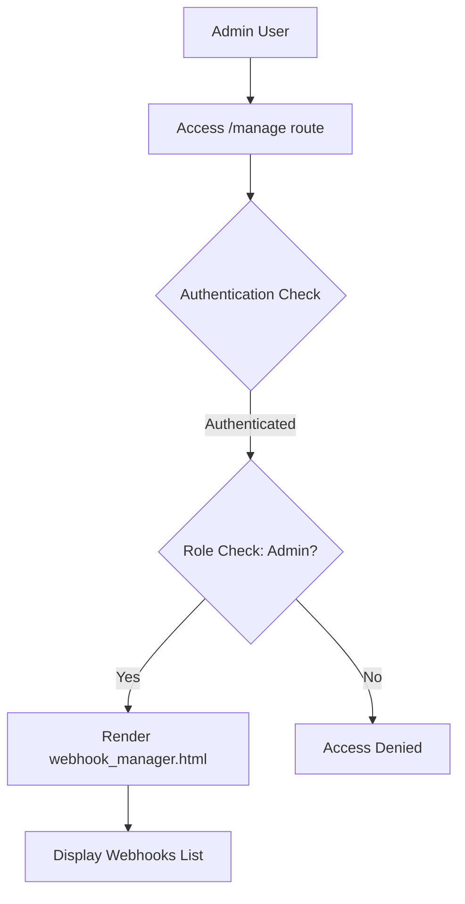
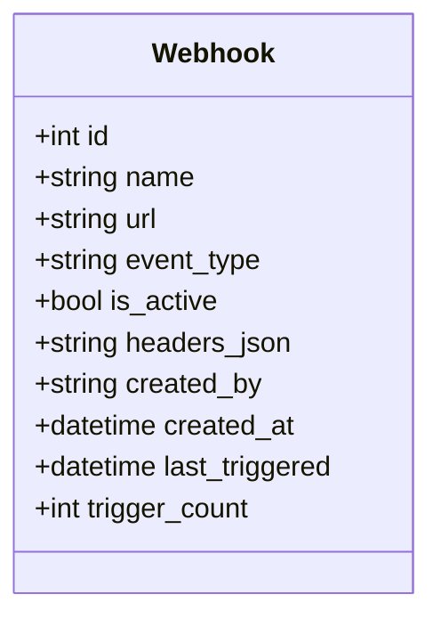
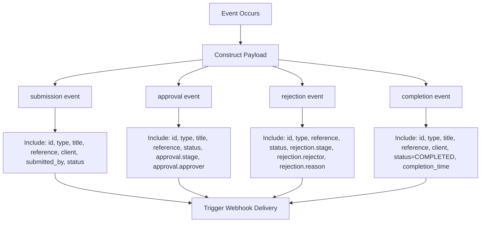
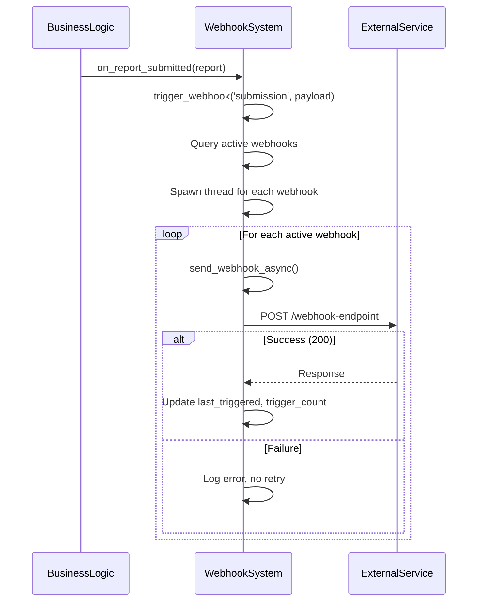
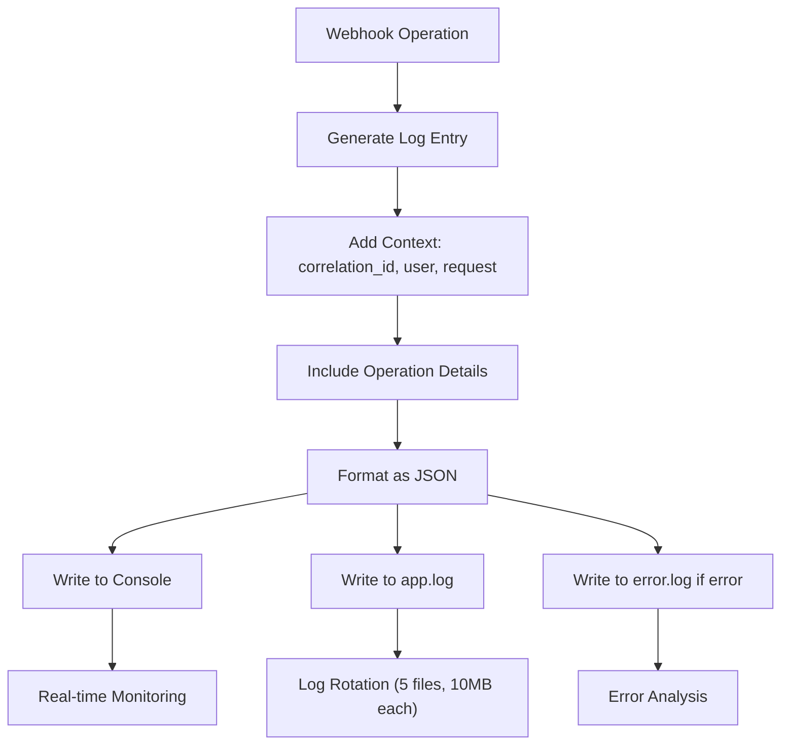
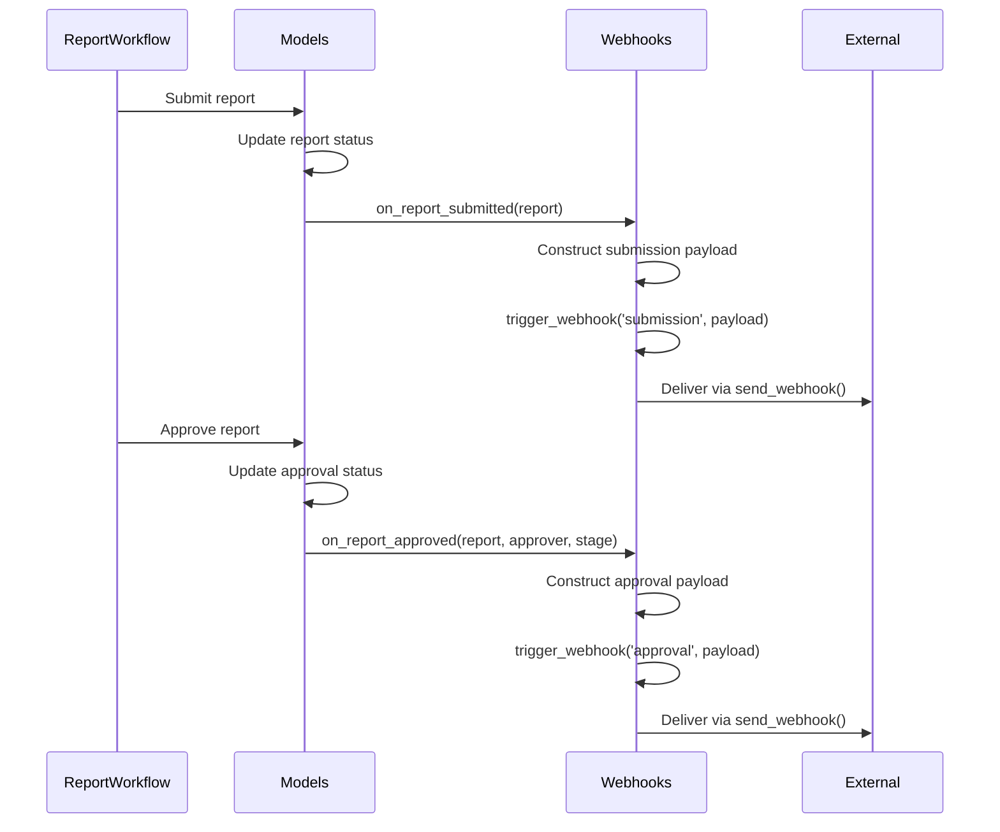

# Webhooks

<cite>
**Referenced Files in This Document**   
- [webhooks.py](file://routes/webhooks.py)
- [models.py](file://models.py)
- [logging_config.py](file://monitoring/logging_config.py)
</cite>

## Table of Contents
1. [Introduction](#introduction)
2. [Webhook Management Interface](#webhook-management-interface)
3. [Webhook Configuration and Lifecycle](#webhook-configuration-and-lifecycle)
4. [Event Types and Payload Structure](#event-types-and-payload-structure)
5. [Webhook Delivery Mechanism](#webhook-delivery-mechanism)
6. [Security Considerations](#security-considerations)
7. [Logging and Monitoring](#logging-and-monitoring)
8. [Troubleshooting Guide](#troubleshooting-guide)
9. [Integration with Business Logic](#integration-with-business-logic)

## Introduction
The webhook system in the SAT Report Generator enables event-driven integration with external services by notifying third-party systems when critical events occur. These events include report submission, approval, rejection, and completion. The system is implemented in `routes/webhooks.py` and provides a management interface for administrators to configure webhook endpoints. Webhooks are triggered from business logic in the application and deliver payloads via HTTP POST requests to registered URLs. The system includes retry avoidance through asynchronous delivery, logging via structured logging, and security features to protect against common threats.

**Section sources**
- [webhooks.py](file://routes/webhooks.py#L1-L20)
- [models.py](file://models.py#L279-L295)

## Webhook Management Interface
The webhook management system provides a web interface accessible only to users with the Admin role. The `/manage` route renders the `webhook_manager.html` template, displaying all configured webhooks. Administrators can create, update, test, and delete webhook configurations through this interface. The management functionality is protected by role-based access control using the `@role_required(['Admin'])` decorator, ensuring only authorized users can modify webhook settings.

**Diagram sources**
- [webhooks.py](file://routes/webhooks.py#L15-L25)

**Section sources**
- [webhooks.py](file://routes/webhooks.py#L15-L30)

## Webhook Configuration and Lifecycle
Webhook configurations are stored in the database using the `Webhook` model, which defines fields for name, target URL, event type, custom headers, activation status, and metadata. Administrators can perform CRUD operations on webhooks through dedicated API endpoints: `/api/create` (POST), `/api/update/<id>` (PUT), and `/api/delete/<id>` (DELETE). Each webhook can be individually activated or deactivated, allowing temporary suspension without deletion. The system also provides a test endpoint (`/api/test/<id>`) that sends a sample payload to verify endpoint connectivity and response handling.

**Diagram sources**
- [models.py](file://models.py#L279-L295)

**Section sources**
- [webhooks.py](file://routes/webhooks.py#L35-L140)
- [models.py](file://models.py#L279-L295)

## Event Types and Payload Structure
The system supports four primary event types: submission, approval, rejection, and completion. Each event type has a specific payload structure containing relevant contextual data. The payload always includes an event identifier, timestamp, and report information such as ID, type, title, and reference. Approval and rejection events include additional details about the approver/rejector, stage, and reason. Completion events include a completion timestamp. All payloads are delivered as JSON via HTTP POST requests with Content-Type: application/json.

**Diagram sources**
- [webhooks.py](file://routes/webhooks.py#L200-L273)

**Section sources**
- [webhooks.py](file://routes/webhooks.py#L200-L273)

## Webhook Delivery Mechanism
Webhook delivery is handled asynchronously using Python threading to prevent blocking the main application flow. When an event occurs, the `trigger_webhook()` function queries for all active webhooks matching the event type and spawns a background thread for each delivery. The `send_webhook()` function performs the actual HTTP POST request with a 10-second timeout. Upon successful delivery (HTTP 200), the webhook's `last_triggered` timestamp and `trigger_count` are updated. Delivery failures due to timeouts or connection issues are captured in the response but do not retry automatically. The asynchronous design ensures that webhook delivery issues do not impact core application functionality.

**Diagram sources**
- [webhooks.py](file://routes/webhooks.py#L145-L198)

**Section sources**
- [webhooks.py](file://routes/webhooks.py#L145-L198)

## Security Considerations
The webhook system implements several security measures to protect against common threats. While the current implementation does not include HMAC signatures or API key authentication in the delivery mechanism, it restricts webhook management to administrators only. The system should validate callback URLs to prevent Server-Side Request Forgery (SSRF) attacks by rejecting internal network addresses and localhost. Payloads should be carefully constructed to avoid exposing sensitive data beyond what is necessary for integration purposes. Future enhancements could include signature verification and IP allowlisting for incoming webhook responses. The management interface is protected by Flask-Login authentication and role-based access control.

**Section sources**
- [webhooks.py](file://routes/webhooks.py#L15-L30)
- [webhooks.py](file://routes/webhooks.py#L35-L140)

## Logging and Monitoring
Webhook operations are integrated with the application's structured logging system defined in `monitoring/logging_config.py`. All webhook-related operations are logged with contextual information including correlation IDs, user context, request details, and performance metrics. Error conditions such as delivery failures, database errors, and timeout exceptions are captured with full stack traces. The logging system uses structlog to produce JSON-formatted logs that include timestamps, log levels, and structured data for easy parsing and analysis. Logs are written to both console output and rotating file handlers, with errors directed to a separate error log file. This comprehensive logging enables monitoring of webhook delivery success rates and troubleshooting of delivery issues.

**Diagram sources**
- [logging_config.py](file://monitoring/logging_config.py#L1-L422)

**Section sources**
- [logging_config.py](file://monitoring/logging_config.py#L1-L422)
- [webhooks.py](file://routes/webhooks.py#L25-L30)

## Troubleshooting Guide
Common webhook issues and their solutions:

**Timeout Errors**: If webhook deliveries fail with "Request timeout" messages, verify that the target service is reachable and responsive. Consider increasing the timeout value in the `send_webhook()` function if the external service requires more processing time.

**Misconfigured Endpoints**: Test webhook configurations using the built-in test functionality (`/api/test/<id>`). Ensure the target URL is correct, accessible from the server, and accepts POST requests with JSON payloads. Check firewall rules and network connectivity.

**Authentication Failures**: If the external service requires authentication, configure the necessary headers (e.g., API keys, Bearer tokens) in the webhook settings. Use the headers_json field to include Authorization headers.

**Payload Format Issues**: Verify that the external service expects the JSON structure sent by the webhook system. The payload format is fixed based on the event type and cannot be customized through the UI.

**Delivery Failures**: Check the application logs for detailed error messages. Common causes include DNS resolution failures, connection refused errors, and SSL/TLS handshake issues. Ensure the server has outbound internet access if calling external services.

**Section sources**
- [webhooks.py](file://routes/webhooks.py#L175-L190)
- [logging_config.py](file://monitoring/logging_config.py#L1-L422)

## Integration with Business Logic
The webhook system is integrated into the application's business logic through dedicated trigger functions that are called from various parts of the codebase. Functions like `on_report_submitted()`, `on_report_approved()`, `on_report_rejected()`, and `on_report_completed()` are invoked from the relevant business processes in `models.py` and other modules. These functions extract relevant data from the report object and construct appropriately formatted payloads before calling `trigger_webhook()` with the event type and payload. This decoupled design allows the core business logic to remain unaware of webhook specifics while enabling event-driven integrations. The trigger functions serve as the integration points between business operations and external system notifications.

**Diagram sources**
- [webhooks.py](file://routes/webhooks.py#L200-L273)
- [models.py](file://models.py#L279-L295)

**Section sources**
- [webhooks.py](file://routes/webhooks.py#L200-L273)
- [models.py](file://models.py#L279-L295)