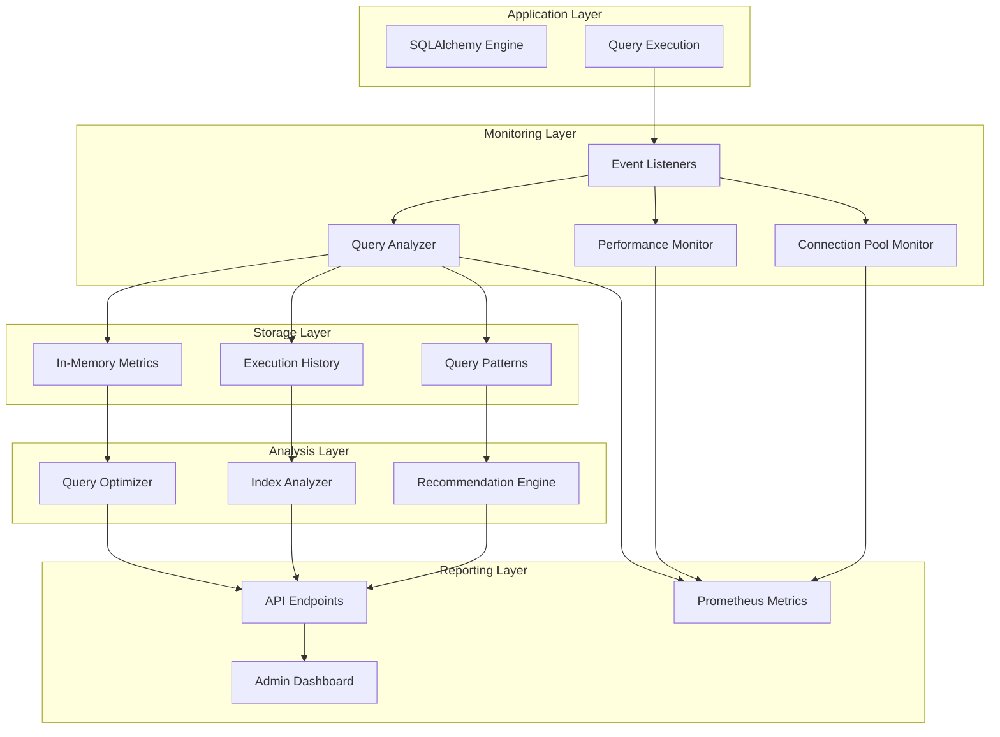
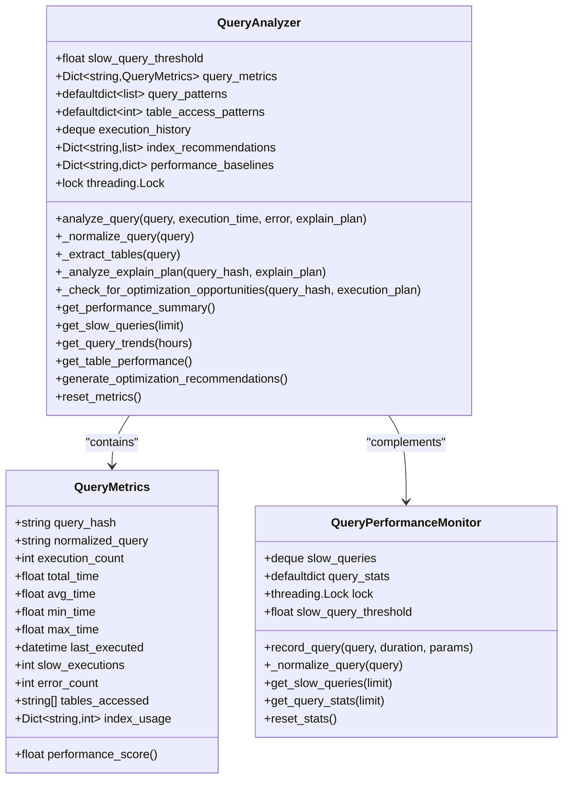
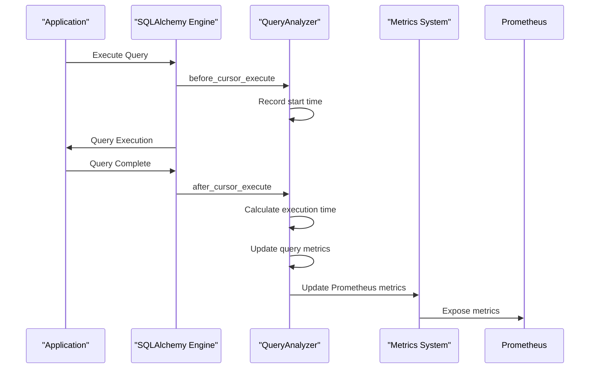
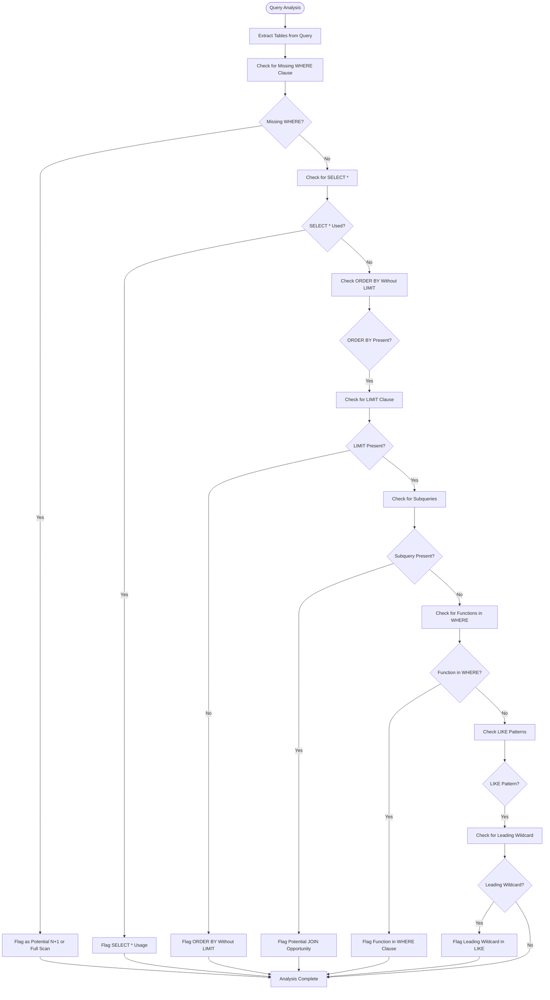
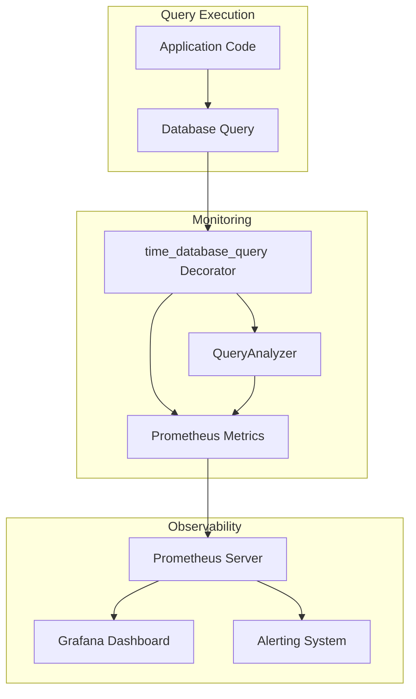
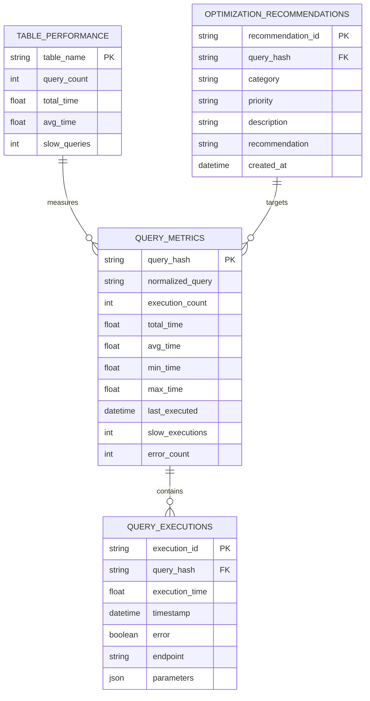
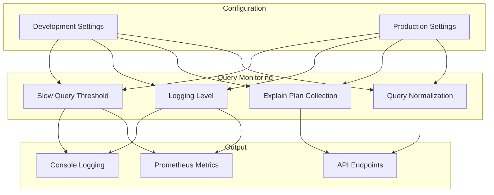
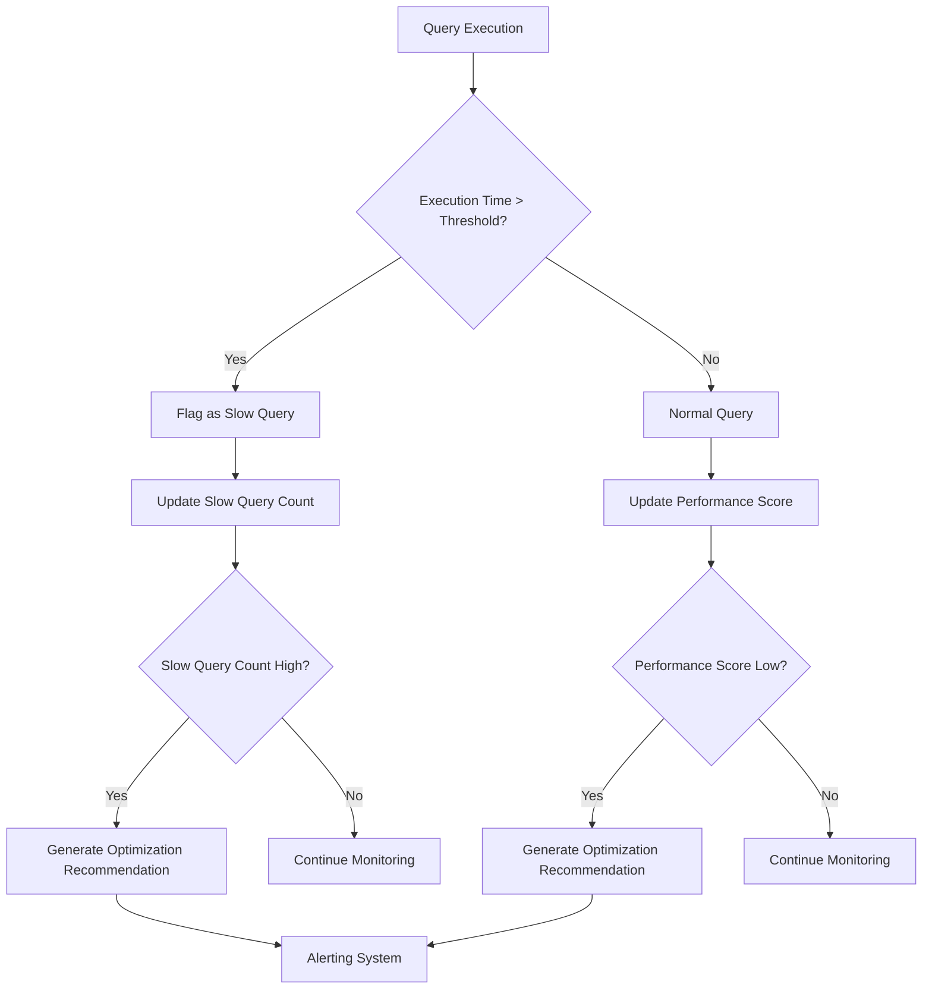

# Database Query Monitoring

<cite>
**Referenced Files in This Document**   
- [database/query_analyzer.py](file://database/query_analyzer.py)
- [monitoring/metrics.py](file://monitoring/metrics.py)
- [database/performance.py](file://database/performance.py)
- [api/database_performance.py](file://api/database_performance.py)
- [database/pooling.py](file://database/pooling.py)
- [database/query_cache.py](file://database/query_cache.py)
- [app.py](file://app.py)
- [database/__init__.py](file://database/__init__.py)
- [api/database.py](file://api/database.py)
</cite>

## Table of Contents
1. [Introduction](#introduction)
2. [Query Analysis Architecture](#query-analysis-architecture)
3. [Core Components](#core-components)
4. [Performance Metrics Collection](#performance-metrics-collection)
5. [Anti-Pattern Detection](#anti-pattern-detection)
6. [Integration with Application Metrics](#integration-with-application-metrics)
7. [Optimization Use Cases](#optimization-use-cases)
8. [Development Configuration](#development-configuration)
9. [Thresholds and Alerting](#thresholds-and-alerting)
10. [API Endpoints](#api-endpoints)
11. [Conclusion](#conclusion)

## Introduction

The Database Query Monitoring system provides comprehensive analysis of SQL queries executed by SQLAlchemy in the SAT Report Generator application. This system captures, analyzes, and logs query performance metrics to identify optimization opportunities and prevent performance degradation in database-intensive operations. The monitoring framework integrates with the application's metrics system to expose key performance indicators and enable proactive optimization of critical workflows such as report generation and search operations.

The system is designed to detect common database anti-patterns including N+1 queries, full table scans, and inefficient query structures. It provides developers with actionable insights to optimize query performance and maintain optimal database health. The monitoring infrastructure is configurable for different environments, allowing developers to enable detailed query logging in development while maintaining performance in production.

**Section sources**
- [database/query_analyzer.py](file://database/query_analyzer.py#L1-L50)
- [app.py](file://app.py#L1-L100)

## Query Analysis Architecture

The query monitoring system employs a multi-layered architecture that captures query execution data at the SQLAlchemy engine level and processes it through specialized components for analysis and reporting. The architecture follows a producer-consumer pattern where query events are captured by event listeners and processed by analysis components.



**Diagram sources**
- [database/query_analyzer.py](file://database/query_analyzer.py#L100-L200)
- [database/performance.py](file://database/performance.py#L50-L100)
- [monitoring/metrics.py](file://monitoring/metrics.py#L50-L100)

## Core Components

The query monitoring system consists of several core components that work together to capture, analyze, and report on database query performance. The primary component is the QueryAnalyzer class, which captures query execution metrics and analyzes performance patterns. This component works in conjunction with the QueryPerformanceMonitor and ConnectionPoolMonitor to provide comprehensive database performance insights.

The QueryMetrics dataclass stores detailed performance information for each unique query pattern, including execution count, timing statistics, and error rates. The analyzer normalizes queries to group similar queries together, enabling the identification of performance trends across query patterns rather than individual query instances.



**Section sources**
- [database/query_analyzer.py](file://database/query_analyzer.py#L50-L300)
- [database/performance.py](file://database/performance.py#L50-L150)

## Performance Metrics Collection

The system collects comprehensive performance metrics for all SQL queries executed through SQLAlchemy. Metrics collection is implemented using SQLAlchemy event listeners that capture query execution events at key points in the query lifecycle. The before_cursor_execute event records the start time of each query, while the after_cursor_execute event captures completion and calculates execution duration.

The QueryAnalyzer class processes these events to update performance metrics for each query pattern. For each query, the system captures execution count, total execution time, average execution time, minimum and maximum execution times, and the number of slow executions. The slow_query_threshold parameter determines which queries are considered slow, with a default threshold of 1.0 seconds.



The system also captures query execution history for trend analysis, storing the last 10,000 execution records. This history includes query hash, execution time, timestamp, error status, and the API endpoint that triggered the query. The execution history enables analysis of query performance trends over time and correlation with specific application endpoints.

**Section sources**
- [database/query_analyzer.py](file://database/query_analyzer.py#L300-L400)
- [monitoring/metrics.py](file://monitoring/metrics.py#L100-L150)

## Anti-Pattern Detection

The query monitoring system includes sophisticated anti-pattern detection capabilities to identify common database performance issues. The QueryOptimizer class implements a rule-based analysis system that examines query patterns for known performance anti-patterns.

The system detects several types of anti-patterns:

1. **N+1 Query Problem**: The system identifies when multiple similar queries are executed in a loop, typically when retrieving related data without proper joins. This is detected by analyzing query patterns and execution frequency.

2. **Full Table Scans**: The analyzer checks execution plans for table scan operations and recommends appropriate indexes. When a query performs a table scan, the system flags it as a high-severity issue.

3. **Missing WHERE Clauses**: Queries without WHERE clauses that may return excessive data are identified as potential performance issues.

4. **SELECT *** Usage: The system flags queries using SELECT * as they retrieve unnecessary data, increasing network overhead and memory usage.

5. **ORDER BY Without LIMIT**: Queries with ORDER BY clauses but no LIMIT are identified as they sort entire result sets unnecessarily.

6. **Subqueries That Could Be JOINs**: The system identifies correlated subqueries that could be more efficiently expressed as JOINs.

7. **Functions in WHERE Clauses**: Queries with functions in WHERE clauses are flagged as they prevent index usage.

8. **Leading Wildcards in LIKE Patterns**: LIKE patterns with leading wildcards are identified as they prevent index usage.



**Section sources**
- [database/performance.py](file://database/performance.py#L500-L800)
- [database/query_analyzer.py](file://database/query_analyzer.py#L400-L450)

## Integration with Application Metrics

The query monitoring system is tightly integrated with the application's metrics infrastructure, exposing key performance indicators through Prometheus. The integration is implemented through the monitoring/metrics.py module, which defines Prometheus metrics for database operations.

The system exposes several database-related metrics:

- **database_query_duration_seconds**: Histogram that captures the duration of database queries, labeled by query type
- **database_queries_total**: Counter that tracks the total number of database queries, labeled by query type and status
- **database_connections_active**: Gauge that shows the number of active database connections

These metrics are updated by the QueryAnalyzer and related components whenever a query is executed. The time_database_query decorator is used to automatically time database queries and update the appropriate metrics. This decorator wraps database operations and records execution time and success/failure status.



The integration also includes correlation with application-level KPIs such as HTTP request duration and user-facing response times. This allows developers to understand the impact of database performance on overall application performance. The system tracks the API endpoint that triggered each query, enabling correlation between specific application features and database performance.

**Section sources**
- [monitoring/metrics.py](file://monitoring/metrics.py#L150-L250)
- [database/query_analyzer.py](file://database/query_analyzer.py#L450-L494)

## Optimization Use Cases

The query monitoring system provides valuable insights for optimizing performance in database-intensive operations such as report generation and search. These use cases demonstrate how the system helps identify and resolve performance bottlenecks.

### Report Generation Optimization

Report generation is a database-intensive operation that often involves complex queries with multiple joins and aggregations. The monitoring system helps optimize report generation by:

1. Identifying slow queries in the report generation pipeline
2. Detecting N+1 query patterns when retrieving related data
3. Recommending appropriate indexes for frequently accessed tables
4. Highlighting queries that would benefit from caching

For example, when generating SAT reports, the system might identify that retrieving user information for each report in a loop is causing performance issues. The analyzer would detect the N+1 pattern and recommend using a JOIN to retrieve all user data in a single query.

### Search Operation Optimization

Search operations often involve complex queries with multiple conditions and sorting. The monitoring system helps optimize search by:

1. Identifying full table scans in search queries
2. Recommending indexes on commonly searched columns
3. Detecting inefficient LIKE patterns with leading wildcards
4. Highlighting queries that would benefit from full-text search

For example, when searching for reports by user email and status, the system might recommend creating a composite index on these columns to improve search performance.



**Section sources**
- [api/database_performance.py](file://api/database_performance.py#L100-L300)
- [database/performance.py](file://database/performance.py#L800-L900)

## Development Configuration

Developers can enable query logging in development to analyze and optimize database performance. The system provides several configuration options for controlling query monitoring behavior in different environments.

To enable detailed query logging in development, developers can adjust the following settings:

1. **Slow Query Threshold**: The threshold for what constitutes a slow query can be configured. In development, this threshold can be lowered to capture more queries for analysis.

2. **Query Logging Level**: The logging level for query monitoring can be adjusted to provide more detailed output in development.

3. **Explain Plan Collection**: Developers can enable collection of query execution plans to analyze query optimization opportunities.

4. **Query Normalization**: The query normalization process can be configured to group similar queries together for analysis.

The system is initialized in the application factory function in app.py, where it sets up the necessary event listeners and initializes the monitoring components. In development, additional debugging information is logged to help developers understand query performance characteristics.



**Section sources**
- [app.py](file://app.py#L200-L300)
- [database/__init__.py](file://database/__init__.py#L1-L32)

## Thresholds and Alerting

The query monitoring system uses configurable thresholds to identify performance issues and trigger alerts. These thresholds are used to classify queries as slow, detect connection pool issues, and identify other performance problems.

The primary threshold is the slow_query_threshold, which determines when a query is considered slow. By default, this threshold is set to 1.0 seconds, but it can be configured based on application requirements and performance goals. Queries that exceed this threshold are flagged as slow and included in performance reports.

The system also monitors connection pool utilization and triggers alerts when utilization exceeds certain thresholds:

- **Warning Level**: When pool utilization exceeds 70%, indicating potential performance issues
- **Critical Level**: When pool utilization exceeds 95%, indicating severe resource constraints

The QueryAnalyzer calculates a performance score for each query pattern based on execution time, slow executions, and errors. This score ranges from 0-100, with higher scores indicating better performance. Queries with low performance scores are prioritized for optimization.

Alerting conditions are implemented through the API endpoints that expose monitoring data. Administrators can set up external monitoring tools to poll these endpoints and trigger alerts based on the returned metrics. For example, an external monitoring system could check the /api/v1/database/health endpoint and trigger an alert if the overall_status is "warning" or "critical".



**Section sources**
- [database/query_analyzer.py](file://database/query_analyzer.py#L450-L494)
- [api/database.py](file://api/database.py#L500-L600)

## API Endpoints

The query monitoring system provides a comprehensive set of API endpoints for accessing performance data and managing optimization tasks. These endpoints are available to administrators through the RESTful API and provide programmatic access to monitoring data.

The primary API endpoints include:

- **GET /api/v1/database/performance/overview**: Returns a comprehensive performance overview including query performance, connection pool status, and cache metrics
- **GET /api/v1/database/performance/queries**: Returns detailed query performance metrics and optimization recommendations
- **GET /api/v1/database/performance/pool**: Returns connection pool performance metrics and optimization recommendations
- **GET /api/v1/database/performance/cache**: Returns query cache performance metrics
- **GET /api/v1/database/optimization/report**: Generates a comprehensive optimization report
- **GET /api/v1/database/indexes/analyze**: Analyzes database indexes and provides recommendations
- **POST /api/v1/database/indexes/create**: Creates recommended database indexes
- **POST /api/v1/database/maintenance/vacuum**: Performs database vacuum operation to reclaim space
- **POST /api/v1/database/maintenance/update-stats**: Updates database statistics for query optimization
- **POST /api/v1/database/maintenance/cleanup**: Cleans up old records based on retention policies
- **POST /api/v1/database/cache/clear**: Clears all cached queries
- **POST /api/v1/database/cache/invalidate**: Invalidates specific cache patterns
- **GET /api/v1/database/health**: Returns overall database health status

These endpoints require admin authentication and provide JSON responses with detailed performance data. The responses include timestamps, performance metrics, and actionable recommendations for optimization.

```mermaid
classDiagram
class DatabasePerformanceAPI {
+GET /performance/overview
+GET /performance/queries
+GET /performance/pool
+GET /performance/cache
+GET /optimization/report
+GET /indexes/analyze
+POST /indexes/create
+POST /maintenance/vacuum
+POST /maintenance/update-stats
+POST /maintenance/cleanup
+POST /cache/clear
+POST /cache/invalidate
+GET /health
}
class QueryAnalysisAPI {
+GET /analysis/summary
+GET /analysis/slow-queries
+GET /analysis/trends
+GET /analysis/tables
+GET /analysis/recommendations
+POST /analysis/reset
}
class BackupAPI {
+GET /backup/status
+GET /backup/list
+POST /backup/create
+POST /backup/restore/{backup_name}
+DELETE /backup/delete/{backup_name}
}
DatabasePerformanceAPI --> QueryAnalysisAPI : "extends"
DatabasePerformanceAPI --> BackupAPI : "includes"
```

**Section sources**
- [api/database_performance.py](file://api/database_performance.py#L1-L563)
- [api/database.py](file://api/database.py#L1-L640)

## Conclusion

The Database Query Monitoring system provides a comprehensive solution for capturing, analyzing, and optimizing SQL query performance in the SAT Report Generator application. By leveraging SQLAlchemy event listeners and in-memory data structures, the system captures detailed performance metrics for all database queries without significant overhead.

The system's anti-pattern detection capabilities help identify common performance issues such as N+1 queries, full table scans, and inefficient query structures. Integration with Prometheus enables monitoring of key performance indicators and correlation with application-level KPIs. The comprehensive API endpoints provide administrators with the tools needed to monitor database health and implement optimizations.

For developers, the system provides valuable insights for optimizing database-intensive operations like report generation and search. By enabling query logging in development, developers can identify and resolve performance bottlenecks before they impact production users. The configurable thresholds and alerting conditions ensure that performance issues are detected and addressed proactively.

Overall, the Database Query Monitoring system plays a critical role in maintaining optimal database performance and ensuring a responsive user experience in the SAT Report Generator application.

**Section sources**
- [database/query_analyzer.py](file://database/query_analyzer.py#L1-L494)
- [monitoring/metrics.py](file://monitoring/metrics.py#L1-L448)
- [database/performance.py](file://database/performance.py#L1-L930)
- [api/database_performance.py](file://api/database_performance.py#L1-L563)
- [database/pooling.py](file://database/pooling.py#L1-L536)
- [database/query_cache.py](file://database/query_cache.py#L1-L471)
- [app.py](file://app.py#L1-L752)
- [database/__init__.py](file://database/__init__.py#L1-L32)
- [api/database.py](file://api/database.py#L1-L640)