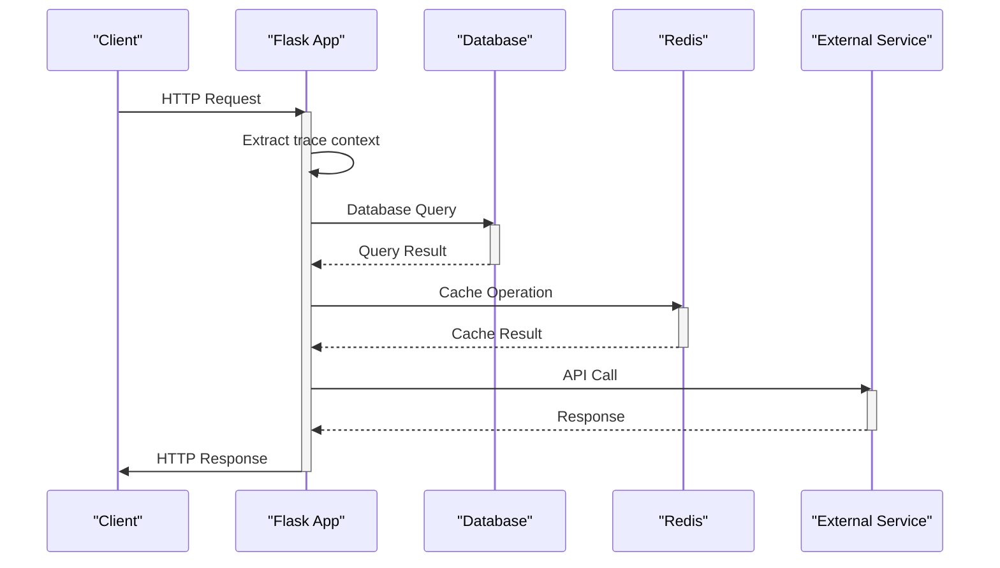
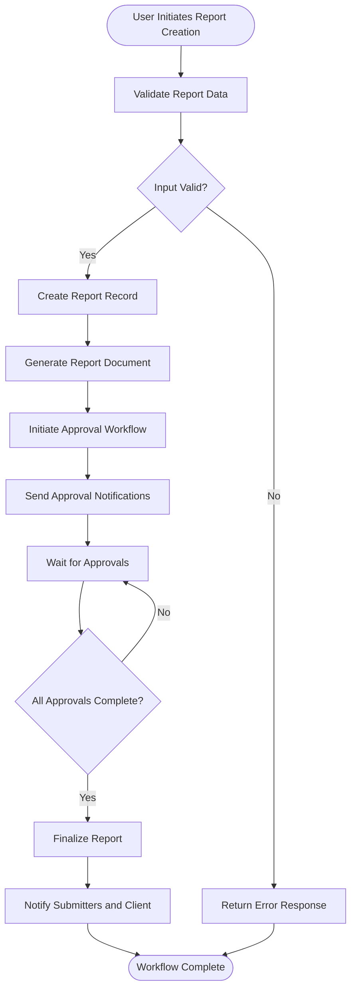
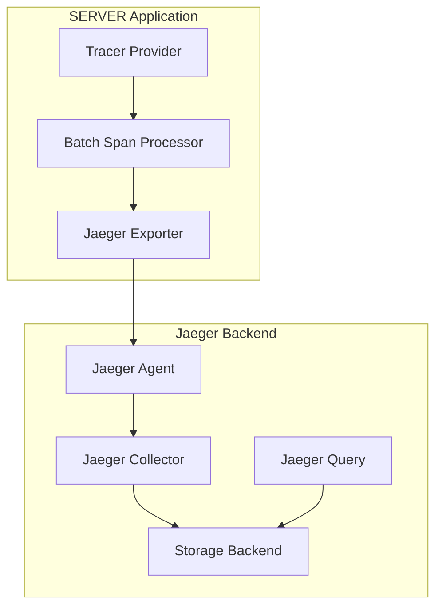

# Distributed Tracing

<cite>
**Referenced Files in This Document**   
- [tracing.py](file://monitoring/tracing.py)
- [app.py](file://app.py)
- [config/app.yaml](file://config/app.yaml)
- [config/production.yaml](file://config/production.yaml)
- [report_tasks.py](file://tasks/report_tasks.py)
- [approval.py](file://routes/approval.py)
- [reports.py](file://api/reports.py)
- [celery_app.py](file://tasks/celery_app.py)
</cite>

## Table of Contents
1. [Introduction](#introduction)
2. [Tracing Configuration and Initialization](#tracing-configuration-and-initialization)
3. [Trace Context Propagation](#trace-context-propagation)
4. [Trace Generation in User Workflows](#trace-generation-in-user-workflows)
5. [Trace Export and Backend Integration](#trace-export-and-backend-integration)
6. [Trace Sampling and Performance Considerations](#trace-sampling-and-performance-considerations)
7. [Analyzing Traces for Diagnostics](#analyzing-traces-for-diagnostics)
8. [Conclusion](#conclusion)

## Introduction

The SERVER application implements a comprehensive distributed tracing system using OpenTelemetry to provide end-to-end visibility across request flows. This documentation details how the tracing system captures and correlates operations across web requests, API calls, and background task execution. The implementation enables developers and operators to diagnose latency bottlenecks and failed transactions by providing a complete view of request flows through the application's components.

The tracing system is designed to work seamlessly across the application's various layers, from the Flask-based web interface to background Celery tasks that handle report generation and approval workflows. By using standardized trace IDs and span IDs, the system can correlate operations across different components and services, providing a unified view of request processing.

**Section sources**
- [tracing.py](file://monitoring/tracing.py#L1-L350)

## Tracing Configuration and Initialization

The distributed tracing system is configured through the `TracingConfig` class in the `tracing.py` module. This class initializes OpenTelemetry with the Flask application and sets up the necessary components for trace collection and export. The configuration is controlled by application settings that can be specified in configuration files or environment variables.

```mermaid
classDiagram
class TracingConfig {
+app : Flask
+tracer : Tracer
+__init__(app : Flask)
+init_app(app : Flask)
}
class CustomSpanProcessor {
+on_start(span, parent_context)
+on_end(span)
+shutdown()
+force_flush(timeout_millis : int)
}
TracingConfig --> CustomSpanProcessor : "uses"
TracingConfig --> "JaegerExporter" : "configures"
TracingConfig --> "BatchSpanProcessor" : "adds"
TracingConfig --> "FlaskInstrumentor" : "instruments"
TracingConfig --> "SQLAlchemyInstrumentor" : "instruments"
TracingConfig --> "RequestsInstrumentor" : "instruments"
TracingConfig --> "RedisInstrumentor" : "instruments"
```

**Diagram sources**
- [tracing.py](file://monitoring/tracing.py#L25-L150)

The initialization process begins by checking whether tracing is enabled via the `TRACING_ENABLED` configuration setting. When enabled, the system creates a tracer provider with resource attributes that identify the service, including its name, version, environment, and instance ID. These attributes help distinguish traces from different services and environments when viewing them in the tracing backend.

The configuration also sets up a Jaeger exporter, which sends trace data to a Jaeger agent or collector. The exporter can be configured with the agent host and port or a collector endpoint, allowing flexibility in deployment scenarios. A batch span processor is added to the tracer provider to efficiently collect and export spans in batches, reducing the overhead of individual span exports.

**Section sources**
- [tracing.py](file://monitoring/tracing.py#L25-L150)
- [app.py](file://app.py#L1-L751)

## Trace Context Propagation

The tracing system implements context propagation to maintain trace continuity across different components and services. This is achieved through the use of composite HTTP propagators that support multiple trace context formats, ensuring compatibility with various systems and services.



**Diagram sources**
- [tracing.py](file://monitoring/tracing.py#L150-L200)

The system uses a composite propagator that supports both Jaeger and B3 (Zipkin) trace context formats. This allows the application to participate in trace flows that originate from systems using either format, ensuring broad compatibility. The propagator extracts trace context from incoming HTTP requests and injects it into outgoing requests, maintaining the trace chain across service boundaries.

Within the application, trace context is propagated through the Flask application context. The `add_trace_context` function, registered as a before-request handler, extracts the current span and adds relevant request attributes such as HTTP method, URL, route, and user agent. It also captures user context when available, adding user ID, email, and role as span attributes. This information is invaluable for understanding which users are making requests and how they are interacting with the system.

For background tasks executed by Celery, trace context is propagated through task arguments. When a web request triggers a background task, the current trace ID and span ID are passed as task parameters, allowing the task to continue the same trace. This ensures that operations spanning both synchronous web requests and asynchronous background processing are captured as a single, continuous trace.

**Section sources**
- [tracing.py](file://monitoring/tracing.py#L150-L200)
- [app.py](file://app.py#L1-L751)
- [celery_app.py](file://tasks/celery_app.py#L1-L281)

## Trace Generation in User Workflows

The tracing system captures detailed information about user interactions through various workflows in the application, including report creation and approval processes. These workflows generate multiple spans that represent the different operations performed, allowing for comprehensive analysis of the entire request flow.



**Diagram sources**
- [approval.py](file://routes/approval.py#L1-L603)
- [report_tasks.py](file://tasks/report_tasks.py#L1-L452)
- [reports.py](file://api/reports.py#L1-L503)

In the report creation workflow, when a user submits a new report, the system creates a trace that captures the entire process. The trace begins with the API request to create the report, capturing HTTP attributes and user context. As the system validates the input data and creates the report record in the database, additional spans are created to represent these operations.

When the report generation process is initiated, either immediately or as a background task, the system creates spans to track the document generation process. The `generate_report_task` function in the `report_tasks.py` module is decorated with tracing decorators that automatically create spans for the task execution. These spans capture the progress of the report generation, including data loading, document rendering, and file saving.

The approval workflow generates a particularly rich set of traces, as it involves multiple stages and participants. Each approval action creates a span that captures the approver's identity, the action taken (approve or reject), and any comments provided. The system also creates spans for notification emails sent to approvers and submitters, allowing the entire approval chain to be visualized and analyzed.

For complex operations, the system uses custom tracing decorators to add detailed context to spans. The `trace_function`, `trace_database_operation`, `trace_external_call`, and `trace_business_operation` decorators allow developers to add specific attributes to spans, providing additional context for analysis. For example, database operations are traced with the operation type and table name, while external service calls are traced with the service name and operation.

**Section sources**
- [approval.py](file://routes/approval.py#L1-L603)
- [report_tasks.py](file://tasks/report_tasks.py#L1-L452)
- [reports.py](file://api/reports.py#L1-L503)

## Trace Export and Backend Integration

The tracing system is configured to export trace data to a Jaeger backend, which provides a comprehensive interface for viewing, searching, and analyzing traces. The integration with Jaeger is handled through the OpenTelemetry Jaeger exporter, which formats and sends span data to the Jaeger agent or collector.



**Diagram sources**
- [tracing.py](file://monitoring/tracing.py#L100-L130)

The export configuration is controlled by several settings that can be specified in the application configuration. The `JAEGER_AGENT_HOST` and `JAEGER_AGENT_PORT` settings specify the address of the Jaeger agent, which typically runs as a sidecar container or on the same host as the application. Alternatively, the `JAEGER_COLLECTOR_ENDPOINT` setting can be used to send spans directly to the Jaeger collector, bypassing the agent.

The system uses a batch span processor to optimize the export process. This processor collects spans in memory and sends them to the Jaeger backend in batches, reducing the number of network requests and improving performance. The batch processor can be configured with parameters such as batch size and export interval to balance between real-time visibility and system overhead.

In addition to Jaeger, the system's use of OpenTelemetry means it can easily be configured to export to other tracing backends that support the OpenTelemetry Protocol (OTLP) or other standard formats. This flexibility allows the application to integrate with various observability platforms depending on the deployment environment and organizational requirements.

The trace data includes rich attributes that enhance its usefulness for analysis. Each span includes attributes such as service name, version, environment, and instance ID, which help identify the source of the trace. HTTP spans include attributes like method, URL, status code, and response size, while database spans include the operation type, table name, and execution time. These attributes can be used to filter and search traces in the Jaeger interface.

**Section sources**
- [tracing.py](file://monitoring/tracing.py#L100-L130)
- [config/app.yaml](file://config/app.yaml#L1-L125)
- [config/production.yaml](file://config/production.yaml#L1-L83)

## Trace Sampling and Performance Considerations

The tracing system includes configurable sampling to balance the need for comprehensive observability with performance and storage considerations. By default, the system uses a probabilistic sampling approach that captures a representative subset of traces, reducing the overhead of trace collection while still providing valuable insights.

The sampling configuration is controlled by the application settings, allowing it to be adjusted based on the environment and operational requirements. In development and testing environments, sampling can be set to capture all traces to facilitate debugging and analysis. In production environments, a lower sampling rate can be used to minimize the performance impact and storage requirements.

The system's use of batch processing and asynchronous export helps minimize the performance impact of tracing. Spans are collected in memory and exported in batches, reducing the number of network requests and the associated latency. The export process runs asynchronously, ensuring that it does not block the main request processing thread.

For high-frequency operations, the system provides mechanisms to control the level of detail captured in traces. The tracing decorators allow developers to specify which attributes to include in spans, enabling them to capture only the most relevant information. This selective tracing approach helps reduce the volume of trace data while still providing the necessary context for analysis.

The system also includes performance monitoring to ensure that tracing itself does not become a bottleneck. The `CustomSpanProcessor` class provides hooks for monitoring span processing, allowing the system to track the performance of the tracing pipeline. This monitoring can help identify issues such as span backlog or export delays, enabling proactive optimization of the tracing configuration.

**Section sources**
- [tracing.py](file://monitoring/tracing.py#L1-L350)

## Analyzing Traces for Diagnostics

The tracing data collected by the system provides powerful capabilities for diagnosing latency bottlenecks and failed transactions. By examining the spans within a trace, developers and operators can identify the specific operations that are contributing to performance issues or errors.

In the Jaeger interface, traces can be viewed as a timeline that shows the duration and relationships of spans. This visualization makes it easy to identify long-running operations and understand how different components interact. For example, in a report generation workflow, a trace might reveal that the majority of the processing time is spent in the document rendering phase, indicating a potential area for optimization.

The system's rich span attributes enable detailed filtering and searching of traces. Traces can be filtered by service, operation, HTTP status code, or custom attributes such as user ID or report type. This allows developers to quickly find traces that match specific criteria, such as all failed report generation tasks or all requests from a particular user.

For failed transactions, the tracing system captures exception information that can aid in root cause analysis. When an exception occurs within a traced function, the system records the exception in the current span and sets the span status to error. This information is included in the exported trace data, allowing developers to see exactly where and why a request failed.

The correlation between traces and other observability data, such as logs and metrics, provides a comprehensive view of system behavior. Each trace includes a correlation ID that can be used to find related log entries, enabling developers to examine the detailed log output for a specific request. This integrated approach to observability makes it easier to understand the full context of issues and develop effective solutions.

**Section sources**
- [tracing.py](file://monitoring/tracing.py#L1-L350)
- [monitoring/logging_config.py](file://monitoring/logging_config.py#L1-L421)

## Conclusion

The distributed tracing implementation in the SERVER application provides comprehensive end-to-end visibility across request flows, enabling effective monitoring, debugging, and optimization of the system. By leveraging OpenTelemetry and Jaeger, the system captures detailed information about web requests, API calls, and background task execution, correlating operations across components using trace IDs and span IDs.

The system's flexible configuration allows it to be adapted to different environments and operational requirements, from comprehensive tracing in development to optimized sampling in production. The integration with request headers ensures that trace context is propagated across service boundaries, maintaining continuity in distributed workflows.

The tracing data provides valuable insights for diagnosing latency bottlenecks and failed transactions, helping to ensure the reliability and performance of the application. By combining tracing with other observability practices such as structured logging and metrics collection, the system provides a comprehensive view of its behavior, enabling proactive monitoring and rapid issue resolution.