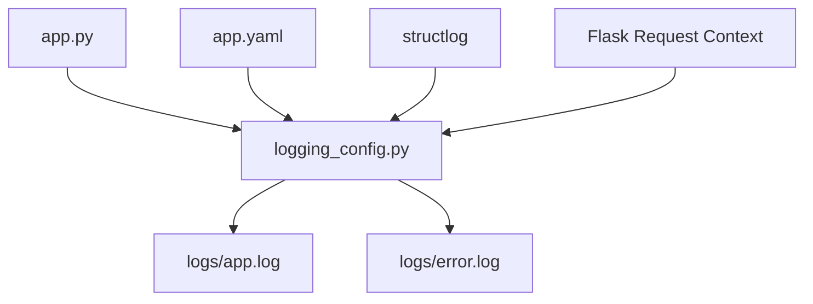
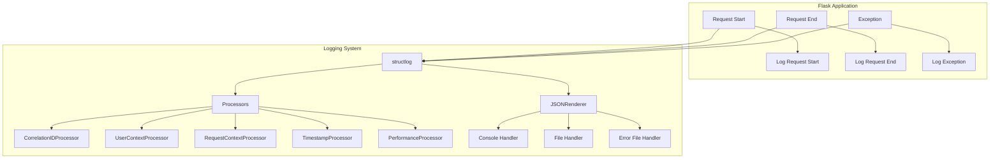
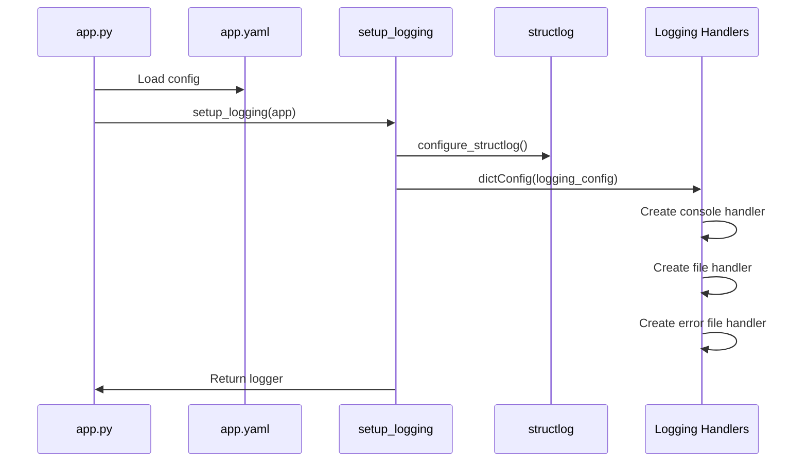
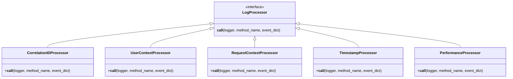
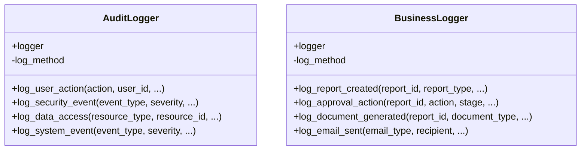
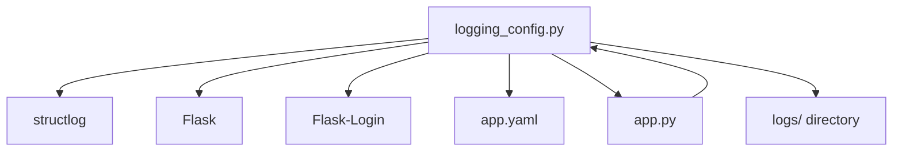

# Logging Configuration

<cite>
**Referenced Files in This Document**   
- [app.py](file://app.py)
- [logging_config.py](file://monitoring/logging_config.py)
- [app.yaml](file://config/app.yaml)
</cite>

## Table of Contents
1. [Introduction](#introduction)
2. [Project Structure](#project-structure)
3. [Core Components](#core-components)
4. [Architecture Overview](#architecture-overview)
5. [Detailed Component Analysis](#detailed-component-analysis)
6. [Dependency Analysis](#dependency-analysis)
7. [Performance Considerations](#performance-considerations)
8. [Troubleshooting Guide](#troubleshooting-guide)
9. [Conclusion](#conclusion)

## Introduction
The logging subsystem of the SERVER application is designed to provide structured, contextual, and secure logging for operational visibility, auditing, and troubleshooting. It leverages `structlog` for structured JSON logging with contextual metadata such as request ID, user ID, correlation ID, and performance metrics. Logs are written to both console and rotating files, with separate handling for error logs. The system integrates with Flask’s request lifecycle to automatically capture request and response details. This document details the configuration, formatting, routing, and usage of the logging system across key operations.

## Project Structure
The logging configuration is centralized in the `monitoring/logging_config.py` module, which defines processors, formatters, handlers, and specialized logger classes. Configuration values are sourced from `config/app.yaml`, and initialization occurs in `app.py` during application creation. Logs are written to the `logs/` directory with rotation and retention policies.

**Diagram sources**
- [app.py](file://app.py)
- [logging_config.py](file://monitoring/logging_config.py)
- [app.yaml](file://config/app.yaml)

**Section sources**
- [app.py](file://app.py)
- [logging_config.py](file://monitoring/logging_config.py)
- [app.yaml](file://config/app.yaml)

## Core Components
The core logging components include structured JSON formatting via `structlog`, contextual processors for request, user, and correlation data, and a centralized `setup_logging` function that configures the logging system for the Flask application. Specialized loggers such as `AuditLogger` and `BusinessLogger` provide domain-specific logging interfaces for security, compliance, and business events.

**Section sources**
- [logging_config.py](file://monitoring/logging_config.py)

## Architecture Overview
The logging architecture integrates with Flask’s application lifecycle to capture request and response metadata automatically. It uses `structlog` processors to enrich log entries with contextual data, formats logs as JSON, and routes them to multiple handlers including console and rotating file handlers. Error logs are routed to a dedicated file with a higher severity threshold. The system supports multiple log levels (DEBUG, INFO, WARNING, ERROR, CRITICAL) and includes automatic request duration tracking.

**Diagram sources**
- [logging_config.py](file://monitoring/logging_config.py)

## Detailed Component Analysis

### Logging Configuration and Initialization
The logging system is initialized in `app.py` via the `setup_logging` function from `monitoring/logging_config.py`. This function reads configuration from the Flask app config (derived from `app.yaml`), sets up `structlog` with a chain of processors, and configures Python’s standard `logging` module with handlers for console and file output.

**Diagram sources**
- [app.py](file://app.py#L100-L150)
- [logging_config.py](file://monitoring/logging_config.py#L112-L193)

**Section sources**
- [app.py](file://app.py#L100-L150)
- [logging_config.py](file://monitoring/logging_config.py#L112-L193)

### Contextual Metadata Processing
The system uses custom `structlog` processors to automatically enrich log entries with contextual metadata. These include `CorrelationIDProcessor`, `UserContextProcessor`, `RequestContextProcessor`, `TimestampProcessor`, and `PerformanceProcessor`. Each processor adds relevant fields to the log event dictionary during processing.

**Diagram sources**
- [logging_config.py](file://monitoring/logging_config.py#L15-L108)

**Section sources**
- [logging_config.py](file://monitoring/logging_config.py#L15-L108)

### Specialized Logger Classes
The system defines two specialized logger classes: `AuditLogger` for security and compliance events, and `BusinessLogger` for business operations. These provide high-level methods for logging domain-specific events with consistent structure and metadata.

**Diagram sources**
- [logging_config.py](file://monitoring/logging_config.py#L195-L380)

**Section sources**
- [logging_config.py](file://monitoring/logging_config.py#L195-L380)

## Dependency Analysis
The logging subsystem depends on `structlog` for structured logging, `Flask` for request context, and `Flask-Login` for user context. It integrates with the application’s configuration system via `app.yaml` and is initialized during the Flask app creation process in `app.py`. The system also interacts with the file system for log rotation and retention.

**Diagram sources**
- [logging_config.py](file://monitoring/logging_config.py)
- [app.py](file://app.py)
- [app.yaml](file://config/app.yaml)

**Section sources**
- [logging_config.py](file://monitoring/logging_config.py)
- [app.py](file://app.py)
- [app.yaml](file://config/app.yaml)

## Performance Considerations
The logging system is designed to minimize performance impact through asynchronous processing where possible and by using efficient JSON serialization. Request duration is captured using timestamps at request start and end. The use of `structlog` processors ensures that metadata is added efficiently without blocking the main request thread. Log rotation is handled by `RotatingFileHandler` with a 10MB size limit and 5 backup files.

## Troubleshooting Guide
To troubleshoot logging issues, verify that the `logs/` directory exists and is writable. Check that `app.yaml` contains valid logging configuration. Review the application startup logs for any errors during logging initialization. Use the `/health` endpoint to verify that the application is running and logging correctly. For missing contextual data, ensure that `g.start_time` and `g.correlation_id` are set in the request context.

**Section sources**
- [app.py](file://app.py#L700-L750)
- [logging_config.py](file://monitoring/logging_config.py#L112-L151)

## Conclusion
The SERVER application’s logging subsystem provides a robust, structured, and contextual logging solution using `structlog` and JSON formatting. It captures rich metadata including request, user, and performance data, and routes logs to both console and rotating files. The system supports specialized logging for audit and business events, integrates with Flask’s lifecycle, and follows security and compliance best practices. Configuration is centralized and extensible, making it suitable for both development and production environments.