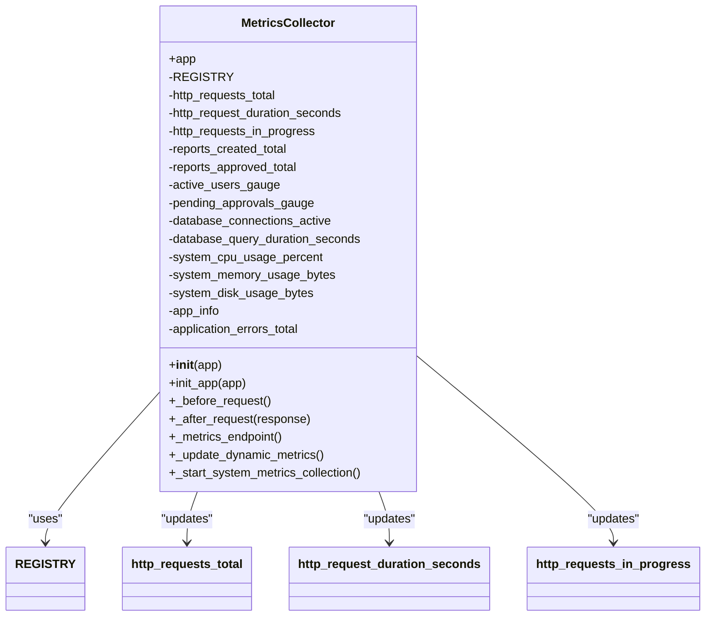
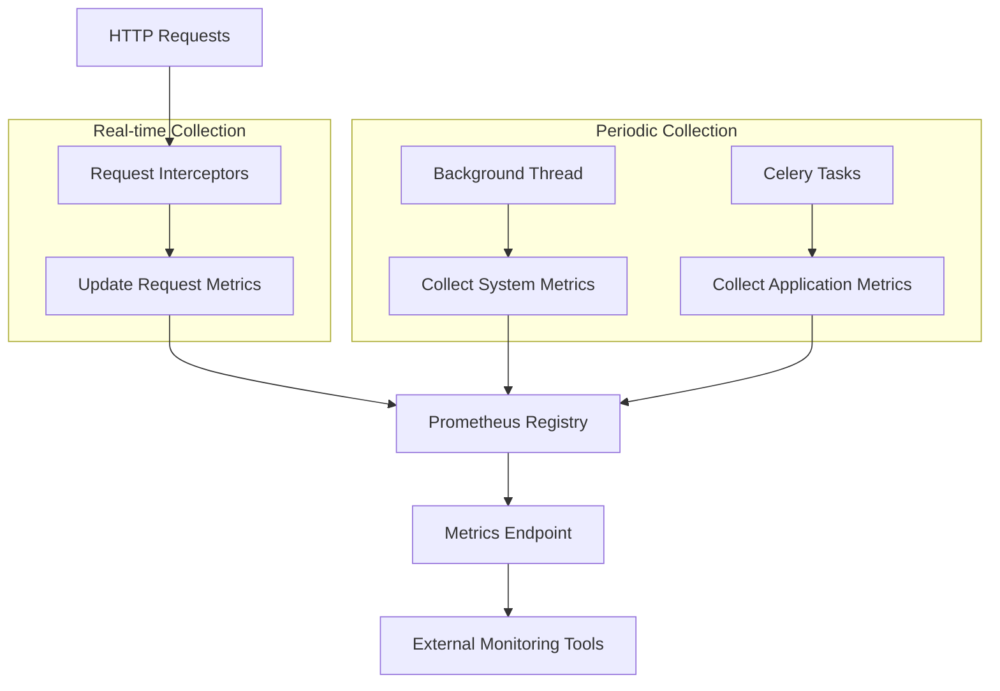
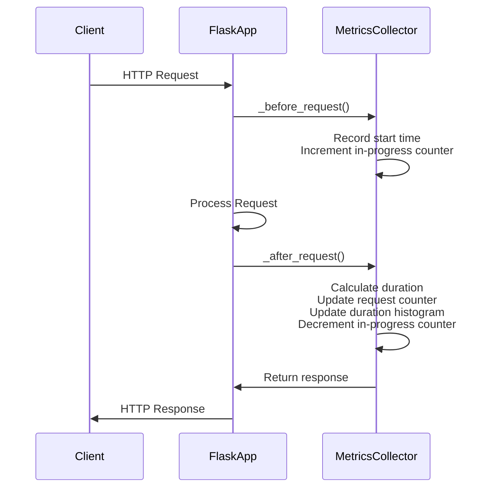
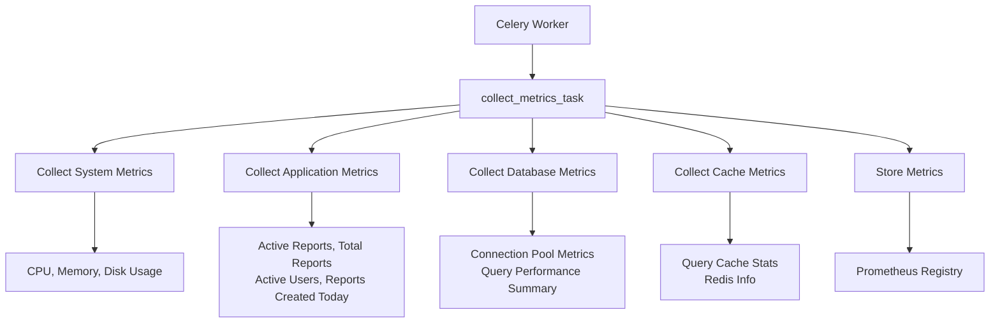
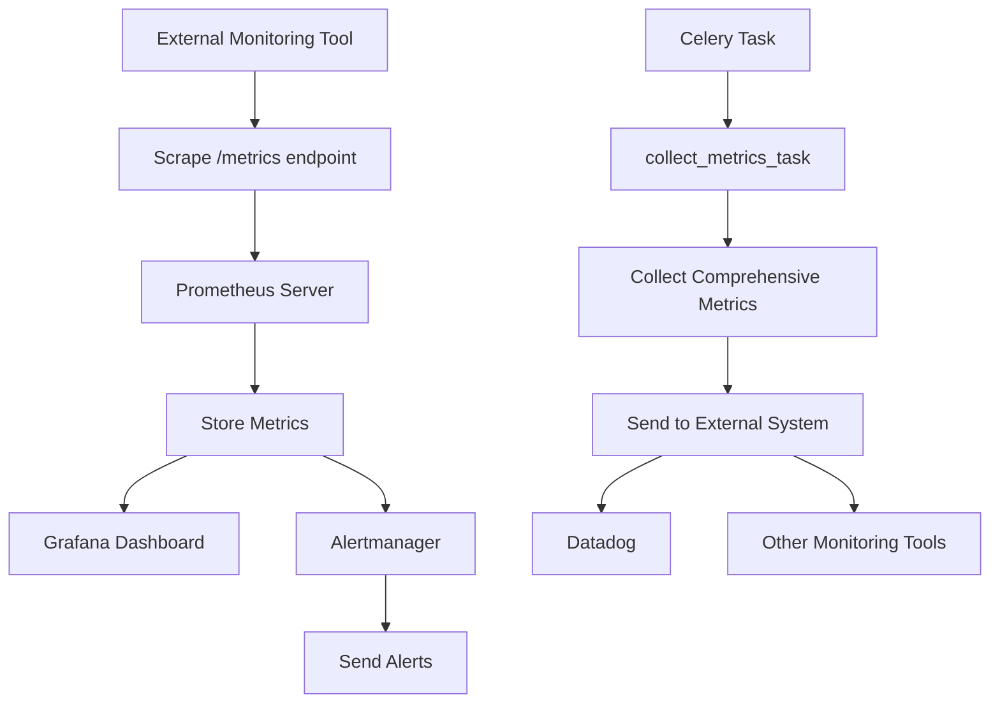
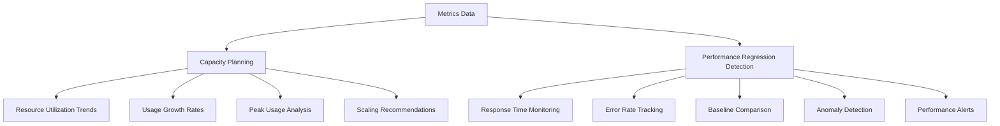

# Metrics Collection

<cite>
**Referenced Files in This Document**   
- [metrics.py](file://monitoring/metrics.py)
- [monitoring_tasks.py](file://tasks/monitoring_tasks.py)
- [app.py](file://app.py)
</cite>

## Table of Contents
1. [Introduction](#introduction)
2. [Core Metrics Implementation](#core-metrics-implementation)
3. [Metrics Collection Architecture](#metrics-collection-architecture)
4. [HTTP Request Monitoring](#http-request-monitoring)
5. [Application-Level Metrics](#application-level-metrics)
6. [System Resource Monitoring](#system-resource-monitoring)
7. [Periodic Monitoring Tasks](#periodic-monitoring-tasks)
8. [Integration with External Monitoring Tools](#integration-with-external-monitoring-tools)
9. [Metric Instrumentation Examples](#metric-instrumentation-examples)
10. [Best Practices for Metric Labeling and Cardinality](#best-practices-for-metric-labeling-and-cardinality)
11. [Use Cases for Capacity Planning and Performance Regression Detection](#use-cases-for-capacity-planning-and-performance-regression-detection)
12. [Conclusion](#conclusion)

## Introduction
The SERVER application implements a comprehensive metrics collection system to monitor application performance, system health, and user activity. This documentation details the implementation of metrics collection using Prometheus client libraries, periodic background tasks, and integration points with external monitoring tools. The system collects HTTP request rates, response times, background task durations, and system resource usage to enable capacity planning, performance optimization, and issue detection.

**Section sources**
- [metrics.py](file://monitoring/metrics.py#L1-L50)
- [monitoring_tasks.py](file://tasks/monitoring_tasks.py#L1-L50)

## Core Metrics Implementation
The metrics collection system is implemented in the `monitoring/metrics.py` module using the Prometheus client library for Python. The system defines various metric types including counters, gauges, histograms, and info metrics to capture different aspects of application behavior.

The implementation uses a custom `CollectorRegistry` to manage all application metrics, allowing for proper isolation and collection. The `MetricsCollector` class serves as the central component that initializes and manages the metrics collection system, integrating with the Flask application lifecycle.



**Diagram sources**
- [metrics.py](file://monitoring/metrics.py#L155-L199)

**Section sources**
- [metrics.py](file://monitoring/metrics.py#L1-L50)

## Metrics Collection Architecture
The metrics collection system follows a hybrid architecture that combines real-time request monitoring with periodic background collection of system and application metrics. The architecture consists of three main components: request-level instrumentation, system-level monitoring, and background task-based data collection.



**Diagram sources**
- [metrics.py](file://monitoring/metrics.py#L155-L199)
- [monitoring_tasks.py](file://tasks/monitoring_tasks.py#L47-L81)

**Section sources**
- [metrics.py](file://monitoring/metrics.py#L1-L50)
- [monitoring_tasks.py](file://tasks/monitoring_tasks.py#L1-L50)

## HTTP Request Monitoring
The system automatically collects HTTP request metrics using Flask request interceptors. The `MetricsCollector` class registers `before_request` and `after_request` handlers to track request duration, count, and concurrent requests.

The implementation captures three key HTTP metrics:
- `http_requests_total`: Counter that tracks the total number of HTTP requests by method, endpoint, and status code
- `http_request_duration_seconds`: Histogram that records request processing time by method and endpoint
- `http_requests_in_progress`: Gauge that tracks the number of requests currently being processed



**Diagram sources**
- [metrics.py](file://monitoring/metrics.py#L155-L199)

**Section sources**
- [metrics.py](file://monitoring/metrics.py#L155-L199)

## Application-Level Metrics
The system defines several application-specific metrics to track business logic and user activity. These metrics are implemented as counters and gauges with appropriate labels to provide dimensional data for analysis.

Key application metrics include:
- `reports_created_total`: Counter tracking report creation by report type and user role
- `reports_approved_total`: Counter tracking report approvals by report type and approval stage
- `reports_rejected_total`: Counter tracking report rejections by report type and approval stage
- `active_users_gauge`: Gauge tracking the number of currently active users
- `pending_approvals_gauge`: Gauge tracking reports pending approval by approval stage

The system also provides business metrics functions that serve as convenient wrappers for recording these events:

```mermaid
flowchart TD
A[Business Logic] --> B{Event Occurs}
B --> |Report Created| C[record_report_created<br/>(report_type, user_role)]
B --> |Report Approved| D[record_report_approved<br/>(report_type, approval_stage)]
B --> |Report Rejected| E[record_report_rejected<br/>(report_type, approval_stage)]
B --> |File Uploaded| F[record_file_upload<br/>(file_type, file_size, success)]
B --> |Login Attempt| G[record_login_attempt<br/>(success)]
B --> |Application Error| H[record_application_error<br/>(error_type, severity)]
C --> I[Update reports_created_total Counter]
D --> J[Update reports_approved_total Counter]
E --> K[Update reports_rejected_total Counter]
F --> L[Update file_uploads_total Counter<br/>Update file_upload_size_bytes Histogram]
G --> M[Update user_login_attempts_total Counter]
H --> N[Update application_errors_total Counter]
```

**Diagram sources**
- [metrics.py](file://monitoring/metrics.py#L402-L447)

**Section sources**
- [metrics.py](file://monitoring/metrics.py#L47-L106)

## System Resource Monitoring
The system collects comprehensive system resource metrics through a background thread that runs continuously. The `_start_system_metrics_collection` method initializes a daemon thread that periodically collects CPU, memory, and disk usage metrics.

System metrics collected include:
- `system_cpu_usage_percent`: Gauge tracking CPU usage percentage
- `system_memory_usage_bytes`: Gauge tracking memory usage with labels for total, used, and available
- `system_disk_usage_bytes`: Gauge tracking disk usage with labels for path and type (total, used, free)

The background thread collects these metrics every 30 seconds under normal conditions, with a longer interval (60 seconds) when errors occur to prevent overwhelming the system during issues.

```mermaid
flowchart TD
A[Background Thread] --> B{Collect System Metrics}
B --> C[Get CPU Usage]
C --> D[Update system_cpu_usage_percent]
B --> E[Get Memory Usage]
E --> F[Update system_memory_usage_bytes<br/>(total, used, available)]
B --> G[Get Disk Usage]
G --> H[Update system_disk_usage_bytes<br/>(total, used, free)]
B --> I[Wait 30 seconds]
I --> B
B --> |Error| J[Wait 60 seconds]
J --> B
```

**Diagram sources**
- [metrics.py](file://monitoring/metrics.py#L302-L336)

**Section sources**
- [metrics.py](file://monitoring/metrics.py#L302-L336)

## Periodic Monitoring Tasks
The system implements periodic monitoring tasks using Celery background workers. These tasks run on a schedule to collect comprehensive metrics and perform health checks across the application stack.

Key monitoring tasks include:
- `collect_metrics_task`: Collects system, application, database, and cache metrics
- `health_check_task`: Performs comprehensive system health check
- `performance_analysis_task`: Analyzes query performance and system trends
- `generate_monitoring_report_task`: Generates comprehensive monitoring reports

The `collect_metrics_task` gathers metrics from multiple sources:
- System metrics via psutil
- Application metrics from database queries
- Database metrics from connection pooling and query analysis
- Cache metrics from Redis and query cache



**Diagram sources**
- [monitoring_tasks.py](file://tasks/monitoring_tasks.py#L47-L81)

**Section sources**
- [monitoring_tasks.py](file://tasks/monitoring_tasks.py#L47-L81)

## Integration with External Monitoring Tools
The system exposes metrics through a dedicated `/metrics` endpoint that returns data in the Prometheus exposition format. This endpoint is registered by the `MetricsCollector` class and can be scraped by external monitoring tools like Prometheus.

The `/metrics` endpoint returns metrics in the standard Prometheus format, making it compatible with various monitoring and visualization tools including:
- Prometheus for metrics collection and alerting
- Grafana for visualization and dashboards
- Datadog for comprehensive monitoring
- Alertmanager for alert routing

The system also supports integration with external tools through the periodic monitoring tasks, which can be configured to send metrics to additional destinations in production environments.



**Diagram sources**
- [metrics.py](file://monitoring/metrics.py#L155-L199)
- [monitoring_tasks.py](file://tasks/monitoring_tasks.py#L47-L81)

**Section sources**
- [metrics.py](file://monitoring/metrics.py#L155-L199)
- [monitoring_tasks.py](file://tasks/monitoring_tasks.py#L47-L81)

## Metric Instrumentation Examples
The system provides several mechanisms for instrumenting code with metrics collection. These include decorators for timing database queries and email operations, as well as utility functions for recording business events.

### Database Query Timing
The `time_database_query` decorator can be applied to database functions to automatically collect query duration and count metrics:

```python
@time_database_query('create_report')
def create_report(data):
    # Database operations
    pass
```

### Email Operation Timing
The `time_email_operation` decorator tracks email sending operations:

```python
@time_email_operation('approval_notification')
def send_approval_email(recipient, report):
    # Email sending logic
    pass
```

### Business Event Recording
The system provides utility functions for recording business events:

```python
# Record report creation
record_report_created('SAT', 'Engineer')

# Record file upload
record_file_upload('pdf', 102400, success=True)

# Record login attempt
record_login_attempt(success=True)

# Record application error
record_application_error('database_connection', 'error')
```

**Section sources**
- [metrics.py](file://monitoring/metrics.py#L334-L368)
- [metrics.py](file://monitoring/metrics.py#L402-L447)

## Best Practices for Metric Labeling and Cardinality
The system follows best practices for metric labeling and cardinality management to ensure efficient monitoring and prevent performance issues.

### Label Design Principles
- Use descriptive but concise label names
- Limit the number of label dimensions to avoid cardinality explosion
- Use consistent label values across metrics
- Avoid high-cardinality labels like user IDs, session IDs, or timestamps

### Cardinality Management
The system manages cardinality by:
- Using predefined categories for labels (e.g., report types, user roles, approval stages)
- Avoiding dynamic label values from user input
- Using counters and gauges appropriately for different use cases
- Implementing proper error handling to prevent metric collection failures from cascading

### Metric Type Selection
The system uses appropriate metric types for different scenarios:
- **Counters**: For cumulative events like requests, errors, and creations
- **Gauges**: For instantaneous values like active users, pending approvals, and system resources
- **Histograms**: For measuring distributions like request durations and file sizes
- **Info**: For static application information

**Section sources**
- [metrics.py](file://monitoring/metrics.py#L1-L50)

## Use Cases for Capacity Planning and Performance Regression Detection
The collected metrics support several key use cases for capacity planning and performance regression detection.

### Capacity Planning
The system metrics enable capacity planning by providing data on:
- Historical resource utilization trends
- Peak usage patterns
- Growth rates of key metrics like reports created and active users
- Database connection pool utilization

This information helps determine when to scale infrastructure, optimize database performance, or implement caching strategies.

### Performance Regression Detection
The metrics system supports performance regression detection through:
- Monitoring request duration histograms for increases in response times
- Tracking error rates for specific endpoints or operations
- Comparing current performance against historical baselines
- Detecting changes in system resource utilization patterns

The periodic `performance_analysis_task` specifically analyzes query performance trends and generates optimization recommendations when performance degradation is detected.



**Diagram sources**
- [monitoring_tasks.py](file://tasks/monitoring_tasks.py#L200-L250)

**Section sources**
- [monitoring_tasks.py](file://tasks/monitoring_tasks.py#L200-L250)

## Conclusion
The SERVER application's metrics collection system provides comprehensive monitoring of application performance, system health, and user activity. By combining real-time request monitoring with periodic background collection, the system captures a complete picture of application behavior. The implementation follows best practices for metric labeling and cardinality management, ensuring efficient monitoring and reliable data collection. The metrics support critical use cases including capacity planning, performance optimization, and issue detection, enabling proactive system management and continuous improvement.

**Section sources**
- [metrics.py](file://monitoring/metrics.py#L1-L50)
- [monitoring_tasks.py](file://tasks/monitoring_tasks.py#L1-L50)