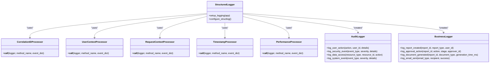
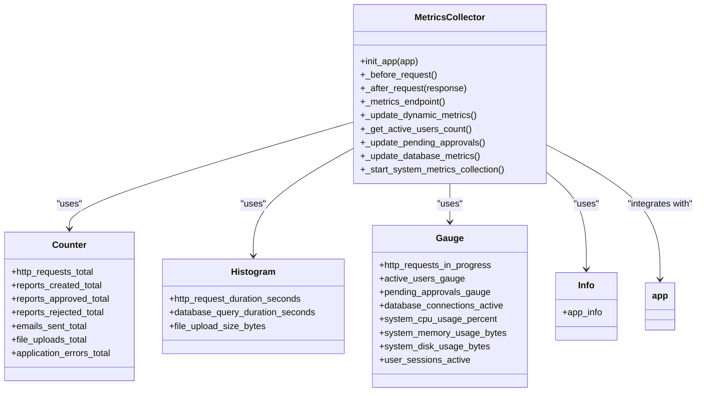
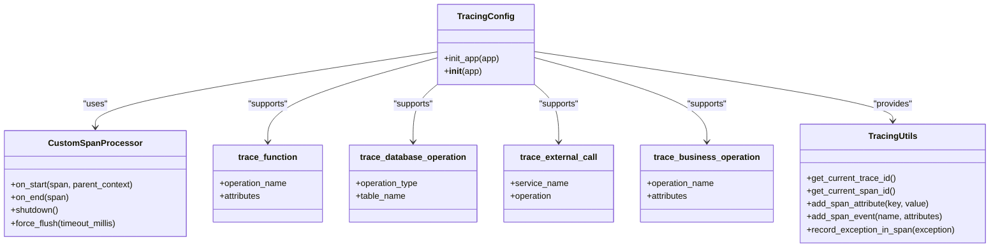
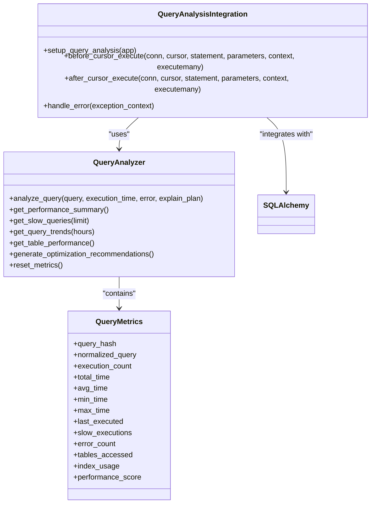
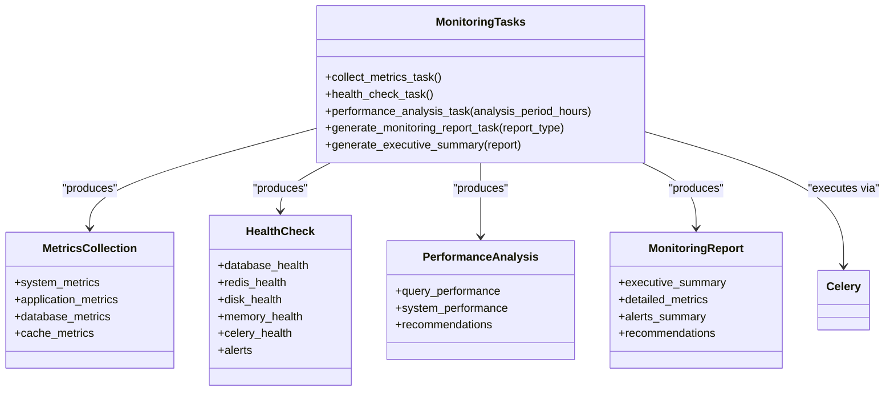
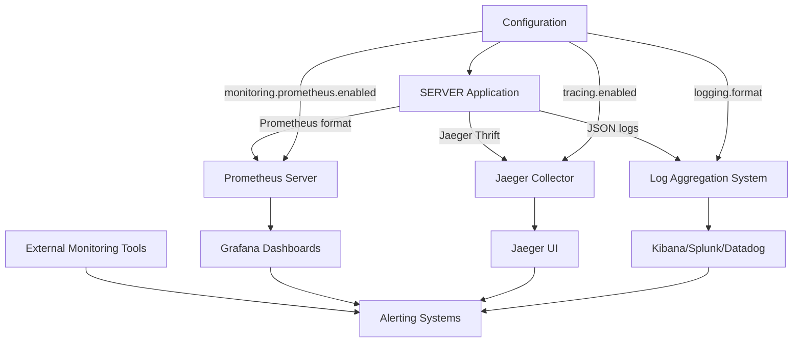
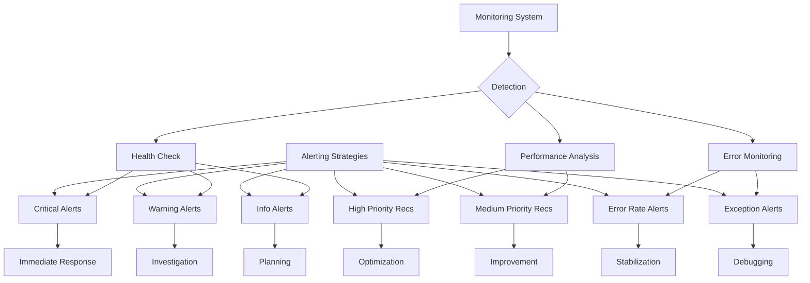
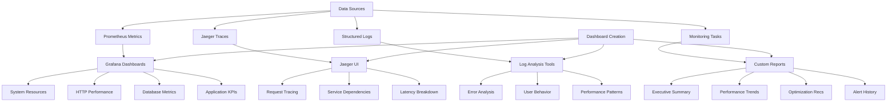
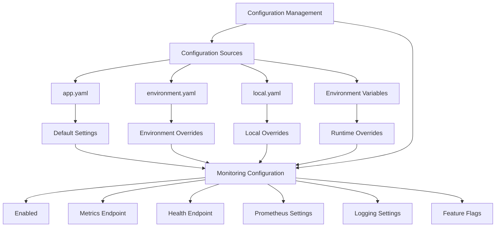

# Monitoring & Observability

<cite>
**Referenced Files in This Document**   
- [logging_config.py](file://monitoring/logging_config.py)
- [metrics.py](file://monitoring/metrics.py)
- [tracing.py](file://monitoring/tracing.py)
- [query_analyzer.py](file://database/query_analyzer.py)
- [monitoring_tasks.py](file://tasks/monitoring_tasks.py)
- [app.py](file://app.py)
- [app.yaml](file://config/app.yaml)
- [production.yaml](file://config/production.yaml)
- [development.yaml](file://config/development.yaml)
</cite>

## Table of Contents
1. [Introduction](#introduction)
2. [Logging Configuration](#logging-configuration)
3. [Metrics Collection System](#metrics-collection-system)
4. [Distributed Tracing Implementation](#distributed-tracing-implementation)
5. [Database Query Analysis](#database-query-analysis)
6. [Performance Monitoring Tasks](#performance-monitoring-tasks)
7. [External Monitoring Integration](#external-monitoring-integration)
8. [Alerting Strategies](#alerting-strategies)
9. [Dashboard Creation](#dashboard-creation)
10. [Configuration Management](#configuration-management)

## Introduction
The monitoring subsystem of the SERVER application provides comprehensive observability through structured logging, metrics collection, distributed tracing, and performance analysis. This documentation details the implementation of these monitoring components, their integration points, and operational strategies for maintaining system health and performance.

The monitoring architecture is designed to provide full visibility into application behavior, from individual function calls to cross-service request flows. It leverages industry-standard tools and practices to ensure reliable monitoring, alerting, and performance optimization capabilities.

## Logging Configuration
The SERVER application implements structured JSON logging through the `monitoring/logging_config.py` module, providing consistent, machine-readable log output with rich contextual data. The logging system uses structlog to create structured logs that include timestamps, correlation IDs, user context, and performance metrics.

Log records are formatted as JSON objects containing standardized fields including:
- `timestamp`: ISO 8601 formatted UTC timestamp
- `correlation_id`: Unique identifier for request tracing
- `user_id`, `user_email`, `user_role`: Authenticated user context
- `request_method`, `request_path`, `remote_addr`: HTTP request details
- `request_duration_ms`: Request processing time in milliseconds

The system configures multiple log handlers with different severity levels:
- Console and file handlers for general application logs (INFO level and above)
- Dedicated error file handler for ERROR level logs
- Rotating file handlers with 10MB size limits and 5 backup files

Specialized logger classes provide domain-specific logging:
- `AuditLogger` for security and compliance events with user actions and data access tracking
- `BusinessLogger` for business events such as report creation and approval actions
- Decorators for automatic function call logging with argument and result tracking



**Diagram sources**
- [logging_config.py](file://monitoring/logging_config.py#L1-L422)

**Section sources**
- [logging_config.py](file://monitoring/logging_config.py#L1-L422)

## Metrics Collection System
The metrics collection system, implemented in `monitoring/metrics.py`, uses Prometheus client libraries to expose application performance indicators through a `/metrics` endpoint. The system tracks key performance indicators across multiple dimensions including HTTP requests, database operations, email processing, and system resources.

Key metrics collected include:
- HTTP request metrics: total requests, duration histograms, and in-progress requests
- Application-specific metrics: reports created, approved, and rejected counts
- Database metrics: active connections, query duration, and query counts
- Email metrics: emails sent with success/failure status
- System metrics: CPU usage, memory usage, and disk usage
- Session metrics: active user sessions and login attempts

The `MetricsCollector` class initializes the monitoring system and registers request handlers to automatically collect metrics. It maintains a custom registry for application metrics and exposes them through the `/metrics` endpoint in Prometheus format.

The system implements several decorator patterns for automatic metric collection:
- `time_database_query` decorator for timing database operations
- `time_email_operation` decorator for timing email operations
- Various record functions for business event metrics

Background metrics collection runs in a separate thread, periodically updating system metrics such as CPU, memory, and disk usage every 30 seconds.



**Diagram sources**
- [metrics.py](file://monitoring/metrics.py#L1-L448)

**Section sources**
- [metrics.py](file://monitoring/metrics.py#L1-L448)

## Distributed Tracing Implementation
Distributed tracing is implemented using OpenTelemetry in `monitoring/tracing.py`, enabling end-to-end request tracking across application components. The system integrates with Jaeger for trace visualization and uses B3 and Jaeger propagators for context propagation.

The `TracingConfig` class initializes the tracing system with:
- Jaeger exporter for trace collection
- Composite HTTP propagator supporting multiple formats
- Instrumentation for Flask, SQLAlchemy, requests, and Redis
- Custom span attributes for HTTP methods, URLs, and user context

The tracing system automatically creates spans for:
- HTTP requests and responses
- Database operations
- External service calls
- Business operations

Several decorator patterns enable automatic tracing of specific operations:
- `trace_function` for general function execution tracing
- `trace_database_operation` for database operations with table context
- `trace_external_call` for external service integrations
- `trace_business_operation` for business logic with user context

Utility functions provide access to trace context:
- `get_current_trace_id()` and `get_current_span_id()` for trace identification
- `add_span_attribute()` and `add_span_event()` for custom span data
- `record_exception_in_span()` for exception tracking



**Diagram sources**
- [tracing.py](file://monitoring/tracing.py#L1-L351)

**Section sources**
- [tracing.py](file://monitoring/tracing.py#L1-L351)

## Database Query Analysis
The database query analysis system, implemented in `database/query_analyzer.py`, provides detailed performance monitoring and optimization recommendations for database operations. The `QueryAnalyzer` class collects and analyzes query execution metrics to identify performance bottlenecks.

Key features include:
- Query normalization for pattern matching and aggregation
- Execution time tracking with percentiles (P50, P95, P99)
- Slow query detection based on configurable thresholds
- Error rate monitoring for failed queries
- Table access pattern analysis
- Index usage tracking

The analyzer calculates a performance score (0-100) based on:
- Average execution time
- Percentage of slow executions
- Error rate

The system provides several analysis methods:
- `get_performance_summary()`: Overall query performance metrics
- `get_slow_queries()`: Detailed analysis of slowest queries
- `get_query_trends()`: Performance trends over time
- `get_table_performance()`: Performance analysis by table
- `generate_optimization_recommendations()`: Comprehensive optimization suggestions

Integration with SQLAlchemy events enables automatic query monitoring:
- `before_cursor_execute` listener records query start time
- `after_cursor_execute` listener analyzes completed queries
- `handle_error` listener captures failed queries



**Diagram sources**
- [query_analyzer.py](file://database/query_analyzer.py#L1-L495)

**Section sources**
- [query_analyzer.py](file://database/query_analyzer.py#L1-L495)

## Performance Monitoring Tasks
The performance monitoring tasks, defined in `tasks/monitoring_tasks.py`, provide background analysis and reporting through Celery integration. These periodic tasks collect system metrics, perform health checks, and generate comprehensive monitoring reports.

Key monitoring tasks include:

### Metrics Collection Task
`collect_metrics_task()` gathers system and application metrics:
- System metrics: CPU, memory, and disk usage
- Application metrics: active reports, total reports, active users
- Database metrics: connection pool status and query performance
- Cache metrics: Redis and query cache statistics

### Health Check Task
`health_check_task()` performs comprehensive system health assessment:
- Database connectivity and connection pool health
- Redis availability and performance
- Disk space usage with critical/warning thresholds
- Memory usage monitoring
- Celery worker availability

### Performance Analysis Task
`performance_analysis_task()` conducts in-depth performance analysis:
- Query performance trends over configurable time periods
- System resource utilization patterns
- Automated optimization recommendations
- Performance score calculation

### Monitoring Report Generation
`generate_monitoring_report_task()` creates comprehensive reports:
- Executive summary with health score and grade
- Detailed metrics across all system components
- Alert summary with critical and warning issues
- Prioritized optimization recommendations

The tasks integrate with the application's monitoring systems and provide both immediate metrics and historical trend analysis.



**Diagram sources**
- [monitoring_tasks.py](file://tasks/monitoring_tasks.py#L1-L652)

**Section sources**
- [monitoring_tasks.py](file://tasks/monitoring_tasks.py#L1-L652)

## External Monitoring Integration
The SERVER application integrates with external monitoring tools through standardized protocols and endpoints. The monitoring subsystem is designed for seamless integration with popular observability platforms.

### Prometheus Integration
The metrics system exposes a `/metrics` endpoint in Prometheus format, enabling collection by Prometheus servers. When enabled in production configuration, the application can be scraped by Prometheus for time-series data collection.

Key integration points:
- `/metrics` endpoint with `CONTENT_TYPE_LATEST` MIME type
- Custom collector registry for application-specific metrics
- Support for counter, histogram, gauge, and info metric types
- Automatic metric labeling for dimensional analysis

### Jaeger Integration
Distributed tracing data is exported to Jaeger via the Jaeger Thrift exporter. The system supports both agent and collector endpoints for flexible deployment options.

Integration features:
- Jaeger exporter with configurable host, port, and endpoint
- Composite HTTP propagator for context propagation
- Automatic instrumentation of Flask, SQLAlchemy, and external HTTP calls
- Custom span attributes for business context

### Log Aggregation
Structured JSON logs are designed for ingestion by log aggregation systems such as ELK Stack, Splunk, or Datadog. The consistent JSON format enables:
- Automated parsing and field extraction
- Correlation of logs using `correlation_id`
- User behavior analysis through `user_id` and `user_role`
- Performance analysis using `request_duration_ms`

The application's configuration system allows environment-specific monitoring settings, enabling different integration strategies for development, staging, and production environments.



**Diagram sources**
- [metrics.py](file://monitoring/metrics.py#L1-L448)
- [tracing.py](file://monitoring/tracing.py#L1-L351)
- [logging_config.py](file://monitoring/logging_config.py#L1-L422)
- [app.yaml](file://config/app.yaml#L1-L126)
- [production.yaml](file://config/production.yaml#L1-L84)

**Section sources**
- [metrics.py](file://monitoring/metrics.py#L1-L448)
- [tracing.py](file://monitoring/tracing.py#L1-L351)
- [logging_config.py](file://monitoring/logging_config.py#L1-L422)
- [app.yaml](file://config/app.yaml#L1-L126)
- [production.yaml](file://config/production.yaml#L1-L84)

## Alerting Strategies
The monitoring subsystem implements a comprehensive alerting strategy through multiple mechanisms, combining automated detection with actionable notifications.

### Health-Based Alerting
The `health_check_task` identifies system issues and generates alerts based on severity levels:
- Critical alerts for complete system failures (database down, no workers)
- Warning alerts for degraded performance (high resource usage, pool exhaustion)
- Informational alerts for maintenance needs (disk space, backup status)

Alert categories include:
- Database: Connection pool issues, connectivity failures
- Redis: Unavailability, performance degradation
- Disk: High usage (>85%), critical usage (>95%)
- Memory: High usage (>85%), critical usage (>95%)
- Celery: No active workers, task processing delays

### Performance-Based Alerting
The `performance_analysis_task` detects performance degradation and generates optimization recommendations:
- Slow queries: Queries exceeding threshold execution time
- High-frequency queries: Queries executed more than 100 times
- Error-prone queries: Queries with repeated failures
- Hot tables: Tables accessed very frequently

Recommendation priorities:
- High priority: Issues directly affecting user experience or system reliability
- Medium priority: Optimization opportunities with cumulative benefits

### Executive Summary Alerts
The `generate_monitoring_report_task` produces an executive summary with:
- Health score (0-100) based on system status and alert count
- Health grade (A-F) for quick assessment
- Top recommendations prioritized by impact
- Key metrics dashboard for operational visibility

The alerting system is designed to provide both immediate notifications of critical issues and strategic recommendations for long-term optimization.



**Diagram sources**
- [monitoring_tasks.py](file://tasks/monitoring_tasks.py#L1-L652)
- [metrics.py](file://monitoring/metrics.py#L1-L448)

**Section sources**
- [monitoring_tasks.py](file://tasks/monitoring_tasks.py#L1-L652)
- [metrics.py](file://monitoring/metrics.py#L1-L448)

## Dashboard Creation
The monitoring system supports dashboard creation through integration with visualization tools and built-in reporting capabilities. The architecture enables comprehensive operational visibility through multiple dashboard types.

### Prometheus/Grafana Dashboards
The exposed metrics endpoint enables creation of Grafana dashboards with panels for:
- System resources: CPU, memory, and disk usage over time
- HTTP metrics: Request rates, duration percentiles, and status codes
- Database performance: Query rates, duration histograms, and connection pool utilization
- Application metrics: Report creation rates, approval workflows, and user activity

### Jaeger Tracing Dashboards
Distributed traces enable creation of service maps and request flow visualizations showing:
- End-to-end request latency across components
- Database query contribution to overall request time
- External service call performance
- Error propagation through the system

### Custom Monitoring Reports
The `generate_monitoring_report_task` produces comprehensive reports with:
- Executive summary dashboard with health score and key metrics
- Performance trends over configurable time periods
- Top slow queries with optimization recommendations
- Resource utilization patterns
- Alert history and resolution status

### Real-time Monitoring Views
The system supports real-time monitoring through:
- `/health` endpoint for system status
- `/metrics` endpoint for current performance data
- Background tasks for periodic comprehensive analysis
- Structured logs for detailed request tracing

The dashboard strategy combines real-time operational views with historical trend analysis to support both immediate troubleshooting and strategic optimization.



**Diagram sources**
- [metrics.py](file://monitoring/metrics.py#L1-L448)
- [tracing.py](file://monitoring/tracing.py#L1-L351)
- [logging_config.py](file://monitoring/logging_config.py#L1-L422)
- [monitoring_tasks.py](file://tasks/monitoring_tasks.py#L1-L652)

**Section sources**
- [metrics.py](file://monitoring/metrics.py#L1-L448)
- [tracing.py](file://monitoring/tracing.py#L1-L351)
- [logging_config.py](file://monitoring/logging_config.py#L1-L422)
- [monitoring_tasks.py](file://tasks/monitoring_tasks.py#L1-L652)

## Configuration Management
Monitoring functionality is controlled through the hierarchical configuration system in `config/manager.py`, allowing environment-specific settings for development, staging, and production.

Key monitoring configuration options:

### Global Monitoring Settings
```yaml
monitoring:
  enabled: true
  metrics_endpoint: "/metrics"
  health_endpoint: "/health"
```

### Environment-Specific Configuration
**Development** (`development.yaml`):
```yaml
monitoring:
  enabled: true
  prometheus:
    enabled: false  # Disabled for development
```

**Production** (`production.yaml`):
```yaml
monitoring:
  enabled: true
  prometheus:
    enabled: true
    port: 9090
```

### Logging Configuration
```yaml
logging:
  level: "INFO"
  format: "%(asctime)s %(levelname)s: %(message)s [in %(pathname)s:%(lineno)d]"
  file: "logs/app.log"
  max_bytes: 10485760
  backup_count: 5
  handlers:
    - "file"
    - "console"
```

### Feature Flags
```yaml
features:
  metrics_enabled: true
  audit_logging: true
```

The configuration system supports hot-reloading of configuration files, allowing runtime adjustments to monitoring settings without application restart. Environment variables can override file-based configuration with the `SAT_` prefix.

The hierarchical configuration system loads settings in order of increasing priority:
1. Default configuration (`app.yaml`)
2. Environment-specific configuration (`development.yaml`, `production.yaml`)
3. Local overrides (`local.yaml`)
4. Environment variables

This flexible configuration approach enables tailored monitoring strategies for different deployment environments while maintaining consistent observability practices.



**Diagram sources**
- [manager.py](file://config/manager.py#L1-L607)
- [app.yaml](file://config/app.yaml#L1-L126)
- [production.yaml](file://config/production.yaml#L1-L84)
- [development.yaml](file://config/development.yaml#L1-L50)

**Section sources**
- [manager.py](file://config/manager.py#L1-L607)
- [app.yaml](file://config/app.yaml#L1-L126)
- [production.yaml](file://config/production.yaml#L1-L84)
- [development.yaml](file://config/development.yaml#L1-L50)