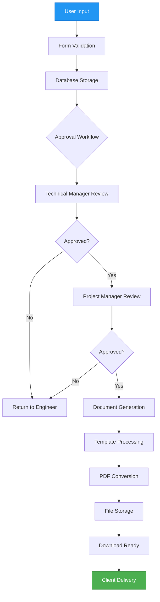
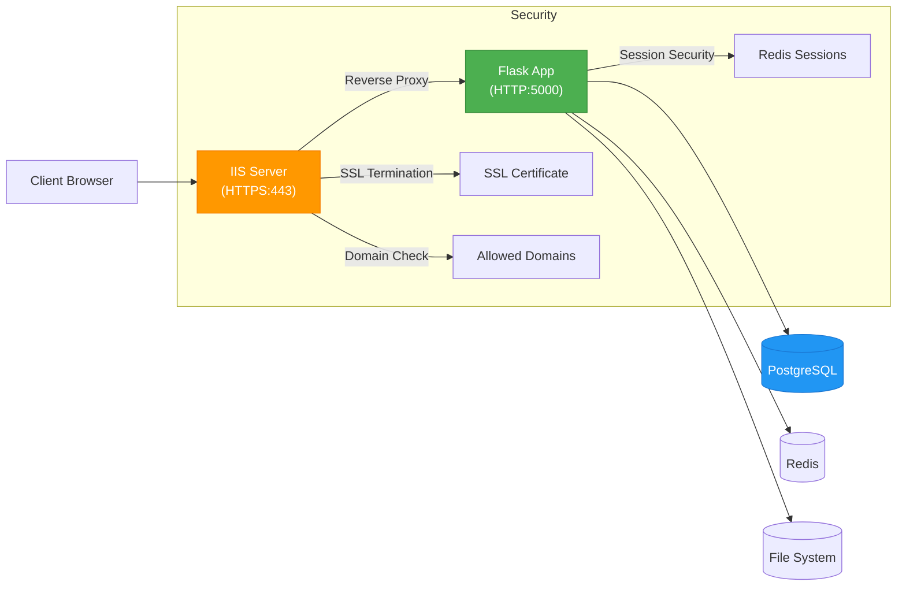

# Project Overview

<cite>
**Referenced Files in This Document**   
- [app.py](file://app.py)
- [config.py](file://config.py)
- [wsgi.py](file://wsgi.py)
- [DEPLOYMENT_INSTRUCTIONS.txt](file://DEPLOYMENT_INSTRUCTIONS.txt)
- [COMPLETE_IIS_SETUP.txt](file://COMPLETE_IIS_SETUP.txt)
- [iis_web_config.xml](file://iis_web_config.xml)
- [tasks/celery_app.py](file://tasks/celery_app.py)
- [tasks/email_tasks.py](file://tasks/email_tasks.py)
- [api/reports.py](file://api/reports.py)
- [README.md](file://README.md)
</cite>

## Table of Contents
1. [Introduction](#introduction)
2. [Core Architecture](#core-architecture)
3. [Application Structure](#application-structure)
4. [Key Features](#key-features)
5. [Data Flow and Workflow](#data-flow-and-workflow)
6. [Deployment and Production Environment](#deployment-and-production-environment)
7. [Development and Testing Tools](#development-and-testing-tools)
8. [Conclusion](#conclusion)

## Introduction

The SERVER application is a Flask-based backend system designed to manage Site Acceptance Test (SAT) reports with a multi-stage approval workflow. This system streamlines the creation, review, approval, and delivery of technical documentation for industrial automation projects. Built with scalability and security in mind, it serves as a centralized platform for engineers, technical managers, project managers, and administrators to collaborate on report generation while maintaining strict access controls and audit trails.

The application replaces manual, error-prone processes with an automated digital workflow that ensures consistency, compliance, and efficiency. It supports role-based access control (RBAC), document templating, background task processing, and secure deployment in enterprise environments. The system is currently deployed internally at Cully Automation and is accessible via a domain-restricted interface.

**Section sources**
- [README.md](file://README.md#L1-L478)

## Core Architecture

The SERVER application follows a modular Flask architecture with clear separation of concerns. It leverages blueprints to organize functionality into distinct components, enabling maintainability and scalability. The core architectural elements include:

- **Flask Application Factory**: The `create_app()` function in `app.py` initializes the application with environment-specific configurations, supporting development, production, and testing modes.
- **Blueprints for Modularity**: Routes are organized into blueprints (`routes/`) for authentication, reports, dashboard, approval, and API endpoints, allowing logical separation of web and API interfaces.
- **Configuration Management**: A hierarchical configuration system loads settings from environment variables and Python modules, with support for different environments through `DevelopmentConfig`, `ProductionConfig`, and `TestingConfig` classes.
- **Security Middleware**: Implements CSRF protection, session security, HTTPS enforcement, and domain-based access control to prevent unauthorized access.
- **Database Abstraction**: Uses SQLAlchemy ORM for database interactions, supporting both SQLite (development) and PostgreSQL (production).
- **Background Task Processing**: Integrates Celery with Redis for asynchronous operations such as email notifications and report generation.
- **Caching Layer**: Utilizes Redis for session storage, query caching, and performance optimization.

The architecture emphasizes performance and security, particularly in production, where features like connection pooling, query caching, and optimized session management are enabled.

```mermaid
graph TB
subgraph "Frontend Layer"
A[Web Browser] --> B[HTML/CSS/JS]
B --> C[Flask Templates]
end
subgraph "Backend Layer"
C --> D[Flask App]
D --> E[Blueprints]
E --> F[Web Routes]
E --> G[API Endpoints]
end
subgraph "Services"
D --> H[Database<br/>(SQLAlchemy)]
D --> I[Celery + Redis]
D --> J[SMTP Email]
D --> K[File System]
end
subgraph "Configuration & Security"
L[Environment Variables] --> D
M[config.py] --> D
N[Security Middleware] --> D
end
style D fill:#4CAF50,stroke:#388E3C,color:white
style H fill:#2196F3,stroke:#1976D2,color:white
style I fill:#FF9800,stroke:#F57C00,color:white
```

**Diagram sources**
- [app.py](file://app.py#L1-L752)
- [config.py](file://config.py#L1-L237)

**Section sources**
- [app.py](file://app.py#L1-L752)
- [config.py](file://config.py#L1-L237)

## Application Structure

The application is organized into a well-defined directory structure that separates concerns and promotes maintainability:

- **api/**: RESTful API endpoints using Flask-RESTX for structured documentation and validation
- **routes/**: Web route handlers organized by functionality (auth, reports, dashboard, approval, etc.)
- **templates/**: Jinja2 templates for rendering HTML pages
- **static/**: CSS, JavaScript, and image assets
- **tasks/**: Background tasks managed by Celery (email, report generation, maintenance)
- **database/**: Database configuration, migrations, and performance optimization utilities
- **config/**: Configuration management, secrets handling, and environment-specific settings
- **cache/**: Redis integration for caching, session storage, and CDN support
- **models.py**: SQLAlchemy models defining the database schema
- **auth.py**: Authentication logic including login, registration, and user management

The separation between `api/` and `routes/` allows for independent evolution of the frontend interface and backend API, supporting both traditional server-rendered pages and modern API-driven interactions.

**Section sources**
- [app.py](file://app.py#L1-L752)
- [README.md](file://README.md#L1-L478)

## Key Features

### User Management and Role-Based Access Control
The system implements a robust RBAC model with four primary roles:
- **Admin**: Full system access, user management, and configuration
- **Engineer**: Report creation and submission
- **Technical Manager (Automation Manager)**: Technical review and first-stage approval
- **Project Manager (PM)**: Final business approval and client delivery

Access control is enforced through decorators like `@login_required`, `@role_required_api`, and custom authorization checks in route handlers.

### Report Creation and Management
Users can create SAT reports through a guided web form that captures:
- Project information (reference, title, client)
- Personnel details (prepared by, reviewed by, approved by)
- Test results and technical specifications
- Supporting documents and digital signatures

Reports progress through a defined lifecycle: Draft → Submitted → TM Approved → PM Approved → Generated → Delivered.

### Document Generation Engine
The system automatically generates professional Word (.docx) and PDF documents using company templates. It replaces template tags (e.g., `{{PROJECT_REFERENCE}}`) with actual data while preserving formatting, fonts, and branding.

### Approval Workflow
A two-stage approval process ensures quality control:
1. **Technical Manager Review**: Validates technical accuracy and completeness
2. **Project Manager Approval**: Confirms business requirements and client readiness

Each approval stage includes comment fields and digital signature capture.

### Email Notifications
Automated email notifications keep stakeholders informed about:
- New submission requests
- Approval/rejection decisions
- Status changes
- System alerts

These are handled asynchronously via Celery tasks to prevent blocking the main application.

```mermaid
classDiagram
class User {
+id : str
+full_name : str
+email : str
+password_hash : str
+role : str
+status : str
+created_date : datetime
}
class Report {
+id : str
+document_title : str
+document_reference : str
+project_reference : str
+client_name : str
+status : str
+created_by : str
+created_at : datetime
+updated_at : datetime
}
class SATReport {
+id : int
+report_id : str
+data_json : str
+created_at : datetime
}
class EmailTask {
+send_email_task()
+send_bulk_email_task()
+send_notification_email_task()
}
class ReportTask {
+generate_report_task()
+convert_to_pdf_task()
}
User --> Report : "creates"
Report --> SATReport : "contains"
Report --> EmailTask : "triggers"
Report --> ReportTask : "initiates"
EmailTask --> "SMTP" : "sends"
ReportTask --> "Word Template" : "uses"
note right of User
Roles : Admin, Engineer,
Automation Manager, PM
end
note right of Report
Status : Draft, Submitted,
TM_Approved, PM_Approved,
Generated, Rejected
end
```

**Diagram sources**
- [models.py](file://models.py)
- [api/reports.py](file://api/reports.py#L1-L504)
- [tasks/email_tasks.py](file://tasks/email_tasks.py#L1-L402)

**Section sources**
- [README.md](file://README.md#L1-L478)
- [api/reports.py](file://api/reports.py#L1-L504)
- [tasks/email_tasks.py](file://tasks/email_tasks.py#L1-L402)

## Data Flow and Workflow

The application follows a well-defined data flow from user input to final report delivery:



**Diagram sources**
- [README.md](file://README.md#L1-L478)
- [app.py](file://app.py#L1-L752)

**Section sources**
- [README.md](file://README.md#L1-L478)

## Deployment and Production Environment

The SERVER application is designed for production deployment on Windows Server with IIS as a reverse proxy. The deployment architecture includes:

- **IIS Reverse Proxy**: Routes HTTPS requests from `automation-reports.mobilehmi.org:443` to the Flask application running on `http://127.0.0.1:5000`
- **WSGI Server**: Uses Waitress (in `wsgi.py`) for production-grade WSGI compliance and performance
- **Domain-Only Access**: Blocks direct IP access (172.16.18.21) and only allows access via the configured domain
- **SSL/TLS Termination**: Handled by IIS using a password-protected `.pfx` certificate
- **Security Headers**: Enforced via IIS configuration (`iis_web_config.xml`) including HSTS, XSS protection, and frame denial

The application can be started using:
- `wsgi.py` for production WSGI deployment
- `start_production.bat` for Windows service startup
- `deploy.py` for environment setup and launch



**Diagram sources**
- [wsgi.py](file://wsgi.py#L1-L42)
- [COMPLETE_IIS_SETUP.txt](file://COMPLETE_IIS_SETUP.txt#L1-L143)
- [iis_web_config.xml](file://iis_web_config.xml#L1-L37)
- [DEPLOYMENT_INSTRUCTIONS.txt](file://DEPLOYMENT_INSTRUCTIONS.txt#L1-L126)

**Section sources**
- [wsgi.py](file://wsgi.py#L1-L42)
- [DEPLOYMENT_INSTRUCTIONS.txt](file://DEPLOYMENT_INSTRUCTIONS.txt#L1-L126)
- [COMPLETE_IIS_SETUP.txt](file://COMPLETE_IIS_SETUP.txt#L1-L143)

## Development and Testing Tools

The repository includes comprehensive tooling for development, testing, and quality assurance:

- **Testing Framework**: Pytest with unit, integration, and end-to-end test suites in the `tests/` directory
- **Code Quality**: Scripts for code quality analysis, technical debt tracking, and automation
- **Performance Testing**: Locust-based performance tests in `tests/performance/`
- **Configuration Management**: Environment-specific configuration files (`development.yaml`, `production.yaml`)
- **Deployment Automation**: Batch files and Python scripts for consistent deployment
- **Logging and Monitoring**: Structured logging with rotation and error tracking

The system supports multiple deployment scenarios including direct Flask execution, WSGI serving, and IIS integration, making it adaptable to various production environments.

**Section sources**
- [scripts/](file://scripts/)
- [tests/](file://tests/)
- [config/](file://config/)

## Conclusion

The SERVER application provides a comprehensive solution for managing Site Acceptance Test reports with a secure, scalable, and user-friendly interface. Its modular Flask architecture, role-based access control, automated document generation, and multi-stage approval workflow make it ideal for enterprise environments requiring strict compliance and auditability.

The system is production-ready with robust deployment support via IIS, WSGI, and reverse proxy configurations. Its separation of web and API routes, combined with background task processing through Celery and Redis, ensures responsive user experiences and reliable asynchronous operations.

For new developers, the application offers a clear structure with well-documented workflows, configuration options, and deployment guides, enabling rapid onboarding and contribution.