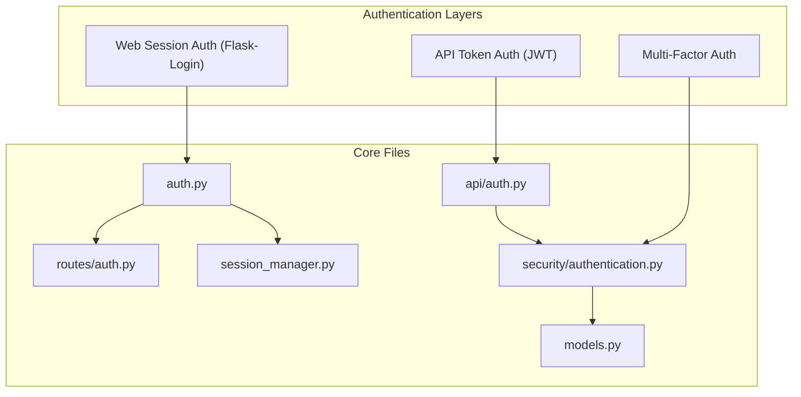
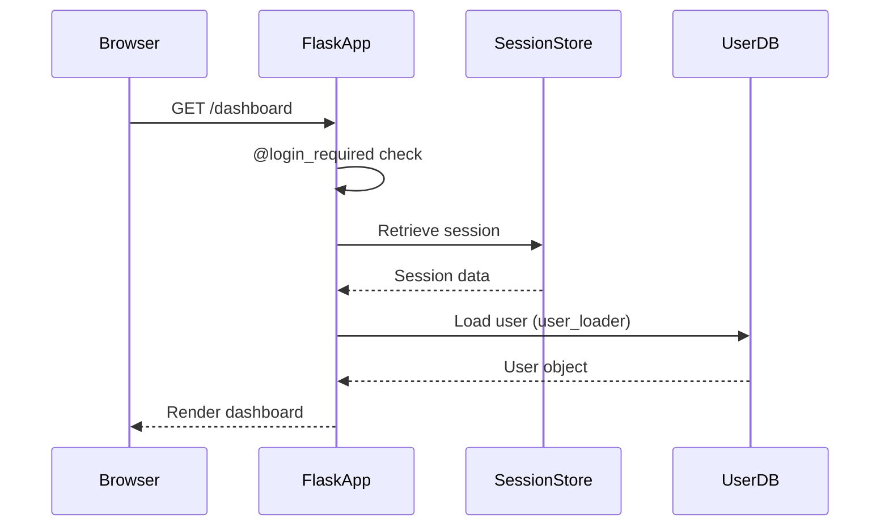
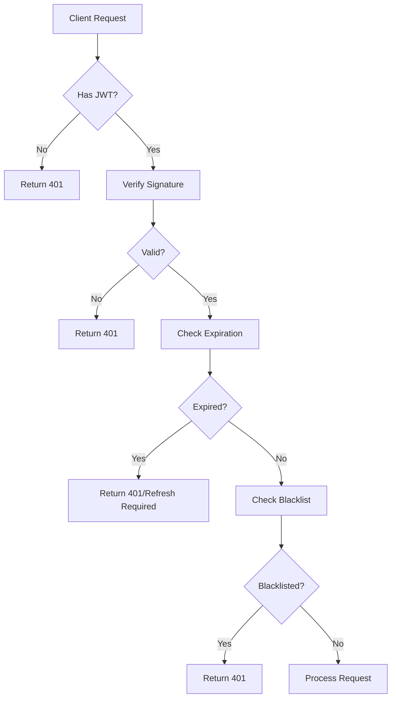
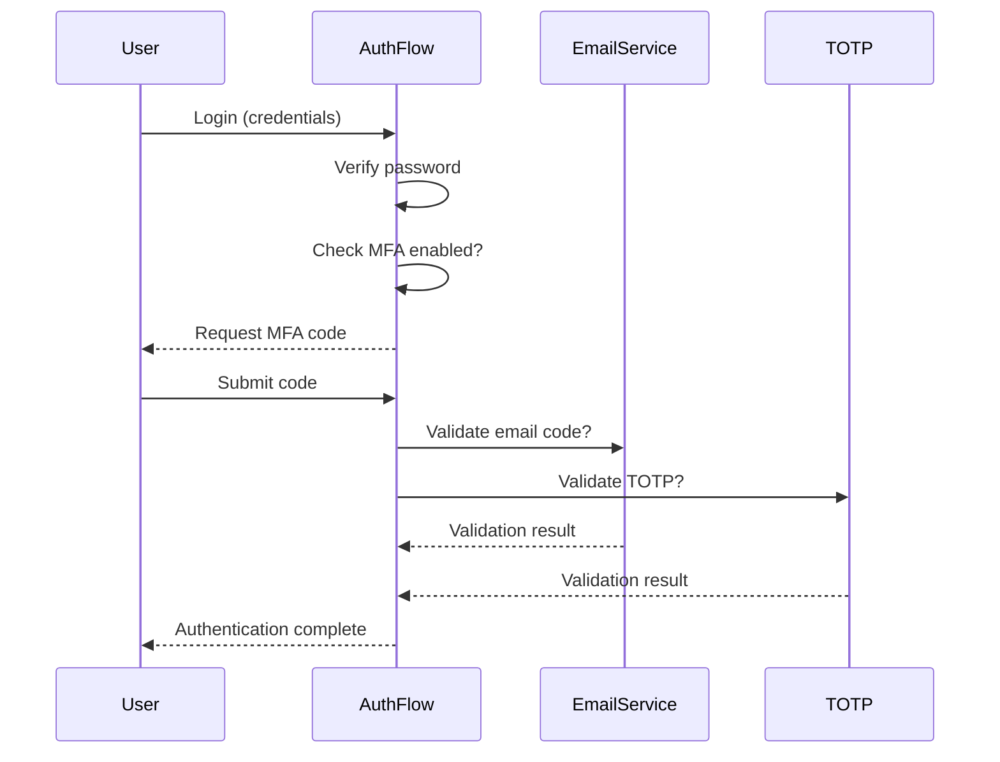
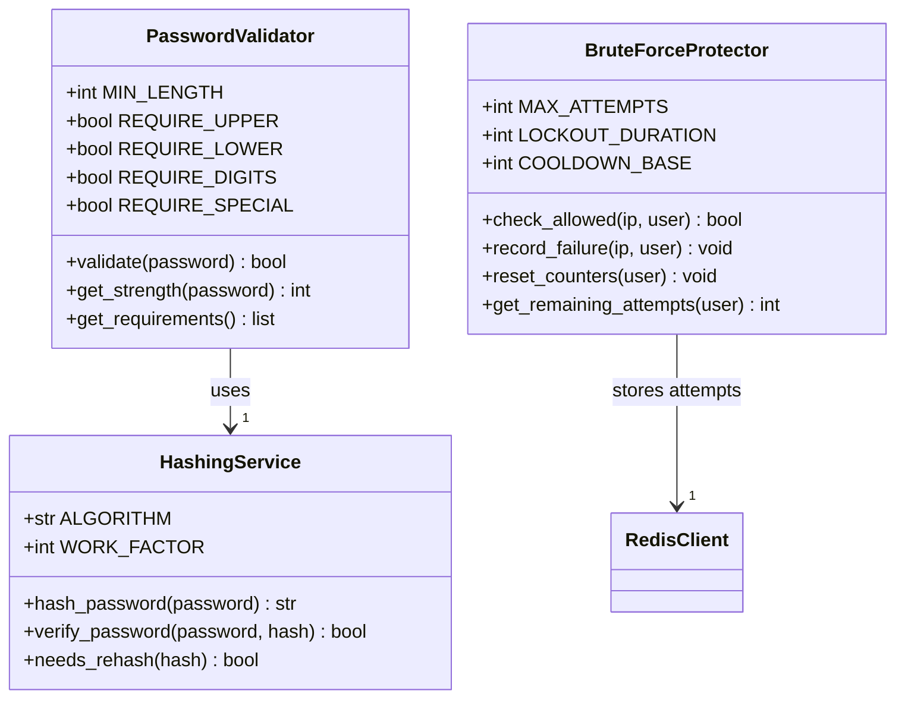
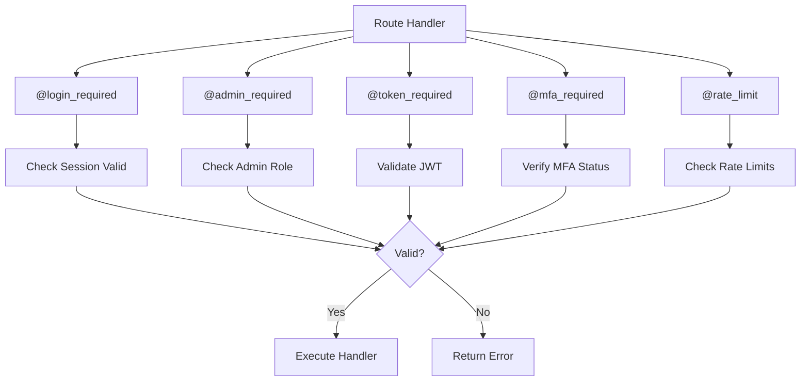
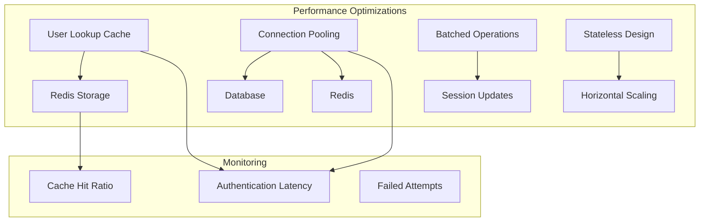

# Authentication Mechanisms

<cite>
**Referenced Files in This Document**   
- [auth.py](file://auth.py)
- [routes/auth.py](file://routes/auth.py)
- [api/auth.py](file://api/auth.py)
- [models.py](file://models.py)
- [session_manager.py](file://session_manager.py)
- [config/secrets.py](file://config/secrets.py)
- [security/authentication.py](file://security/authentication.py)
</cite>

## Table of Contents
1. [Introduction](#introduction)
2. [Project Structure and Authentication Components](#project-structure-and-authentication-components)
3. [Session-Based Authentication with Flask-Login](#session-based-authentication-with-flask-login)
4. [JWT Token Management for API Endpoints](#jwt-token-management-for-api-endpoints)
5. [Multi-Factor Authentication (MFA) Implementation](#multi-factor-authentication-mfa-implementation)
6. [Secure Credential Handling and Password Policies](#secure-credential-handling-and-password-policies)
7. [Configuration and Secrets Management](#configuration-and-secrets-management)
8. [Authentication Flow and Decorator Usage](#authentication-flow-and-decorator-usage)
9. [Common Security Issues and Mitigations](#common-security-issues-and-mitigations)
10. [Performance and Caching Strategies](#performance-and-caching-strategies)
11. [Conclusion](#conclusion)

## Introduction
The SERVER application implements a robust, multi-layered authentication system combining session-based login for web interfaces and JWT-based token authentication for API endpoints. This document details the architecture, implementation, and security considerations of the authentication subsystem, focusing on Flask-Login integration, token management, credential security, and performance optimization.

## Project Structure and Authentication Components

The authentication functionality is distributed across multiple modules, each serving a distinct role in the overall security architecture.

**Diagram sources**
- [auth.py](file://auth.py#L1-L20)
- [routes/auth.py](file://routes/auth.py#L1-L15)
- [api/auth.py](file://api/auth.py#L1-L15)
- [security/authentication.py](file://security/authentication.py#L1-L10)

**Section sources**
- [auth.py](file://auth.py#L1-L50)
- [routes/auth.py](file://routes/auth.py#L1-L30)

## Session-Based Authentication with Flask-Login

The web interface utilizes Flask-Login for session management, providing persistent user sessions across requests. The system implements secure session handling through server-side session storage and CSRF protection.

User session persistence is managed via the `session_manager.py` module, which integrates with Redis for distributed session storage in production environments. Sessions are serialized and encrypted before storage to prevent tampering.

Flask-Login's `@login_required` decorator is used throughout route handlers to enforce authentication, with custom login views defined in `routes/auth.py`. The `User` model in `models.py` implements the required Flask-Login interface methods including `is_authenticated`, `is_active`, and `get_id()`.

**Diagram sources**
- [auth.py](file://auth.py#L45-L80)
- [session_manager.py](file://session_manager.py#L20-L40)
- [models.py](file://models.py#L100-L120)

**Section sources**
- [auth.py](file://auth.py#L25-L100)
- [session_manager.py](file://session_manager.py#L15-L50)
- [models.py](file://models.py#L90-L130)

## JWT Token Management for API Endpoints

API authentication is implemented using JSON Web Tokens (JWT) with configurable expiration and refresh mechanisms. The `api/auth.py` module handles token generation, validation, and refresh operations.

Tokens are signed using HS256 algorithm with a secret key configured in `secrets.py`. Access tokens have a short lifespan (15 minutes), while refresh tokens last 7 days. The system implements a token blacklist stored in Redis to handle logout and token invalidation.

Token validation occurs at the middleware level for protected API endpoints, with detailed error responses for expired, malformed, or revoked tokens. The refresh endpoint requires both valid refresh token and user identity verification.

**Diagram sources**
- [api/auth.py](file://api/auth.py#L30-L120)
- [security/authentication.py](file://security/authentication.py#L50-L80)

**Section sources**
- [api/auth.py](file://api/auth.py#L20-L150)
- [security/authentication.py](file://security/authentication.py#L40-L100)

## Multi-Factor Authentication (MFA) Implementation

The system supports optional multi-factor authentication using both TOTP (Time-Based One-Time Password) and email-based verification. MFA configuration is stored in the user profile and can be enabled/disabled through the account settings interface.

The TOTP implementation follows RFC 6238 standards, with QR code generation for authenticator app setup. Email verification sends time-limited codes via SMTP with rate limiting to prevent abuse. MFA state is tracked in the session and required for sensitive operations like password changes or role modifications.

MFA flows are orchestrated through the `security/authentication.py` module, which provides unified interfaces for different verification methods while maintaining consistent security policies.

**Diagram sources**
- [security/authentication.py](file://security/authentication.py#L100-L200)
- [tasks/email_tasks.py](file://tasks/email_tasks.py#L45-L60)

**Section sources**
- [security/authentication.py](file://security/authentication.py#L90-L220)

## Secure Credential Handling and Password Policies

Password security is enforced through bcrypt hashing with configurable work factors. The `security/authentication.py` module handles password hashing and verification, using salted hashes to prevent rainbow table attacks.

The system implements comprehensive protection against brute-force attacks through multiple mechanisms:
- Account lockout after 5 failed attempts within 15 minutes
- Progressive delay between login attempts
- IP-based rate limiting for authentication endpoints
- Monitoring and alerting for suspicious login patterns

Password complexity requirements are enforced during registration and password changes, requiring minimum length, mixed case, numbers, and special characters. All credential operations occur over HTTPS with HSTS enforcement.

**Diagram sources**
- [security/authentication.py](file://security/authentication.py#L200-L300)
- [cache/redis_client.py](file://cache/redis_client.py#L10-L25)

**Section sources**
- [security/authentication.py](file://security/authentication.py#L180-L320)

## Configuration and Secrets Management

Authentication behavior is controlled through configuration files in the `config/` directory, with environment-specific settings in `development.yaml`, `production.yaml`, and `testing.yaml`. The `secrets.py` file contains sensitive credentials and cryptographic keys.

Key configuration options include:
- **Session settings**: timeout duration, cookie security flags, storage backend
- **JWT settings**: secret key, access/refresh token lifespans, algorithm
- **Security policies**: password complexity, lockout thresholds, rate limits
- **MFA options**: enabled methods, grace periods, recovery codes

Secrets are loaded at application startup and never exposed in logs or error messages. In production, critical secrets are expected to be provided via environment variables rather than file storage.

**Section sources**
- [config/secrets.py](file://config/secrets.py#L1-L40)
- [config/manager.py](file://config/manager.py#L50-L80)
- [config/production.yaml](file://config/production.yaml#L1-L30)

## Authentication Flow and Decorator Usage

The authentication system provides several decorators to protect routes and enforce security policies. These are implemented in `auth.py` and `api/auth.py` for web and API endpoints respectively.

Key decorators include:
- `@login_required`: Ensures user is authenticated via session
- `@admin_required`: Verifies user has administrative privileges
- `@token_required`: Validates JWT for API endpoints
- `@mfa_required`: Enforces multi-factor authentication
- `@rate_limit`: Protects against brute-force attacks

These decorators are composable, allowing multiple security requirements to be applied to a single endpoint. Error handling is centralized to provide consistent responses and prevent information leakage.

**Diagram sources**
- [auth.py](file://auth.py#L100-L180)
- [api/auth.py](file://api/auth.py#L150-L200)

**Section sources**
- [auth.py](file://auth.py#L80-L200)
- [api/auth.py](file://api/auth.py#L120-L220)

## Common Security Issues and Mitigations

The authentication system addresses several common security challenges through proactive design and implementation.

**Session Fixation**: Prevented by regenerating session IDs after successful authentication and using secure session cookies with HttpOnly and SameSite flags.

**Expired Tokens**: Handled through graceful error responses that prompt clients to refresh tokens or re-authenticate, with clear distinction between expired and invalid tokens.

**CSRF Protection**: Implemented via CSRF tokens in forms and validation in `routes/auth.py`, with automatic token generation and verification. The `static/js/csrf_manager.js` handles client-side token management.

**Token Sidejacking**: Mitigated by binding tokens to client fingerprints (IP + User-Agent) and monitoring for anomalous usage patterns.

**Replay Attacks**: Prevented through short token lifespans, one-time use refresh tokens, and timestamp validation with small clock skew tolerance.

**Section sources**
- [routes/auth.py](file://routes/auth.py#L100-L150)
- [middleware.py](file://middleware.py#L20-L40)
- [static/js/csrf_manager.js](file://static/js/csrf_manager.js#L1-L30)

## Performance and Caching Strategies

Authentication performance is optimized through strategic caching and connection pooling. User lookups are cached in Redis with a 5-minute TTL to reduce database load during peak authentication periods.

The system implements connection pooling for both database and Redis operations, with configurable pool sizes based on deployment environment. Critical authentication paths are optimized to minimize round trips and database queries.

Rate limiting counters are stored in Redis for fast access, and session operations are batched where possible to reduce network overhead. The authentication endpoints are designed to be stateless where feasible, enabling horizontal scaling.

**Diagram sources**
- [cache/redis_client.py](file://cache/redis_client.py#L15-L40)
- [database/pooling.py](file://database/pooling.py#L10-L25)
- [session_manager.py](file://session_manager.py#L30-L50)

**Section sources**
- [cache/redis_client.py](file://cache/redis_client.py#L1-L60)
- [database/pooling.py](file://database/pooling.py#L1-L40)
- [session_manager.py](file://session_manager.py#L1-L60)

## Conclusion

The SERVER application's authentication subsystem provides a comprehensive, secure, and performant solution for both web and API access. By combining proven technologies like Flask-Login and JWT with robust security practices, the system effectively protects user accounts and application resources. The modular design allows for future enhancements such as biometric authentication or single sign-on integration while maintaining backward compatibility and security standards.