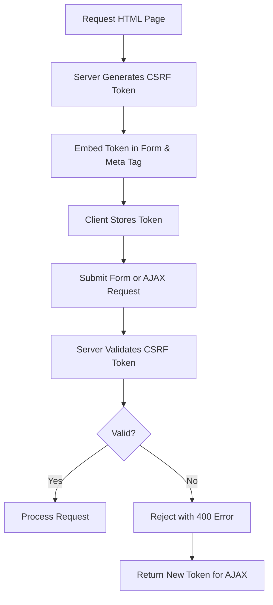
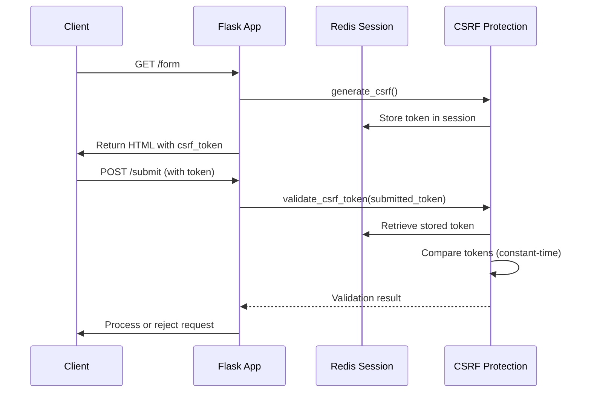
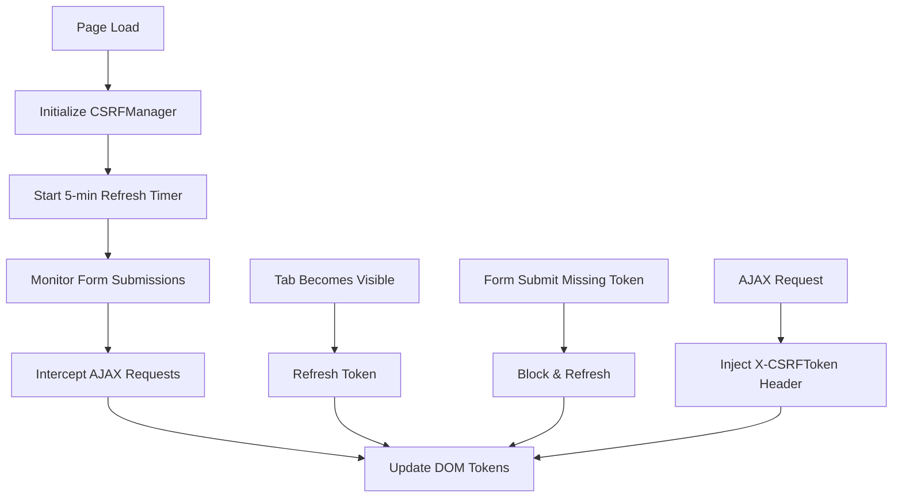
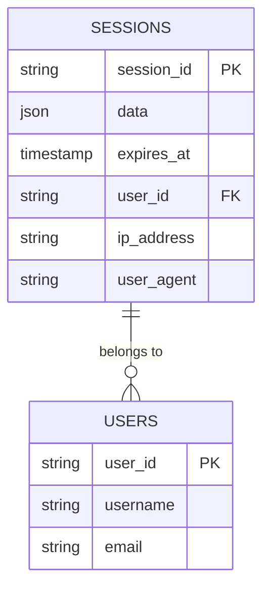
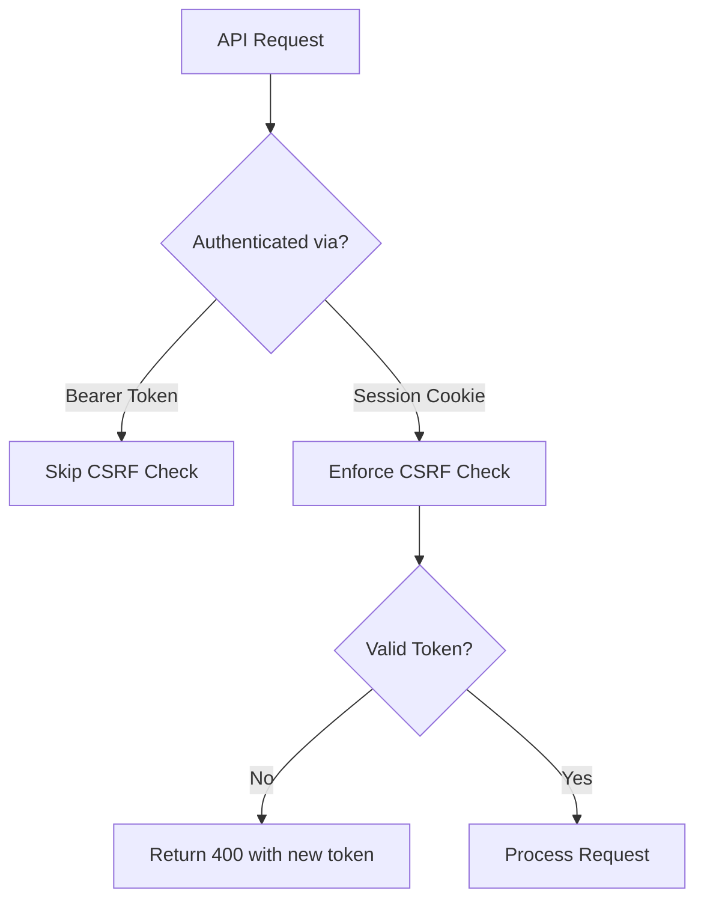
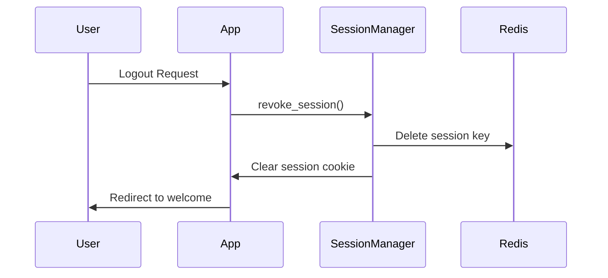

# CSRF Protection and Session Management

<cite>
**Referenced Files in This Document**   
- [app.py](file://app.py)
- [middleware.py](file://middleware.py)
- [cache/session_store.py](file://cache/session_store.py)
- [static/js/csrf_manager.js](file://static/js/csrf_manager.js)
- [security/headers.py](file://security/headers.py)
- [session_manager.py](file://session_manager.py)
- [routes/auth.py](file://routes/auth.py)
- [config.py](file://config.py)
</cite>

## Table of Contents
1. [Introduction](#introduction)
2. [CSRF Protection Overview](#csrf-protection-overview)
3. [Session Management Architecture](#session-management-architecture)
4. [Flask-WTF CSRF Implementation](#flask-wtf-csrf-implementation)
5. [Frontend CSRF Token Handling](#frontend-csrf-token-handling)
6. [Secure Session Storage with Redis](#secure-session-storage-with-redis)
7. [Session Cookie Security Settings](#session-cookie-security-settings)
8. [CSRF Token Injection and Template Integration](#csrf-token-injection-and-template-integration)
9. [API Endpoint Security and CSRF Bypass Risks](#api-endpoint-security-and-csrf-bypass-risks)
10. [Session Hijacking Prevention and Token Invalidation](#session-hijacking-prevention-and-token-invalidation)
11. [Performance Implications and Redis Scaling](#performance-implications-and-redis-scaling)
12. [Troubleshooting CSRF and Session Issues](#troubleshooting-csrf-and-session-issues)
13. [Conclusion](#conclusion)

## Introduction
This document provides a comprehensive analysis of the CSRF protection and session security mechanisms implemented in the SERVER application. It details the integration of Flask-WTF's CSRF protection across forms and AJAX requests, the Redis-backed session storage system, and the security policies enforced through middleware and configuration. The documentation covers token lifecycle management, frontend synchronization, known vulnerabilities, and mitigation strategies to ensure robust application security.

## CSRF Protection Overview

The SERVER application implements a multi-layered CSRF protection strategy combining server-side token generation, validation, and client-side JavaScript management. CSRF tokens are generated per session and embedded in HTML responses, forms, and made available to JavaScript for AJAX request signing. The system prevents cross-site request forgery attacks by validating the authenticity of state-changing requests through cryptographic tokens.



**Diagram sources**
- [app.py](file://app.py#L298-L333)
- [security/headers.py](file://security/headers.py#L106-L144)

**Section sources**
- [app.py](file://app.py#L298-L333)
- [security/headers.py](file://security/headers.py#L106-L144)

## Session Management Architecture

The session management system is built on Flask's extensible session interface, with Redis serving as the persistent backend. This architecture enables secure, scalable, and fault-tolerant session storage across application instances. The `RedisSessionInterface` class implements Flask's `SessionInterface`, managing session creation, retrieval, and persistence with automatic expiration and signing.

```mermaid
classDiagram
class RedisSession {
+sid : str
+new : bool
+modified : bool
+permanent : bool
}
class RedisSessionInterface {
-redis_client : Redis
-key_prefix : str
-use_signer : bool
+open_session(app, request)
+save_session(app, session, response)
+generate_sid()
}
class SessionManager {
-redis_client : Redis
-key_prefix : str
+get_session_data(session_id)
+delete_session(session_id)
+delete_user_sessions(user_id)
+get_active_sessions(user_id)
+get_session_stats()
}
RedisSessionInterface --> RedisSession : "creates"
SessionManager --> RedisSessionInterface : "uses"
RedisSessionInterface --> "Redis" : "stores data"
```

**Diagram sources**
- [cache/session_store.py](file://cache/session_store.py#L1-L309)

**Section sources**
- [cache/session_store.py](file://cache/session_store.py#L1-L309)

## Flask-WTF CSRF Implementation

Flask-WTF's CSRF protection is integrated at the application level through token generation and validation hooks. The `generate_csrf()` function creates cryptographically secure tokens stored in the user's session. These tokens are validated on form submission and API calls using constant-time comparison to prevent timing attacks. The system automatically regenerates tokens upon expiration or invalidation.



**Diagram sources**
- [app.py](file://app.py#L298-L333)
- [security/headers.py](file://security/headers.py#L106-L144)

**Section sources**
- [app.py](file://app.py#L298-L333)
- [security/headers.py](file://security/headers.py#L106-L144)

## Frontend CSRF Token Handling

The frontend JavaScript component `csrf_manager.js` ensures CSRF token freshness and automatic injection into requests. It implements a periodic refresh mechanism (every 5 minutes) and intercepts form submissions and AJAX calls to ensure valid tokens are present. The manager also handles tab visibility changes, refreshing tokens when users return to inactive tabs.



**Diagram sources**
- [static/js/csrf_manager.js](file://static/js/csrf_manager.js#L0-L167)

**Section sources**
- [static/js/csrf_manager.js](file://static/js/csrf_manager.js#L0-L167)

## Secure Session Storage with Redis

Session data is securely stored in Redis using signed session IDs and JSON serialization. The `RedisSessionInterface` ensures data integrity and confidentiality by leveraging Flask's signing mechanism when enabled. Each session is assigned a unique ID generated via UUID4 and stored under a prefixed key (default: `session:`) to avoid namespace collisions.

Key features:
- Automatic session expiration based on `PERMANENT_SESSION_LIFETIME`
- Support for signed session cookies to prevent tampering
- Error handling for Redis connectivity issues (falls back to in-memory)
- Comprehensive logging for session operations



**Diagram sources**
- [cache/session_store.py](file://cache/session_store.py#L1-L309)
- [config.py](file://config.py#L153-L179)

**Section sources**
- [cache/session_store.py](file://cache/session_store.py#L1-L309)
- [config.py](file://config.py#L153-L179)

## Session Cookie Security Settings

Session cookies are configured with strict security flags to mitigate common web vulnerabilities. These settings are enforced through Flask configuration and applied globally via the `after_request` handler. The configuration ensures cookies are protected against XSS, CSRF, and network interception attacks.

**Cookie Security Configuration**
| Setting | Value | Purpose |
|-------|-------|--------|
| `SESSION_COOKIE_HTTPONLY` | `True` | Prevents JavaScript access to session cookie |
| `SESSION_COOKIE_SECURE` | `True` | Ensures cookie is only sent over HTTPS |
| `SESSION_COOKIE_SAMESITE` | `Lax` | Mitigates CSRF by restricting cross-site sending |
| `SESSION_COOKIE_DOMAIN` | `None` | Uses current domain without subdomain leakage |

**Section sources**
- [config.py](file://config.py#L153-L179)
- [middleware.py](file://middleware.py#L0-L117)

## CSRF Token Injection and Template Integration

CSRF tokens are automatically injected into all templates through Flask's context processor mechanism. This ensures every rendered page has access to a valid CSRF token without requiring manual insertion in each template. The token is available as `csrf_token` in Jinja2 templates and can be used in forms and JavaScript.

```html
<!-- In template -->
<meta name="csrf-token" content="{{ csrf_token }}">
<input type="hidden" name="csrf_token" value="{{ csrf_token }}">

<!-- AJAX usage -->
<script>
fetch('/api/endpoint', {
  method: 'POST',
  headers: { 'X-CSRFToken': document.querySelector('meta[name="csrf-token"]').content }
})
</script>
```

For single-page interactions, the `CSRFManager` class synchronizes tokens across the application, ensuring AJAX requests always use valid tokens even after refresh.

**Section sources**
- [app.py](file://app.py#L330-L359)
- [security/headers.py](file://security/headers.py#L106-L144)

## API Endpoint Security and CSRF Bypass Risks

While most endpoints require CSRF protection, API endpoints using token-based authentication (e.g., Bearer tokens) may be exempt. However, this creates a potential bypass vector if not properly isolated. The application mitigates this by:

1. Using separate authentication mechanisms for API vs. web forms
2. Enforcing CSRF for all cookie-authenticated requests regardless of endpoint
3. Returning fresh CSRF tokens in error responses to maintain usability

The custom CSRF error handler returns a JSON response with a new token for AJAX requests, preventing user frustration while maintaining security.



**Section sources**
- [app.py](file://app.py#L415-L446)
- [security/headers.py](file://security/headers.py#L106-L144)

## Session Hijacking Prevention and Token Invalidation

The application implements multiple layers to prevent session hijacking:

- **HttpOnly cookies**: Prevent JavaScript access to session identifiers
- **Short session lifetime**: 30-minute inactivity timeout
- **Session revocation**: Immediate invalidation on logout
- **IP and User-Agent binding**: Sessions tied to client characteristics
- **Token rotation**: CSRF tokens regenerated periodically

The `SessionManager` provides explicit methods to revoke sessions, including `delete_user_sessions()` for administrative logout and `revoke_session()` during user logout. Revoked sessions are tracked in memory and Redis to prevent reuse.



**Section sources**
- [session_manager.py](file://session_manager.py#L106-L137)
- [routes/auth.py](file://routes/auth.py#L151-L181)

## Performance Implications and Redis Scaling

Using Redis for session storage introduces network latency but enables horizontal scaling and high availability. The performance characteristics include:

- **Latency**: ~1-5ms per session read/write (network + Redis)
- **Throughput**: Limited by Redis connection pool size (default: 50)
- **Memory Usage**: ~1-2KB per active session
- **Scalability**: Linear scaling with Redis cluster size

To optimize performance:
- Use connection pooling to minimize Redis connection overhead
- Set appropriate timeout values (SESSION_CACHE_TIMEOUT = 86400s)
- Monitor Redis memory usage and evict expired sessions
- Implement fallback mechanisms for Redis outages

The `REDIS_REQUIRED` configuration flag determines whether Redis is mandatory or optional for session operations.

**Section sources**
- [cache/session_store.py](file://cache/session_store.py#L1-L309)
- [config.py](file://config.py#L153-L179)

## Troubleshooting CSRF and Session Issues

### Common CSRF Errors
- **"CSRF token expired"**: Caused by token timeout (30 min) or tab inactivity
  - Solution: Refresh page or wait for automatic refresh
- **Missing token in AJAX**: JavaScript failed to inject token
  - Solution: Check browser console for errors in `csrf_manager.js`
- **Form submission blocked**: Token not present in form
  - Solution: Ensure `` is in all POST forms

### Session Expiration Issues
- **Unexpected logout**: Session expired due to 30-minute inactivity
  - Solution: Re-login; consider increasing `PERMANENT_SESSION_LIFETIME`
- **Redis connectivity errors**: Session data not persisted
  - Solution: Check Redis server status and connection settings
- **Cookie not set**: Browser blocking third-party cookies
  - Solution: Ensure same-site configuration matches deployment

### Debugging Steps
1. Check browser developer tools for cookie presence
2. Verify CSRF token in page source (`meta[name="csrf-token"]`)
3. Review server logs for Redis connection errors
4. Test with `curl` to isolate client-side issues
5. Validate Redis key existence: `redis-cli keys "session:*"`

**Section sources**
- [app.py](file://app.py#L415-L446)
- [static/js/csrf_manager.js](file://static/js/csrf_manager.js#L0-L167)
- [cache/session_store.py](file://cache/session_store.py#L1-L309)

## Conclusion

The SERVER application implements a robust security framework for CSRF protection and session management. By combining Flask-WTF's CSRF utilities with Redis-backed sessions and comprehensive frontend JavaScript management, the system effectively mitigates cross-site request forgery and session hijacking risks. Key strengths include automatic token refresh, strict cookie policies, and centralized session revocation. For optimal security, ensure Redis is properly configured and monitored, and consider implementing additional protections such as user-agent validation and IP binding for high-risk operations.