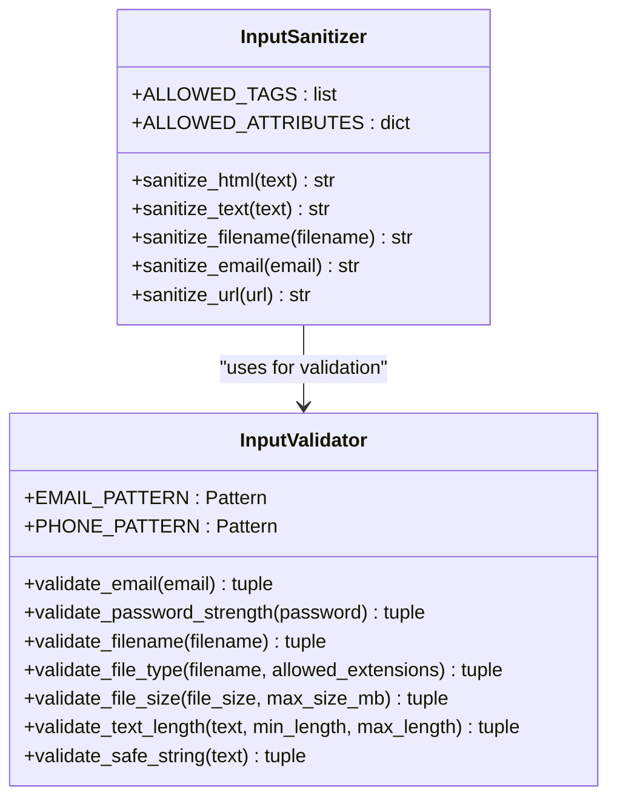
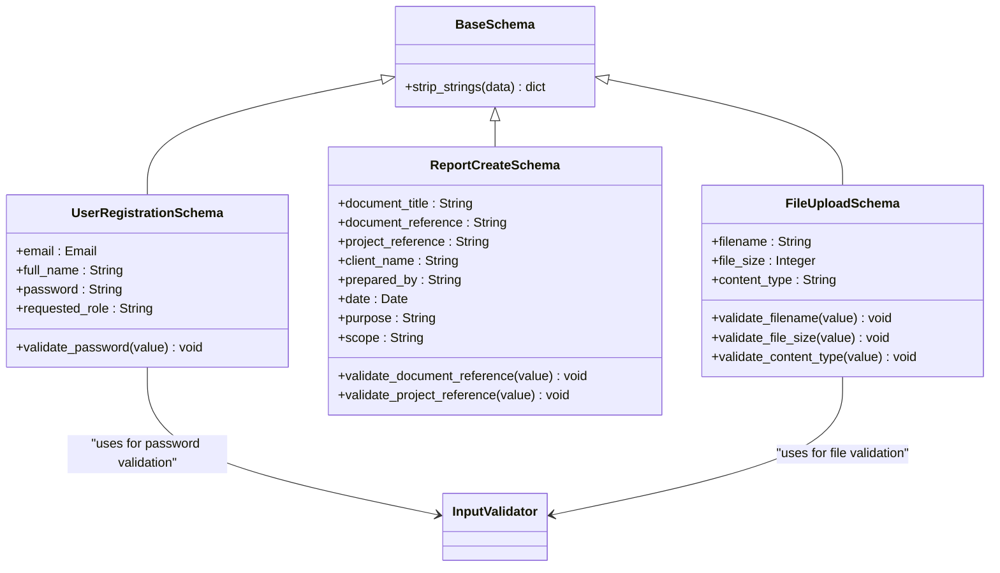
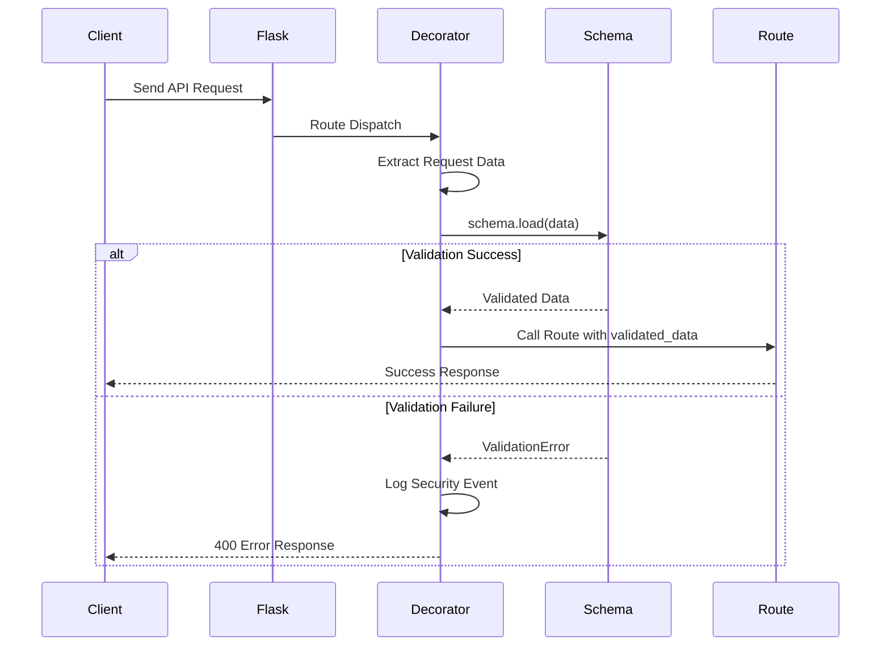
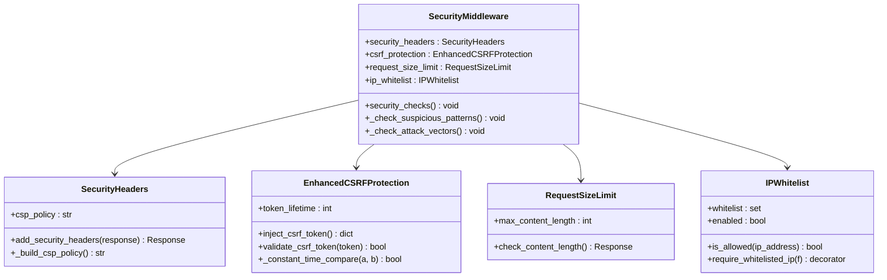
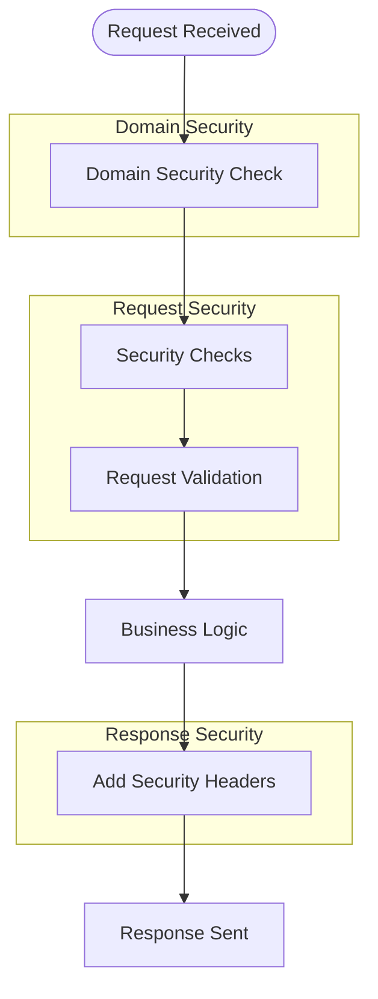
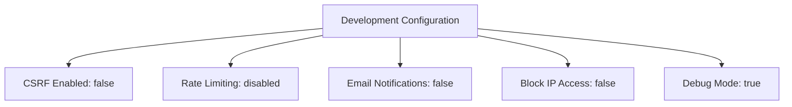
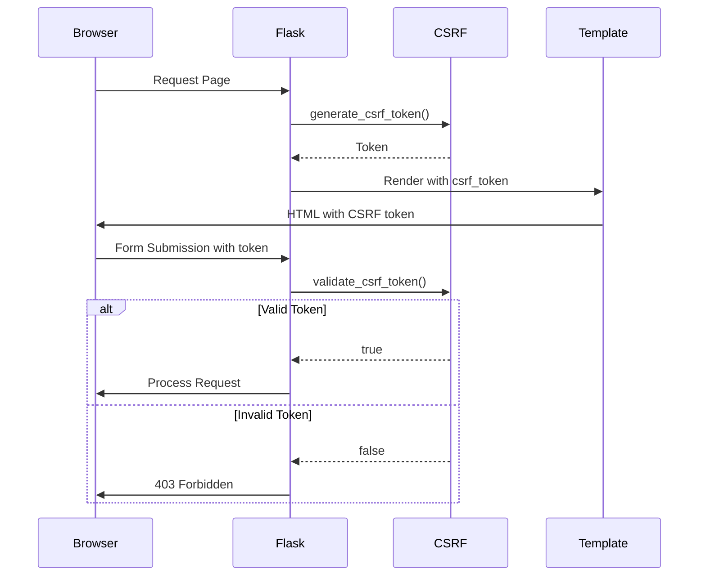

# Input Validation and Security Headers

<cite>
**Referenced Files in This Document**   
- [security/validation.py](file://security/validation.py)
- [security/headers.py](file://security/headers.py)
- [api/schemas.py](file://api/schemas.py)
- [middleware.py](file://middleware.py)
- [config/production.yaml](file://config/production.yaml)
- [config/development.yaml](file://config/development.yaml)
</cite>

## Table of Contents
1. [Introduction](#introduction)
2. [Input Validation and Sanitization](#input-validation-and-sanitization)
3. [Marshmallow Schema Validation](#marshmallow-schema-validation)
4. [Security Headers Implementation](#security-headers-implementation)
5. [Middleware Integration](#middleware-integration)
6. [Environment-Specific Configuration](#environment-specific-configuration)
7. [Common Misconfigurations and Troubleshooting](#common-misconfigurations-and-troubleshooting)
8. [Testing and Verification Strategies](#testing-and-verification-strategies)
9. [Frontend and CDN Integration](#frontend-and-cdn-integration)
10. [Conclusion](#conclusion)

## Introduction

The SERVER application implements comprehensive security measures for input validation and HTTP security headers enforcement. This documentation details the implementation of input sanitization routines, request payload validation using Marshmallow schemas, and the application of critical security headers such as Content-Security-Policy, X-Content-Type-Options, X-Frame-Options, and Strict-Transport-Security. The security framework is designed to protect against common web vulnerabilities including SQL injection, cross-site scripting (XSS), and cross-site request forgery (CSRF), while providing configurable security policies across different deployment environments.

## Input Validation and Sanitization

The input validation framework in the SERVER application is implemented in `security/validation.py` and provides comprehensive protection against common web vulnerabilities. The system employs both proactive sanitization and strict validation to ensure data integrity and security.

### Input Sanitization Routines

The `InputSanitizer` class provides methods for sanitizing various types of user input:

- **HTML Content**: Uses the `bleach` library to sanitize HTML, allowing only a predefined set of safe tags and attributes
- **Plain Text**: Applies HTML escaping and removes null bytes to prevent injection attacks
- **Filenames**: Removes dangerous characters and path traversal sequences to prevent directory traversal
- **Email Addresses**: Normalizes and removes potentially dangerous characters
- **URLs**: Validates schemes and reconstructs clean URLs to prevent open redirect vulnerabilities



**Diagram sources**
- [security/validation.py](file://security/validation.py#L15-L250)

**Section sources**
- [security/validation.py](file://security/validation.py#L15-L250)

### Attack Vector Protection

The validation system specifically protects against:

- **SQL Injection**: By validating input patterns and sanitizing text content
- **XSS Payloads**: Through HTML sanitization with allowed tags and attributes
- **Path Traversal**: By removing dangerous characters from filenames
- **Command Injection**: By validating input against safe character patterns
- **Malformed Data**: Through comprehensive type and format validation

The system also includes a decorator `sanitize_request_data` that automatically sanitizes JSON request data, ensuring all string values are processed through the sanitization routines before reaching business logic.

## Marshmallow Schema Validation

Request payload validation is implemented using Marshmallow schemas defined in `api/schemas.py`. This approach provides a declarative way to define validation rules and ensures consistent data validation across the application.

### Schema Implementation

The application defines several schemas for different API endpoints:

- **User Registration**: Validates email format, password strength, and role selection
- **Report Creation**: Validates document metadata including title, references, and content fields
- **File Upload**: Validates filename, size, and content type against allowed values
- **Password Changes**: Validates new password strength requirements



**Diagram sources**
- [api/schemas.py](file://api/schemas.py#L50-L300)
- [security/validation.py](file://security/validation.py#L250-L300)

**Section sources**
- [api/schemas.py](file://api/schemas.py#L1-L307)
- [security/validation.py](file://security/validation.py#L300-L360)

### Validation Decorator

The `validate_request_data` decorator applies schema validation to Flask routes:



**Diagram sources**
- [security/validation.py](file://security/validation.py#L300-L360)

The decorator automatically handles both JSON and form data, adds validated data to the request context, and returns appropriate error responses with detailed validation messages.

## Security Headers Implementation

The SERVER application implements comprehensive HTTP security headers through the `security/headers.py` module. These headers protect against various client-side attacks and enforce secure browsing practices.

### Security Headers Configuration

The `SecurityHeaders` class manages the application of security headers to HTTP responses:

- **Content-Security-Policy (CSP)**: Restricts sources for scripts, styles, fonts, and other resources
- **X-Content-Type-Options**: Prevents MIME type sniffing
- **X-Frame-Options**: Protects against clickjacking attacks
- **X-XSS-Protection**: Enables browser XSS filtering
- **Strict-Transport-Security (HSTS)**: Enforces HTTPS connections
- **Referrer-Policy**: Controls referrer information disclosure
- **Permissions-Policy**: Restricts browser features and APIs



**Diagram sources**
- [security/headers.py](file://security/headers.py#L15-L300)

**Section sources**
- [security/headers.py](file://security/headers.py#L1-L371)

### Content Security Policy

The application implements a comprehensive CSP policy that includes:

- **script-src**: Allows 'self', 'unsafe-inline', 'unsafe-eval', and trusted CDNs
- **style-src**: Allows 'self', 'unsafe-inline', and trusted CSS CDNs
- **font-src**: Allows 'self' and Google Fonts
- **img-src**: Allows 'self', data URLs, and external HTTPS sources
- **frame-src**: Set to 'none' to prevent framing
- **object-src**: Set to 'none' to prevent plugin execution
- **upgrade-insecure-requests**: Automatically upgrades HTTP requests to HTTPS

The CSP is dynamically built by the `_build_csp_policy` method and applied to all responses through the `add_security_headers` after-request handler.

## Middleware Integration

Security features are integrated into the application through middleware components that process requests and responses at various stages of the request lifecycle.

### Security Middleware Chain

The application implements a layered security approach through multiple middleware components:



**Diagram sources**
- [middleware.py](file://middleware.py#L1-L118)
- [security/headers.py](file://security/headers.py#L300-L371)

### Middleware Components

The primary middleware components include:

- **domain_security_middleware**: Enforces domain-only access and blocks direct IP access
- **SecurityHeaders.add_security_headers**: Applies security headers to responses
- **SecurityMiddleware.security_checks**: Performs pre-request security checks
- **RequestSizeLimit.check_content_length**: Limits request size to prevent denial-of-service

The `init_security_middleware` function in `middleware.py` registers these components with the Flask application, ensuring they are executed for each request.

**Section sources**
- [middleware.py](file://middleware.py#L1-L118)

## Environment-Specific Configuration

Security settings are configured differently across environments through YAML configuration files, allowing appropriate security levels for development, testing, and production.

### Production Configuration

The production environment (`config/production.yaml`) implements strict security policies:

- **Domain Access**: Only allows access through specific domains
- **IP Access**: Blocks direct IP access to the server
- **CSRF Protection**: Enabled with a 1-hour token lifetime
- **Rate Limiting**: Enabled with strict limits
- **Session Security**: Secure, HTTP-only cookies with strict SameSite policy
- **HTTPS**: Required with automatic HTTP redirect

```mermaid
flowchart TD
ProductionConfig["Production Configuration"] --> DomainSecurity["Allowed Domains"]
ProductionConfig --> AccessControl["Block IP Access: true"]
ProductionConfig --> CSRF["CSRF Enabled: true"]
ProductionConfig --> RateLimiting["Rate Limiting: enabled"]
ProductionConfig --> SessionSecurity["Secure Cookies"]
ProductionConfig --> HSTS["HSTS: enabled"]
DomainSecurity --> |List| "automation-reports.mobilehmi.org"
```

**Diagram sources**
- [config/production.yaml](file://config/production.yaml#L1-L84)

### Development Configuration

The development environment (`config/development.yaml`) uses relaxed security settings to facilitate development:

- **CSRF Protection**: Disabled for easier testing
- **Rate Limiting**: Disabled to prevent interference with development
- **Email Notifications**: Disabled to prevent accidental emails
- **IP Access**: Not blocked to allow local development
- **Session Security**: Less strict cookie settings



**Diagram sources**
- [config/development.yaml](file://config/development.yaml#L1-L50)

**Section sources**
- [config/production.yaml](file://config/production.yaml#L1-L84)
- [config/development.yaml](file://config/development.yaml#L1-L50)

## Common Misconfigurations and Troubleshooting

This section addresses common issues and misconfigurations related to input validation and security headers.

### CSP-Related Issues

**Blocked Resources**: When resources are blocked by CSP, check the browser console for CSP violation reports. Solutions include:

- Adding the domain to the appropriate CSP directive (script-src, style-src, etc.)
- Using nonces or hashes for inline scripts if necessary
- Ensuring all resources are loaded over HTTPS

**Development vs Production**: The CSP policy differs between environments. In development, the policy is more permissive to allow debugging tools and local resources.

### Validation Errors

**API Payload Validation**: When API requests fail validation:

- Check the error response for specific field validation messages
- Ensure all required fields are present
- Verify data types and format requirements
- Check string length limits

**Troubleshooting Steps**:
1. Examine the validation error details in the response
2. Verify the request payload matches the expected schema
3. Check for hidden characters or encoding issues
4. Test with minimal valid data and gradually add fields

### Browser Compatibility

**HSTS**: Ensure HTTPS is properly configured before enabling HSTS, as it can make the site inaccessible if HTTPS is not working.

**CSP**: Some older browsers have limited CSP support. Test critical functionality across target browsers.

**X-XSS-Protection**: This header is deprecated in modern browsers but still provides protection in older versions.

**Section sources**
- [security/validation.py](file://security/validation.py#L300-L400)
- [security/headers.py](file://security/headers.py#L1-L371)

## Testing and Verification Strategies

Effective testing ensures that security measures are properly implemented and functioning as intended.

### Automated Testing

The application should include automated tests for:

- **Input Validation**: Test boundary cases, invalid inputs, and attack payloads
- **Security Headers**: Verify headers are present and correctly configured
- **CSRF Protection**: Test token generation and validation
- **Rate Limiting**: Verify rate limits are enforced

### Manual Testing

**Browser Developer Tools**: Use the Security tab to verify security headers and identify issues.

**Security Scanners**: Tools like OWASP ZAP or Burp Suite can identify configuration issues.

**CSP Violation Monitoring**: Implement reporting endpoints to capture CSP violations in production.

### Verification Commands

```bash
# Test security headers
curl -I https://your-domain.com

# Test CSP with report-only mode
# Add report-uri directive to CSP
```

## Frontend and CDN Integration

Security measures must be coordinated with frontend assets and CDN configurations.

### CDN Considerations

When using CDNs, ensure:

- CDN domains are included in CSP directives
- Assets are served over HTTPS
- CDN caching respects security headers
- Versioned assets prevent cache poisoning

### Frontend Integration

**CSRF Tokens**: The `EnhancedCSRFProtection.inject_csrf_token` method provides CSRF tokens to templates:



**Diagram sources**
- [security/headers.py](file://security/headers.py#L150-L200)
- [security/validation.py](file://security/validation.py#L250-L300)

### Asset Loading

Ensure all frontend assets comply with CSP:

- Use HTTPS for all external resources
- Include CDN domains in CSP directives
- Avoid inline scripts and styles when possible
- Use nonces or hashes for necessary inline code

## Conclusion

The SERVER application implements a comprehensive security framework for input validation and HTTP security headers. The system combines proactive input sanitization, strict schema validation, and comprehensive security headers to protect against common web vulnerabilities. Configuration varies by environment, with strict policies in production and relaxed settings for development. Proper testing and monitoring are essential to ensure the security measures function correctly and do not interfere with legitimate application functionality. The integration of these security features through middleware ensures consistent application across all endpoints while maintaining flexibility for different deployment scenarios.