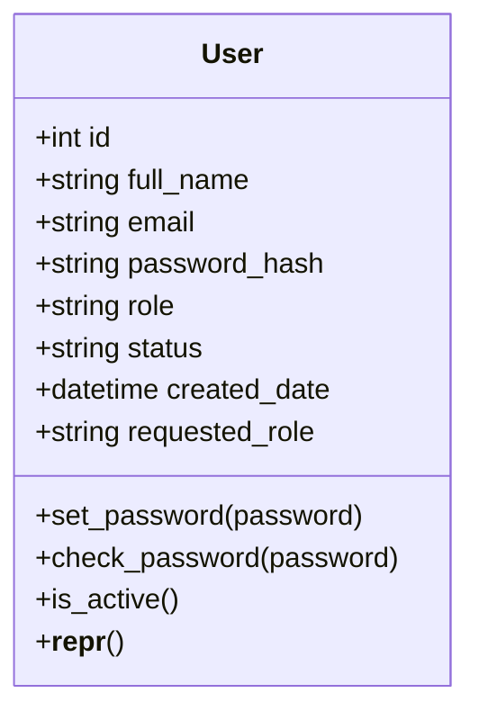
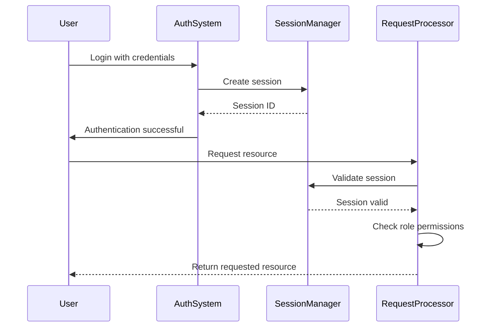
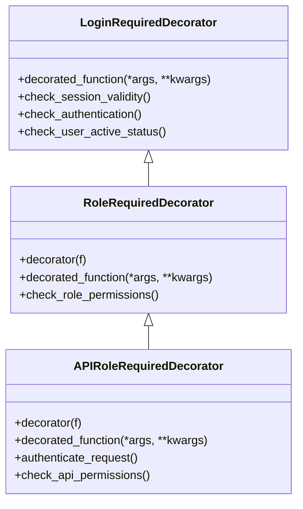

# Role-Based Access Control

<cite>
**Referenced Files in This Document**   
- [models.py](file://models.py)
- [auth.py](file://auth.py)
- [security/authentication.py](file://security/authentication.py)
- [api/security.py](file://api/security.py)
- [routes/auth.py](file://routes/auth.py)
</cite>

## Table of Contents
1. [Introduction](#introduction)
2. [Defined Roles and Permissions](#defined-roles-and-permissions)
3. [User Role Storage and Management](#user-role-storage-and-management)
4. [Authentication and Authorization Flow](#authentication-and-authorization-flow)
5. [Decorator Implementation](#decorator-implementation)
6. [Role Enforcement in Web and API Layers](#role-enforcement-in-web-and-api-layers)
7. [Integration with Flask-Login](#integration-with-flask-login)
8. [Edge Cases and Special Scenarios](#edge-cases-and-special-scenarios)
9. [Extending the RBAC System](#extending-the-rbac-system)
10. [Troubleshooting and Debugging](#troubleshooting-and-debugging)

## Introduction
The Role-Based Access Control (RBAC) system in the SERVER application provides a comprehensive security framework for managing user access to various application features and API endpoints. This system implements a multi-layered approach to authentication and authorization, supporting different authentication methods including session-based authentication, JWT tokens, and API keys. The RBAC system defines specific roles with distinct permission levels and enforces access control through decorators applied to route handlers and API methods. This documentation details the implementation, usage, and extension of the RBAC system to ensure secure and appropriate access to application resources.

## Defined Roles and Permissions
The SERVER application defines four primary roles with hierarchical permissions:

- **Admin**: Full system access, including user management, system configuration, and all report operations
- **Engineer**: Ability to create, edit, and submit reports; access to engineering tools and dashboards
- **Automation Manager**: Authority to review, approve, and reject reports; access to automation management features
- **PM (Project Manager)**: Access to project oversight, reporting, and team management functions

These roles are validated at multiple levels throughout the application, with schema validation ensuring only these specific roles can be assigned to users.

**Section sources**
- [models.py](file://models.py#L15-L39)
- [api/schemas.py](file://api/schemas.py#L72)
- [api/users.py](file://api/users.py#L50)

## User Role Storage and Management
User roles are stored in the database within the User model as a string field. The role information is persisted in the 'role' column of the 'users' table, with a maximum length of 30 characters. User roles are managed through the registration and administrative processes, with new users initially having a 'Pending' status until approved by an administrator who assigns the appropriate role.

The User model includes methods for checking user status and active state, with the `is_active` property determining whether a user can access the system based on their status field.

**Diagram sources**
- [models.py](file://models.py#L15-L39)

**Section sources**
- [models.py](file://models.py#L15-L39)
- [routes/auth.py](file://routes/auth.py#L10-L305)

## Authentication and Authorization Flow
The authentication and authorization flow in the SERVER application follows a multi-step process that begins with user login and continues through request processing. The system supports multiple authentication methods including session-based authentication, JWT tokens, and API keys, with a fallback mechanism that prioritizes JWT authentication when available.

When a user logs in, the system creates a tracked session with a session ID stored in the user's session data. The SessionManager class handles session creation, validation, and revocation, enforcing a 24-hour timeout for all sessions. During each request, the system verifies the session validity before proceeding with role-based authorization checks.

For API endpoints, the system first checks for a JWT token in the Authorization header, falling back to session-based authentication if no token is present. API key authentication is also supported for external integrations, with API keys stored as hashed values in the database.

**Diagram sources**
- [security/authentication.py](file://security/authentication.py#L244-L308)
- [auth.py](file://auth.py#L77-L101)

**Section sources**
- [security/authentication.py](file://security/authentication.py#L244-L308)
- [auth.py](file://auth.py#L77-L101)
- [session_manager.py](file://session_manager.py)

## Decorator Implementation
The RBAC system implements several decorators to enforce role-based access control at both the web and API layers. These decorators are applied to route handlers and API methods to restrict access based on user roles and authentication status.

The `@login_required` decorator ensures that only authenticated users can access protected routes, checking both Flask-Login's authentication status and the validity of the user's session. The `@role_required` decorator extends this functionality by verifying that the authenticated user has one of the specified roles before allowing access to the resource.

For API endpoints, the system provides specialized decorators including `@enhanced_login_required` and `@role_required_api`, which support multiple authentication methods including JWT tokens and API keys in addition to session-based authentication.

**Diagram sources**
- [auth.py](file://auth.py#L77-L101)
- [security/authentication.py](file://security/authentication.py#L244-L308)

**Section sources**
- [auth.py](file://auth.py#L77-L101)
- [security/authentication.py](file://security/authentication.py#L244-L308)

## Role Enforcement in Web and API Layers
Role enforcement is implemented consistently across both web routes and API endpoints, with specialized decorators for each layer. In the web layer, route handlers use the `@role_required` decorator to restrict access to specific roles, with appropriate flash messages and redirects for unauthorized access attempts.

For API endpoints, the system uses the `@role_required_api` decorator which returns JSON responses with appropriate HTTP status codes (401 for unauthenticated requests and 403 for insufficient permissions) rather than redirecting users. This approach provides a consistent API experience while maintaining security.

The system also implements granular permission checking through the `require_auth` decorator in the API security module, which can enforce specific permissions beyond just role membership. This allows for more fine-grained access control when needed.

**Section sources**
- [auth.py](file://auth.py#L77-L101)
- [security/authentication.py](file://security/authentication.py#L282-L308)
- [api/security.py](file://api/security.py#L349-L493)

## Integration with Flask-Login
The RBAC system integrates closely with Flask-Login to manage user sessions and authentication state. The `current_user` proxy from Flask-Login is used throughout the application to access the currently authenticated user's information, including their role and status.

The application extends Flask-Login's functionality with custom session management through the SessionManager class, which adds additional security measures beyond Flask-Login's default session handling. This includes explicit session creation and revocation, session timeout enforcement, and protection against session fixation attacks.

During the user loading process, the system verifies session validity before returning the user object, ensuring that even if Flask-Login considers a user authenticated, the application-level session validation must also pass.

**Section sources**
- [auth.py](file://auth.py#L77-L101)
- [security/authentication.py](file://security/authentication.py#L244-L308)
- [routes/auth.py](file://routes/auth.py#L10-L305)

## Edge Cases and Special Scenarios
The RBAC system handles several edge cases and special scenarios to ensure robust security and usability:

- **Role elevation**: Only Admin users can assign roles to other users, preventing privilege escalation
- **Permission inheritance**: The system does not implement role inheritance; each role has explicitly defined permissions
- **Unauthenticated access**: Attempts to access protected resources without authentication are redirected to the login page with appropriate messaging
- **Unauthorized access**: Users attempting to access resources beyond their permissions are redirected to the welcome page with a flash message indicating the required roles
- **Session expiration**: When a session expires, users are redirected to the login page with a message indicating the session has expired
- **Inactive accounts**: Users with 'Pending' or 'Disabled' status cannot access the system, even with valid credentials

The system also handles the scenario where a user's role is changed while they have an active session. In such cases, the user must log out and log back in for the role changes to take effect, as role information is not re-validated during an existing session.

**Section sources**
- [auth.py](file://auth.py#L77-L101)
- [routes/auth.py](file://routes/auth.py#L10-L305)
- [security/authentication.py](file://security/authentication.py#L244-L308)

## Extending the RBAC System
The RBAC system can be extended to support additional roles or more granular permissions through several mechanisms:

1. **Adding new roles**: New roles can be added by updating the validation logic in the API schemas and user interface components to include the new role options
2. **Implementing granular permissions**: The `require_auth` decorator in the API security module supports permission-based access control, allowing for more fine-grained authorization beyond simple role membership
3. **Custom decorators**: New decorators can be created by following the pattern of existing decorators, wrapping functions with authentication and authorization checks
4. **API key permissions**: API keys can be assigned specific permissions, allowing for differentiated access levels for external integrations

When extending the RBAC system, it's important to update both the backend validation and frontend user interface components to maintain consistency across the application.

**Section sources**
- [api/security.py](file://api/security.py#L349-L493)
- [auth.py](file://auth.py#L77-L101)
- [api/schemas.py](file://api/schemas.py#L72)

## Troubleshooting and Debugging
Common authorization issues and their troubleshooting approaches include:

- **Users unable to access expected resources**: Verify the user's role in the database and ensure they are logging in with the correct credentials
- **Session expiration issues**: Check the session timeout configuration and verify that the SessionManager is properly validating session timestamps
- **API authentication failures**: Ensure the correct authentication headers are being sent (Authorization for JWT, X-API-Key for API keys)
- **Permission denied errors**: Verify that the route or API endpoint has the correct role requirements specified in the decorator
- **Role assignment not taking effect**: Confirm that users log out and log back in after role changes, as role information is not re-validated during active sessions

Debugging can be facilitated by examining the application logs, which record authentication attempts, session creation and revocation, and authorization failures. The system also provides audit logging for security events, which can help identify patterns of unauthorized access attempts.

**Section sources**
- [auth.py](file://auth.py#L77-L101)
- [security/authentication.py](file://security/authentication.py#L244-L308)
- [api/security.py](file://api/security.py#L349-L493)
- [routes/auth.py](file://routes/auth.py#L10-L305)