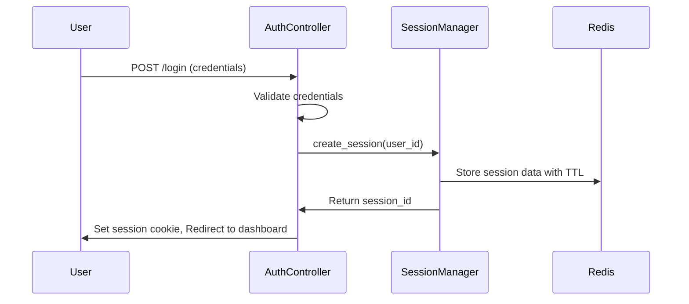
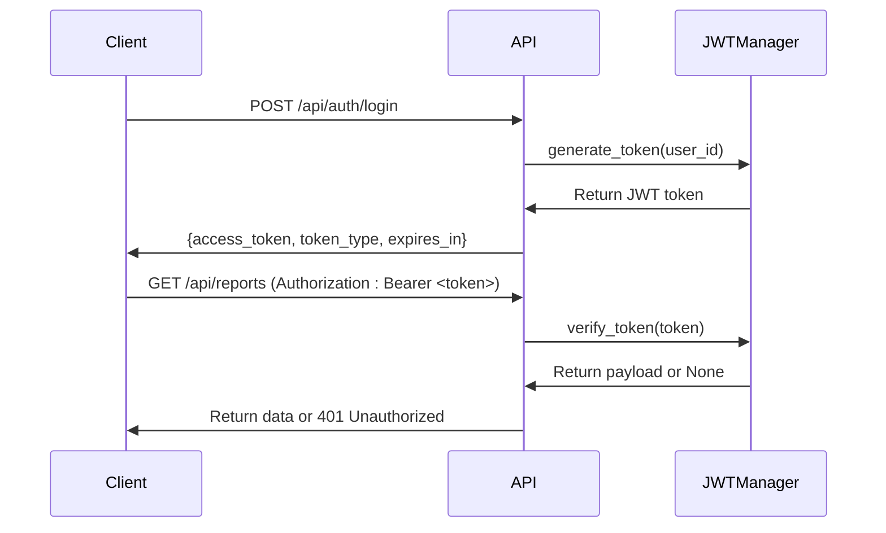
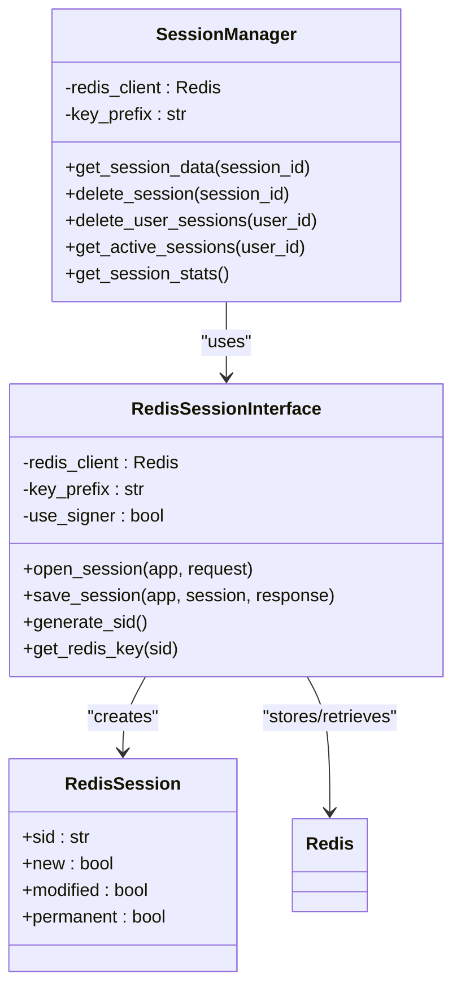
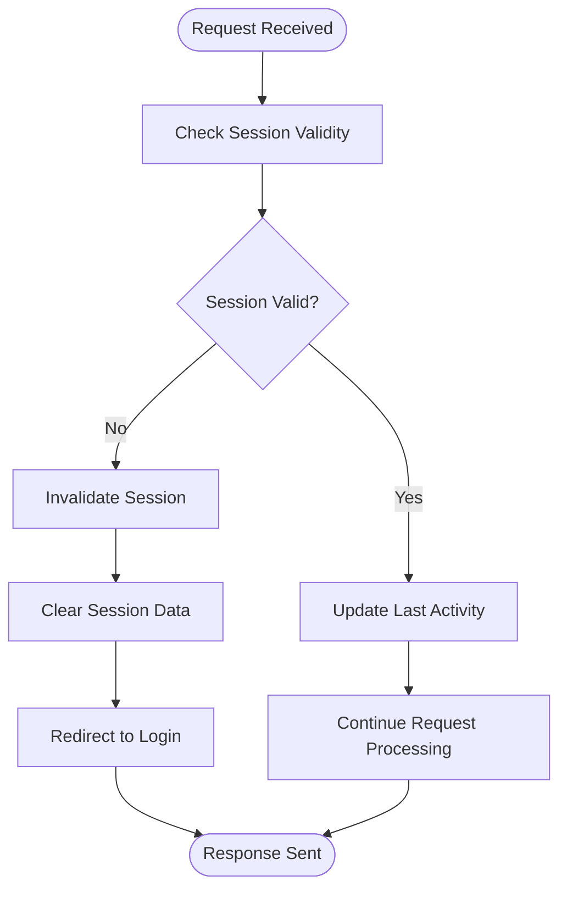
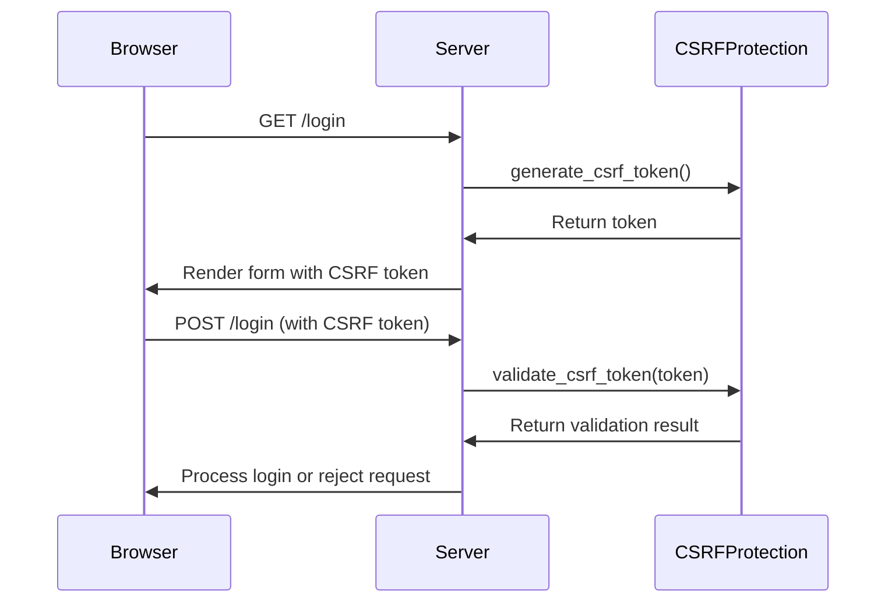
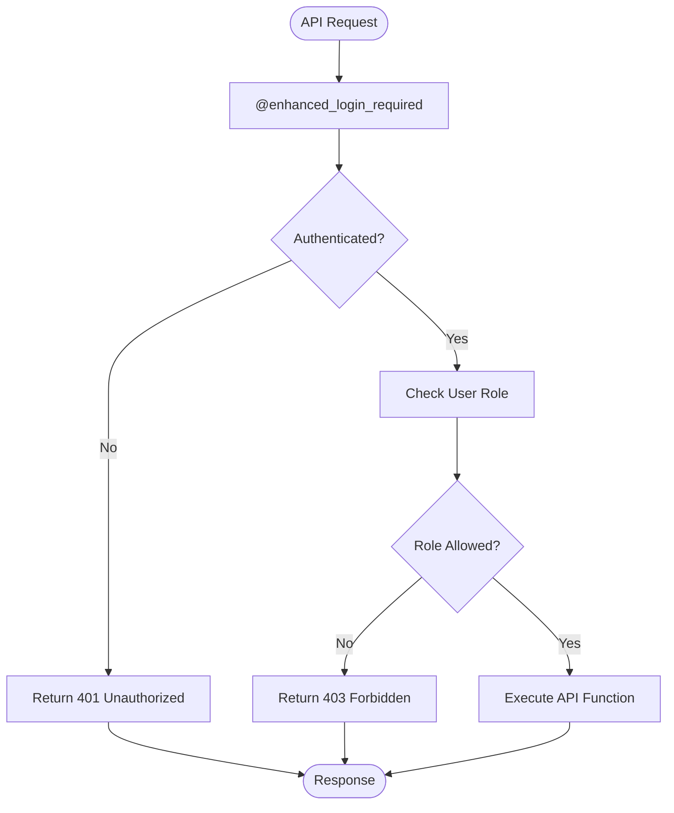
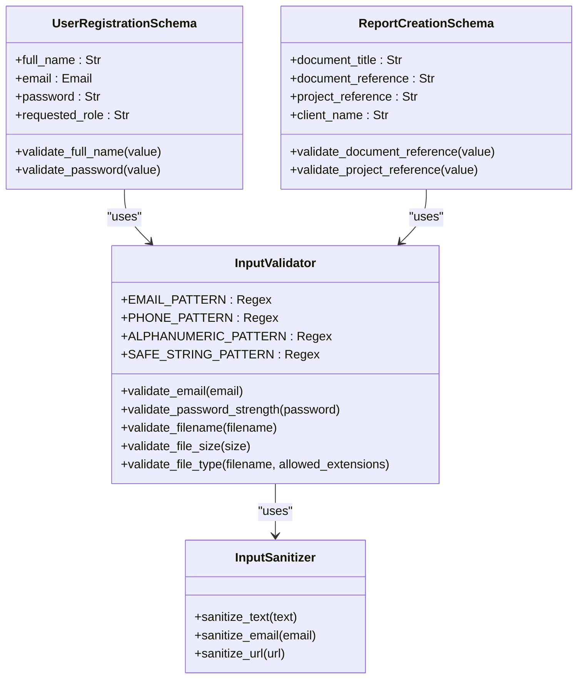
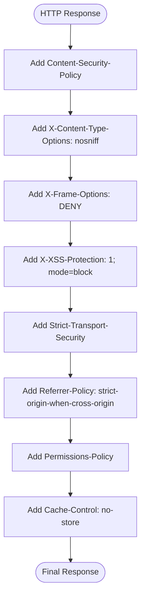

# Security Architecture

<cite>
**Referenced Files in This Document**   
- [security/authentication.py](file://security/authentication.py)
- [security/headers.py](file://security/headers.py)
- [security/validation.py](file://security/validation.py)
- [cache/session_store.py](file://cache/session_store.py)
- [session_manager.py](file://session_manager.py)
- [app.py](file://app.py)
- [api/security.py](file://api/security.py)
- [api/auth.py](file://api/auth.py)
</cite>

## Table of Contents
1. [Introduction](#introduction)
2. [Authentication Mechanisms](#authentication-mechanisms)
3. [Session Management](#session-management)
4. [CSRF Protection](#csrf-protection)
5. [Role-Based Access Control](#role-based-access-control)
6. [Input Validation](#input-validation)
7. [Security Headers](#security-headers)
8. [Audit Logging and Monitoring](#audit-logging-and-monitoring)
9. [Threat Models and Mitigations](#threat-models-and-mitigations)
10. [Conclusion](#conclusion)

## Introduction
The SERVER application implements a comprehensive security architecture designed to protect against common web vulnerabilities while providing robust authentication, authorization, and data protection mechanisms. This document details the security subsystem with a focus on authentication flows, session management, access control, input validation, and security monitoring. The system employs multiple layers of defense including session-based login, JWT tokens, CSRF protection, role-based access control, and comprehensive input validation.

**Section sources**
- [README.md](file://README.md#L274-L284)

## Authentication Mechanisms

### Session-Based Authentication
The application implements session-based authentication using Flask's session management system with Redis-backed storage. User sessions are created upon successful login and stored in Redis for improved performance and scalability. Sessions include user ID, creation timestamp, and last activity tracking to enable timeout-based invalidation.

**Diagram sources**
- [security/authentication.py](file://security/authentication.py#L45-L93)
- [cache/session_store.py](file://cache/session_store.py#L0-L48)

### JWT Token Authentication
For API endpoints, the system implements JWT (JSON Web Token) based authentication. Tokens are generated with a 1-hour expiration and include user ID, role, permissions, and cryptographic signatures. The JWTManager class handles token generation, verification, and revocation through a planned blacklist mechanism.

**Diagram sources**
- [api/security.py](file://api/security.py#L202-L246)
- [api/auth.py](file://api/auth.py#L383-L428)

### Multi-Factor Authentication (MFA)
While MFA is not fully implemented, the codebase includes support for Time-based One-Time Password (TOTP) using the pyotp library. The architecture is designed to support MFA setup and verification flows, with user records tracking MFA enablement status.

**Section sources**
- [security/authentication.py](file://security/authentication.py#L0-L48)

## Session Management

### Redis-Backed Session Storage
The application uses Redis as the backend for session storage through a custom RedisSessionInterface. This implementation provides better performance, scalability, and centralized session management compared to default Flask session storage.

**Diagram sources**
- [cache/session_store.py](file://cache/session_store.py#L0-L48)
- [cache/session_store.py](file://cache/session_store.py#L79-L111)

### Session Security Configuration
Session cookies are configured with security best practices including HTTP-only flags, secure transmission over HTTPS, and SameSite=Lax policy to prevent CSRF attacks. Sessions have a maximum lifetime of 30 minutes of inactivity, after which users must re-authenticate.

**Diagram sources**
- [config.py](file://config.py#L153-L179)
- [session_manager.py](file://session_manager.py#L106-L137)

## CSRF Protection

### CSRF Token Generation and Validation
The application implements CSRF protection using Flask-WTF's CSRF token system with custom enhancements. CSRF tokens are generated for each session and validated on all state-changing requests. The system uses constant-time comparison to prevent timing attacks during token validation.

**Diagram sources**
- [security/headers.py](file://security/headers.py#L106-L144)
- [app.py](file://app.py#L298-L333)

### CSRF Token Lifecycle
CSRF tokens are stored in the user session with timestamps to enable expiration after 24 hours. Tokens are automatically regenerated and invalidated upon session expiration or user logout to prevent replay attacks.

**Section sources**
- [security/headers.py](file://security/headers.py#L106-L144)

## Role-Based Access Control

### Access Control Decorators
The system implements role-based access control through custom decorators such as @role_required_api, which enforces permission checks on API endpoints. The decorator verifies user authentication and validates that the user's role is included in the allowed roles list.

**Diagram sources**
- [security/authentication.py](file://security/authentication.py#L294-L308)

### Role Hierarchy and Permissions
The application supports multiple user roles including Engineer, Admin, PM, and Automation Manager. Each role has specific permissions that determine access to various system features and API endpoints. The access control system is designed to be extensible for future role additions.

**Section sources**
- [security/authentication.py](file://security/authentication.py#L294-L308)

## Input Validation

### Server-Side Validation Framework
The application implements comprehensive server-side input validation through the InputValidator class, which provides methods for validating emails, filenames, file sizes, and other input types. Validation occurs at multiple layers including form processing, API request handling, and database operations.

**Diagram sources**
- [security/validation.py](file://security/validation.py#L86-L134)
- [security/validation.py](file://security/validation.py#L202-L237)

### Schema-Based Validation
The system uses Marshmallow schemas for structured data validation on API endpoints. These schemas define field requirements, length constraints, and custom validation methods to ensure data integrity and security.

**Section sources**
- [security/validation.py](file://security/validation.py#L234-L259)
- [api/schemas.py](file://api/schemas.py#L38-L68)

## Security Headers

### Comprehensive Header Enforcement
The application implements a robust security header strategy through the SecurityMiddleware class, which adds multiple HTTP security headers to all responses. These headers protect against various web vulnerabilities including XSS, clickjacking, and MIME type sniffing.

**Diagram sources**
- [security/headers.py](file://security/headers.py#L34-L74)
- [app.py](file://app.py#L330-L359)

### Header Configuration
Security headers are configured based on the deployment environment, with stricter policies enforced in production. The system includes conditional logic to adjust header values based on configuration settings such as HTTPS usage and iframe requirements.

**Section sources**
- [security/headers.py](file://security/headers.py#L34-L74)
- [middleware.py](file://middleware.py#L67-L100)

## Audit Logging and Monitoring

### Security Event Logging
The application includes audit logging capabilities through the audit.py module, which records security-relevant events such as failed login attempts, token expiration, and invalid token usage. These logs are used for monitoring, incident response, and compliance reporting.

**Section sources**
- [api/security.py](file://api/security.py#L243-L283)

### Monitoring Integration
Security events are integrated with the application's monitoring system, allowing for real-time alerting and analysis of potential security incidents. The system logs details of security events including severity levels and contextual information for investigation.

**Section sources**
- [api/security.py](file://api/security.py#L243-L283)

## Threat Models and Mitigations

### XSS (Cross-Site Scripting) Mitigation
The application protects against XSS attacks through multiple mechanisms:
- Content Security Policy (CSP) restricting script sources
- X-XSS-Protection header enabling browser XSS filters
- Input validation and sanitization of user-provided content
- Proper escaping of output in templates

### SQL Injection Prevention
SQL injection is prevented through:
- Use of SQLAlchemy ORM with parameterized queries
- Input validation for all user-provided data
- Regular security testing and code reviews
- Database query logging and monitoring

### IDOR (Insecure Direct Object Reference) Protection
The system mitigates IDOR risks through:
- Role-based access control on all data access operations
- Permission checks on API endpoints
- User context validation for data ownership
- Audit logging of data access patterns

### CSRF (Cross-Site Request Forgery) Defense
CSRF protection is implemented via:
- Synchronizer token pattern with per-session tokens
- SameSite cookie attributes
- Custom CSRF validation with constant-time comparison
- Token expiration and regeneration policies

**Section sources**
- [security/headers.py](file://security/headers.py#L34-L74)
- [security/validation.py](file://security/validation.py#L86-L134)
- [security/authentication.py](file://security/authentication.py#L294-L308)

## Conclusion
The SERVER application's security architecture provides a comprehensive, multi-layered defense system that addresses authentication, authorization, input validation, and common web vulnerabilities. By combining session-based and token-based authentication, Redis-backed session storage, CSRF protection, role-based access control, and comprehensive input validation, the system establishes a robust security foundation. The implementation follows security best practices including proper header enforcement, secure session configuration, and audit logging. Future enhancements should focus on completing the JWT token revocation system, implementing full MFA support, and expanding the audit logging capabilities for comprehensive security monitoring.