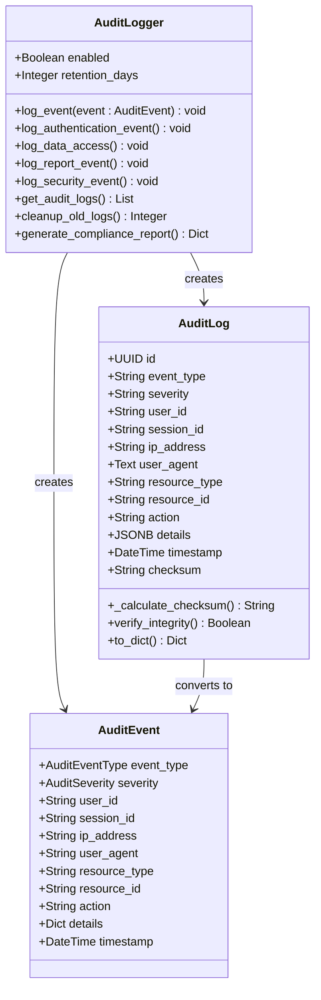
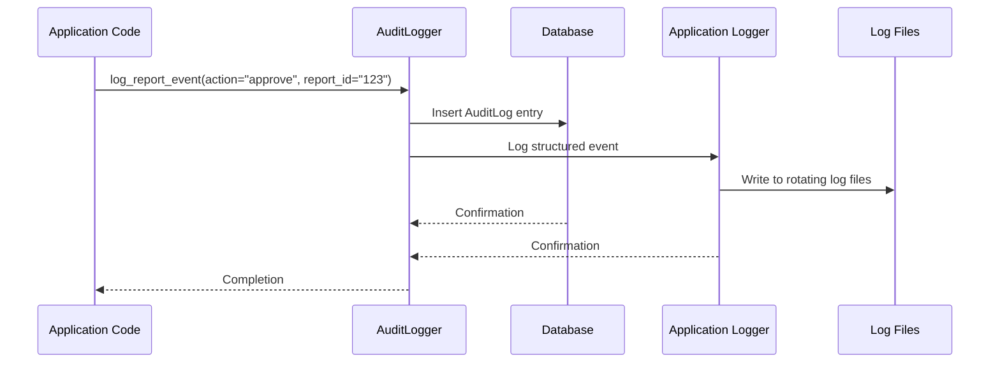

# Security Audit and Logging

<cite>
**Referenced Files in This Document**   
- [audit.py](file://security/audit.py)
- [logging_config.py](file://monitoring/logging_config.py)
- [audit.py](file://routes/audit.py)
- [admin.py](file://api/admin.py)
</cite>

## Table of Contents
1. [Introduction](#introduction)
2. [Audit Event Implementation](#audit-event-implementation)
3. [Audit Log Storage and Integrity](#audit-log-storage-and-integrity)
4. [Logging System Integration](#logging-system-integration)
5. [Audit Log Access Controls](#audit-log-access-controls)
6. [Audit Log Structure and Examples](#audit-log-structure-and-examples)
7. [Compliance Requirements](#compliance-requirements)
8. [Performance and Retention](#performance-and-retention)
9. [Troubleshooting](#troubleshooting)

## Introduction
The SERVER application implements a comprehensive security audit and logging framework designed to track critical system events, ensure compliance with regulatory requirements, and provide visibility into user activities. The audit system captures authentication attempts, report approvals, user management changes, configuration updates, and other security-relevant events. This documentation details the implementation of the audit trail system, including event logging, storage, access controls, and compliance features.

## Audit Event Implementation

The audit framework in the SERVER application is implemented through the `security/audit.py` module, which defines a comprehensive system for tracking security-relevant events. The implementation uses an event-driven architecture with predefined event types and severity levels to categorize different kinds of activities.

The system defines multiple event categories through the `AuditEventType` enum, including authentication events (login_success, login_failure, logout), authorization events (access_granted, access_denied), data events (data_create, data_read, data_update, data_delete), report events (report_create, report_approve, report_reject), and security events (security_violation, rate_limit_exceeded). Each event type is associated with a severity level (low, medium, high, critical) through the `AuditSeverity` enum.

The `AuditLogger` class provides specialized methods for logging different types of events:
- `log_authentication_event()` for tracking login attempts and authentication changes
- `log_data_access()` for recording data operations with appropriate severity levels
- `log_report_event()` for capturing report lifecycle actions including approvals
- `log_security_event()` for security-related incidents

These methods automatically capture contextual information including user identity, session ID, IP address, user agent, and timestamp. The audit system is designed to be invoked both programmatically and through decorators that automatically log specific actions.

**Section sources**
- [audit.py](file://security/audit.py#L1-L594)

## Audit Log Storage and Integrity

Audit events are persisted in the database through the `AuditLog` model, which stores comprehensive information about each security event. The model includes fields for event type, severity, user ID, session ID, IP address, user agent, resource type, resource ID, action, details, timestamp, and a checksum for integrity verification.

The database schema is optimized for audit log queries with multiple indexes on key fields:
- `idx_audit_timestamp` on the timestamp field for time-based queries
- `idx_audit_user_id` on the user_id field for user-specific queries
- `idx_audit_event_type` on the event_type field for event type filtering
- `idx_audit_severity` on the severity field for priority-based filtering
- `idx_audit_resource` on resource_type and resource_id for resource-specific queries

To ensure the integrity of audit logs and prevent tampering, each log entry includes a SHA-256 checksum calculated from the log data. The `_calculate_checksum()` method creates a JSON representation of the log entry (excluding the checksum itself), sorts the keys for consistency, and generates a hash. The `verify_integrity()` method allows validation of log entries by recalculating the checksum and comparing it with the stored value.

The system also implements a 7-year retention policy (2,555 days) for audit logs, which is automatically enforced through the `cleanup_old_logs()` method that removes entries older than the retention period.

**Diagram sources**
- [audit.py](file://security/audit.py#L79-L169)
- [audit.py](file://security/audit.py#L172-L392)

**Section sources**
- [audit.py](file://security/audit.py#L79-L392)

## Logging System Integration

The audit framework is integrated with the application's structured logging system through the `monitoring/logging_config.py` module. This integration ensures that audit events are consistently formatted and properly routed to appropriate logging destinations.

The logging configuration uses structlog to provide structured, JSON-formatted logs with comprehensive context. The system includes several processors that automatically add contextual information to log entries:
- `CorrelationIDProcessor` adds a unique correlation ID to track requests across the system
- `UserContextProcessor` includes user identity information when available
- `RequestContextProcessor` captures HTTP request details such as method, path, and user agent
- `TimestampProcessor` ensures ISO 8601 timestamp format
- `PerformanceProcessor` adds request duration metrics

Audit events are written to both the database and the application log files. The database provides persistent storage for compliance and querying, while the application logs support real-time monitoring and integration with external log aggregation systems. The logging configuration supports multiple handlers with different formats and destinations:
- Console output for development and debugging
- Rotating file handlers for persistent storage (10MB files, 5 backups)
- Separate error file for critical issues

The system is configured to handle high-volume logging efficiently, with JSON formatting for machine readability and appropriate log levels to control verbosity. Log rotation prevents unbounded growth of log files, and the structured format facilitates parsing by external monitoring and security information and event management (SIEM) systems.

**Diagram sources**
- [audit.py](file://security/audit.py#L172-L392)
- [logging_config.py](file://monitoring/logging_config.py#L236-L308)

**Section sources**
- [logging_config.py](file://monitoring/logging_config.py#L1-L421)

## Audit Log Access Controls

Access to audit logs is restricted through role-based access controls implemented in the `routes/audit.py` module. Only users with the 'Admin' role can view, search, and export audit logs, ensuring that sensitive audit information is protected from unauthorized access.

The audit log interface is exposed through several endpoints in the `audit_bp` blueprint:
- `/logs` - Renders the audit log interface with filter options
- `/api/logs` - Returns audit logs in JSON format with filtering and pagination
- `/api/stats` - Provides statistical summaries of audit activity
- `/api/export` - Exports audit logs to CSV format

All endpoints are protected by the `@login_required` and `@role_required(['Admin'])` decorators, which enforce authentication and role-based authorization. The system uses Flask-Login for session management and a custom role system to verify user permissions.

The API endpoints support comprehensive filtering options including:
- User email
- Action type
- Entity type
- Date range
- Success/failure status

Results are paginated (50 items per page by default) to handle large volumes of audit data efficiently. The export functionality allows administrators to download audit logs in CSV format for offline analysis or compliance reporting.

**Section sources**
- [audit.py](file://routes/audit.py#L0-L275)

## Audit Log Structure and Examples

Audit log entries contain a standardized structure with consistent fields that provide comprehensive context for each recorded event. The structure includes both technical metadata and business context to support investigation and compliance reporting.

Key fields in each audit log entry include:
- **id**: Unique UUID identifier for the log entry
- **event_type**: Categorized event type (e.g., "report_approve", "login_failure")
- **severity**: Severity level (low, medium, high, critical)
- **user_id**: Identifier of the user who performed the action
- **session_id**: Session identifier for tracking user sessions
- **ip_address**: IP address from which the action originated
- **user_agent**: User agent string identifying the client software
- **resource_type**: Type of resource involved (e.g., "report", "user")
- **resource_id**: Identifier of the specific resource
- **action**: Description of the action performed
- **details**: JSON field containing additional context-specific information
- **timestamp**: ISO 8601 formatted timestamp
- **checksum**: SHA-256 hash for integrity verification

Example audit log entries:
- Login success: `{event_type: "login_success", severity: "low", user_id: "user123", ip_address: "192.168.1.100", user_agent: "Mozilla/5.0...", action: "login", resource_type: "authentication"}`
- Report approval: `{event_type: "report_approve", severity: "medium", user_id: "approver456", resource_type: "report", resource_id: "rep789", action: "approve", details: {"previous_status": "pending", "comments": "Approved after review"}}`
- Configuration change: `{event_type: "config_change", severity: "high", user_id: "admin789", resource_type: "system", resource_id: "smtp_settings", action: "update", details: {"changed_fields": ["host", "port"], "old_values": {"host": "smtp.old.com", "port": 25}}}`

The `to_dict()` method on the `AuditLog` model standardizes the output format, ensuring consistent representation across different consumers of audit data.

**Section sources**
- [audit.py](file://security/audit.py#L152-L169)
- [audit.py](file://security/audit.py#L121-L128)

## Compliance Requirements

The audit framework includes specific features to support compliance with regulatory requirements such as GDPR. The `ComplianceManager` class in `security/audit.py` provides utilities for handling data subject requests and demonstrating compliance.

For GDPR compliance, the system implements the following features:
- Data access logging for user data requests
- Right to be forgotten processing with audit trail
- Data portability requests with export tracking
- Purpose limitation in audit log details

The `ensure_gdpr_compliance()` method logs data access operations with explicit compliance context, including the purpose of access. When a data deletion request is received, the `handle_data_deletion_request()` method logs the request with details indicating it's a "right_to_be_forgotten" request. Similarly, data export requests are logged through `generate_data_export()` with "data_portability" context.

The system supports compliance reporting through the `generate_compliance_report()` method, which produces a comprehensive report summarizing audit events over a specified period. The report includes:
- Event type summary statistics
- User activity summaries
- Security event details (high and critical severity)
- Period coverage and generation timestamp

The 7-year retention policy exceeds typical regulatory requirements and ensures that audit data is available for compliance audits and investigations.

**Section sources**
- [audit.py](file://security/audit.py#L456-L517)

## Performance and Retention

The audit logging system is designed to handle high-volume logging while maintaining performance and managing storage efficiently. The implementation includes several performance optimizations and retention strategies.

Performance considerations include:
- Database indexing on frequently queried fields to accelerate searches
- Asynchronous logging pattern that doesn't block application execution
- Efficient JSON serialization and hashing operations
- Connection pooling for database operations
- Batch operations for cleanup tasks

The system implements a 7-year (2,555 days) retention policy for audit logs, which is automatically enforced by the `cleanup_old_logs()` method. This method identifies and removes log entries older than the cutoff date in a single database operation for efficiency. The cleanup process itself is logged as an audit event to maintain an unbroken audit trail.

Storage optimization features include:
- Use of efficient data types (UUID, indexed strings, JSONB)
- Compression of details field when stored in the database
- Separation of high-frequency metadata from variable details
- Regular cleanup of expired entries

The system is designed to scale with increasing log volume through database indexing, efficient querying patterns, and the ability to archive older logs to cold storage if needed. The retention policy balances compliance requirements with storage cost considerations.

**Section sources**
- [audit.py](file://security/audit.py#L172-L175)
- [audit.py](file://security/audit.py#L344-L355)

## Troubleshooting

When troubleshooting issues with the audit logging system, consider the following common problems and diagnostic steps:

**Missing audit entries:**
- Verify that the `AuditLogger.enabled` flag is set to true
- Check for exceptions in the application logs related to audit logging
- Ensure database connectivity and that the audit_logs table exists
- Verify that the calling code properly invokes the audit logging methods
- Check that transactions are being committed after audit log insertion

**Logging pipeline issues:**
- Review the application error logs for "Audit logging failed" messages
- Verify database connection pool availability
- Check disk space for log files
- Validate that the structlog configuration is properly loaded
- Confirm that the correlation ID is being properly set in requests

**Performance issues:**
- Monitor database query performance for audit log operations
- Check for lock contention on the audit_logs table
- Review the frequency of audit log writes during peak usage
- Consider adjusting the retention policy if storage growth is excessive
- Monitor the impact of checksum calculations on performance

**Integrity verification:**
- Use the `verify_integrity()` method to check individual log entries
- Implement periodic batch integrity checks for compliance
- Monitor for any failed integrity verifications which may indicate tampering
- Ensure clock synchronization across servers to prevent timestamp issues

The system includes built-in monitoring through the application logs, which record both successful audit logging operations and any failures. Critical audit logging failures are logged at the "critical" level to ensure they are noticed and addressed promptly.

**Section sources**
- [audit.py](file://security/audit.py#L194-L202)
- [logging_config.py](file://monitoring/logging_config.py#L135-L150)