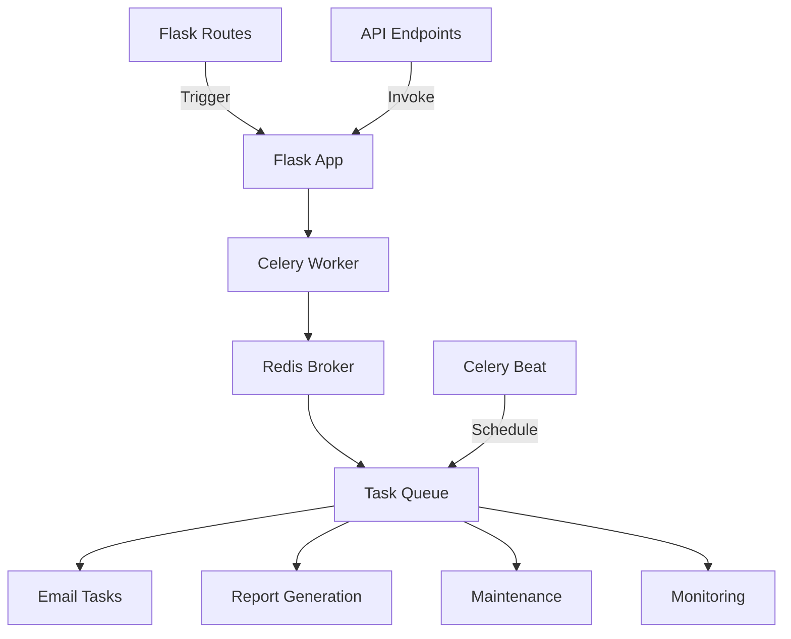
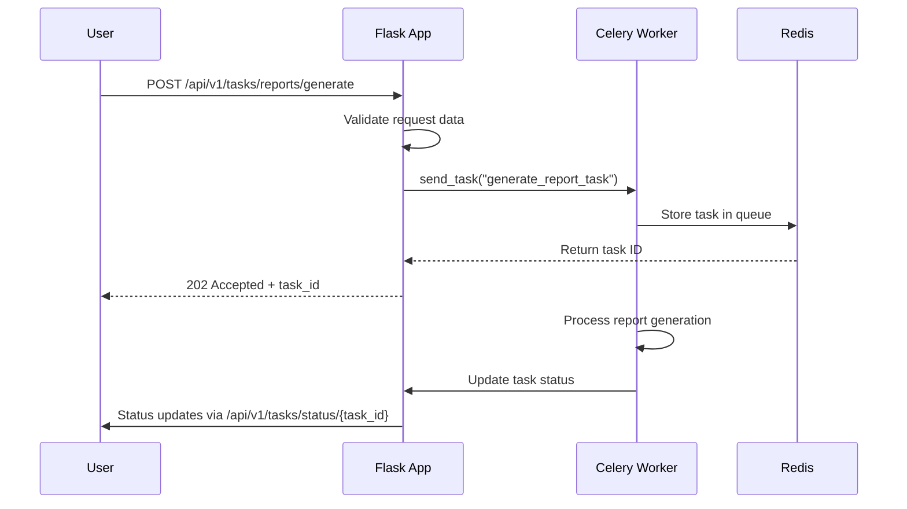

# Technology Stack & Dependencies

<cite>
**Referenced Files in This Document**   
- [app.py](file://app.py)
- [requirements.txt](file://requirements.txt)
- [requirements-test.txt](file://requirements-test.txt)
- [requirements-complete.txt](file://requirements-complete.txt)
- [config/app.yaml](file://config/app.yaml)
- [config/production.yaml](file://config/production.yaml)
- [config/testing.yaml](file://config/testing.yaml)
- [tasks/celery_app.py](file://tasks/celery_app.py)
- [api/tasks.py](file://api/tasks.py)
</cite>

## Table of Contents
1. [Core Web Frameworks](#core-web-frameworks)
2. [Supporting Libraries](#supporting-libraries)
3. [Configuration & Secrets Management](#configuration--secrets-management)
4. [Testing & Quality Assurance](#testing--quality-assurance)
5. [Dependency Management](#dependency-management)
6. [Technology Integration Examples](#technology-integration-examples)
7. [Setup & Virtual Environment](#setup--virtual-environment)

## Core Web Frameworks

The SERVER application is built on a robust Flask-based technology stack, leveraging several key extensions for enhanced functionality and scalability.

### Flask & Flask-RESTX
Flask serves as the foundational web framework, providing routing, request handling, and template rendering. The application uses **Flask 2.2.3**, a stable and widely adopted version ensuring compatibility and security. Flask-RESTX is integrated to build a structured, documented RESTful API, enabling clean separation of API endpoints and automatic Swagger documentation generation. This allows for rapid API development with built-in input validation, error handling, and response marshaling.

### Flask-SQLAlchemy
Flask-SQLAlchemy provides an Object-Relational Mapping (ORM) layer over SQLAlchemy, abstracting database interactions and enabling Pythonic data model definitions. It simplifies CRUD operations, relationship management, and query construction while maintaining the full power of raw SQL when needed. The application supports both SQLite (for development) and PostgreSQL (for production), with connection pooling configured for performance.

### Celery & Redis for Background Tasks
Celery is used for asynchronous task processing, decoupling long-running operations (like report generation and email sending) from the main request-response cycle. Redis acts as both the message broker and result backend, ensuring reliable task queuing and state tracking. The system is configured with multiple queues (email, reports, maintenance, monitoring) and comprehensive retry policies. Periodic tasks (e.g., database backups, health checks) are managed via Celery Beat.



**Diagram sources**
- [app.py](file://app.py#L200-L250)
- [tasks/celery_app.py](file://tasks/celery_app.py#L10-L50)
- [api/tasks.py](file://api/tasks.py#L50-L100)

**Section sources**
- [app.py](file://app.py#L100-L300)
- [tasks/celery_app.py](file://tasks/celery_app.py#L1-L100)

## Supporting Libraries

### Marshmallow for Serialization
Marshmallow is used for data serialization and deserialization, particularly in API endpoints. It validates incoming JSON payloads against defined schemas and formats outgoing data consistently. This ensures data integrity and provides clear error messages for invalid inputs.

### docxtpl for DOCX Generation
The docxtpl library enables dynamic DOCX document generation by populating Word templates with data. This is central to the application's report generation functionality, allowing complex formatting and styling to be preserved while injecting variable content from the database.

### Cryptography for Security
The cryptography library provides robust cryptographic operations for secure data handling. It is used for encrypting sensitive information, generating secure tokens, and managing SSL/TLS operations. Combined with PyJWT and PyOTP, it supports secure authentication, session management, and two-factor authentication.

**Section sources**
- [requirements.txt](file://requirements.txt#L50-L60)
- [api/tasks.py](file://api/tasks.py#L10-L20)

## Configuration & Secrets Management

### YAML-Based Configuration
The application uses a hierarchical YAML configuration system with environment-specific files (`app.yaml`, `development.yaml`, `production.yaml`, `testing.yaml`). This allows for clean separation of settings across environments. Key configuration aspects include:
- Database connection strings and pooling parameters
- Email server settings
- Session and security policies (CSRF, cookie security)
- Feature flags for enabling/disabling functionality
- Task queue and caching configurations
- Logging levels and handlers

### Production-Grade Secrets Management
In production, secrets are managed using HashiCorp Vault (via the `hvac` library), providing secure storage and dynamic secret generation. For development and testing, secrets can be stored in environment variables or YAML files. The system supports both password-protected `.pfx` SSL certificates and separate `.pem`/`.key` files, with automatic certificate loading and temporary file cleanup.

```mermaid
graph TD
A[Application] --> B{Environment}
B --> |Development| C[app.yaml]
B --> |Production| D[Vault + production.yaml]
B --> |Testing| E[testing.yaml]
C --> F[Plain Text Secrets]
D --> G[Encrypted Secrets]
E --> H[Minimal Configuration]
I[Flask Config] < --> A
```

**Diagram sources**
- [config/app.yaml](file://config/app.yaml#L1-L20)
- [config/production.yaml](file://config/production.yaml#L1-L20)
- [config/testing.yaml](file://config/testing.yaml#L1-L20)

**Section sources**
- [config/app.yaml](file://config/app.yaml#L1-L126)
- [config/production.yaml](file://config/production.yaml#L1-L84)
- [config/testing.yaml](file://config/testing.yaml#L1-L53)

## Testing & Quality Assurance

### pytest for Comprehensive Testing
The test suite is built on pytest, providing a powerful and flexible testing framework. The application includes:
- **Unit tests**: Testing individual functions and methods in isolation
- **Integration tests**: Validating component interactions (API endpoints, database operations)
- **End-to-end tests**: Simulating user workflows with Selenium
- **Performance tests**: Using Locust for load testing API endpoints

### Locust for Load Testing
Locust is used for performance and stress testing, simulating hundreds or thousands of concurrent users to identify bottlenecks. Performance test scenarios are defined in `tests/performance/locustfile.py`, focusing on critical paths like report generation and user authentication.

### Code Quality Tools
A comprehensive suite of quality assurance tools ensures code maintainability:
- **Black, isort, Flake8**: Code formatting and style enforcement
- **Mypy**: Static type checking
- **Bandit, Safety**: Security vulnerability scanning
- **Pylint, Radon**: Code complexity and quality analysis
- **Pre-commit**: Automated checks on every commit

**Section sources**
- [requirements-test.txt](file://requirements-test.txt#L1-L40)
- [tests/unit/test_auth.py](file://tests/unit/test_auth.py)
- [tests/performance/locustfile.py](file://tests/performance/locustfile.py)

## Dependency Management

### Requirements Files Strategy
The project employs a multi-tiered dependency management approach:
- **requirements.txt**: Core application dependencies for development and production
- **requirements-test.txt**: Testing-specific dependencies with stricter version requirements
- **requirements-complete.txt**: All possible dependencies, including optional and development tools
- **requirements-minimal.txt**: Minimal dependencies for lightweight deployments

### Version Compatibility
Key version considerations:
- Flask 2.2.3 is compatible with Flask-SQLAlchemy 3.x and Flask-RESTX 1.1.0+
- Celery 5.2+ requires Redis 4.0+ for optimal performance
- Python 3.8+ is required due to type hinting and modern syntax usage
- PostgreSQL 12+ is recommended for production deployments

### Dependency Resolution
Use `pip install -r requirements.txt` for standard setup. For development, install additional tools via `requirements-test.txt`. The `Makefile` provides convenience commands for dependency management, testing, and quality checks.

**Section sources**
- [requirements.txt](file://requirements.txt#L1-L98)
- [requirements-test.txt](file://requirements-test.txt#L1-L38)
- [requirements-complete.txt](file://requirements-complete.txt#L1-L101)

## Technology Integration Examples

### Celery Task Invocation from Flask Routes
The integration between Flask and Celery is seamless, allowing API endpoints to trigger background tasks. When a user requests report generation, the Flask route validates input and immediately returns a 202 Accepted response with a task ID, while Celery processes the report asynchronously.



**Diagram sources**
- [app.py](file://app.py#L200-L250)
- [api/tasks.py](file://api/tasks.py#L200-L300)
- [tasks/celery_app.py](file://tasks/celery_app.py#L100-L150)

**Section sources**
- [app.py](file://app.py#L200-L300)
- [api/tasks.py](file://api/tasks.py#L200-L700)

## Setup & Virtual Environment

### Virtual Environment Configuration
Always use a virtual environment:
```bash
python -m venv venv
source venv/bin/activate  # Linux/Mac
venv\Scripts\activate     # Windows
pip install -r requirements.txt
```

### Common Setup Issues
- **Redis not running**: Ensure Redis server is started before launching the app
- **Database permissions**: Verify PostgreSQL user has appropriate privileges in production
- **SSL certificate errors**: Ensure .pfx password is set in environment variables
- **Missing dependencies**: Use `requirements-complete.txt` for full feature set
- **Port conflicts**: Change port in config or kill existing processes on port 5000

### Development vs Production
Development uses filesystem sessions and SQLite, while production requires Redis, PostgreSQL, and Vault integration. The `FLASK_ENV` environment variable controls configuration loading, with appropriate security settings (CSRF, HTTPS, IP blocking) enabled in production mode.

**Section sources**
- [app.py](file://app.py#L500-L750)
- [config/production.yaml](file://config/production.yaml#L1-L84)
- [requirements.txt](file://requirements.txt#L1-L98)