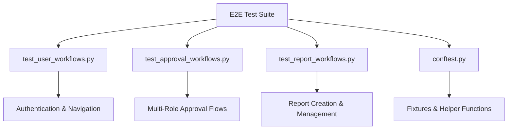
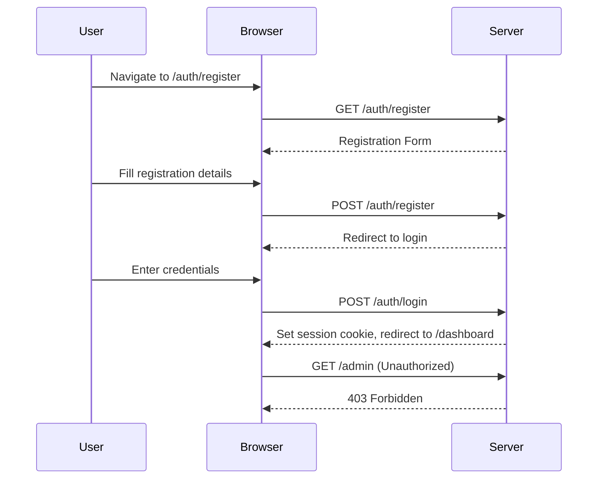
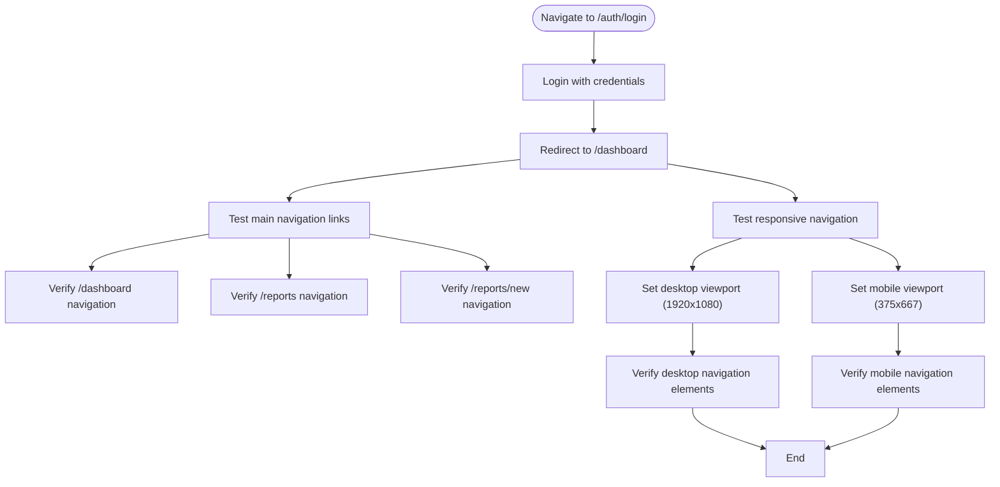
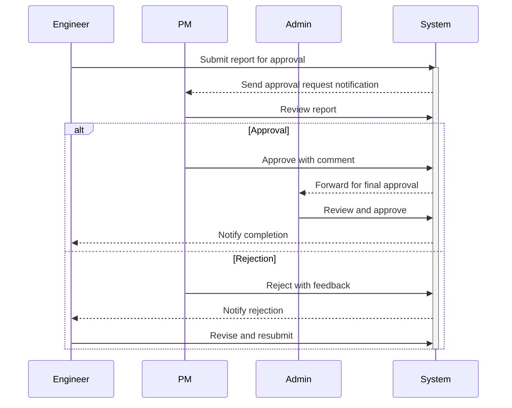
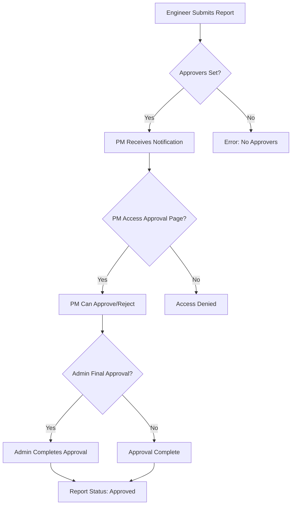
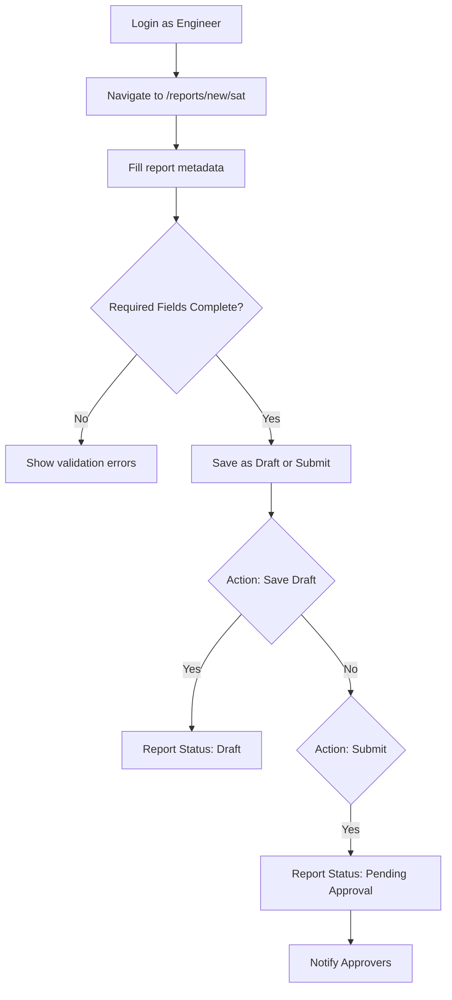
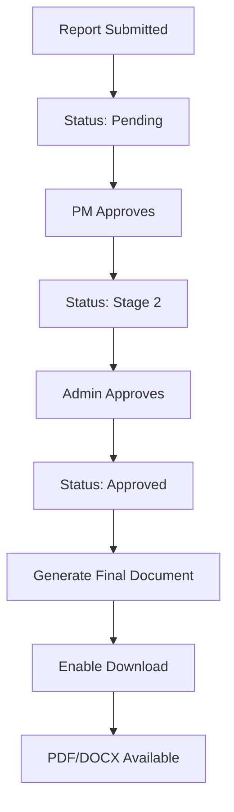
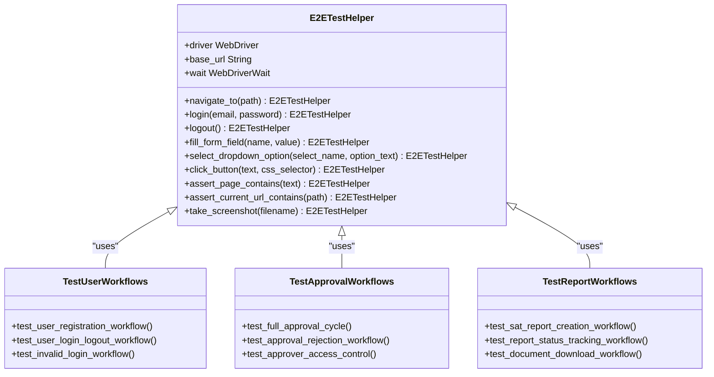
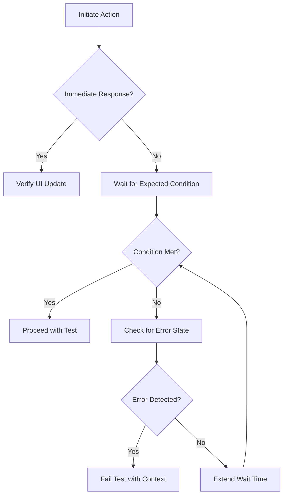

# End-to-End Testing

<cite>
**Referenced Files in This Document**   
- [test_user_workflows.py](file://tests/e2e/test_user_workflows.py)
- [test_approval_workflows.py](file://tests/e2e/test_approval_workflows.py)
- [test_report_workflows.py](file://tests/e2e/test_report_workflows.py)
- [conftest.py](file://tests/e2e/conftest.py)
</cite>

## Table of Contents
1. [Introduction](#introduction)
2. [E2E Testing Framework Overview](#e2e-testing-framework-overview)
3. [User Journey Simulation](#user-journey-simulation)
4. [Approval Workflows Validation](#approval-workflows-validation)
5. [Report Lifecycle Testing](#report-lifecycle-testing)
6. [Testing Infrastructure and Tools](#testing-infrastructure-and-tools)
7. [Challenges in E2E Testing](#challenges-in-e2e-testing)
8. [Best Practices for Reliable E2E Tests](#best-practices-for-reliable-e2e-tests)
9. [Conclusion](#conclusion)

## Introduction

The end-to-end (E2E) testing framework for the SERVER application ensures comprehensive validation of real user journeys across the web interface. This documentation details the implementation of E2E tests that simulate complete workflows including user authentication, report creation, submission, multi-role approval processes, and dashboard navigation. The framework leverages Selenium-based browser automation to validate UI interactions, state transitions, and system integrations under realistic conditions.

## E2E Testing Framework Overview

The E2E testing suite is organized within the `tests/e2e` directory and utilizes pytest with Selenium WebDriver for browser automation. The framework is designed to simulate real user interactions with the application through a headless browser, ensuring that all components work together as expected in a production-like environment.



**Diagram sources**
- [test_user_workflows.py](file://tests/e2e/test_user_workflows.py#L1-L403)
- [test_approval_workflows.py](file://tests/e2e/test_approval_workflows.py#L1-L590)
- [test_report_workflows.py](file://tests/e2e/test_report_workflows.py#L1-L532)
- [conftest.py](file://tests/e2e/conftest.py#L1-L264)

**Section sources**
- [test_user_workflows.py](file://tests/e2e/test_user_workflows.py#L1-L403)
- [test_approval_workflows.py](file://tests/e2e/test_approval_workflows.py#L1-L590)
- [test_report_workflows.py](file://tests/e2e/test_report_workflows.py#L1-L532)
- [conftest.py](file://tests/e2e/conftest.py#L1-L264)

## User Journey Simulation

The `test_user_workflows.py` file contains comprehensive tests for complete user journeys, simulating real-world interactions from registration to dashboard navigation. These tests validate authentication flows, access control, navigation patterns, and error handling across different user roles.

### Authentication and Access Control

The framework validates complete authentication workflows including registration, login, logout, and session timeout behaviors. It also tests access control by verifying that users can only access resources appropriate to their roles (Engineer, PM, Admin).



**Diagram sources**
- [test_user_workflows.py](file://tests/e2e/test_user_workflows.py#L15-L150)
- [conftest.py](file://tests/e2e/conftest.py#L50-L150)

**Section sources**
- [test_user_workflows.py](file://tests/e2e/test_user_workflows.py#L15-L200)

### Navigation and Responsive Design

The E2E tests validate main navigation functionality, breadcrumb navigation, and responsive design across different screen sizes. This ensures consistent user experience on both desktop and mobile devices.



**Diagram sources**
- [test_user_workflows.py](file://tests/e2e/test_user_workflows.py#L202-L250)

## Approval Workflows Validation

The `test_approval_workflows.py` file contains extensive tests for multi-role approval processes, validating the complete workflow from report submission to final approval by different stakeholders (Engineers, PMs, Admins).

### Multi-Role Approval Cycle

The framework tests complete approval cycles involving multiple roles, ensuring proper handoff between Engineers (submitters), PMs (first approvers), and Admins (final approvers). It validates status transitions, notification delivery, and permission enforcement throughout the approval process.



**Diagram sources**
- [test_approval_workflows.py](file://tests/e2e/test_approval_workflows.py#L15-L150)
- [test_approval_workflows.py](file://tests/e2e/test_approval_workflows.py#L152-L300)

**Section sources**
- [test_approval_workflows.py](file://tests/e2e/test_approval_workflows.py#L15-L300)

### Approval Permissions and Delegation

The tests validate that only authorized users can approve reports and that approvers cannot approve their own submissions. They also test delegation functionality, allowing approvers to assign their approval responsibilities to others.



**Diagram sources**
- [test_approval_workflows.py](file://tests/e2e/test_approval_workflows.py#L302-L400)

## Report Lifecycle Testing

The `test_report_workflows.py` file validates the complete SAT report lifecycle from creation through final approval, covering all intermediate states and user interactions.

### Report Creation and Submission

The framework tests the complete report creation process, including form validation, auto-save functionality, draft saving, and final submission. It ensures that required fields are properly validated and that users can save incomplete reports as drafts.



**Diagram sources**
- [test_report_workflows.py](file://tests/e2e/test_report_workflows.py#L15-L100)

**Section sources**
- [test_report_workflows.py](file://tests/e2e/test_report_workflows.py#L15-L150)

### Status Tracking and Document Generation

The tests validate that users can track report status through the workflow and access generated documents once approved. They also verify collaboration features such as comments and sharing.



**Diagram sources**
- [test_report_workflows.py](file://tests/e2e/test_report_workflows.py#L250-L350)

## Testing Infrastructure and Tools

The E2E testing framework is built on Selenium WebDriver with pytest, running in headless mode for efficiency. The `conftest.py` file provides essential fixtures and helper functions that streamline test development and execution.

### Test Helper Components

The `E2ETestHelper` class in `conftest.py` encapsulates common browser interactions, providing a clean API for test authors. This abstraction enables consistent test patterns and reduces code duplication across test cases.



**Diagram sources**
- [conftest.py](file://tests/e2e/conftest.py#L150-L250)

**Section sources**
- [conftest.py](file://tests/e2e/conftest.py#L1-L264)

## Challenges in E2E Testing

The framework addresses several common challenges in E2E testing, particularly around test brittleness, timing dependencies, and asynchronous operations.

### Handling Asynchronous Operations

The tests account for background tasks such as email delivery and document generation by using appropriate waiting strategies rather than fixed timeouts. This prevents flaky tests caused by variable processing times.



**Section sources**
- [test_user_workflows.py](file://tests/e2e/test_user_workflows.py#L350-L400)
- [test_approval_workflows.py](file://tests/e2e/test_approval_workflows.py#L500-L550)

### Test Brittle Prevention

The framework uses explicit waits for elements to be clickable or present, rather than relying on fixed sleep durations. This makes tests more resilient to performance variations while avoiding unnecessary delays.

**Section sources**
- [conftest.py](file://tests/e2e/conftest.py#L100-L150)

## Best Practices for Reliable E2E Tests

The implementation follows several best practices to ensure test reliability and maintainability.

### Page Object Pattern Implementation

Although not fully formalized, the `E2ETestHelper` class implements principles of the Page Object pattern by encapsulating UI interactions behind method calls. This abstraction layer isolates tests from UI changes.

**Section sources**
- [conftest.py](file://tests/e2e/conftest.py#L150-L250)

### Explicit Waits and Synchronization

The framework uses WebDriverWait with expected conditions to synchronize test execution with application state changes, avoiding race conditions and flaky tests.

```python
# Example from conftest.py
def wait_for_clickable(self, locator, timeout=10):
    wait = WebDriverWait(self.driver, timeout)
    return wait.until(EC.element_to_be_clickable(locator))
```

**Section sources**
- [conftest.py](file://tests/e2e/conftest.py#L100-L120)

### Screenshot Logging for Debugging

The framework includes screenshot capture capabilities for failed tests, providing visual context for debugging issues. Screenshots are saved to a dedicated directory with descriptive filenames.

```python
def take_screenshot(self, filename):
    screenshot_dir = 'test_screenshots'
    os.makedirs(screenshot_dir, exist_ok=True)
    filepath = os.path.join(screenshot_dir, filename)
    self.driver.save_screenshot(filepath)
    return self
```

**Section sources**
- [conftest.py](file://tests/e2e/conftest.py#L200-L220)

## Conclusion

The E2E testing framework for the SERVER application provides comprehensive coverage of critical user journeys, ensuring that the system functions correctly as an integrated whole. By simulating real user interactions across authentication, report creation, approval workflows, and dashboard navigation, the tests validate both functional correctness and user experience. The framework's use of headless browsers, explicit waits, and helper abstractions makes it reliable and maintainable, while its focus on multi-role interactions ensures proper enforcement of business rules and access controls. Continued adherence to best practices such as the page object pattern, proper synchronization, and thorough error logging will ensure the long-term effectiveness of the E2E test suite.