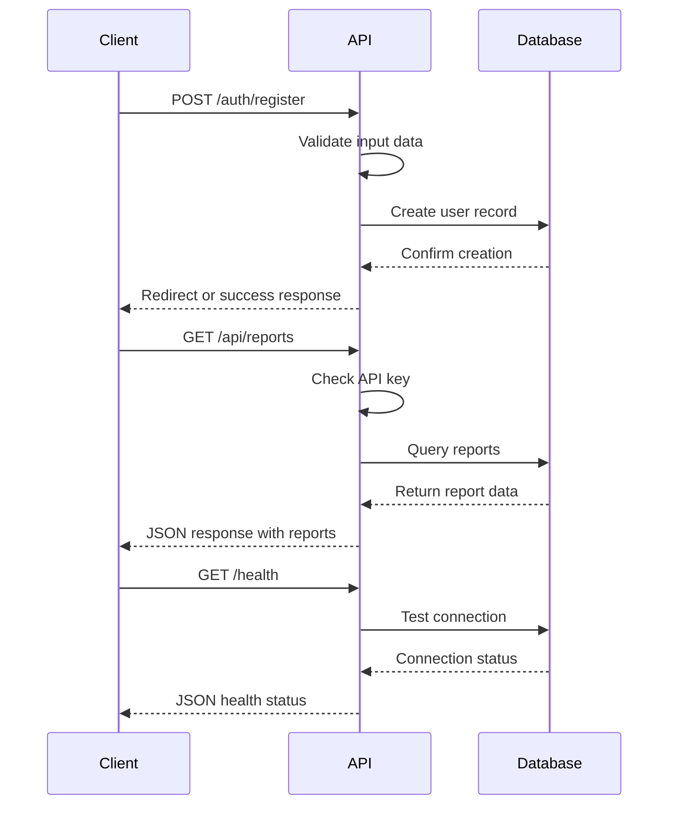
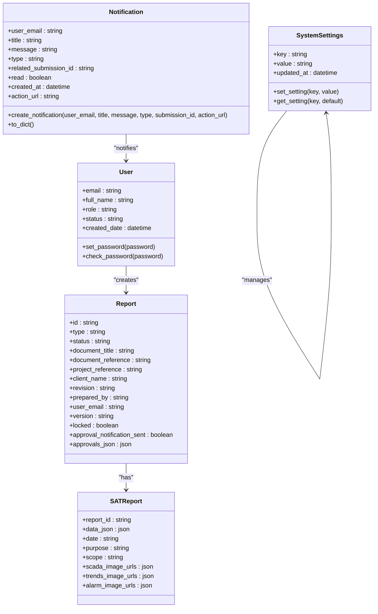
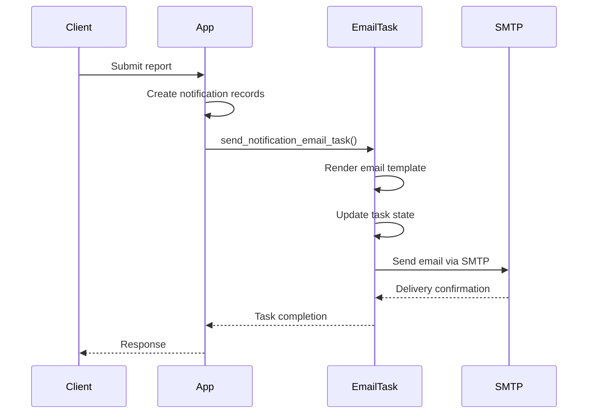

# Integration Testing

<cite>
**Referenced Files in This Document**   
- [test_api_endpoints.py](file://tests/integration/test_api_endpoints.py)
- [test_database_operations.py](file://tests/integration/test_database_operations.py)
- [test_email_notifications.py](file://tests/integration/test_email_notifications.py)
- [conftest.py](file://tests/conftest.py)
- [factories.py](file://tests/factories.py)
- [celery_app.py](file://tasks/celery_app.py)
- [email_tasks.py](file://tasks/email_tasks.py)
- [utils.py](file://utils.py)
- [app.py](file://app.py)
</cite>

## Table of Contents
1. [Introduction](#introduction)
2. [Test Setup and Fixtures](#test-setup-and-fixtures)
3. [API Endpoint Testing](#api-endpoint-testing)
4. [Database Operation Testing](#database-operation-testing)
5. [Email Notification Testing](#email-notification-testing)
6. [Common Testing Challenges](#common-testing-challenges)
7. [Debugging and Optimization](#debugging-and-optimization)
8. [Conclusion](#conclusion)

## Introduction

The integration testing layer of the SERVER application ensures that various components work together as expected. This includes validating interactions between API endpoints, database operations, file handling, and email delivery systems. The tests are designed to simulate real-world scenarios and verify that the application maintains data integrity, handles authentication properly, and communicates effectively with external services. The integration tests are organized into separate modules that focus on specific aspects of the application's functionality, allowing for targeted testing and easier maintenance.

## Test Setup and Fixtures

The integration tests utilize pytest fixtures to create a consistent testing environment. The `conftest.py` file defines several key fixtures that are used across multiple test modules. The `app` fixture creates a Flask application instance configured for testing, while the `client` fixture provides a test client for making HTTP requests. Database operations are tested using the `db_session` fixture, which sets up an in-memory SQLite database for each test function and ensures proper cleanup afterward. User authentication is simulated using fixtures like `admin_user`, `engineer_user`, and `pm_user`, which create users with different roles and permissions. The `authenticated_client` fixture automatically logs in a test user, allowing tests to focus on the functionality being tested rather than authentication setup. Additionally, the `sample_report` fixture creates a complete report with associated SAT data, providing a realistic test scenario for various operations.

**Section sources**
- [conftest.py](file://tests/conftest.py#L1-L171)
- [factories.py](file://tests/factories.py#L1-L367)

## API Endpoint Testing

The API endpoint tests validate the functionality of various routes in the application, ensuring they handle authentication, data validation, and error conditions correctly. The tests are organized into classes based on the type of endpoint being tested. Authentication endpoints are verified to properly handle user registration, login, and logout operations, with tests confirming that valid credentials result in successful authentication while invalid credentials are rejected. Report endpoints are tested to ensure that authenticated users can access report creation pages and submit new reports with valid data. The API endpoints are tested for proper authentication using API keys, with tests verifying that requests without valid keys are rejected with appropriate error messages. Health check endpoints are validated to ensure they return the correct status information, including database connectivity. Error handling is thoroughly tested, including 404 errors for non-existent endpoints, CSRF errors for AJAX requests, and method not allowed errors for incorrect HTTP methods. Data validation is also tested, ensuring that registration forms reject invalid email formats, unauthorized roles, and weak passwords.

**Diagram sources**
- [test_api_endpoints.py](file://tests/integration/test_api_endpoints.py#L1-L375)
- [app.py](file://app.py#L1-L752)

## Database Operation Testing

The database operation tests verify the integrity and functionality of the application's data storage and retrieval mechanisms. These tests cover CRUD operations for various models including User, Report, SATReport, SystemSettings, and Notification. The User model tests validate that users can be created, read, updated, and deleted, with specific tests for password operations and unique constraints on email addresses. Report model tests ensure that reports can be created with proper relationships to SAT reports, and that JSON fields for approval workflows are correctly stored and retrieved. The SATReport model tests focus on the handling of complex JSON data, including context information, test results, and equipment lists, as well as image URL storage. SystemSettings tests verify that settings can be created, retrieved, and updated, with proper handling of default values. Notification tests confirm that notifications can be created, queried by various criteria, and properly serialized to dictionaries. Transaction handling is also tested, with specific tests for rollback on errors and bulk operations for improved performance.

**Diagram sources**
- [test_database_operations.py](file://tests/integration/test_database_operations.py#L1-L550)
- [models.py](file://models.py)

## Email Notification Testing

The email notification tests validate the application's ability to send emails through various workflows, including approval requests, edit links, and completion notifications. These tests use mocking to simulate SMTP server interactions without actually sending emails. The `send_email` function is tested for successful delivery, SMTP errors, missing credentials, and missing recipients. Approval email notifications are verified to include the correct approver email, submission ID, stage number, and appropriate URLs for approval and status tracking. Edit link emails are tested to ensure they contain valid edit and status URLs. Completion notifications are validated to include download links and proper messaging. The notification creation tests ensure that database records are properly created for various notification types, including approval requests, status updates, completions, and new submissions. The workflow tests verify that the complete notification process works as expected, from creating a new submission to sending approval requests, status updates, and final completion notifications. The tests also validate that notification read status is properly tracked and that old notifications can be cleaned up according to retention policies.

**Diagram sources**
- [test_email_notifications.py](file://tests/integration/test_email_notifications.py#L1-L482)
- [email_tasks.py](file://tasks/email_tasks.py#L1-L402)
- [utils.py](file://utils.py#L1-L1387)

## Common Testing Challenges

Integration testing the SERVER application presents several common challenges that require specific strategies to address. Environment parity is maintained through the use of configuration files that define different settings for development, testing, and production environments. The test configuration uses an in-memory SQLite database to ensure fast test execution and isolation between test runs. Test data seeding is handled through factory classes that create realistic test data with proper relationships between models. The factories allow for the creation of users with specific roles, reports in various workflow stages, and notifications with different types and statuses. Race conditions are mitigated through the use of file locking mechanisms that prevent concurrent access to shared resources. The application's use of background tasks through Celery introduces additional complexity, as tests must account for asynchronous operations. This is addressed by using task result backends and monitoring task states to ensure that background operations complete successfully before proceeding with subsequent test steps. External service dependencies are handled through mocking, allowing tests to verify the correct interaction patterns without requiring actual external services.

**Section sources**
- [conftest.py](file://tests/conftest.py#L1-L171)
- [factories.py](file://tests/factories.py#L1-L367)
- [utils.py](file://utils.py#L1-L1387)
- [celery_app.py](file://tasks/celery_app.py#L1-L282)

## Debugging and Optimization

Debugging failed integrations requires a systematic approach that leverages the application's logging and monitoring capabilities. The integration tests include comprehensive logging that captures the state of the application at various points during test execution. When a test fails, the logs can be examined to identify the specific point of failure and the conditions that led to it. The use of pytest's detailed error reporting helps pinpoint the exact assertion that failed and the values involved. For optimization, the tests are designed to run efficiently by minimizing database operations and using in-memory databases. Test execution speed is further improved through resource cleanup, with fixtures ensuring that database tables are properly dropped and recreated between test functions. Parallelization is supported through the use of independent test modules that can be run concurrently without interfering with each other. The test suite also includes performance tests that measure the execution time of critical operations, allowing for the identification of bottlenecks. The use of factories to generate test data reduces the overhead of manual data creation and ensures consistency across tests.

**Section sources**
- [test_api_endpoints.py](file://tests/integration/test_api_endpoints.py#L1-L375)
- [test_database_operations.py](file://tests/integration/test_database_operations.py#L1-L550)
- [test_email_notifications.py](file://tests/integration/test_email_notifications.py#L1-L482)
- [conftest.py](file://tests/conftest.py#L1-L171)

## Conclusion

The integration testing layer of the SERVER application provides comprehensive coverage of the system's critical components and their interactions. By validating API endpoints, database operations, and email notifications, the tests ensure that the application functions correctly as a whole. The use of pytest fixtures and factory classes creates a consistent and maintainable testing environment, while mocking and in-memory databases enable fast and isolated test execution. The tests address common challenges such as environment parity, test data management, and race conditions, providing confidence in the application's reliability. The debugging and optimization strategies ensure that test failures can be quickly diagnosed and that the test suite remains efficient as the application grows. Overall, the integration tests serve as a crucial safety net, catching issues before they reach production and enabling confident refactoring and feature development.