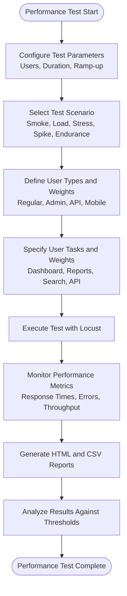
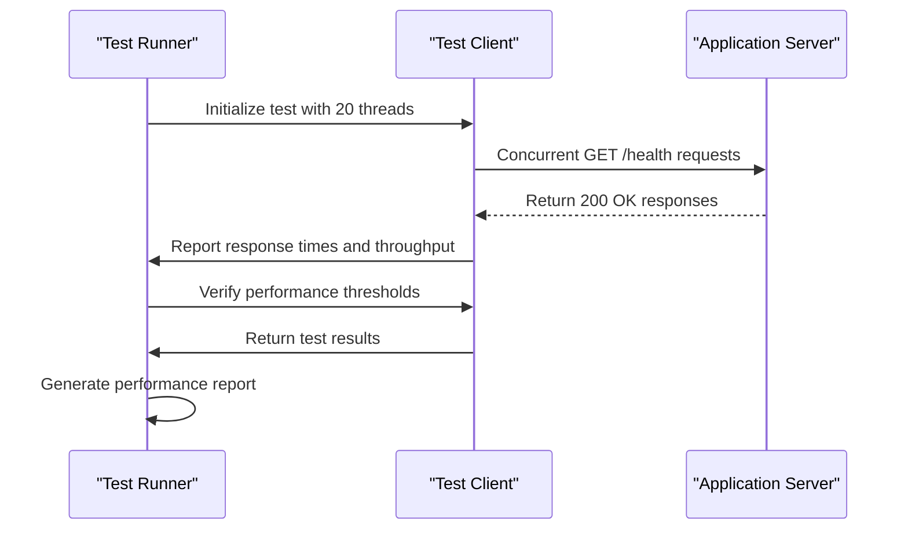
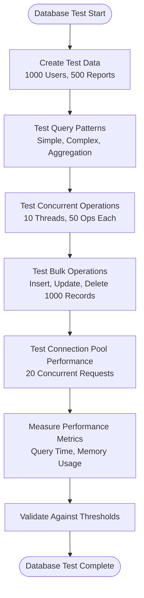
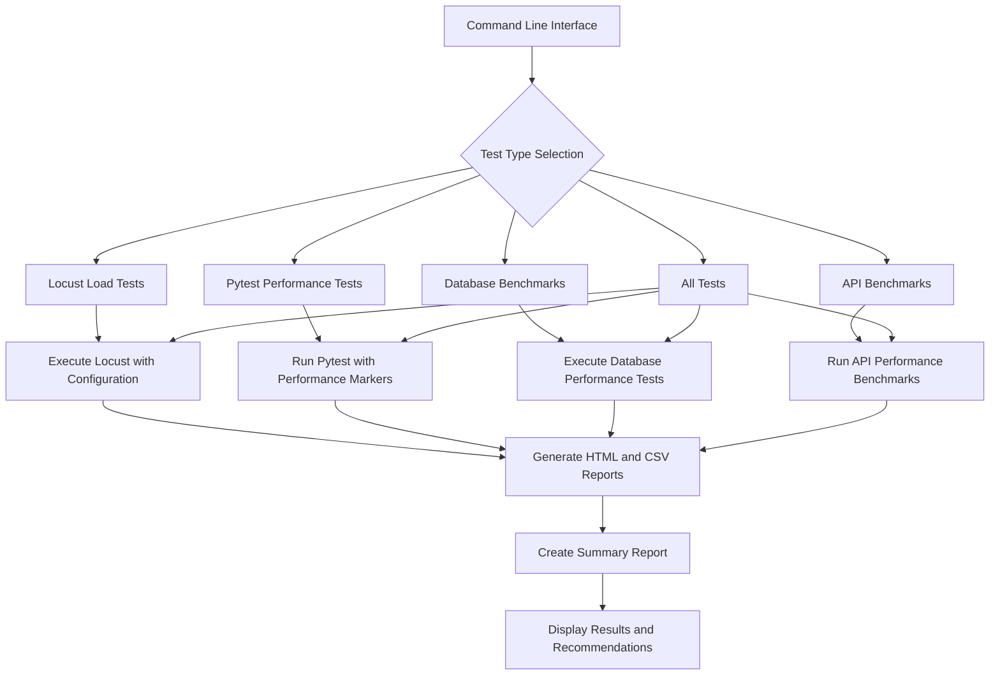
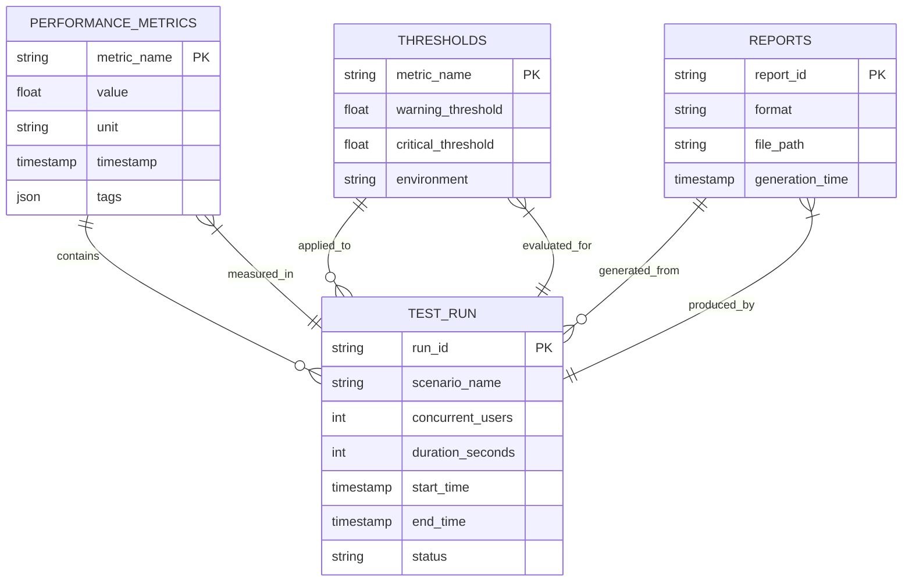

# Performance Testing

<cite>
**Referenced Files in This Document**   
- [locustfile.py](file://tests/performance/locustfile.py)
- [test_api_performance.py](file://tests/performance/test_api_performance.py)
- [test_database_performance.py](file://tests/performance/test_database_performance.py)
- [run_performance_tests.py](file://run_performance_tests.py)
- [performance_config.py](file://tests/performance/performance_config.py)
</cite>

## Table of Contents
1. [Introduction](#introduction)
2. [Performance Testing Strategy](#performance-testing-strategy)
3. [Locust Load Testing](#locust-load-testing)
4. [API Performance Testing](#api-performance-testing)
5. [Database Performance Testing](#database-performance-testing)
6. [Test Execution and Automation](#test-execution-and-automation)
7. [Performance Metrics and Thresholds](#performance-metrics-and-thresholds)
8. [Common Performance Issues](#common-performance-issues)
9. [Optimization Recommendations](#optimization-recommendations)
10. [Performance Regression Testing](#performance-regression-testing)

## Introduction
The SERVER application employs a comprehensive performance testing strategy to ensure system reliability, responsiveness, and scalability under various load conditions. This documentation details the performance testing framework, including load testing with Locust, targeted API and database benchmarking, automated test execution, and performance optimization practices. The strategy focuses on measuring response times, error rates, system bottlenecks, and resource utilization to maintain optimal application performance in production environments.

## Performance Testing Strategy
The performance testing strategy for the SERVER application consists of multiple complementary approaches designed to evaluate system behavior under different conditions. The framework includes load testing with Locust to simulate concurrent user scenarios, targeted benchmarking with pytest for specific API endpoints and database operations, and automated execution through a centralized test runner. The strategy emphasizes measuring key performance indicators such as response times, throughput, error rates, and resource utilization to identify potential bottlenecks before they impact users.

The testing approach follows a tiered methodology, starting with smoke tests to verify basic functionality under minimal load, progressing to load tests that simulate expected production traffic, and culminating in stress and endurance tests that push the system beyond normal operating conditions. This comprehensive approach ensures the application can handle both typical usage patterns and unexpected traffic spikes while maintaining acceptable performance levels.

**Section sources**
- [performance_config.py](file://tests/performance/performance_config.py#L125-L182)
- [run_performance_tests.py](file://run_performance_tests.py#L237-L264)

## Locust Load Testing
Locust is used for load testing API endpoints under concurrent user scenarios, simulating realistic user behavior across different user types. The framework defines multiple user classes that represent different user roles and interaction patterns, including regular users, admin users, API-only users, and mobile users. Each user class performs a series of tasks that mimic actual application usage, such as viewing dashboards, creating reports, searching for content, and checking authentication status.

The load testing configuration supports various test scenarios with configurable parameters for user count, test duration, and user ramp-up patterns. Predefined scenarios include smoke tests (5 users), load tests (50 users), stress tests (100 users), spike tests (200 users), and endurance tests (30 users for one hour). These scenarios allow for systematic evaluation of system performance under different load conditions, from baseline functionality verification to extreme stress testing.

**Diagram sources**
- [locustfile.py](file://tests/performance/locustfile.py#L1-L425)
- [performance_config.py](file://tests/performance/performance_config.py#L125-L182)

**Section sources**
- [locustfile.py](file://tests/performance/locustfile.py#L1-L425)
- [performance_config.py](file://tests/performance/performance_config.py#L125-L182)

## API Performance Testing
API performance testing is conducted using pytest to benchmark critical endpoints under various conditions. The test suite evaluates response times for key API endpoints such as health checks, authentication verification, dashboard access, and reports listing. Tests are designed to measure both individual endpoint performance and system behavior under concurrent access, with specific focus on response time degradation as load increases.

The testing framework includes scenarios for concurrent API access, mixed endpoint load, and scalability assessment. These tests measure throughput (requests per second), average and maximum response times, and system resource usage under load. Special attention is given to error handling performance, ensuring that the application responds quickly even when requests fail or encounter errors. The tests also evaluate memory and CPU usage patterns to detect potential resource leaks or inefficient resource utilization.

**Diagram sources**
- [test_api_performance.py](file://tests/performance/test_api_performance.py#L1-L467)
- [performance_config.py](file://tests/performance/performance_config.py#L0-L50)

**Section sources**
- [test_api_performance.py](file://tests/performance/test_api_performance.py#L1-L467)

## Database Performance Testing
Database performance testing focuses on evaluating the efficiency of database operations, particularly for critical functions like report retrieval and bulk submissions. The test suite measures query performance for various operations, including simple filters, complex joins, aggregations, and paginated queries. Tests are conducted with large datasets to ensure the application can handle production-scale data volumes efficiently.

The framework evaluates both individual query performance and concurrent database operations, assessing the effectiveness of the connection pool under load. Bulk operation performance is tested for insert, update, and delete operations to ensure efficient handling of large data sets. The tests also examine memory usage patterns when processing large query results, validating that the application properly manages memory and avoids leaks when handling substantial data volumes.

**Diagram sources**
- [test_database_performance.py](file://tests/performance/test_database_performance.py#L1-L466)
- [performance_config.py](file://tests/performance/performance_config.py#L0-L50)

**Section sources**
- [test_database_performance.py](file://tests/performance/test_database_performance.py#L1-L466)

## Test Execution and Automation
The performance testing framework is automated through the run_performance_tests.py script, which provides a command-line interface for executing various types of performance tests. The script supports running Locust load tests, pytest performance tests, database benchmarks, and API benchmarks either individually or as a comprehensive suite. It accepts configurable parameters for test duration, user count, spawn rate, target host, and output directory.

The automation script orchestrates the execution of performance tests, captures results, and generates summary reports in multiple formats including HTML, CSV, and JSON. It integrates with the testing frameworks to ensure consistent execution and result aggregation. The script also handles environment-specific configurations, allowing tests to be run against different environments (development, staging, production) with appropriate performance thresholds for each environment.

**Diagram sources**
- [run_performance_tests.py](file://run_performance_tests.py#L0-L313)
- [performance_config.py](file://tests/performance/performance_config.py#L380-L416)

**Section sources**
- [run_performance_tests.py](file://run_performance_tests.py#L0-L313)

## Performance Metrics and Thresholds
The performance testing framework captures a comprehensive set of metrics to evaluate system performance and identify potential bottlenecks. Key metrics include response times (average and maximum), throughput (requests per second), error rates, memory usage, CPU utilization, database query times, and connection pool efficiency. These metrics are collected during test execution and compared against predefined thresholds to determine system health and performance compliance.

Performance thresholds are configured based on application requirements and environment characteristics. For API endpoints, the target average response time is 200ms with a maximum of 1000ms. The system should maintain a minimum throughput of 50 requests per second with less than 5% error rate. Database queries should complete within 100ms on average and 500ms maximum. Memory usage should not exceed 500MB, and CPU utilization should remain below 80% under load.

**Diagram sources**
- [performance_config.py](file://tests/performance/performance_config.py#L0-L50)
- [test_api_performance.py](file://tests/performance/test_api_performance.py#L1-L467)

**Section sources**
- [performance_config.py](file://tests/performance/performance_config.py#L0-L50)

## Common Performance Issues
The performance testing framework is designed to identify common issues that can impact application responsiveness and stability. Memory leaks are detected through sustained load tests that monitor memory usage over time, with alerts triggered when memory consumption exceeds expected thresholds. Slow database queries are identified through query performance testing, particularly for complex joins and aggregations on large datasets.

Thread contention issues are revealed through concurrent operation tests that simulate multiple users accessing shared resources simultaneously. Connection pool exhaustion is detected by monitoring database connection usage under high load, ensuring the pool size is adequate for the expected concurrent user count. The framework also identifies inefficient algorithms and data processing patterns that can cause performance degradation as data volumes increase.

Other common issues include inadequate caching strategies that result in repeated expensive operations, inefficient data serialization that increases response times, and suboptimal indexing strategies that slow down database queries. The testing framework also uncovers issues related to external service dependencies, such as slow email delivery services or third-party API integrations that can become bottlenecks.

**Section sources**
- [test_api_performance.py](file://tests/performance/test_api_performance.py#L1-L467)
- [test_database_performance.py](file://tests/performance/test_database_performance.py#L1-L466)

## Optimization Recommendations
Based on performance testing findings, several optimization strategies are recommended to improve application performance. For database operations, implementing proper indexing on frequently queried fields can significantly reduce query execution time. Query optimization techniques such as avoiding N+1 queries, using efficient join patterns, and minimizing data transfer can further enhance database performance.

Caching strategies should be implemented for frequently accessed but infrequently changing data, such as user profiles, configuration settings, and reference data. Implementing Redis or similar in-memory caching can dramatically reduce database load and improve response times for cached content. Connection pooling should be properly configured with appropriate minimum and maximum connection counts to balance resource usage and performance.

For API endpoints, response data should be optimized by implementing pagination for large result sets, using efficient serialization formats, and minimizing the amount of data transferred. Asynchronous processing should be used for long-running operations to prevent blocking request threads. Code-level optimizations such as algorithm improvements, efficient data structures, and reducing unnecessary computations can also contribute to performance gains.

**Section sources**
- [test_database_performance.py](file://tests/performance/test_database_performance.py#L1-L466)
- [test_api_performance.py](file://tests/performance/test_api_performance.py#L1-L467)

## Performance Regression Testing
Regular performance regression testing is recommended in staging environments to catch performance issues before they reach production. The testing framework should be integrated into the continuous integration/continuous deployment (CI/CD) pipeline to automatically run performance tests with each code change. Smoke tests and basic load tests should be executed routinely to ensure that new features or bug fixes do not introduce performance regressions.

Performance baselines should be established for key metrics, and subsequent test results should be compared against these baselines to detect any degradation. Automated alerts should be configured to notify the development team when performance thresholds are exceeded. The test suite should be updated regularly to reflect changes in user behavior patterns, new features, and evolving performance requirements.

Performance testing should be conducted before major releases and after significant infrastructure changes to validate system performance under expected production conditions. The results should be reviewed by the development and operations teams to identify trends, plan capacity, and prioritize performance improvements. Documentation of performance test results and optimization efforts should be maintained to track progress over time.

**Section sources**
- [run_performance_tests.py](file://run_performance_tests.py#L0-L313)
- [performance_config.py](file://tests/performance/performance_config.py#L380-L416)