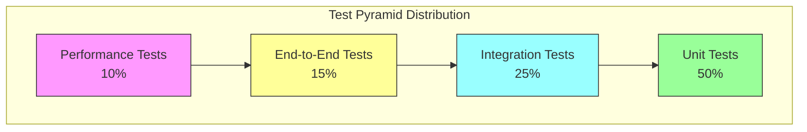
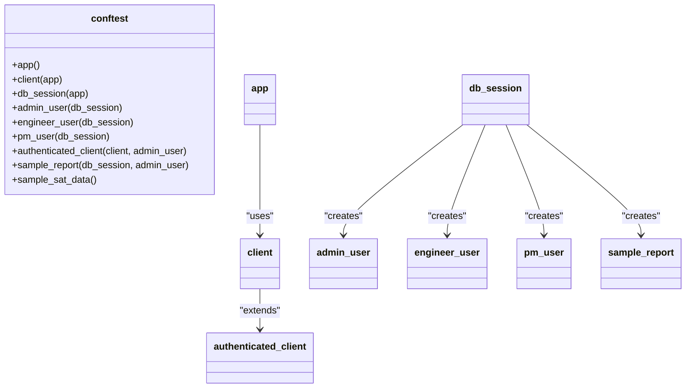
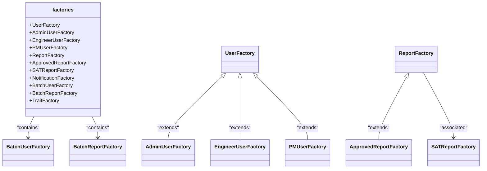
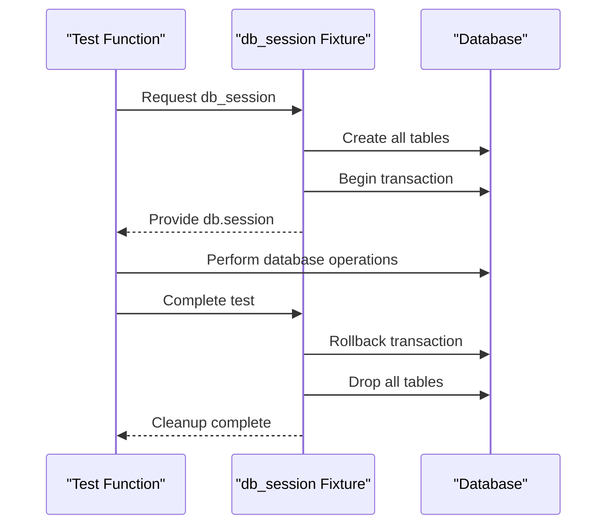
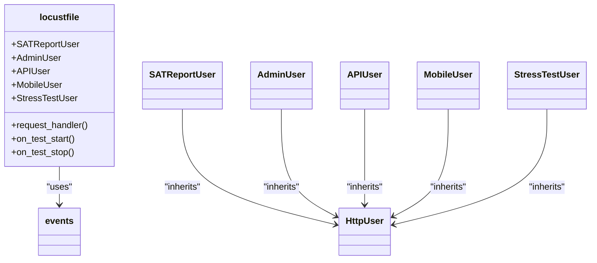
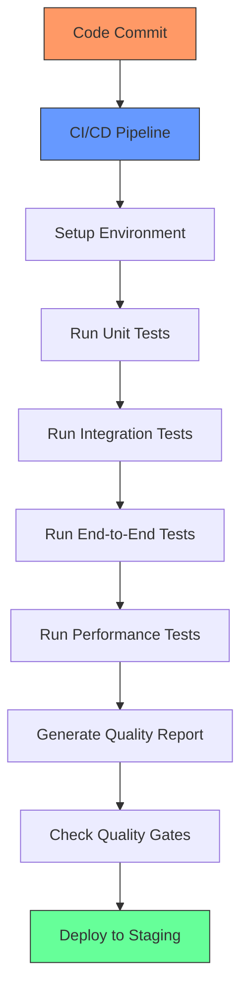
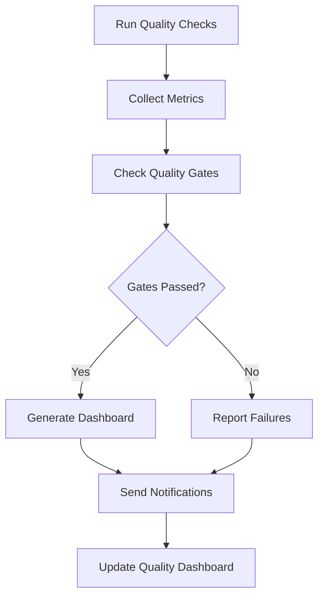

# Testing Strategy

<cite>
**Referenced Files in This Document**   
- [test_auth.py](file://tests/unit/test_auth.py)
- [test_models.py](file://tests/unit/test_models.py)
- [test_api_endpoints.py](file://tests/integration/test_api_endpoints.py)
- [test_database_operations.py](file://tests/integration/test_database_operations.py)
- [test_user_workflows.py](file://tests/e2e/test_user_workflows.py)
- [locustfile.py](file://tests/performance/locustfile.py)
- [conftest.py](file://tests/conftest.py)
- [factories.py](file://tests/factories.py)
- [quality_automation.py](file://scripts/quality_automation.py)
</cite>

## Table of Contents
1. [Introduction](#introduction)
2. [Four-Tier Testing Strategy](#four-tier-testing-strategy)
3. [Test Pyramid and Coverage Goals](#test-pyramid-and-coverage-goals)
4. [Pytest Fixtures and Test Factories](#pytest-fixtures-and-test-factories)
5. [Database Transaction Rollback Patterns](#database-transaction-rollback-patterns)
6. [Performance Testing with Locust](#performance-testing-with-locust)
7. [Running Tests Locally and in CI/CD](#running-tests-locally-and-in-ci-cd)
8. [Code Coverage Analysis](#code-coverage-analysis)
9. [Best Practices for Writing Effective Tests](#best-practices-for-writing-effective-tests)

## Introduction
The SERVER application employs a comprehensive four-tier testing strategy to ensure software quality, reliability, and performance. This document details the testing architecture, covering unit, integration, end-to-end, and performance tests. It explains the test pyramid distribution, coverage goals, and supporting infrastructure including pytest fixtures, test factories, and database transaction rollback patterns. The document also covers performance testing methodology using Locust, guidance for running tests in different environments, code coverage analysis, and best practices for writing effective tests.

## Four-Tier Testing Strategy

The SERVER application implements a four-tier testing strategy that follows the test pyramid principle, with increasing complexity and decreasing frequency from bottom to top.

### Unit Tests
Unit tests focus on individual components in isolation, verifying the correctness of specific functions and methods. These tests are fast, reliable, and form the foundation of the test pyramid.

The unit test suite is located in `tests/unit/` and includes:
- [test_auth.py](file://tests/unit/test_auth.py): Tests authentication and authorization functions
- [test_models.py](file://tests/unit/test_models.py): Tests database models and their methods

**Section sources**
- [test_auth.py](file://tests/unit/test_auth.py#L1-L265)
- [test_models.py](file://tests/unit/test_models.py#L1-L332)

### Integration Tests
Integration tests verify the interaction between multiple components, ensuring that different parts of the system work together correctly. These tests typically involve the database, API endpoints, and business logic.

The integration test suite is located in `tests/integration/` and includes:
- [test_api_endpoints.py](file://tests/integration/test_api_endpoints.py): Tests API endpoints for authentication, reports, and health checks
- [test_database_operations.py](file://tests/integration/test_database_operations.py): Tests database operations for CRUD functionality and complex queries

**Section sources**
- [test_api_endpoints.py](file://tests/integration/test_api_endpoints.py#L1-L375)
- [test_database_operations.py](file://tests/integration/test_database_operations.py#L1-L550)

### End-to-End Tests
End-to-end tests simulate real user workflows, testing the complete system from the user interface through to the database. These tests ensure that the application works as expected from the user's perspective.

The end-to-end test suite is located in `tests/e2e/` and includes:
- [test_user_workflows.py](file://tests/e2e/test_user_workflows.py): Tests complete user workflows including authentication, navigation, and error handling

**Section sources**
- [test_user_workflows.py](file://tests/e2e/test_user_workflows.py#L1-L403)

### Performance Tests
Performance tests evaluate the system's behavior under various load conditions, identifying bottlenecks and ensuring scalability. These tests simulate multiple users interacting with the application simultaneously.

The performance test suite is located in `tests/performance/` and includes:
- [locustfile.py](file://tests/performance/locustfile.py): Configures performance tests using Locust for API and database load testing

**Section sources**
- [locustfile.py](file://tests/performance/locustfile.py#L1-L426)

## Test Pyramid and Coverage Goals

The SERVER application follows the test pyramid model, with a strategic distribution of test types to maximize coverage while minimizing execution time and maintenance overhead.



**Diagram sources**
- [test_auth.py](file://tests/unit/test_auth.py#L1-L265)
- [test_api_endpoints.py](file://tests/integration/test_api_endpoints.py#L1-L375)
- [test_user_workflows.py](file://tests/e2e/test_user_workflows.py#L1-L403)
- [locustfile.py](file://tests/performance/locustfile.py#L1-L426)

The test coverage goals for the SERVER application are:
- **Unit tests**: 80%+ coverage of all business logic and critical functions
- **Integration tests**: 70%+ coverage of API endpoints and database interactions
- **End-to-end tests**: 90%+ coverage of critical user workflows
- **Performance tests**: All critical endpoints tested under expected load conditions

The application aims for an overall test coverage of 75%+ as measured by coverage tools, with higher coverage for critical security and business logic components.

## Pytest Fixtures and Test Factories

The SERVER application leverages pytest fixtures and factory-boy to create reusable test setup code and generate test data efficiently.

### Pytest Fixtures in conftest.py
The [conftest.py](file://tests/conftest.py) file contains shared fixtures that are available across all test modules. These fixtures provide consistent test setup and teardown functionality.

Key fixtures include:
- `app`: Creates a Flask application instance configured for testing
- `client`: Provides a test client for making requests to the Flask application
- `db_session`: Manages database sessions for testing with automatic cleanup
- `admin_user`, `engineer_user`, `pm_user`: Create users with different roles for testing access control
- `authenticated_client`: Provides a client with an authenticated session
- `sample_report`: Creates a sample report for testing report-related functionality



**Diagram sources**
- [conftest.py](file://tests/conftest.py#L1-L171)

**Section sources**
- [conftest.py](file://tests/conftest.py#L1-L171)

### Test Factories
The [factories.py](file://tests/factories.py) file contains factory classes that generate test data using factory-boy. These factories create realistic test data with minimal configuration.

Key factory classes include:
- `UserFactory`: Creates User instances with configurable attributes
- `AdminUserFactory`, `EngineerUserFactory`, `PMUserFactory`: Specialized user factories for different roles
- `ReportFactory`: Creates Report instances with associated data
- `ApprovedReportFactory`: Creates reports in the approved state
- `SATReportFactory`: Creates SATReport instances with comprehensive test data
- `NotificationFactory`: Creates Notification instances for testing notifications
- `BatchUserFactory`: Creates batches of users for team-based testing
- `BatchReportFactory`: Creates batches of reports in different workflow states



**Diagram sources**
- [factories.py](file://tests/factories.py#L1-L367)

**Section sources**
- [factories.py](file://tests/factories.py#L1-L367)

## Database Transaction Rollback Patterns

The SERVER application implements robust database transaction rollback patterns to ensure test isolation and data integrity.

The [conftest.py](file://tests/conftest.py) fixture `db_session` implements a transaction rollback pattern that ensures each test runs in isolation:

1. Before each test, a new database transaction is started
2. All test operations occur within this transaction
3. After the test completes, the transaction is rolled back, removing all changes
4. The database is left in its original state for the next test

This approach provides several benefits:
- **Test isolation**: Tests do not interfere with each other
- **Speed**: No need to recreate the database schema between tests
- **Reliability**: Tests start with a clean, predictable state
- **Resource efficiency**: Avoids the overhead of database setup and teardown

The implementation uses SQLAlchemy's session management to control transactions:



**Diagram sources**
- [conftest.py](file://tests/conftest.py#L1-L171)

**Section sources**
- [conftest.py](file://tests/conftest.py#L1-L171)

## Performance Testing with Locust

The SERVER application uses Locust for performance and load testing, simulating multiple users interacting with the system simultaneously.

### Locust Test Configuration
The [locustfile.py](file://tests/performance/locustfile.py) contains the performance test configuration, defining different user types that simulate various usage patterns:

- `SATReportUser`: Simulates regular users creating reports and viewing dashboards
- `AdminUser`: Simulates administrators managing users and approving reports
- `APIUser`: Simulates API-only usage with high-frequency requests
- `MobileUser`: Simulates mobile device usage with different user agent
- `StressTestUser`: Simulates high-intensity usage for stress testing

Each user type has specific tasks with different weights, reflecting real-world usage patterns.

### Performance Testing Methodology
The performance testing methodology includes:

1. **Baseline testing**: Measure response times under normal load conditions
2. **Load testing**: Gradually increase the number of users to identify performance bottlenecks
3. **Stress testing**: Push the system beyond normal operating capacity to identify breaking points
4. **Soak testing**: Run tests for extended periods to identify memory leaks or resource exhaustion

The tests measure key performance indicators:
- Response time for critical endpoints
- Requests per second
- Error rate under load
- Resource utilization (CPU, memory, database connections)



**Diagram sources**
- [locustfile.py](file://tests/performance/locustfile.py#L1-L426)

**Section sources**
- [locustfile.py](file://tests/performance/locustfile.py#L1-L426)

## Running Tests Locally and in CI/CD

The SERVER application provides clear guidance for running tests in both local development and CI/CD environments.

### Running Tests Locally
To run tests locally, use the following commands:

```bash
# Run all tests
pytest

# Run unit tests only
pytest tests/unit/

# Run integration tests only
pytest tests/integration/

# Run end-to-end tests only
pytest tests/e2e/

# Run performance tests
locust -f tests/performance/locustfile.py

# Run tests with coverage
pytest --cov=api --cov-report=html
```

Local testing requires the following setup:
- Python 3.8+ installed
- Dependencies installed via `pip install -r requirements-test.txt`
- Locust installed via `pip install locust`

### Running Tests in CI/CD
The CI/CD pipeline executes tests automatically on every push to the repository. The pipeline configuration (not shown) would typically include:

1. **Setup**: Install dependencies and configure the test environment
2. **Unit tests**: Run unit tests with coverage reporting
3. **Integration tests**: Run integration tests against a test database
4. **End-to-end tests**: Run end-to-end tests using headless browser
5. **Performance tests**: Run performance tests with limited load
6. **Quality gates**: Check coverage and quality metrics against thresholds

The [quality_automation.py](file://scripts/quality_automation.py) script supports CI/CD by automating quality checks, generating reports, and enforcing quality gates.



**Diagram sources**
- [quality_automation.py](file://scripts/quality_automation.py#L1-L405)

**Section sources**
- [quality_automation.py](file://scripts/quality_automation.py#L1-L405)

## Code Coverage Analysis

The SERVER application uses automated code coverage analysis to measure test effectiveness and identify untested code.

### Coverage Tools
The application leverages coverage.py integrated with pytest to measure code coverage:

```bash
# Run tests with coverage
pytest --cov=api --cov-report=html --cov-report=xml

# Generate HTML coverage report
coverage html

# Generate XML report for CI/CD integration
coverage xml
```

The coverage configuration is managed through pytest.ini and quality_config.yaml, specifying which files to include and exclude from coverage analysis.

### Quality Automation
The [quality_automation.py](file://scripts/quality_automation.py) script provides comprehensive quality management, including:

- Automated quality checks
- Technical debt tracking
- Quality gate enforcement
- Dashboard generation
- Notification sending

The script enforces quality gates based on configurable thresholds for coverage, code quality, complexity, and security issues.



**Diagram sources**
- [quality_automation.py](file://scripts/quality_automation.py#L1-L405)

**Section sources**
- [quality_automation.py](file://scripts/quality_automation.py#L1-L405)

## Best Practices for Writing Effective Tests

The SERVER application follows several best practices for writing effective tests:

### Test Organization
- Organize tests by type (unit, integration, end-to-end, performance)
- Group related tests in classes and modules
- Use descriptive test names that explain what is being tested
- Follow the AAA pattern (Arrange, Act, Assert) in test structure

### Test Quality
- Write isolated tests that do not depend on each other
- Use appropriate test doubles (mocks, stubs) to isolate components
- Test both positive and negative cases
- Focus on testing behavior rather than implementation details
- Keep tests fast and reliable

### Test Maintenance
- Use fixtures and factories to reduce code duplication
- Implement proper cleanup to maintain test isolation
- Regularly review and refactor tests
- Remove obsolete tests
- Document complex test scenarios

### Performance Testing Best Practices
- Test under realistic load conditions
- Monitor system resources during tests
- Identify and address performance bottlenecks
- Establish performance baselines
- Test both normal and peak load scenarios

These best practices ensure that the test suite remains maintainable, reliable, and effective in catching bugs and preventing regressions.

**Section sources**
- [test_auth.py](file://tests/unit/test_auth.py#L1-L265)
- [test_models.py](file://tests/unit/test_models.py#L1-L332)
- [test_api_endpoints.py](file://tests/integration/test_api_endpoints.py#L1-L375)
- [test_database_operations.py](file://tests/integration/test_database_operations.py#L1-L550)
- [test_user_workflows.py](file://tests/e2e/test_user_workflows.py#L1-L403)
- [locustfile.py](file://tests/performance/locustfile.py#L1-L426)
- [conftest.py](file://tests/conftest.py#L1-L171)
- [factories.py](file://tests/factories.py#L1-L367)
- [quality_automation.py](file://scripts/quality_automation.py#L1-L405)