# Unit Testing

<cite>
**Referenced Files in This Document**   
- [conftest.py](file://tests/conftest.py)
- [factories.py](file://tests/factories.py)
- [test_auth.py](file://tests/unit/test_auth.py)
- [test_models.py](file://tests/unit/test_models.py)
- [test_utils.py](file://tests/unit/test_utils.py)
- [pytest.ini](file://pytest.ini)
- [requirements-test.txt](file://requirements-test.txt)
</cite>

## Table of Contents
1. [Introduction](#introduction)
2. [Test Organization and Structure](#test-organization-and-structure)
3. [Core Testing Components](#core-testing-components)
4. [Authentication Logic Testing](#authentication-logic-testing)
5. [Data Model Testing](#data-model-testing)
6. [Utility Function Testing](#utility-function-testing)
7. [Pytest Fixtures and Test Configuration](#pytest-fixtures-and-test-configuration)
8. [Factory Patterns for Test Data](#factory-patterns-for-test-data)
9. [Database Management in Tests](#database-management-in-tests)
10. [Assertion Strategies and Test Validation](#assertion-strategies-and-test-validation)
11. [Common Testing Issues and Solutions](#common-testing-issues-and-solutions)
12. [Best Practices for Unit Testing](#best-practices-for-unit-testing)
13. [CI Integration and Pre-commit Hooks](#ci-integration-and-pre-commit-hooks)

## Introduction
The SERVER application implements a comprehensive unit testing sub-system designed to validate core functionality in isolation. This documentation details the implementation of unit tests for authentication logic, data models, and utility functions, with emphasis on test organization, data mocking strategies, and integration with development workflows. The testing framework leverages pytest with specialized fixtures and factory patterns to ensure fast, deterministic, and maintainable tests that provide high code coverage.

## Test Organization and Structure

The test suite follows a hierarchical organization that separates different testing concerns:

```mermaid
graph TD
tests[tests/]:::directory
unit[tests/unit/]:::directory
integration[tests/integration/]:::directory
e2e[tests/e2e/]:::directory
performance[tests/performance/]:::directory
conftest[tests/conftest.py]:::file
factories[tests/factories.py]:::file
unit --> test_auth[test_auth.py]
unit --> test_models[test_models.py]
unit --> test_utils[test_utils.py]
integration --> test_api_endpoints[test_api_endpoints.py]
integration --> test_database_operations[test_database_operations.py]
e2e --> test_user_workflows[test_user_workflows.py]
e2e --> test_approval_workflows[test_approval_workflows.py]
performance --> test_api_performance[test_api_performance.py]
performance --> locustfile[locustfile.py]
style directory fill:#f0f0f0,stroke:#333
style file fill:#ffffff,stroke:#333
```

**Diagram sources**
- [conftest.py](file://tests/conftest.py#L1-L170)
- [factories.py](file://tests/factories.py#L1-L366)

**Section sources**
- [conftest.py](file://tests/conftest.py#L1-L170)
- [factories.py](file://tests/factories.py#L1-L366)

## Core Testing Components

The unit testing sub-system consists of several key components that work together to provide comprehensive test coverage:

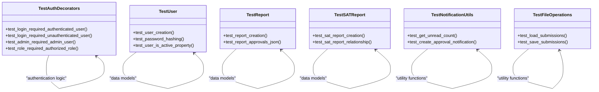

**Diagram sources**
- [test_auth.py](file://tests/unit/test_auth.py#L1-L264)
- [test_models.py](file://tests/unit/test_models.py#L1-L331)
- [test_utils.py](file://tests/unit/test_utils.py#L1-L427)

**Section sources**
- [test_auth.py](file://tests/unit/test_auth.py#L1-L264)
- [test_models.py](file://tests/unit/test_models.py#L1-L331)
- [test_utils.py](file://tests/unit/test_utils.py#L1-L427)

## Authentication Logic Testing

The authentication system is thoroughly tested using isolated unit tests that validate decorator behavior, user loading, and authorization requirements. Tests use mocking to isolate the authentication logic from session management and database dependencies.

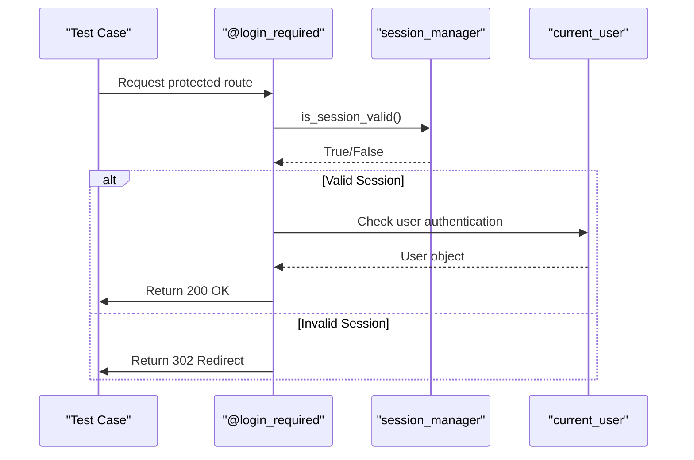

**Diagram sources**
- [test_auth.py](file://tests/unit/test_auth.py#L1-L264)

**Section sources**
- [test_auth.py](file://tests/unit/test_auth.py#L1-L264)

## Data Model Testing

Data models are tested to ensure proper persistence, relationship integrity, and business logic implementation. Each model has dedicated test cases that verify creation, validation, and method functionality.

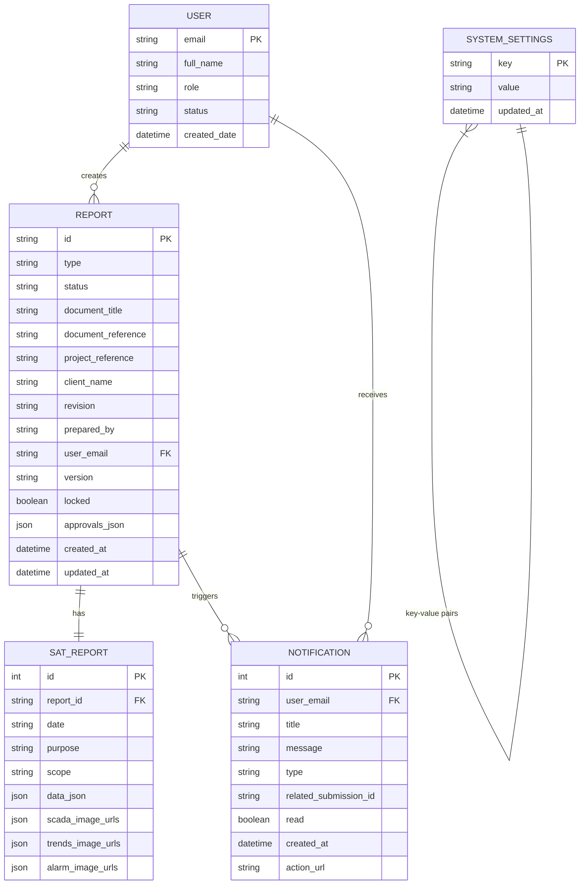

**Diagram sources**
- [test_models.py](file://tests/unit/test_models.py#L1-L331)

**Section sources**
- [test_models.py](file://tests/unit/test_models.py#L1-L331)

## Utility Function Testing

Utility functions are tested to ensure reliable operation across various scenarios, including edge cases and error conditions. The tests validate both successful execution and proper error handling.

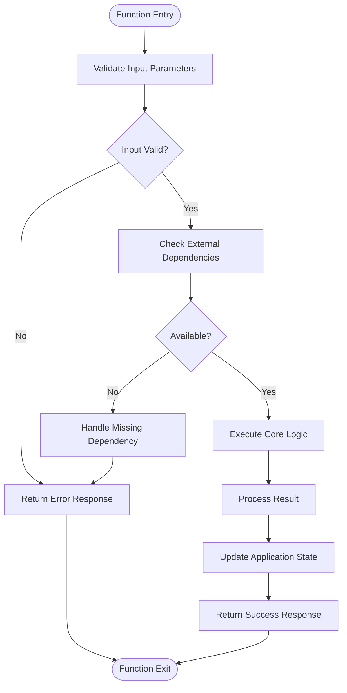

**Diagram sources**
- [test_utils.py](file://tests/unit/test_utils.py#L1-L427)

**Section sources**
- [test_utils.py](file://tests/unit/test_utils.py#L1-L427)

## Pytest Fixtures and Test Configuration

The test suite uses pytest fixtures extensively to provide consistent test setup and teardown. The conftest.py file defines shared fixtures that are available across all test modules.

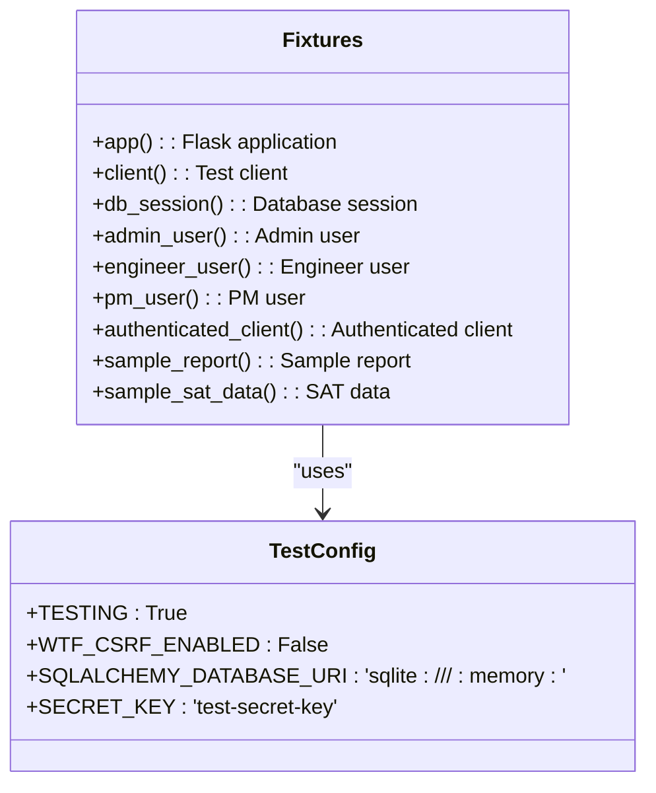

**Diagram sources**
- [conftest.py](file://tests/conftest.py#L1-L170)

**Section sources**
- [conftest.py](file://tests/conftest.py#L1-L170)

## Factory Patterns for Test Data

The testing framework uses factory_boy patterns to create realistic test data with minimal boilerplate. Factories provide consistent data creation with support for customization and batch operations.

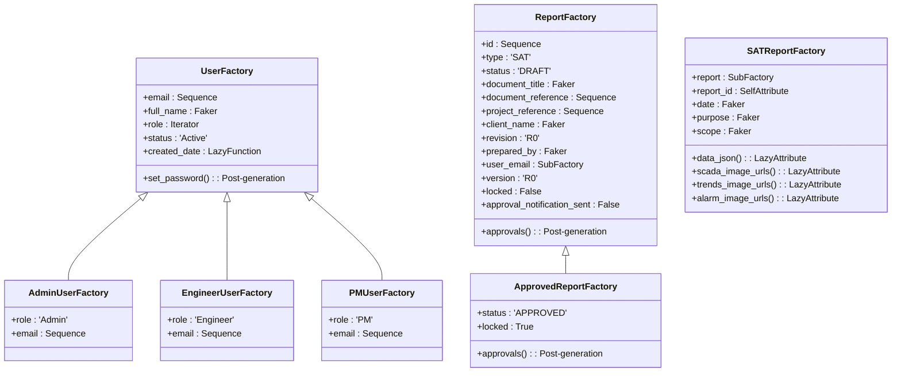

**Diagram sources**
- [factories.py](file://tests/factories.py#L1-L366)

**Section sources**
- [factories.py](file://tests/factories.py#L1-L366)

## Database Management in Tests

The testing framework uses SQLite in-memory databases to ensure fast test execution and complete isolation between tests. Database sessions are properly managed with automatic rollback after each test.

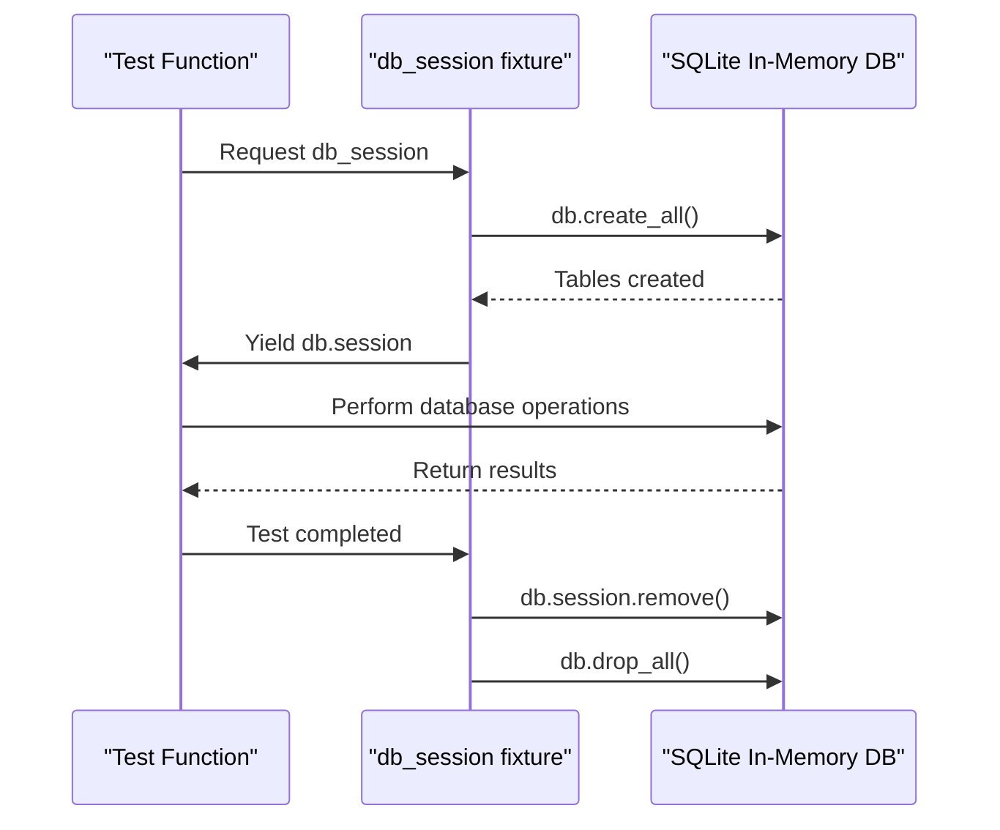

**Diagram sources**
- [conftest.py](file://tests/conftest.py#L1-L170)
- [test_models.py](file://tests/unit/test_models.py#L1-L331)

**Section sources**
- [conftest.py](file://tests/conftest.py#L1-L170)
- [test_models.py](file://tests/unit/test_models.py#L1-L331)

## Assertion Strategies and Test Validation

The test suite employs comprehensive assertion strategies to validate both expected outcomes and edge cases. Tests verify not only success conditions but also proper error handling and security constraints.

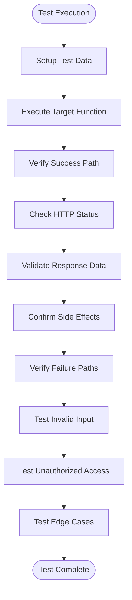

**Diagram sources**
- [test_auth.py](file://tests/unit/test_auth.py#L1-L264)
- [test_models.py](file://tests/unit/test_models.py#L1-L331)
- [test_utils.py](file://tests/unit/test_utils.py#L1-L427)

**Section sources**
- [test_auth.py](file://tests/unit/test_auth.py#L1-L264)
- [test_models.py](file://tests/unit/test_models.py#L1-L331)
- [test_utils.py](file://tests/unit/test_utils.py#L1-L427)

## Common Testing Issues and Solutions

The testing framework addresses common issues such as test flakiness, dependency management, and test isolation through established patterns and configurations.

```mermaid
graph TD
Issue[Common Testing Issues] --> Flakiness["Test Flakiness"]
Issue --> Mocking["Dependency Mocking"]
Issue --> Isolation["Test Isolation"]
Issue --> Performance["Test Performance"]
Flakiness --> Solution1["Use deterministic data and time"]
Flakiness --> Solution2["Avoid external service dependencies"]
Flakiness --> Solution3["Use proper synchronization"]
Mocking --> Solution4["Use pytest-mock for patching"]
Mocking --> Solution5["Mock external APIs and services"]
Mocking --> Solution6["Isolate database operations"]
Isolation --> Solution7["Use in-memory SQLite database"]
Isolation --> Solution8["Clear state between tests"]
Isolation --> Solution9["Use transaction rollback"]
Performance --> Solution10["Run tests in parallel"]
Performance --> Solution11["Optimize database operations"]
Performance --> Solution12["Use lightweight test data"]
style Solution1 fill:#e6f3ff,stroke:#333
style Solution2 fill:#e6f3ff,stroke:#333
style Solution3 fill:#e6f3ff,stroke:#333
style Solution4 fill:#e6f3ff,stroke:#333
style Solution5 fill:#e6f3ff,stroke:#333
style Solution6 fill:#e6f3ff,stroke:#333
style Solution7 fill:#e6f3ff,stroke:#333
style Solution8 fill:#e6f3ff,stroke:#333
style Solution9 fill:#e6f3ff,stroke:#333
style Solution10 fill:#e6f3ff,stroke:#333
style Solution11 fill:#e6f3ff,stroke:#333
style Solution12 fill:#e6f3ff,stroke:#333
```

**Diagram sources**
- [conftest.py](file://tests/conftest.py#L1-L170)
- [test_auth.py](file://tests/unit/test_auth.py#L1-L264)
- [test_models.py](file://tests/unit/test_models.py#L1-L331)

**Section sources**
- [conftest.py](file://tests/conftest.py#L1-L170)
- [test_auth.py](file://tests/unit/test_auth.py#L1-L264)
- [test_models.py](file://tests/unit/test_models.py#L1-L331)

## Best Practices for Unit Testing

The SERVER application follows established best practices for unit testing to ensure high-quality, maintainable, and effective tests.

```mermaid
flowchart TD
BestPractices[Best Practices] --> Isolation["Test Isolation"]
BestPractices --> Speed["Fast Execution"]
BestPractices --> Determinism["Deterministic Results"]
BestPractices --> Coverage["High Code Coverage"]
BestPractices --> Clarity["Clear Test Names"]
BestPractices --> Maintenance["Easy Maintenance"]
Isolation --> Rule1["Test one thing at a time"]
Isolation --> Rule2["Mock external dependencies"]
Isolation --> Rule3["Use in-memory database"]
Speed --> Rule4["Keep tests fast (< 1s)"]
Speed --> Rule5["Avoid I/O operations"]
Speed --> Rule6["Use lightweight fixtures"]
Determinism --> Rule7["Use deterministic data"]
Determinism --> Rule8["Avoid random values"]
Determinism --> Rule9["Control time and dates"]
Coverage --> Rule10["Aim for 80%+ coverage"]
Coverage --> Rule11["Test edge cases"]
Coverage --> Rule12["Test error conditions"]
Clarity --> Rule13["Use descriptive test names"]
Clarity --> Rule14["Follow AAA pattern"]
Clarity --> Rule15["Document test purpose"]
Maintenance --> Rule16["Use shared fixtures"]
Maintenance --> Rule17["Avoid code duplication"]
Maintenance --> Rule18["Refactor when needed"]
style Rule1 fill:#e6ffe6,stroke:#333
style Rule2 fill:#e6ffe6,stroke:#333
style Rule3 fill:#e6ffe6,stroke:#333
style Rule4 fill:#e6ffe6,stroke:#333
style Rule5 fill:#e6ffe6,stroke:#333
style Rule6 fill:#e6ffe6,stroke:#333
style Rule7 fill:#e6ffe6,stroke:#333
style Rule8 fill:#e6ffe6,stroke:#333
style Rule9 fill:#e6ffe6,stroke:#333
style Rule10 fill:#e6ffe6,stroke:#333
style Rule11 fill:#e6ffe6,stroke:#333
style Rule12 fill:#e6ffe6,stroke:#333
style Rule13 fill:#e6ffe6,stroke:#333
style Rule14 fill:#e6ffe6,stroke:#333
style Rule15 fill:#e6ffe6,stroke:#333
style Rule16 fill:#e6ffe6,stroke:#333
style Rule17 fill:#e6ffe6,stroke:#333
style Rule18 fill:#e6ffe6,stroke:#333
```

**Section sources**
- [conftest.py](file://tests/conftest.py#L1-L170)
- [test_auth.py](file://tests/unit/test_auth.py#L1-L264)
- [test_models.py](file://tests/unit/test_models.py#L1-L331)
- [test_utils.py](file://tests/unit/test_utils.py#L1-L427)

## CI Integration and Pre-commit Hooks

The testing framework is integrated into development workflows through pre-commit hooks and CI pipelines to ensure code quality and prevent regressions.

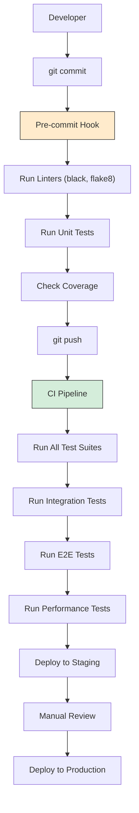

**Diagram sources**
- [pytest.ini](file://pytest.ini#L1-L27)
- [requirements-test.txt](file://requirements-test.txt#L1-L37)

**Section sources**
- [pytest.ini](file://pytest.ini#L1-L27)
- [requirements-test.txt](file://requirements-test.txt#L1-L37)